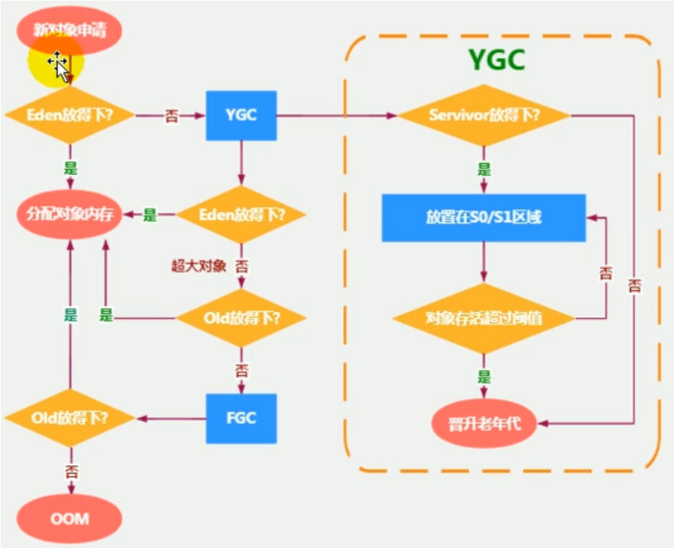

-------------------------------------------------------
参考资料：  
① https://blog.csdn.net/qq_22993855/article/details/106948129  
② https://blog.csdn.net/qq_42058242/article/details/106278252
-------------------------------------------------------

# 堆相关核心概述
① 一个JVM实例只存在一个堆内存，堆也是JVM内存管理的核心区域  
② Java堆区在JVM启动的时候即被创建，其余空间大小也就确定了，是JVM管理的最大一块内存空间  
③ 《Java虚拟机规范》规定，堆可以处于物理上不连续的内存空间中，但在逻辑上应该被视为连续的  
④ 所有的线程共享Java堆，在这里还可以划分线程私有的缓冲区（Thread Local Allocation Buffer，简称```TLAB```）   
⑤ 几乎所有的对象实例以及数组都应当在运行时分配在堆上（栈上分配、标量替换）  
⑥ 数组和对象可能永远不会存储在栈上，因为栈帧中（在局部变量表上）保存引用，这个引用指向对象或者数组在堆中的位置  
⑦ 在方法结束后，保存在栈帧上的对象引用已经出栈，但是堆中对象不会马上被移除，仅仅在垃圾收集的时候才被移除  
⑧ 堆，是GC执行垃圾回收的重点区域

# 设置堆内存大小
① 堆空间大小的设置：默认情况下，初始内存大小是物理内存的1/64，最大内存大小是物理内存大1/4  
② "-Xms"用于表示堆区的起始内存，等价于-XX:InitialHeapSize  
③ "-Xmx"则用于表示堆区的最大内存，等价于-XX:MaxHeapSize  
④ 一旦堆区中的内存大小超过"-Xmx"所指定的最大内存时，将会抛出OutOfMemoryError异常  
⑤ 通常会将-Xms和-Xmx两个参数配置相同的值，其目的是为了能够在Java垃圾回收机制清理完堆区后不需要重新分隔计算堆区的大小，从而提高性能  

> -XX:NewRatio：设置新生代与老年代的比例，默认是1:2  
> -XX:SurvivorRatio：设置新生代中Eden区与Survivor区的比例，默认值是8:1:1  
> -XX:-UseAdaptiveSizePolicy：关闭自适应的内存分配策略，暂时用不上，需要显示指定SurvivorRatio，才能指定比例  
> -Xmn:设置新生代空间的大小（一般不设置）

# 年轻代与老年代
### 部分收集：不是完整收集整个Java堆的垃圾收集
新生代GC（Minor GC）触发机制：  
① 当新生代空间不足时，就会触发Minor GC，这里的新生代满指的是Eden满，Survivor满不会引发Minor GC。（每次Minor GC会清理新生代的内存）  
② 因为Java对象大多具备朝生夕死的特性，所以Minor GC非常频繁，一般回收速度也比较快。  
③ Minor GC会引发STW，暂停其他用户的线程，等垃圾回收结束，用户线程才恢复运行。  

老年代GC（Major GC）触发机制：  
① 指发生在老年代的GC，对象从老年代消失时，我们说"Major GC"或"Full GC"发生了  
② 出现了Major GC，经常会伴随至少一次Minor GC。也就是老年代空间不足时，会先尝试触发Minor GC。如果之后空间还不足，则触发Major GC  
③ Major GC的速度一般会比Minor GC慢10倍以上，STW的时间更长  
④ 如果Major GC后，内存还不足，就报OOM了

### 整堆收集：收集整个Java堆和方法区的垃圾收集
Full GC触发机制：  
① 调用System.gc()时，系统建议执行Full GC，但是不必然执行  
② 老年代空间不足  

> 通过Minor GC后进入老年代的平均大小大于老年代的可用内存  
> 由Eden区、s0向s1区复制时，对象大小大于To Space可用内存，则把该对象转存到老年代，且老年代的可用内存小于该对象大小

③ 方法区空间不足  

> 注意：full gc是开发霍调优中尽量要避免的，这样暂时时间会短暂一些

### 混合收集：收集整个新生代以及部分老年代的垃圾收集
目前，只有G1 GC会有这种行为

# 对象分配过程
  
总结：  
① 针对幸存者s0、s1区的总结：复制之后有交换，谁空谁是to  
② 关于垃圾回收：频繁在新生区收集，很少在养老区收集，几乎不在永久区/元空间收集  

### 内存分配策略（不同年龄段的对象分配原则）
如果对象在Eden区出生并经过第一次MinorGC后仍然存活，并且能被Survivor区容纳的话，将被移动到Survivor区中，并将对象的年龄设置为1。对象在Survivor区中每熬过一次MinorGC，
年龄就增加一岁，当它的年龄增加到一定程度（默认为15岁，其实每个JVM，每个GC都有所不同）时，就会被晋升到老年代。对象晋升老年代的阈值，可以通过选项-XX:MaxTenuringThreshold来设置  
① 优先分配到Eden区  
② 大对象直接分配到老年代（尽量避免程序中出现过多的大对象）  
③ 长期存活的对象分配到老年代  
④ 动态对象年龄判断  

> 如果survivor区中相同年龄的所有对象大小的总和大于survivor空间的一半，年龄大于等于该年龄的对象可以直接进入老年代，无需等待MaxTenuringThreshold中要求的年龄

⑤ 空间分配担保：大量对象在GC之后还是存活的，Survivor区中无法容纳的对象放到老年代，老年代能进行担保的前提是有足够容量能容纳下这些对象
-XX:HandlePromotionFailure

### ```TLAB```
① 对Eden区继续进行划分，JVM为每个线程分配了一个私有缓存区域，它包含在Eden区内  
② 使用```jinfo -flag userTLAB pid```查看```tlab```是否开启。开启后，JVM是将```TLAB```作为内存分配的首选  
③ 一旦对象在```TLAB```空间分配内存失败时，JVM就会尝试着通过使用加锁机制确保数据操作的原子性，从而直接在Eden空间中分配内存

> 堆空间常用的参数设置  
> ① -XX:+PrintFlagsInitial         查看所有的参数的默认值  
> ② -XX:+PrintFlagsFinal           查看所有的参数的最终值（可能会存在修改，不再是初始值）  
> ③ -Xms                           初始堆空间内存（默认为物理内存的1/64）  
> ④ -Xmx                           最大堆空间内存（默认为物理内存的1/4）  
> ⑤ -Xmn                           设置新生代的大小（初始值及最大值）  
> ⑥ -XX:NewRatio                   配置新生代与老年代在堆结构的占比  
> ⑦ -XX:SurvivorRatio              设置新生代中Eden、S0、S1 空间的比例  
> ⑧ -XX:MaxTenuringThreshold       设置新生代垃圾的最大年龄  
> ⑨ -XX+PrintGCDetails             输出详细的GC处理日志  
> ⑩ 打印GC简要信息：-XX:+PrintGC 或者 -verbose:gc  
> 11 -XX:HandlePromotionFailure     是否设置空间分配担保  
> ```
> jdk7及之后，空间分配担保的规则：只要老年代的连续空间大于新生代对象总大小或者历次晋升的平均大小就会进行Minor GC，否则进行Full GC
> ```
> 12 具体查看某个参数的指令 jps:查看当前运行中的进程 ```jinfo -flag SurvivorRatio 进程id```  

# 对象分配优化策略
### 基于逃逸分析技术
① 策略一：栈上分配  
当一个对象在方法中被定义后，对象只在方法内部使用，则认为没有发生逃逸。对于此种情况，则可以采用栈上分配的策略  
在逃逸分析中，给成员变量赋值、方法有返回值、实例引用传递则不能进行栈上分配。开发中能使用局部变量的，就不要使用在方法外定义
```
在jdk7及之后，hotspot中默认开启了逃逸分析。如果使用之前较早版本，开发人员可以通过-XX:+DoEscapeAnalysis显示开启逃逸分析，通过选项-XX:+PrintEscapeAnalysis查看逃逸分析的筛选结果
```
② 策略二：同步省略(也叫锁消除)。如果一个对象被发现只能从一个线程被访问到，那么对于这个对象的操作可以不考虑同步   
```java
public void f(){
    Object obj = new Object(); 
    synchironized(obj) {    // 起不到同步锁的作用，可以去除
        System.out.println(obj);
    }
}

// 在逃逸分析之后，JVM会自动去除锁
public void f(){
    Object obj = new Object();
    System.out.println(obj);
}
```
③ 策略三：分离对象或标量替换。有的对象可能不需要作为一个连续的内存结构存在也可以被访问到，那么对象的部分（或全部）可以不存储在内存，而是存储在CPU寄存器中  
```java
public static void alloc(){
    Point point = new Point(1,2);
    System.out.println("point.x=" + point.x + ";point.y=" + point.y);
}

// 经过逃逸分析后，发现它并没有发生逃逸，就被替换成两个标量了，可以减少堆内存的占用
// 参数-XX:+EliminateAllocations，默认开启标量替换，允许将对象打散分配在栈上
public static void alloc(){
    int x = 1;
    int y = 2;
    System.out.println("point.x=" + point.x + ";point.y=" + point.y);
}
```

# 堆是对象分配的唯一选择吗？
从hotspotVM的使用上来看，是的，一是栈上分配技术不成熟，并未应用到JVM中，二是JDK7以后字符串常量池和静态变量都直接在堆上分配（这是JDK7及以后一个很重大的变化），所以对象实例都是分配在堆上的  
从其他虚拟机上看，并不是的，一是对象可以直接分配在栈上，二是```taobaoVM```已经实现了将对象实例分配在本地内存中，这样做的好处就是不用GC，遇到瓶颈直接加机器即可

# 堆的总结
① 年轻代是对象的诞生、成长、消亡的区域，一个对象在这里产生、应用，最后被垃圾回收器收集、结束生命  
② 老年代放置长生命周期的对象，通常都是从Survivor区域筛选拷贝过来的Java对象。当然，也有特殊情况，我们知道普通的对象会被分配在```TLAB```上，如果对象较大，JVM会试图直接分配
在Eden其他位置上，如果对象太大，完全无法在新生代找到足够长的连续空闲空间，JVM就会直接分配到老年代  
③ 当GC只发生在年轻代中，回收年轻对象的行为被称为Minor GC。当GC发生在老年代时则被称为Major GC或者Full GC。一般的，Minor GC的发生频率要比Major GC高很多，即老年代中
垃圾回收发生的频率将大大低于年轻代


