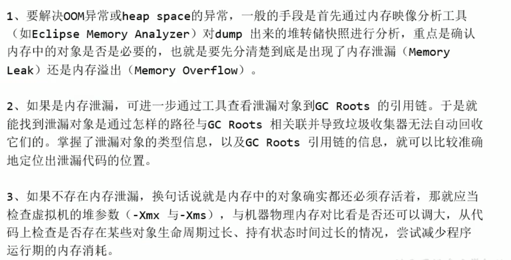

# 方法区
## 方法区的核心概述
① 方法区与Java堆一样，是各个线程共享的内存区域  
② 方法区在JVM启动的时候被创建，并且它的实际的物理内存空间中和Java堆区一样都可以是不连续的  
③ 方法区的大小，跟堆空间一样，可以选择固定大小或者可扩展  
④ 方法区的大小决定了兄台那个可以保存多少个类，如果系统定义了太多的类，导致方法区溢出，虚拟机同样会抛出内存溢出错误：java.lang.OutOfMemoryError:PermGen space 或者 java.lang.OutOfMemoryError:Metaspace  
⑤ 关闭JVM就会释放这个区域的内存

## 设置方法区内存大小
```
jdk7及以前： -XX:PermSize=100m          -XX:MaxMetaspaceSize=100m  
jdk8及以后： -XX:MetaspaceSize=100m     -XX:MaxMetaspaceSize=100m
```

## 如何解决OOM异常


## non-final的类变量和final的类变量
non-final的类变量:  
① 静态变量和类变量关联在一起,随着类的加载而加载,他们成为了类数据在逻辑上的一部分  
② 类变量(即静态变量)被类的所有实例共享,即使没有类实例时你也可以访问它  

final的类变量:  
① 被声明为final的类变量的处理方法则不同,每个全局变量在编译的时候就已经分配好了

## 运行时常量池和常量池
① 运行时常量池(Runtime Constant Pool)是方法区的一部分  
② 常量池是Class文件的一部分,用来存放编译期生成的各种字面量与符号引用,这部分内容将在类加载后存放到方法区的运行时常量池中  
③ 运行时常量池,在加载类和接口到虚拟机后,就会创建对应的运行时常量池  
④ JVM为每一个已加载的类型(类和接口)都维护这一个常量池.池中的数据项向数组项一样,是通过索引进行访问的  
⑤ 运行时常量池中包含了多种不同的常量,包括编译期就已经确定下来的数值字面量,也包括到运行时期解析后才能够得到的方法或者字段引用等,此时不再是常量池中的符号引用了,这里换成了真实的地址
> 运行时常量池相对于class文件常量池的另一个重要特征:具备动态性:String.intern()方法的使用

⑥ 运行时常量池类似传统编程中的符号表(Symbol table),但是它所包含的数据比符号表要更加的丰富  
⑦ 当创建类或者接口的运行时常量池时,如果构造运行时常量池所需的内存空间超过了方法区提供的最大值,则会抛OutOfMemoryError异常

## 永久代为什么要被元空间替换?
① 为永久代设置空间大小是很难确定的  
② 对永久代进行调优是很困难的,永久代进行的是Full GC

## 方法区中字符串常量池和静态变量的变化
① 字符串常量池放在方法区中,只有在老年代空间不足或者永久代空间不足时才会触发full gc,full gc会导致回收效率低,因此放到堆中,能及时回收内存  
② 静态变量也存放在堆中

## 方法区的垃圾收集
方法区的垃圾收集主要回收两部分内容:常量池中废弃的常量(主要是两大类常量:字面量和符号引用)和不再使用的类型(判断一个类不再需要是比较苛刻的)

# 对象的实例化内存布局与访问定位
### 创建对象的方式
① new  
② Class的newInstance()(反射的方式,只能调用空参的构造器,权限必须是public)  
③ Constructor的newInstance()(反射的方式,可以调用空参,带参的构造器,权限没有要求)  
④ 使用clone():不调用任何构造器,当前类需要实现cloneable接口,实现clone()  
⑤ 使用反序列化:从文件中,从网络中获取一个对象的二进制流  
⑥ 第三方库Objenesis

### 创建对象的步骤
① 判断对象对应的类是否加载,链接,初始化  
② 为对象分配内存,如果内存规整,则进行指针碰撞,如果内存不规整,则虚拟机需要维护一个空闲列表,记录哪些内存块是可用的  
③ 处理并发安全问题,一是可以采用CAS失败重试,区域加锁保证更新的原子性,二是每个线程都预先分配一块```TLAB```区域,可以通过```-XX:+UseTLAB```参数来设定  
④ 属性的默认初始化(零值初始化),所有属性设置默认值,保证对象实例字段在不赋值时可以直接使用  
⑤ 设置对象头的信息  
⑥ 属性的显式初始化,代码块中初始化,构造器中初始化

### 对象的属性赋值的操作
① 属性的默认初始化  
② 显式初始化/代码块中初始化  
③ 构造器中初始化

### 对象的内存布局
① 对象头:包含运行时元数据和类型指针  
> 运行时元数据:  
> 类型指针:指向类元数据InstanceClass,确定该对象所属的类型

② 实例数据  
③ 对齐填充

### 对象的访问定位
① 句柄访问  
② 直接访问

# 本地内存
本地内存大小的理解

# 执行引擎
### 解释器、即时编译器
当虚拟机启动的时候，解释器可以首先发挥作用，而不必等待即时编译器全部编译完成再执行，这样就可以省去许多不必要的编译时间，解释器的优势是响应速度快，启动就能解释执行  
并且随着程序运行时间的推移，即时编译器逐渐发挥作用，根据热点探测功能，将有价值的字节码编译为本地机器指令，以换取更高的程序执行效率  

确定是否需要启动JIT即时编译器将字节码编译为对应平台的本地机器指令，则需要根据代码被调用执行的频率而定，多次被调用的代码是热点代码，将会被JIT编译器直接编译为机器指令，以此提升Java程序的执行性能  

目前HotSpot所采用的热点探测方式是基于计数器的热点探测，一种是方法调用计数器，用于统计方法的调用次数，另外一种是回边计数器，用于统计循环体执行的循环次数

### HotSpot VM可以设置程序执行方式
① ```-Xint```：完全采用解释器模式执行程序  
② ```-Xcomp```：完全采用即时编译器模式执行程序，如果即时编译出现问题，解释器会介入执行  
③ ```-Xmixed```：采用解释器+即时编译器的混合模式共同执行程序  
切换模式的命令：```java -Xint -version```

### 总结
① 一般来讲，JIT编译出来的机器码性能比解释器高  
② 在即时编译中，C2编译器启动时长比C1编译器慢，系统稳定执行后，C2编译器执行速度远远快于C1编译器


