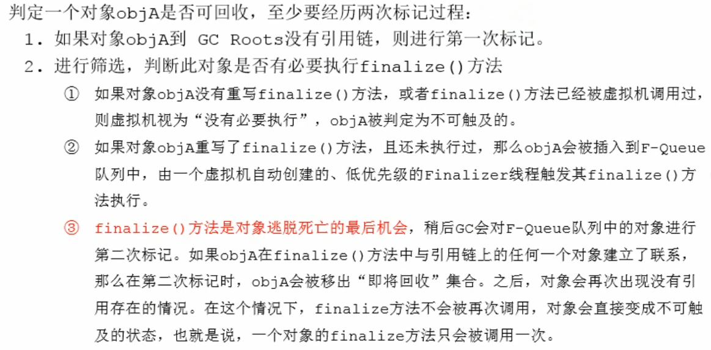
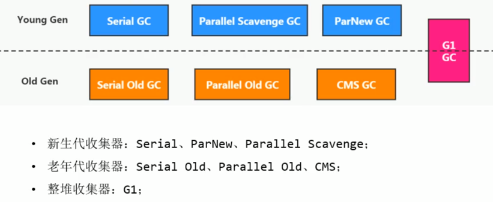
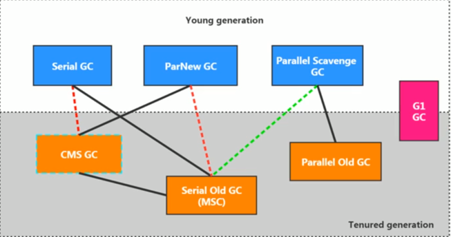
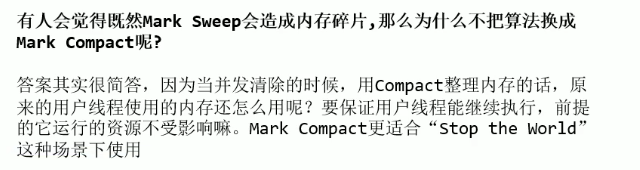
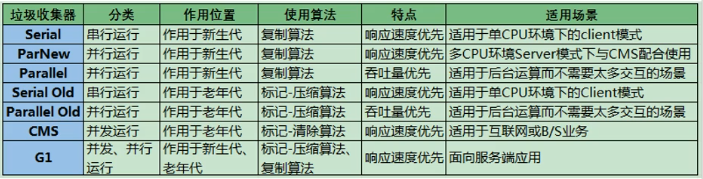

---------------------------------------------------------
https://blog.csdn.net/mingyuli/article/details/121045963
---------------------------------------------------------

# Java内存自动管理
① 内存分配  
② 内存回收  
③ 内存监控

# 垃圾回收相关概念
### 什么是垃圾
垃圾是指在运行程序中没有任何指针指向的对象，这个对象就是需要被回收的垃圾

### 垃圾回收的意义
① 不进行垃圾回收，内存迟早都会被消耗完  
② 垃圾回收不仅可以释放无用的对象，也可以清除内存里的记录碎片，碎片整理将所占用的堆内存移到堆的一端，以便JVM将整理出的内存分配给新的对象  
③ 经常造成STW的GC跟不上实际的需求，所以需要不断对GC进行优化  
④ 可以将对象的引用变量设置为null，暗示垃圾回收机制可以回收该对象，程序员可以通过System.gc()或者Runtime.getRuntime().gc()来通知系统进行垃圾回收，会有一些效果，但是系统是否进行垃圾回收依然不确定  
⑤ 垃圾回收机制回收任何对象之前，总会先调用它的finalize方法（如果覆盖该方法，让一个新的引用变量重新引用该对象，则会重新激活对象），永远不要主动调用某个对象的finalize方法，应该交给垃圾回收机制调用

### System.gc()的理解
在默认情况下，通过System.gc()或者Runtime.getRunTime().gc()的调用，会显示触发Full GC，同时对老年代和新生代进行回收，尝试释放被丢弃对象占用的内存  
System.gc()调用附带一个免责声明，无法保证对垃圾收集器的调用  

### 内存溢出和内存泄露
内存溢出：没有空闲内存，并且垃圾收集器也无法提供更多内存，包括堆的溢出和方法区的溢出  
内存泄露：只有程序不会再被程序用到了，但是GC又不能回收他们的情况，才叫内存泄露

### STW

### 垃圾回收中的并行、串行、并发
并行(Parallel)：指多条垃圾收集线程并行工作，但此时用户线程仍处于等待状态。如ParNew、Parallel Scavenge、Parallel Old  
并发(Concurrent)：```在一个时间段内```，用户线程与垃圾收集线程同时执行，但不一定是并行的，垃圾回收线程在执行时不会停顿用户线程的执行，两个线程运行在不同的CPU上，如：CMS、G1  
串行(Serial)：相较于并行来说，串行是单线程执行的。如果内存不够，则程序暂停，启动JVM垃圾回收器进行垃圾回收，回收完，再启动程序的线程  

### 安全点与安全区域

## 强、软、弱、虚引用及终结器引用
① 强引用的对象是可触及的，垃圾收集器永远不会回收掉被引用的对象。强引用是造成Java内存泄露的主要原因之一  
② 在系统将要发生内存溢出之前，将会把这些对象列入回收范围之中进行第二次回收。如果这次回收后还没有足够的内存，才会抛出内存溢出异常  
③ 被弱引用关联的对象只能生存到下一次垃圾收集之前，当垃圾收集器工作时，无论内存空间是否足够，都会回收掉被弱引用关联的对象
> 软引用、弱引用和虚引用的对象是软可触及、弱可触及和虚可触及的，在一定条件下，都是可以被回收的

④ 弱引用对象与软引用对象的最大不同就在于，当GC在进行回收时，只有在内存不够时才（将要发生OOM或者发生了OOM）回收软引用对象，而对于弱引用对象，GC总是进行回收。弱引用对象更容易、更快被GC回收
> 使用```WeakHashMap```保存图片信息，当内存不足时，自动对图片信息进行回收，避免OOM

⑤ 虚引用必须和引用队列一起使用。虚引用在创建时必须提供一个引用队列作为参数。当垃圾回收器准备回收一个对象时，如果发现它还有虚引用，就会在回收对象后，将这个虚引用加入引用队列，以通知应用程序对象的回收情况
> 一个对象是否有虚引用的存在，完全不会对其生存时间构成影响，也无法通过虚引用来获得一个对象的实例。为一个对象设置虚引用关联的唯一目的就是能在这个对象被垃圾收集器回收时收到一个系统通知  
> 由于虚引用可以跟踪对象的回收时间，因此，也可以将一些资源释放操作放置在虚引用中执行和记录

```java
Object obj = new Objec();
ReferenceQueue<Object> phantomQueue = new ReferenceQueue();
PhantomReference<Object> pf = new PhantomReference<Object>(obj, phantomQueue);
obj = null;//必须将强引用置空
```

# 垃圾回收相关算法
### 标记阶段
需要区分内存中哪些是存活对象，哪些是已经死亡的对象，只有被标记为已经死亡的对象，GC才会在执行垃圾回收时，释放掉其所占用的内存空间，因此这个过程我们可以称为垃圾标记阶段  
① 引用计数算法  
引用计数算法对每个对象保存一个整型的引用计数器属性，用于记录对象被引用的情况。对于一个对象A，只要有任何一个对象引用了A，则A的引用计数器就加1，当引用失效时，引用计数器就减1。
只要对象A的引用计数器的值为0，即表示对象A不可能再被使用，即可进行回收  

优点：实现简单，垃圾对象便于辨识，判定效率高，回收没有延迟性  
缺点：增加了额外的空间开销，每次赋值都需要更新计数器，伴随着加法和减法操作，增加了时间开销。  
最致命的问题是无法处理循环引用的情况，导致在Java垃圾回收器中没有使用这种算法  

② 可达性分析算法  
可以有效解决在引用技术算法中循环引用的问题，防止内存泄露的发生  

> 可达性分析基本实现思路：  
> ① 可达性分析算法是以根对象集合（GC Roots）为起始点，按照从上至下的方式搜索被根对象集合所连接的目标对象是否可达  
> ② 使用可达性分析算法后，内存中的存活对象都会被根对象集合直接或间接连接着，搜索所走过的路径称为引用链  
> ③ 如果目标对象没有任何引用链相连，则是不可达的，就意味着该对象已经死亡，可以标记为垃圾对象  
> ④ 在可达性分析算法中，只有能够被根对象集合直接或者间接连接的对象才是存活的对象

> GC Roots包括以下几类元素：  
> ① 虚拟机栈中引用的对象，比如：各个线程被调用的方法中使用到的参数、局部变量等  
> ② 本地方法栈内JNI（通常说的本地方法）引用的对象  
> ③ 方法区中类静态属性引用的对象，比如：static修饰的类变量  
> ④ 方法区中常量引用的对象，比如：字符串常量池里的引用  
> ⑤ 所有被同步锁synchronized持有的对象  
> ⑥ Java虚拟机内部的引用：基本数据类型对应的Class对象，一些常驻的异常对象，如NullPointerException、OutOfMemoryError，系统类加载器  
> 
> 如果只针对Java堆中的某一块区域进行垃圾回收（比如：典型的只针对新生代），必须考虑到内存区域是虚拟机自己的实现细节，更不是孤立封闭的，这个区域的对象完全有可能被其他区域的对象所引用，
> 这时候就需要一并将关联的区域对象也加入GC Roots集合中去考虑，才能保证可达性分析的准确性  
> 
> 简单理解：由于Root采用栈方式存放变量和指针，所以如果一个指针，它保存了堆内存里面的对象，但是自己又不存放在堆内存里面，那它就是一个Root

### 清除阶段
##### 1 标记-清除算法(Mark-Sweep)
标记：垃圾收集器从根节点开始遍历，标记所有被引用的对象，一般是在对象的Header中记录为可达对象  
清除：垃圾收集器对堆内存从头到尾进行线性的遍历，如果发现某个对象在其Header中没有标记为可达对象，则将其回收  

> 清除实际上并不是真的置空，而是把需要清除的对象地址保存在空闲的地址列表里，下次有新对象需要加载的时候，判断垃圾的位置空间是否足够，如果足够，就存放

缺点：  
① 在进行GC的时候，需要停止整个应用程序，导致用户体验差  
② 这种方式清理出来的空闲内存是不连续的，产生内存碎片，需要维护一个空闲列表  

##### 2 复制算法
将活着的内存空间分为两块，每次只使用其中一块，在垃圾回收时将正在使用的内存中的存活对象复制到未被使用的内存块中，之后清除正在使用的内存块中的所有对象，交换两个内存的角色，最后完成垃圾回收  
复制算法的高效性是建立在存活对象少、垃圾对象多的前提下的，这种情况在新生代经常发生，但是在老年代，更常见的情况是大部分对象都是存活对象，如果依然使用复制算法，由于存活对象较多，复制的成本
也将很高，因此，基于老年代垃圾回收的特性，需要使用其他的算法  

优点：没有标记和清除过程，实现简单，运行高效。复制过去以后保证空间的连续性，不会出现”碎片“问题  
缺点：此算法的最大缺点就是需要两倍的内存空间。对于G1这种拆分为大量region的GC，复制意味着GC需要大量维护region中对象与栈帧内引用变量地址值的关系，不管是内存占用或者时间开销也不小  

##### 3 标记-压缩算法(Mark-Compact算法)
第一阶段和标记-清除算法一样，从根节点开始标记所有被引用对象。第二阶段将所有的存活对象压缩到内存一端，按顺序排放。之后，清理边界外所有的空间  

优点：消除了标记-清除算法当中，内存区域分散的缺点，需要给新对象分配内存时，可以采用指针碰撞的方式进行分配。消除了复制算法当中，内存减半的高额代价  
缺点：从效率上说，标记-压缩算法要低于复制算法。而且移动对象的同时，如果对象被其他对象引用，则还需要调整引用的地址。移动过程中，需要STW（即暂停用户线程）

### 对比上述三种算法
|  | Mark-Sweep | Mark-Compact | Copying |
| --- | --- | --- | --- |
| 速度 | 中等 | 最慢 | 最快 |
| 空间开销 | 少（但会堆积碎片） | 少（不堆积碎片） | 通常需要活对象的2倍大小（不堆积碎片） |
| 移动对象 | 否 | 是 | 是 |

对于标记-清除算法，会采用空闲列表方式分配新对象内存空间。对于标记-压缩算法或者复制算法，可以采用指针碰撞方式分配新对象内存空间

### 分代收集算法
不同的对象的生命周期是不一样的，因此，不同生命周期的对象可以采取不同的收集方式，以便提高回收效率  
一般是把Java堆分为新生代和老年代，这样就可以根据各个年代的特点使用不同的回收算法，以提高垃圾回收的效率  
① 新生代特点：  
对象生命周期短、存活率低，回收频繁。这些对象可能是在程序运行过程中生成的临时变量。这种情况，使用复制算法的回收效率最高，
因为复制算法只和当前存活对象的大小有关，因此适合年轻代的回收，并且复制算法内存利用率不高的问题在新生代的两个survivor区的设计中得到缓解  
② 老年代特点：  
区域较大，对象生命周期长，存活率不高，回收不及新生代频繁。老年代中存在大量存活的对象，一般是由标记-清除或标记-压缩实现GC  
比如Http请求中的Session对象、线程、Socket连接，这类对象跟业务相关，因此生命周期较长
> 标记-清除算法或者标记-整理算法  
> ① 标记阶段的开销与存活对象的数量成正比  
> ② 清除阶段的开销与所管理区域的大小成正比  
> ③ 整理阶段的开销与存活对象的数据成正比

### 增量收集算法
如果一次性将所有的垃圾进行收集,需要造成系统长时间的停顿,那么就可以让垃圾收集线程和应用程序交替执行,每一次垃圾收集值收集一小片区域的内存空间,接着切换到应用程序线程,依次反复,知道垃圾收集完成  

缺点：  
使用这种方式,由于在垃圾收集过程中,间断性还执行了应用程序代码,所以能减少系统的停顿时间,但是,由于线程切换和上下文转换的销毁,会使得垃圾回收的总成本上升,造成系统的吞吐量的下降

### 分区算法
一般来说,在相同的条件下,堆空间越大,一次GC时所需要的时间就越长,有关GC产生的停顿也越长,为了更好地控制GC产生的停顿时间,将一块大的内存区域分割成多个小块,根据目标的停顿时间,
每次合理回收若干个小区间,而不是整个堆空间,从而减少一次GC所产生的停顿。  
分区算法:将按照对象的生命周期长短划分为两个部分,分区算法将真个堆空间分为连续的不同的小区间，每个小区间都独立使用, 这种算法的好处是可以控制一次回收多少个小区间:其中,G1就采用这种分区算法思想

# 对象的finalization机制
Java语言提供了对象终止机制来允许开发人员提供对象被销毁之前的自定义处理逻辑，即：垃圾回收此对象之前，总会先调用这个对象的finalize()方法  
finalize()方法允许在子类中被重写，用于在对象被回收时进行资源释放，比如数据库连接、输入流输出流、Socket连接  

> 由于finalize()方法的存在，虚拟机中的对象一般处于三种可能的状态：  
> ① 可触及的：从根节点开始，可以到达这个对象  
> ② 可复活的：对象的所有引用都被释放，但是对象有可能在finalize()中复活  
> ③ 不可触及的：对象的finalize()被调用，并且没有复活，那木就会进入不可触及状态，不可触及的对象不可能被复活，因为finalize()只会被调用一次

### 判定一个对象是否可以被回收的具体过程如下图
  

# 垃圾回收器
### GC性能指标
① 吞吐量：运行用户代码的时间占总运行时间（包括GC时间）的比例  
② 暂停时间：执行垃圾收集时，程序的工作线程被暂停的时间  
③ 内存占用：Java堆区所占的内存大小（堆区越大，GC时间越久）  

总结，高吞吐量GC在单位时间内，总STW的时间最短；较少暂停时间，在单次STW的时间最短  
现在的要求是，在吞吐量尽量大的情况下，降低暂停时间，或者在可接受的暂停时间范围内，提升吞吐量  

### 7款经典的GC
串行GC：Serial、Serial Old  
并行GC：ParNew、Parallel Scavenge、Parallel Old  
并发GC：CMS、G1



> ① 两个收集器之间有连线,表明他们可以配合使用:
> Serial GC/Serial Old GC
> Serial GC/CMS
> ParNew GC/Serial Old GC
> ParNew GC/CMS
> Parallel Scavenge GC/Serial Old GC
> Parallel Scavenge GC/Parallel Old GC
> G1 GC
> 2.其中,Serial Old GC 作为CMS 出现"Concurrent Mode Failure"失败的后备方案.
> 3.(红色虚线)由于维护和兼容性测试的成本,在JDK 8时将Serial Old + CMS,ParNew + Serial Old这两个组合声明为废弃,同时,在JDK9中完全取消了这两个组合的支持(即移除)
> 4.(绿色虚线)JDK14中,弃用了Parallel Scavenge和Serial Old的组合
> 5.(青色虚线)JDK14中,删除了CMS垃圾回收器

### Serial回收器：串行回收（不常用）
1.Serial收集器是最基本,历史最悠久的垃圾收集器了.JDK1.3之前回收新生代唯一的选择;
2.Serial GC作为HotSpot中Client模式下的默认新生代垃圾回收器
3.Serial GC 采用的是复制算法,串行回收和"Stop The World"机制的方式执行垃圾内存回收的
4.除了年轻代之外Serial 收集器还提供了用于执行老年代垃圾收集的Serial Old GC,Serial Old GC收集器同样也采用了串行回收和"Stop The World"机制,只不过内存回收算法使用的是标记-压缩算法.
注意:
1.Serial Old是运行在Client模式下的默认的老年代的垃圾收集器
2.Serial Old在Server模式下主要有两个用途:一是与新生代的ParallelScavenge配合使用,二是作为老年代CMS收集器的后备垃圾收集方案

单核CPU下，这种GC效率才高

```-XX:+UseSerialGC```表明新生代使用Serial GC，同时老年代使用Serial Old GC  

### ParNew回收器：并行回收（不常用）
```-XX:+UseParNewGC```手动指定新生代使用ParNew收集器执行内存回收任务，它表示年轻代使用并行垃圾收集器，老年代可选CMS或者Serial Old  
```-XX:ParallelGCThreads```限制线程数量，默认开启和CPU核数相同的线程数

### Parallel回收器：并行回收、吞吐量优先
① ParNew收集器主要强调并行回收。而Parallel收集器的目标是达到一个可控制的吞吐量，它也被称为吞吐量优先的垃圾收集器  
② 自适应调节策略也是Parallel与ParNew的一个重要区别  
③ 高吞吐量可以高效的利用CPU时间，尽快完成运算任务。主要适合后台运算而不需要太多交互的任务。例如批处理、工资支付、订单处理等  

> ① 在程序吞吐量优先的应用场景中，Parallel收集器和Parallel Old收集器的组合，在Server模式下的内存回收性能很不错  
> ② 在Java8中，默认是此垃圾收集器

```-XX:+UseParallelGC```手动指定年轻代使用Parallel并行收集器执行内存回收任务  
```-XX:+UseParallelOldGC```手动指定老年代都是使用并行垃圾回收器
> 上面两个参数分别适合新生代和老年代，默认jdk8中是开启的。这两个参数，默认开启一个，另外一个也会被开启

```-XX:ParallelGCThreads```设置年轻代并行收集器的线程数，一般的，最好与CPU数量相等，以避免过多的线程数影响垃圾收集性能
> 在默认情况下，当CPU数量小于8个，ParallelGCThreads的值等于CPU数量  
> 当CPU数量大于8个，ParallelGCThreads的值等于 [3+[5*CPU_Count]]/8

```-XX:MaxGCPauseMillis```设置垃圾收集器最大停顿时间（即STW的时间），单位是ms  
> 为了尽可能的把停顿时间控制在MaxGCPauseMills以内，收集器在工作时会调整Java堆大小或者其他一些参数  
> 对于用户来讲，停顿时间越短体验越好，但是在服务器端，我们注重高并发和整体的吞吐量，所以服务器端适合Parallel

```-XX:GCTimeRatio```垃圾收集时间占总时间的比例（=1/(N+1)），用于衡量吞吐量的大小
> 取值范围0-100，默认99，也就是垃圾回收时间不超过1%  
> 与前一个-XX:MaxGCPauseMillis参数有一定的矛盾性，暂停时间越长，Ratio参数就容易超过设定的比例

```-XX:+UseAdaptiveSizePolicy```设置Parallel收集器具有自适应调节策略  
> 在这种模式下，年轻代的大小、Eden和Survivor的比例、晋升老年代的对象年龄等参数会被自动调整，以达到在堆大小、吞吐量和停顿时间之间的平衡点  
> 在手动调优比较困难的场合，可以直接使用这种自适应的方式，仅指定虚拟机的最大堆、目标的吞吐量（GCTimeRatio）和停顿时间（MaxGCPauseMills），让虚拟机自己完成调优工作

### CMS回收器：低延迟
| 步骤 | 具体内容 |
| --- | --- |
| 初始标记阶段 | 在此阶段，程序的所有的工作线程会因为“Stop-The-World”机制而出现短暂的暂停（此时停顿第一次），这个阶段的主要任务仅仅只是标记出GC Roots能关联到的对象。一旦标记完成，就会恢复之前被暂停的所有的应用线程。由于直接关联的对象比较地小（因为此时在老年代中进行垃圾回收，能被GC Roots标记到的对象很少），所以这里的速度会很快 |
| 并发标记阶段 | 从GC Roots的直接关联对象开始遍历整个对象图，这个过程耗时比较长，但是不需要停顿用户线程，可以与垃圾收集收集线程一起并发运行 |
| 重新标记阶段 | 由于在并发标记阶段中，程序的工作线程一一直在运行过程中 ，可能会由于和垃圾的收集线程交叉运行导致之前的一些标记会发生一些变动，故进行标记的修正，这个过程比初始标记略长（STW，此时停顿第二次），但比并发标记的时间要短很多 |
| 并发清除阶段 | 此阶段清理删除掉标记阶段已被判断为已经死亡的对象，并释放内存空间，由于不需要移动内存对象的位置，则此阶段也是可以和用户线程同时并发执行的 |



```-XX:+UseConcMarkSweepGC```表明老年代使用CMS GC，同时，年轻代会使用ParNew GC

### 上述GC小结
① 如果想要最小化地使用内存和并行开销，可以选择 Serial GC  
② 如果想要最大化应用程序的吞吐量，可以选择 Parallel GC  
③ 如果想要最小化GC的中断或停顿时间，可以选择CMS GC

### G1：区域分代化
目标是在延迟可控的情况下获得尽可能高的吞吐量  

优势：  
① 并行与并发  
② 分代收集  
③ 空间整合（Region之间是复制算法）  
④ 可预测的停顿时间模型（即保证绝大部分在规定时间内完成垃圾收集）  

缺点：  

### GC总结

垃圾收集器的选择：  
① 优先调整堆的大小让JVM自适应完成  
② 如果内存小于100M，或者是单核、单机程序，并且没有停顿时间的要求，可以选择串行垃圾收集器  
③ 如果是多核，需要高吞吐量，允许停顿时间超过1s，可以选择并行垃圾收集器  
④ 如果是多核，追求低停顿时间，需要快速响应（比如延迟时间不超过1s），可以选择并发的垃圾收集器  
⑤ 现在官方推荐G1，性能高，而且现在互联网的项目，基本都是用G1


