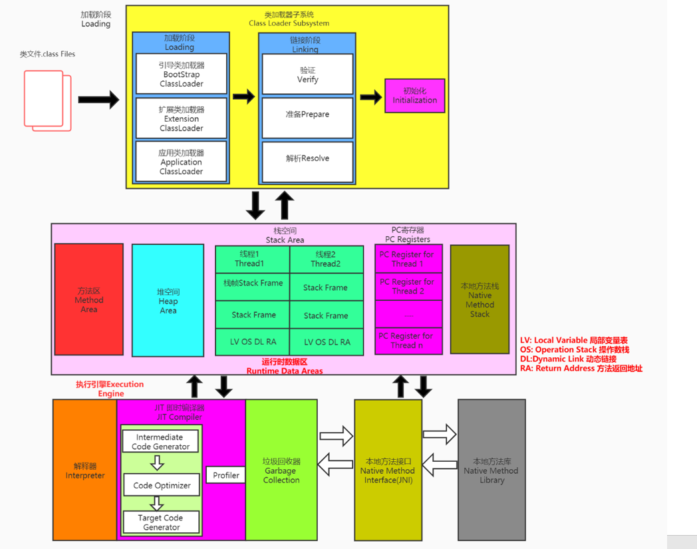
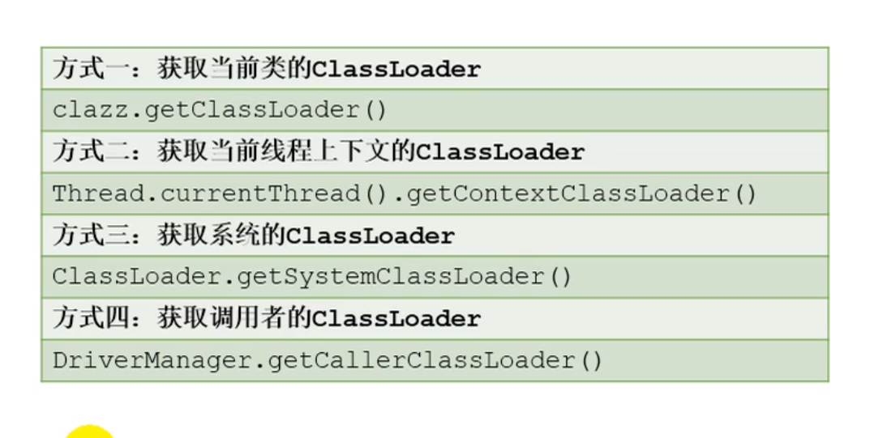
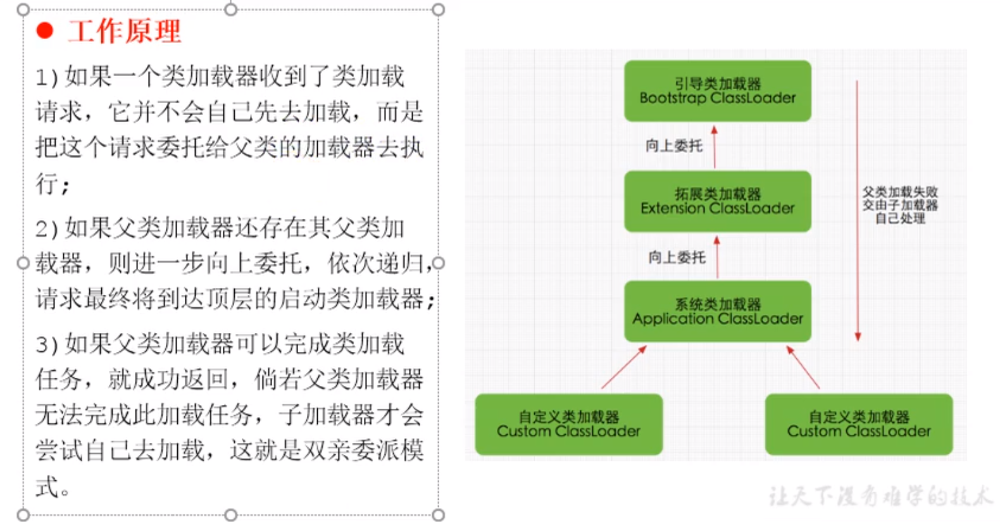
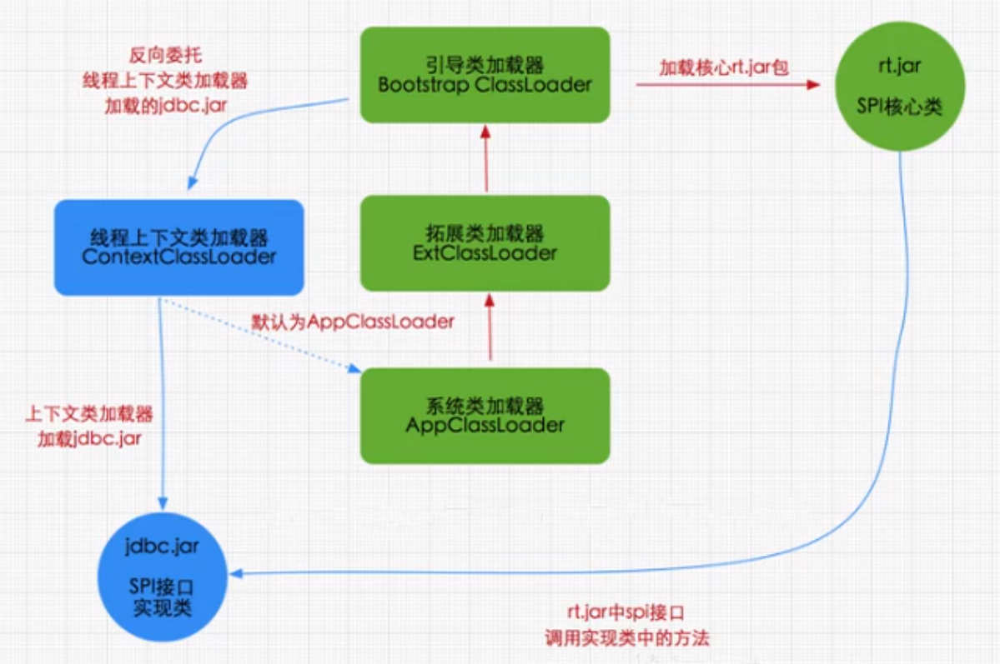

一、类加载子系统

注意：  
① class文件在文件的开头有特定的文件标识  
② ClassLoader只负责class文件的加载,至于它是否可以运行,由Execution Engine(执行引擎)来决定  
③ 加载的类信息存放在于一块叫做方法区的内存空间里面

1.类加载（loading）
1.1 通过一个类的全限定名获取定义此类的二进制字节流
1.2 将这个字节流所代表的静态存储结构转换成方法区的运行时数据结构
1.3 在内存中生成一个代表这个类的java.lang.Class对象,作为方法区这个类的各种数据的访问入口

2.链接（linking）
2.1 验证(Verify)
确保class文件的字节流中包含信息是否符合虚拟机的规划要求(CAFE BABY)开头,保证被加载的类的正确性;
主要包括:文件格式验证,元数据验证,字节码验证,符号引用的验证等等;
2.2 准备(Prepare)
为类变量(即静态变量)分配内存并且设置该类变量的默认初始化值,也就是我们所说的零值;
注意:
这里不包含用final修饰的类变量值:因为final修饰的常量在编译的时候已经分配好了,准备阶段会进行显式的初始化;
同时,这里也不会为实例变量进行分配初始化,类变量会分配到方法区中,而实例变量是会随着对象一起分配到Java堆中的.
2.3 解析(Resolve)
将常量池中的符号引用转换成直接引用的过程。其中,符号引用指的是一组符号锁引用的目标.符号引用的字面量形式明确规定在Class文件格式中;
而直接引用就是直接指向目标的的指针,相对偏移量或者一个间接定位到目标的句柄.

3.初始化阶段(Initialization)
初始化阶段就是执行类构造器的clinit()方法
此方法无需进行定义,是javac编译器自动收集类中的所有类变量的赋值动作和静态代码块中语句合并而来的(言外之意就是如果该类没有定义静态变量和静态代码块的话,此方法将不会在jvm类加载中执行)
如果该类具有父类,JVM会保证子类的clinit()方法执行前,父类的clinit()方法已经执行完毕;
虚拟机必须保证一个类的clinit方法在多线程下被同步加锁.-----只会加载一次! ! !

4.获取ClassLoader的途径:

> 面试题：
> 
> 双亲委派机制
> 
> 
> 
> 沙箱安全机制
> 保证对Java信息源代码的保护
> 何为沙箱安全机制?即如果我们自己建立和源代码相同的包,例如java/lang/String.Class,在我们去使用类加载器去加载此类时,
> 为了防止你自定义的类对源码的破坏,所以他默认不是使用你的String类的本身的系统加载器去加载它,而是选择率先使用引导类加载器去加载,
> 而引导类在加载的过程中会先去加载JDK自带的文件(rt.jar包中的java/lang/String.class),而不是你自己定义的String.class,
> 报错信息会提示没有main方法 ,就是因为加载的是rt.jar包下的String类,这样就可以做到保证对java核心源代码的保护,这既是沙箱保护机制。
> 
> JVM判断两个class对象是否为同一个类存在两个必要条件?
> 1)类的完整类名必须一致(包括包名)
> 2)加载类的ClassLoader必须相同
> 
> 若是一个类型由用户加载器(系统加载器)加载 那么JVM会将这个类加载器的一个引用类型信息的一部分保存到方法区中
> 
> 类的主动使用和被动使用 
> 主动使用情况:① 创建类的实例 ②访问某个类或者接口的静态变量 ③调用类的静态方法 ④反射⑤初始化一个类的子类 
> ⑥Java虚拟机启动时被表明启动类的类等等 
> 被动使用:若类不会导致类的初始化,则为被动使用
> 
> 