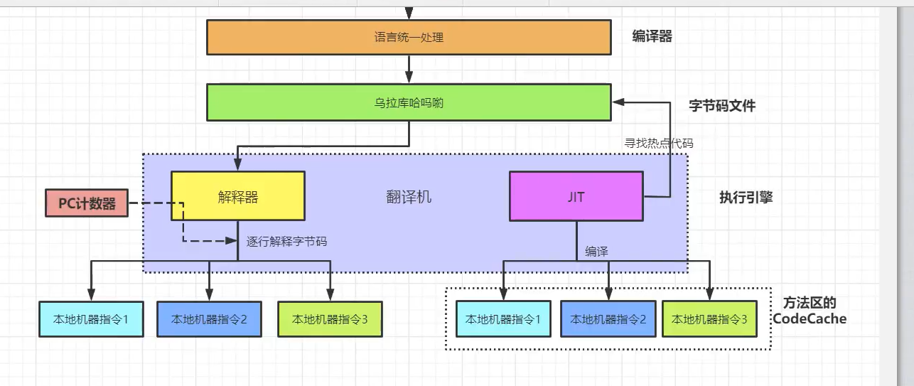
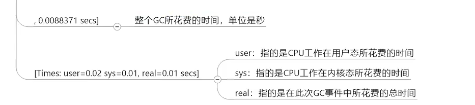
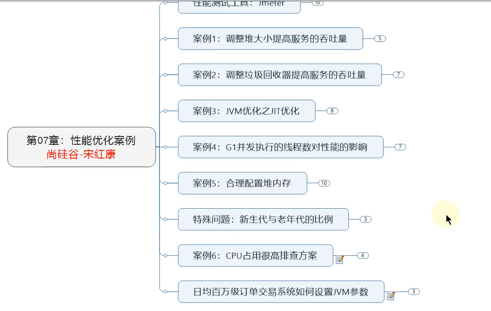

Java中内存泄露的8种情况：  
① 静态集合类  
静态集合类，如hashMap，LinkedList等等，如果这些容器为静态的，那么他们的生命周期与JVM程序一致，则容器中的对象在程序结束之前将不能被释放，从而造成
内存泄露。简单而言，长生命周期的对象持有短生命周期对象的引用，尽管短生命周期的对象不再使用，但是因为长生命周期对象持有它的引用而导致不能被回收。
```
public class MemoryLeak{
    static List list=new ArrayList();
    
    public void oomTest(){
        Object obj=new Object();
        list.add(obj);
    }
}
```

② 单例模式  
和静态集合类导致内存泄露的原因类似，因为单例的静态特性，它的生命周期和JVM的生命周期一样长，所以如果单例对象持有外部对象的引用，那么这个外部对象
也不会被回收，那么就会造成内存泄露  

③ 内部类持有外部类  
内部类持有外部类，如果一个外部类的实例对象的方法返回了一个内部类的实例对象。这个内部类对象长期被引用，即使那个外部类实例对象不再被使用，
但是由于内部类持有外部类的实例对象，这个外部类对象将不会被垃圾回收，将造成内存泄露  

④ 各种连接，如数据库连接，网络连接和IO连接等
在对数据库进行操作的过程中，首先需要建立与数据库的连接，当不再使用时，需要调用close()方法来释放与数据库的连接，只有连接被关闭后，垃圾回收器
才会回收对应的对象。否则，如果在访问数据库的过程中，对connection、statement或resultSet不显性地关闭，将会造成大量的对象无法被回收，从而引起内存泄露  

⑤ 变量不合理的作用域  
一个变量定义的作用范围大于其使用范围，或者没有及时把对象设置为null，都很有可能造成内存泄露  
```
public class UsingRandom{
    // 可能会造成内存泄露，msg的生命周期和对象相同，所以方法结束，msg不能回收，将其定义到方法里
    // 或者使用完msg后，将msg设置为null也行
    private String msg;
    
    public void receiveMsg(){
        // private String msg;
        readFrom();// 获取数据保存到msg中
        saveDB();// 把msg保存到数据库中
        // msg = null;
    }
}
```

⑥ 改变哈希值  
当一个对象被存储进hashSet集合后，就不能修改对象中参与计算哈希值的字段了。否则，对象修改后的哈希值与最初存储进hashSet集合中时的哈希值就不同了  
在这种情况下，即使在contains方法使用该对象的当前引用作为参数去hashSet集合中检索对象，也将返回找不到对象的结果，这将导致无法从hashSet集合中
单独删除当前对象，造成内存泄露  
这也是String被设置成不可变类型的原因，我们可以放心把String存入hashSet，或者把String当作hashMap的key  

⑦ 缓存泄露  
内存泄露的另一个常见来源是缓存。对于这个问题，可以使用WeakHashMap代表缓存，此种Map的特点是，当除了自身有对key的引用外，此key没有其他引用
那么此map会自动丢弃此值  

⑧ 监听器和回调  
如果客户端在你实现的API中注册回调，却没有显示的取消，那么就会聚集。需要确保回调立即被当作垃圾回收的最佳方法是只保存它的弱引用，例如将他们保存
成为WeakHashMap的键。  

# 常用的JVM参数选项
①打印设置的XX选项及值  


默认情况下，UseAdaptiveSizePolicy是开启状态的，导致新生代中Eden区可能占比1/6。禁用该值，并且显示设置-XX:SurvivorRatio=8才生效，即Eden区占1/8。


垃圾收集器相关选项


使用G1垃圾收集器，就不要再设置-Xmn、newRatio的值




哪些情况下会触发Full GC？
①老年代空间不足  
②方法区空间不足  
③显示调用System.gc()  
④Minor GC进入老年代的数据的平均大小 大于 老年代的可用内存  
⑤大对象直接进入老年代，而老年代的可用空间不足  








