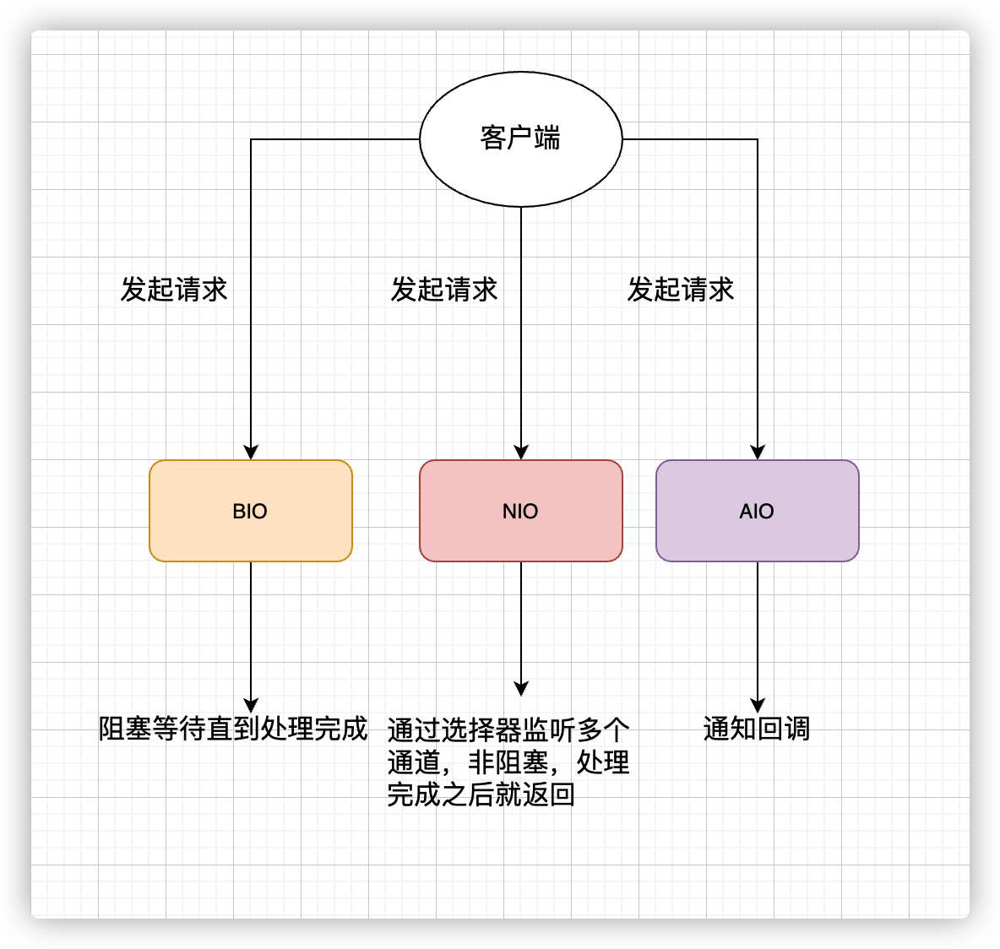
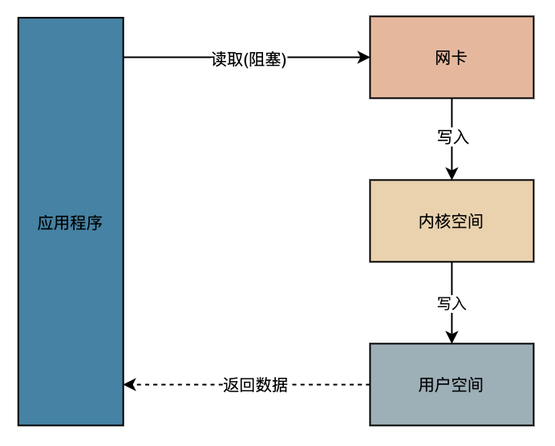
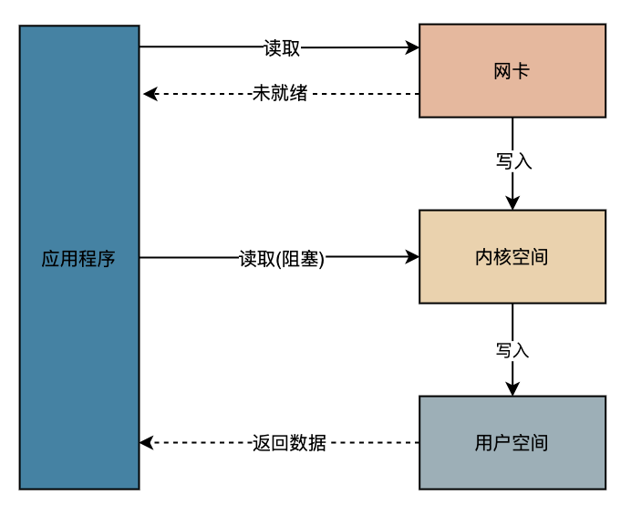
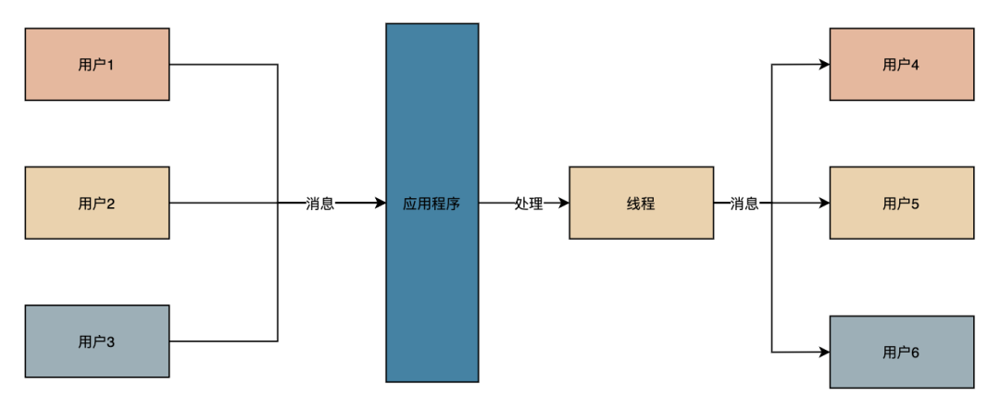
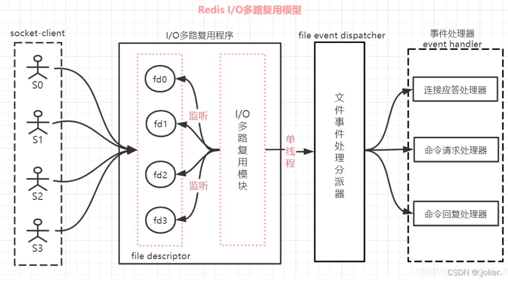
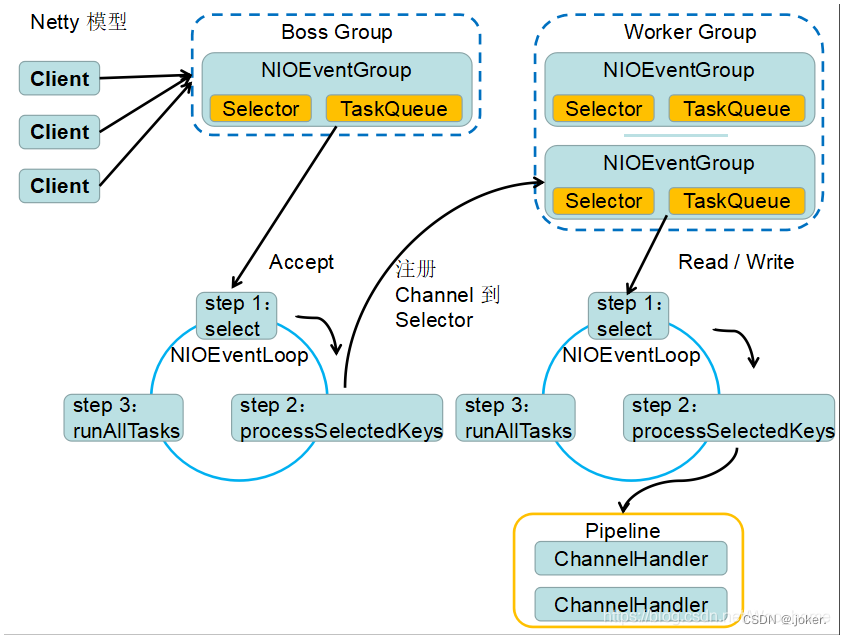

# IO流的分类
### 按数据流向分为输入流和输出流
输入与输出是相对于应用程序而言的，比如文件读写，读取文件是输入流，写文件是输出流

### 按处理数据单位分为字节流和字符流
Java中字符是采用Unicode标准，Unicode 编码中，一个英文字母或一个中文汉字为两个字节

### 按流的角色分为节点流和处理流
节点流：直接操作数据读写的流类，比如FileInputStream  
处理流：对一个已存在的流的链接和封装，通过对数据进行处理为程序提供强大、灵活 的读写功能，例如BufferedInputStream处理流的构造方法总是要带一个
其他的流对象做参数，一个流对象经过其他流的多次包装  
处理流和节点流应用了Java的装饰者设计模式，处理流是对节点流的封装，最终的数据处理还是由节点流完成的

# IO模型


## BIO

数据的读取写入必须阻塞在一个线程内等待其完成，在连接数不是特别高的情况下（小于单机1000），这种模型是比较 不错的，可以让每一个连接专注于自己的
IO并且编程模型简单，也不用过多考虑系统的过载、限流等问题  
线程池本身就是一个天然的漏斗，可以缓存一些系统处理不了的连接或请求，但是当面对十万甚至是百万连接时，传统的BIO模型是无能为力的，因此，我们需要
一种更高效的IO处理模型来应对更高 的并发量

## NIO

NIO 解决的地方是从网卡到内核空间部分的阻塞，也就是说应用程序发送一个读取 IO 的请求，如果数据还没有从网卡写入内核空间，直接返回未就绪，
这样就做到了不需要程序死等到结果。等到写入内核空间以后，程序继续读取数据，这时候才会阻塞程序。  

> NIO支持面向缓冲区的、基于通道的IO操作并以更加高效的方式进行文件的读写操作，其核心API为Channel(通道)，Buffer(缓冲区), Selector(选择器)  
> ① Channel负责传输  
> ② Buffer负责存储  
> ③ Selector是Java NIO中用于管理一个或多个Channel的组件，控制决定对哪些Channel进行读写；通过使用Selector让一个单线程可以管理多个Channel甚至多个网络连接
> 当Selector管理的channel发生对应事件时就会通知Selector并将该事件存储到它内部的一个列表里(SelectionKey)

## AIO

## IO多路复用


```
https://blog.csdn.net/Squid87/article/details/123452472
```
IO多路复用可以在一个线程中监听多个文件描述符，一旦某个描述符就绪（一般是读就绪或者写就绪），能够通知程序进行相应的读写操作  
IO多路复用的优势是使用更少的线程处理更多的连接，例如Nginx、网关，这种可能需要处理海量连接转发的服务，它们就非常适合使用IO多路复用，IO多路复用
并不能让你的业务系统提速，但是它可以让你的系统支撑更多的连接

> ```select```、```poll```、```epoll```这三个函数都可以用于实现IO多路复用  
> select函数：当被 监听的fd（文件描述符）就绪后会返回，但是我们无法知道具体是哪些fd就绪了，只能遍历所有的fd。通常来说某一时刻，就绪的fd并不会很多，
> 但是使用select必须遍历所有的fd，这就造成了一定程度上的性能损失，select最多可监听的fd是有限制的，32位操作系统默认1024个，64位默认2048  
> 
> poll函数：和select一样，使用poll时也无法知道具体哪些fd就绪了，还是需要遍历，poll最大的改进是没有了监听数量的限制，但是监听了过多的fd会导致性能不佳  
> 
> epoll函数：通常在linux系统中使用IO多路复用，都是在使用epoll函数，epoll是select和poll的增强，可以通知我们哪些fd已经就绪了，并且没有监听数量的限制，
> 所以使用epoll的性能要远远优于select和poll

# Reactor模型

# Redis的IO多路复用模型


# Netty的多路复用模型


# 零拷贝
```
https://blog.csdn.net/qq_44786814/article/details/115132009
```

# IO问题排查思路及工具
```
https://blog.csdn.net/yangguosb/article/details/89853045
```


