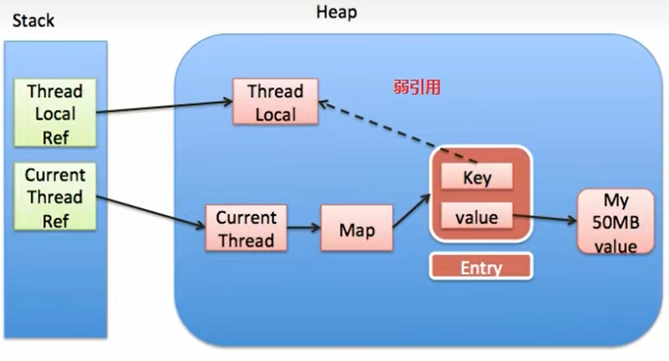

---------------------------------
https://mp.weixin.qq.com/s/bECVeuxE-WIYmvXbF2V3QA  
https://mp.weixin.qq.com/s?__biz=MzkxNTE3NjQ3MA==&mid=2247491733&idx=1&sn=2a4efe9f12a6d3009d89d703e7dadaa5&chksm=c1618decf61604fa0eb46bb65e31248db2bd555527dc558b19c5a60a2be634a24e5e1bc79e0c&scene=21#wechat_redirect
---------------------------------
# 概念
提供线程内的局部变量，不同的线程之间不会互相干扰，这种变量在线程的生命周期内起作用  
ThreadLocal对象使用static修饰，ThreadLocal无法解决共享对象的更新问题  
必须回收自定义的ThreadLocal变量，尤其在线程池场景下，线程经常会被复用，如果不清理自定义的ThreadLocal变量，可能会影响后续业务逻辑和造成内存泄露问题  

> 必须进行清空线程数据处理  
> 程序运行在 Tomcat 中，执行程序的线程是Tomcat的工作线程，而Tomcat的工作线程是基于线程池的  
> 线程池会重用固定的几个线程，一旦线程重用，那么很可能首次从 ThreadLocal 获取的值是之前其他用户的请求遗留的值。这时，ThreadLocal 中的用户信息就是其他用户的信息。

# ThreadLocal与synchronized的区别
|  | synchronized | threadLocal |
| --- | --- | --- |
| 原理 | 同步机制采用'以时间换空间'的方式，只提供了一份变量，让不同的线程排队访问 | ThreadLocal采用'以空间换时间'的方式，为每一个线程都提供了一份变量的副本，从而实现同时访问而互相不干扰 |
| 侧重点 | 多个线程之间访问资源的同步 | 多线程中让每个线程之间的数据相互隔离 |

# ThreadLocal内存泄漏问题

因为key是弱引用，保证了key指向的ThreadLocal对象能够被及时回收，但是value指向的对象是需要ThreadLocal调用get()，但如果key指向对象被回收，
key变成了null，那么value无法获得，即不会再回收entry、value，因此弱引用不能100%保证内存不泄露。在不使用某个ThreadLocal对象后，
手动调用remove方法来删除它。特别是在线程池中，不仅仅是内存泄漏的问题，因为线程池中的线程是重复使用的，意味着这个线程的ThreadLocalMap对象也是重复使用的，
如果我们不手动调用remove方法，那么后面的线程就有可能获取到上个线程遗留下来的value值，造成bug。

### entry的内存泄露问题
1 使用完threadLocal，调用其remove方法删除对应的entry（推荐）  
2 使用完threadLocal，当前线程也随之结束运行，因为强引用链thread->threadLocalMap->entry(key,value)

### key的弱引用优化
因为在threadLocalMap的set/getEntry方法中，会对key为null（即key弱引用threadLocal对象，threadLocal变量置空后，因为弱引用的原因，threadLocal会被gc，而指向threadLocal
的key会被置空）进行判断，如果为null的话，那么是会对value置为null的  
这就意味着使用完threadLocal，当前线程依然运行的情况下，就算忘记调用remove方法，弱引用因为gc然后置空的原因也比强引用多一层保障。因为弱引用的原因，threadLocal会被回收，对应的
value在下一次threadLocalMap调用set、get、remove中的任一方法的时候会被清除，从而避免内存泄露（entry或者value会出现内存泄露问题）

# ThreadLocal的问题
1 entry对象的key为什么是弱引用指向ThreadLocal对象？  
因为自定义指向ThreadLocal对象的强引用变量在方法结束后，会被销毁，但此时ThreadLocalMap中某个entry对象的key还指向了该ThreadLocalMap对象，如果是强引用，就会导致key指向的
ThreadLocal对象不能被gc回收，造成内存泄露。但是如果是弱引用，则会大概率减少内存泄露的问题，可以使ThreadLocal对象在方法执行完毕后顺利被回收且entry的key引用指向null

2 key为null的entry的回收？
此种场景下，在thread运行结束后，ThreadLocal、ThreadLocalMap、Entry没有引用可达，在gc时会进行垃圾回收。但是在线程池场景下，线程复用就会出现内存泄露问题。  
此后调用get、set或remove方法时，就会尝试删除key为null的entry，可以释放value对象所占用的内存。**因此在不使用某个ThreadLocal对象后，需要手动调用remove方法来删除它**  

# ThreadLocal总结
1 ThreadLocal并不解决线程间数据共享的问题  
2 ThreadLocal适用于变量在线程间隔离且在方法间共享的场景  
3 ThreadLocal通过隐式的在不同线程内创建独立实例副本避免了实例线程安全的问题  
4 每个线程持有一个只属于自己的专属Map，并维护了ThreadLocal对象与具体实例的映射，该map由于只被持有它的线程访问，故不存在线程安全以及锁的问题  
5 ThreadLocalMap的Entry对ThreadLocal的引用为弱引用，避免了ThreadLocal对象无法被回收的问题  
6 会通过expungeStaleEntry、cleanSomeSlots、replaceStaleEntry这三个方法回收key为null的Entry对象的值（即具体实例）以及Entry对象本身从而防止内存泄露

# ThreadLocalMap解决哈希冲突
ThreadLocalMap使用```线性探测法```来解决哈希冲突，该方法一次探测下一个地址，直到有空的地址后插入，若整个空间都找不到空余的地址，则产生溢出