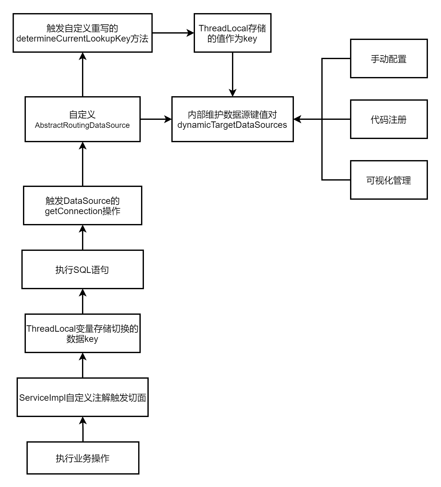

# AOP
AOP是一种编程思想。AOP代理是AOP框架创建的对象，代理就是目标对象的增强  

## AspectJ
AspectJ是静态代理，有专门的编译器，在编译期间织入代码  
相对来说AspectJ的静态代理方式具有更好的性能，但是AspectJ需要特定的编译器进行处理，而Spring AOP则无需特定的编译器处理

## SpringAOP
SpringAOP代理可以使用JDK动态代理，也可以使用CGLIB代理，前者基于接口，后者基于子类

### JDK动态代理
JDK动态代理通过反射来接收被代理的类，并且要求被代理的类必须实现一个接口。JDK动态代理的核心是InvocationHandler接口和Proxy类。

### CGLIB动态代理
如果目标类没有实现接口，那么Spring AOP会选择使用CGLIB来动态代理目标类。CGLIB（Code Generation Library），是一个代码生成的类库，可以在运行时动态的生成某个类的子类。
注意：CGLIB是通过继承的方式做的动态代理，因此如果某个类被标记为final，那么它是无法使用CGLIB做动态代理的。

# 异常分类


> rollbackFor 默认对RuntimeException 和Error 以及它们的子类，做回滚

# 事务失效场景
① 访问权限不是```public```，Spring则不会提供事务功能  
② 方法被定义成final、static的，无法通过动态代理，变成事务方法  
③ 方法内部调用
> ① 在Service类中注入自己  
> ② 通过AopContext.currentProxy()获取代理对象

④ 未被Spring管理  
⑤ 多线程调用，不在同一个线程中，获取到的数据库连接不一样，从而是不同的事务  
⑥ 表不支持事务，```myisam```存储引擎不支持事务  
⑦ 自定义了回滚异常。Spring事务，默认情况下，只会回滚RuntimeException（运行时异常）和Error（错误），对于普通的Exception（非运行时异常），
它不会回滚。阿里巴巴开发者规范中，还是要求开发者重新指定该参数，建议一般情况下，将该参数设置成：```Exception```或```Throwable```  
⑧ 嵌套事务回滚多了
```java
// doOtherThing方法出现了异常，没有手动捕获，会继续往上抛，到外层add方法的代理方法中捕获了异常。所以，这种情况下是直接回滚了整个事务，不只回滚单个保存点
public class UserService {
    @Autowired
    private UserMapper userMapper;
    @Autowired
    private RoleService roleService;

    @Transactional
    public void add(UserModel userModel) throws Exception {
        userMapper.insertUser(userModel);
        roleService.doOtherThing();
    }
}

@Service
public class RoleService {
    @Transactional(propagation = Propagation.NESTED)
    public void doOtherThing() {
        System.out.println("保存role表数据");
    }
}
```

# 正则表达式
> Matcher.matches：对整个字符串进行匹配,只有整个字符串都匹配了才返回true  
> Matcher.lookingAt：对前面的字符串进行匹配,只有在最前面匹配到才返回true  
> Matcher.find：对字符串进行匹配,匹配到的字符串可以在任何位置
>
> Matcher.start():返回匹配到的子字符串在字符串中的索引位置  
> Matcher.end():返回匹配到的子字符串的最后一个字符在字符串中的索引位置  
> Matcher.group():返回匹配到的子字符串
>
> groupCount()用于返回有多少组,自然也给出了相应的按照组查看的方法,及start(),end(),Group()的重载方法:start(int i),end(int i),group(int i)

注意：只有当匹配操作成功，即matches(),lookingAt(),find()其中任意一个方法返回true时，才可以使用start(),end(),group()三个方法,否则会抛出java.lang.IllegalStateException  

# 动态数据源


### service方法上加@Transaction后切换数据源不生效
在service中开启事务，service中对其他数据源的操作只会使用开启事务的数据源，因为开启事务的数据源会被缓存下来，可以在DataSourceTransactionManager的doBegin()中看见那个txObject，
如果在一个事务内，就会复用connection，所以切换不了数据源