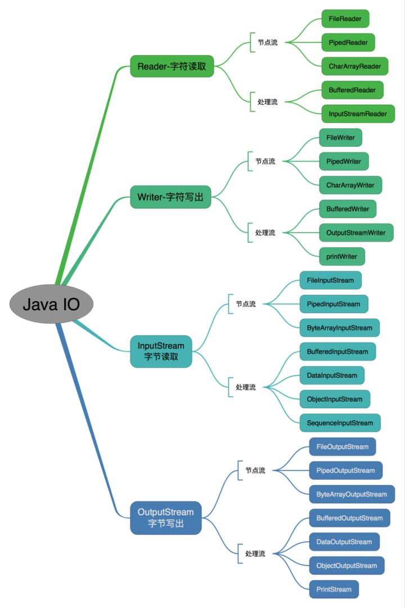
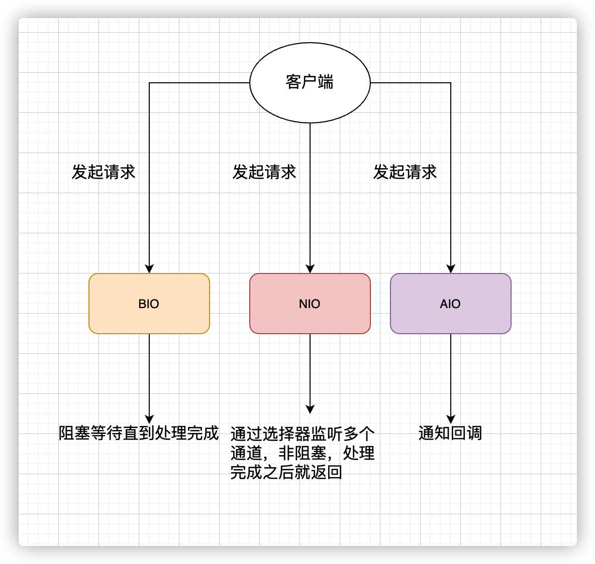
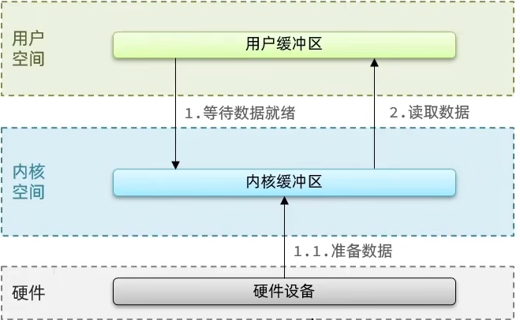
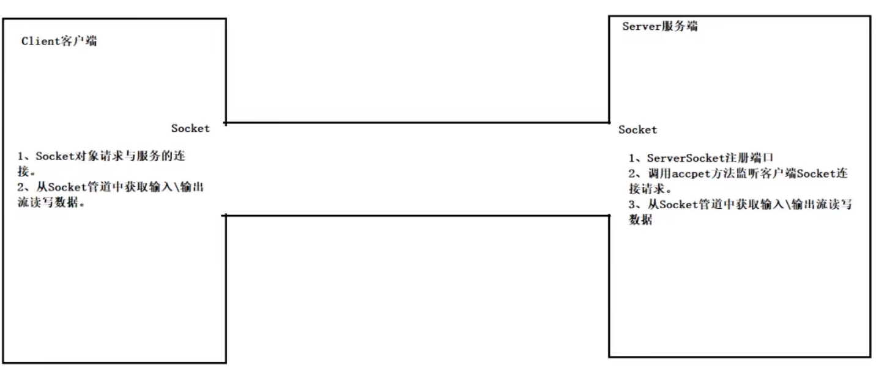
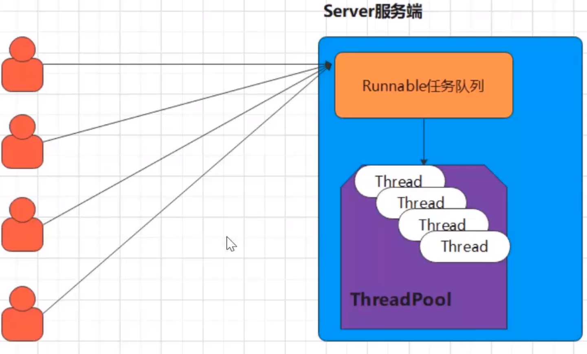
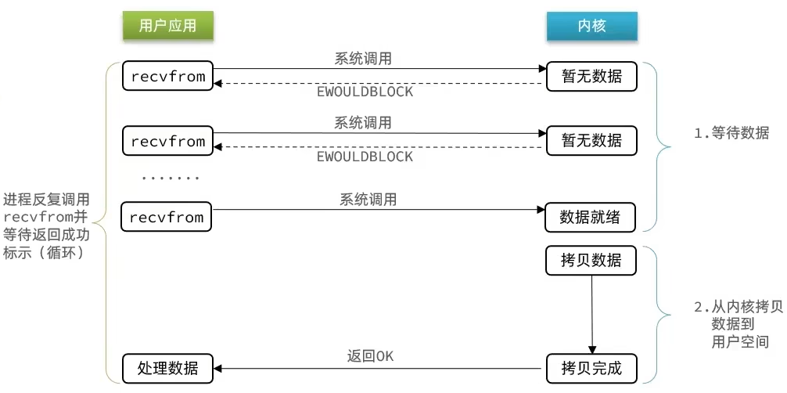
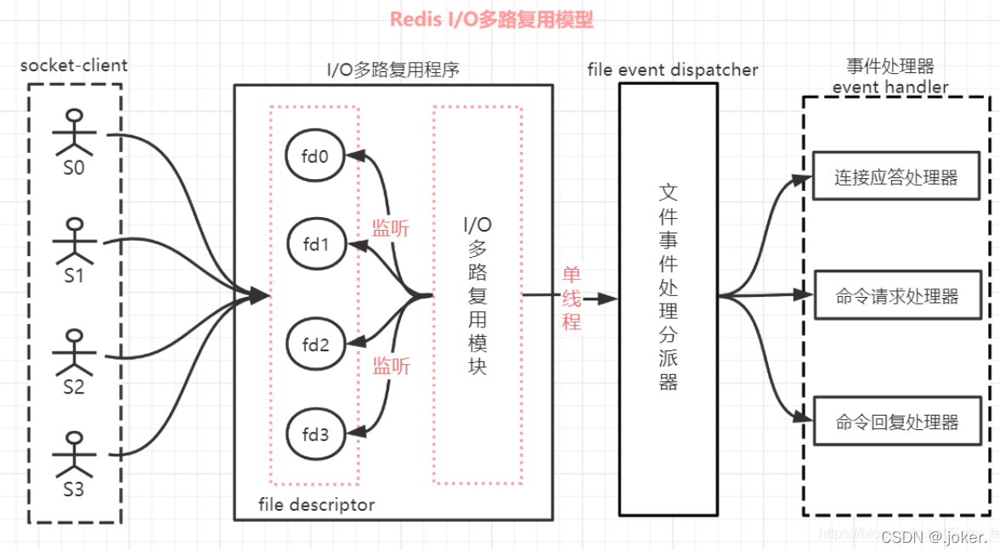
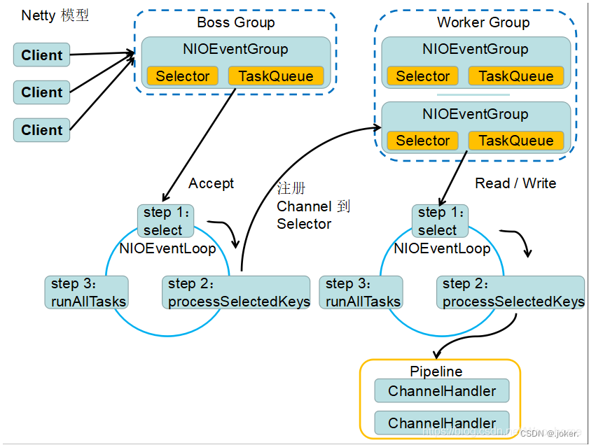

# IO模型


## BIO（同步并阻塞）




①服务器的实现模式是一个连接一个线程，即客户端有连接请求时服务器需要启动一个线程进行处理，如果这个连接不做任何事情会造成不必要的线程开销。

②在连接数不是特别高的情况下（小于单机1000），这种模型是比较 不错的，但是当面对十万甚至是百万连接时，传统的BIO模型是无能为力的。

### 伪异步IO编程



①伪异步IO采用了线程池实现，因此避免了为每个请求创建一个独立线程造成资源耗尽的问题，但由于底层依然采用的同步阻塞模型，因此无法从根本上解决问题。

②如果单个消息处理的缓慢，或者服务器线程池中的全部线程都被阻塞，那么后续socket的io消息都将在队列中排队。新的socket请求将被拒绝，客户端会发生大量连接超时。但是系统并不会宕机。

## NIO（同步非阻塞）


①服务器实现模型是一个线程处理多个请求连接，即客户端发送的连接请求都会注册到多路复用器上，多路复用器轮询到连接有IO请求就进行处理。

> NIO支持面向缓冲区的、基于通道的IO操作并以更加高效的方式进行文件的读写操作，其核心API为Channel(通道)，Buffer(缓冲区), Selector(选择器)  
> ① Channel负责传输  
> ② Buffer负责存储  
> ③ Selector是Java NIO中用于管理一个或多个Channel的组件，控制决定对哪些Channel进行读写；通过使用Selector让一个单线程可以管理多个Channel甚至多个网络连接
> 当Selector管理的channel发生对应事件时就会通知Selector并将该事件存储到它内部的一个列表里(SelectionKey)

## AIO（异步非阻塞）

服务器实现模式是一个有效请求一个线 程，客户端的IO请求都是由OS先完成了再通知服务器应用去启动线程进行处理，一般适用于连接数较多且连接时间较长的应用。
IO多路复用的优势是使用更少的线程处理更多的连接，例如Nginx、网关，这种可能需要处理海量连接转发的服务，它们就非常适合使用IO多路复用，IO多路复用
并不能让你的业务系统提速，但是它可以让你的系统支撑更多的连接

> ```select```、```poll```、```epoll```这三个函数都可以用于实现IO多路复用  
> select函数：当被 监听的fd（文件描述符）就绪后会返回，但是我们无法知道具体是哪些fd就绪了，只能遍历所有的fd。通常来说某一时刻，就绪的fd并不会很多，
> 但是使用select必须遍历所有的fd，这就造成了一定程度上的性能损失，select最多可监听的fd是有限制的，32位操作系统默认1024个，64位默认2048  
>
> poll函数：和select一样，使用poll时也无法知道具体哪些fd就绪了，还是需要遍历，poll最大的改进是没有了监听数量的限制，但是监听了过多的fd会导致性能不佳  
>
> epoll函数：通常在linux系统中使用IO多路复用，都是在使用epoll函数，epoll是select和poll的增强，可以通知我们哪些fd已经就绪了，并且没有监听数量的限制，
> 所以使用epoll的性能要远远优于select和poll

# 适用场景

①BIO方式适用于连接数目比较小且固定的架构，这种方式对服务器资源要求较高，并发局限于应用中，JDK1.4以前的唯一选择，但程序简单。

②NIO方式适用于连接数目多且连接比较短的架构，比如聊天服务器，弹幕系统，服务器间通讯等。编程复杂。JDK1.4开始支持。

③AIO方式适用于连接数目多且连接比较长的架构，比如相册服务器，充分调用OS参与并发操作。编程复杂。JDK1.7开始支持。

# Reactor模型

# Redis的IO多路复用模型


# Netty的多路复用模型


# 零拷贝
```
https://blog.csdn.net/qq_44786814/article/details/115132009
```

# IO问题排查思路及工具
```
https://blog.csdn.net/yangguosb/article/details/89853045
```


