# 用户空间和内核空间

①进程的寻址空间被划分为两部分：内核空间、用户空间。用户应用在用户空间，内核应用（内存管理、文件系统、进程管理、网络磁盘管理等）在内核空间。

②用户空间只能执行受限的命令（R3级别），而且不能直接调用系统资源，必须通过内核提供的接口来访问

③内核空间可以执行特权命令（R0级别），调用一切系统资源

> 为了提高IO效率，会在用户空间和内核空间都加入缓冲区
>
> ①写数据时
>
> 用户缓冲区    ->   内核缓冲区   ->   设备
>
> ②读数据时
>
> 设备   ->   内核缓冲区   ->   用户缓冲区

# IO模型


## 阻塞IO（Blocking IO）

阻塞IO在两个阶段都是阻塞状态。①等待数据就绪状态；②等待数据拷贝完成


①服务器的实现模式是一个连接一个线程，即客户端有连接请求时服务器需要启动一个线程进行处理，如果这个连接不做任何事情会造成不必要的线程开销。

②在连接数不是特别高的情况下（小于单机1000），这种模型是比较 不错的，但是当面对十万甚至是百万连接时，传统的BIO模型是无能为力的。

## 非阻塞IO（Non-blocking IO）

# 三大组件

Channel、Buffer、Selector

### ByteBuffer

①向buffer写入数据，例如调用channel.read(buffer)

②调用flip()切换至读模式

③从buffer读取数据，例如调用buffer.get()

④调用clear()或compact()切换至写模式

⑤重复1-4步骤

### ByteBuffer大小分配

每个channel都需要记录可能被切分的消息，因为ByteBuffer不能被多个channel共同使用，因此需要为每个channel维护一个独立的ByteBuffer。

ByteBuffer不能太大，比如一个ByteBuffer 1M的话，要支持百万连接就要1TB内存，因此需要设计大小可变的ByteBuffer。

①一种思路是首先分配一个较小的buffer，例如4K，如果发现容量不够，再分配8k的buffer，将4kbuffer内容拷贝至8k buffer，优点是消息连续容易处理，缺点是数据拷贝耗费性能。

②另一种思路是用多个数组组成buffer，一个数组不够，把多出来的内容写入新的数组，与前面的区别是消息存储不连续解析复杂，优点是避免了靠北引起性能损耗。


①非阻塞IO的recvfrom操作会立即返回结果而不是阻塞用户进程。

②二阶段数据拷贝操作仍需等待。第一阶段的循环机制会导致CPU空转，CPU使用率暴增。

③如果调用recfrom时，恰好数据准备就绪，则用户进程可以直接进入第二阶段，读取并处理数据。


①服务器实现模型是一个线程处理多个请求连接，即客户端发送的连接请求都会注册到多路复用器上，多路复用器轮询到连接有IO请求就进行处理。

> NIO支持面向缓冲区的、基于通道的IO操作并以更加高效的方式进行文件的读写操作，其核心API为Channel(通道)，Buffer(缓冲区), Selector(选择器)  
> ① Channel负责传输  
> ② Buffer负责存储  
> ③ Selector是Java NIO中用于管理一个或多个Channel的组件，控制决定对哪些Channel进行读写；通过使用Selector让一个单线程可以管理多个Channel甚至多个网络连接
> 当Selector管理的channel发生对应事件时就会通知Selector并将该事件存储到它内部的一个列表里(SelectionKey)

## 多路复用IO（IO Multiplexing）

服务端在处理客户端Socket请求时，在单线程情况下，只能依次处理每一个socket，如果正在处理的socket恰好未就绪（数据不可读或不可写），线程就会被阻塞，所有其他客户端socket都必须等待，性能自然会差。

在Linux系统中，一切皆文件，例如常规文件、视频、硬件设备等，当然也包括网络套接字（Socket）。文件描述符（简称FD）是一个从0开始递增的无符号整数，用来关联Linux中的一个文件。

IO多路复用就是利用单个线程来同时监听多个FD，并在某个FD可读、可写时得到通知，从而避免无效的等待，充分利用CPU资源。

IO多路复用的优势是使用更少的线程处理更多的连接，例如Nginx、网关，这种可能需要处理海量连接转发的服务，它们就非常适合使用IO多路复用，IO多路复用
并不能让你的业务系统提速，但是它可以让你的系统支撑更多的连接。

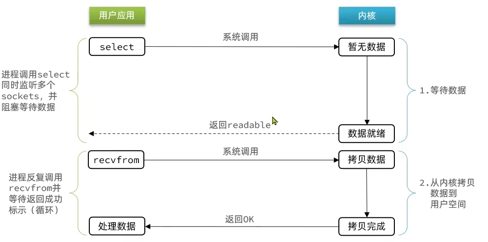

把要监听的多个FD传入select函数，等待数据就绪，如果全部不就绪，则需要等待数据，只要其中一个FD就绪，则可以调用recvfrom进行数据拷贝，数据拷贝过程中也需要等待其完成。监听FD的方式、通知的方式有多种实现。

### select

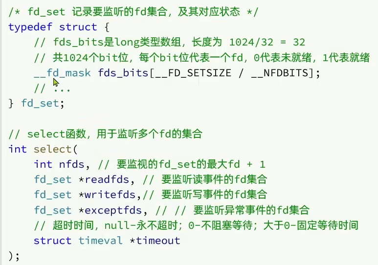

监听多个FD

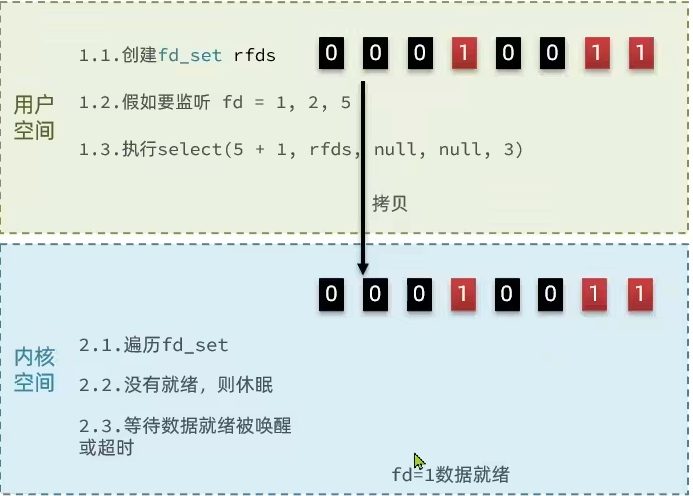

fd=1的数据就绪

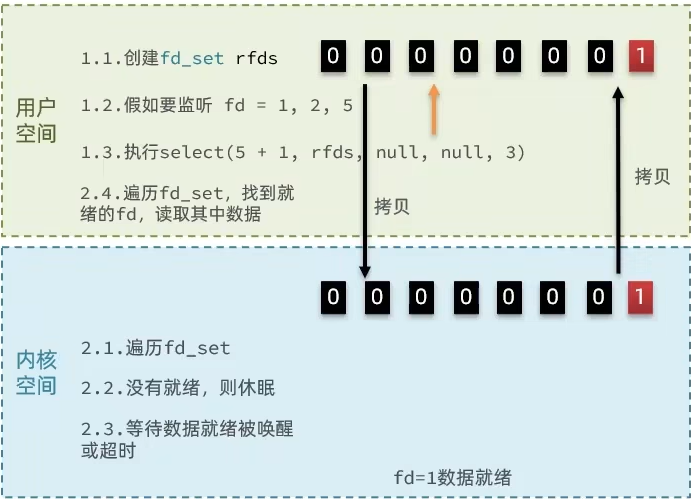

select模式存在的问题：

①需要将整个fd_set从用户空间拷贝到内核空间，select结束还要再次拷贝回用户空间；

②select无法得知具体是哪个fd就绪，需要遍历整个fd_set；

③fd_set监听的fd数量不能超过1024

### poll

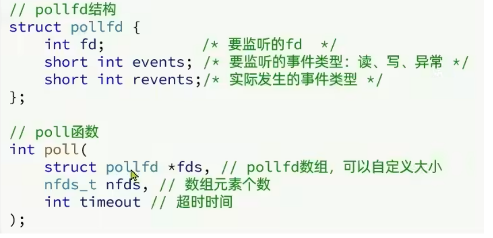

IO流程：

①创建pollfd数组，向其中添加关注的fd信息，数组大小自定义

②调用poll函数，将pollfd数组拷贝到内核空间，转链表存储，无上限

③内核遍历fd，判断是否就绪

④数据就绪或超时后，拷贝pollfd数组到用户空间，返回就绪fd数量n

⑤用户进程判断n是否大于0

⑥大于0则遍历pollfd数组，找到就绪的fd

**与select相比：**

①select模式中的fd_set大小固定为1024，而pollfd在内核中采用链表，理论上无上限

②监听fd越多，每次遍历消耗时间也越久，性能反而会下降

### epoll

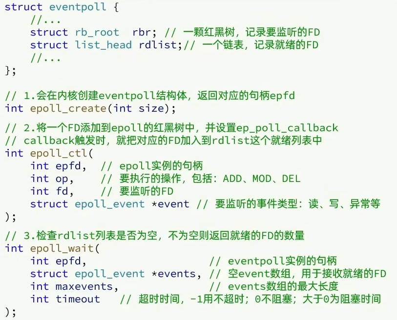

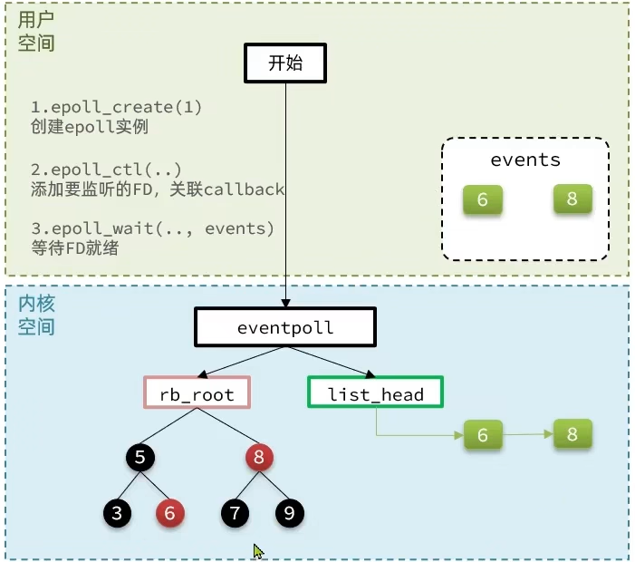

> select模式存在的三个问题：
>
> ①能监听FD最大不超过1024
>
> ②每次select都需要把所有要监听的FD都拷贝到内核空间
>
> ③每次都要遍历所有FD来判断就绪状态
>
> poll模式存在的问题：
>
> poll利用链表解决了select中监听FD上限的问题，但依然要遍历所有FD，如果监听较多，性能会下降
>
> epoll模式中如何解决上述方式的问题的？
>
> ①基于epoll实例中的红黑树保存要监听的FD，理论上无上限，而且增删改查效率都非常高，性能不会随监听的FD数量增多而下降。
>
> ②每个FD只需要执行一次epoll_ctl添加到红黑树，以后每次epoll_wait无需传递任何参数，无需重复拷贝FD到内核空间。
>
> ③内核会将就绪的FD直接拷贝到用户空间的指定位置，用户进程无需遍历所有FD就能知道就绪的FD是谁。
>
> 三种方式差异：
>
> ①select和poll只会通知用户进程有FD就绪，但不确定具体是哪个FD，需要用户进程逐个遍历FD来确认
>
> ②epoll则会在通知用户进程FD就绪的同时，把已就绪的FD写入用户空间，这样用户进程就知道是哪个FD数据准备就绪了

##### 基于epoll模式的WEB服务的流程示意图

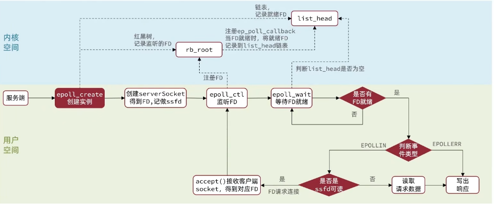

## 信号驱动IO（Signal Driven IO）

**信号驱动IO** 是与内核建立SIGIO的信号关联并设置回调，当内核有FD就绪时，会发出SIGIO信号通知用户，期间用户应用可以执行其它业务，无需阻塞等待。

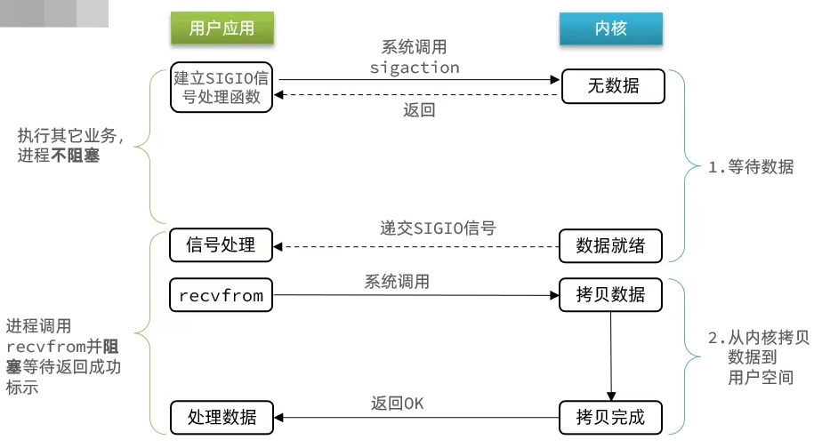

**问题：**

当有大量IO操作时，信号较多，SIGIO处理函数不能及时处理可能导致信号队列溢出，而且内核空间与用户空间的频繁信号交互性能也较低。

## 异步IO（Asynchronous IO）

异步IO的整个过程都是非阻塞的，用户进程调用完异步API后就可以去做其他事情，内核等待数据就绪并拷贝到用户空间后才会递交信号，通知用户进程。

在高并发场景下，内核由于接收了太多任务，导致内核压力过大，整体性能并不会理想，因此此种方式需要控制请求访问量。

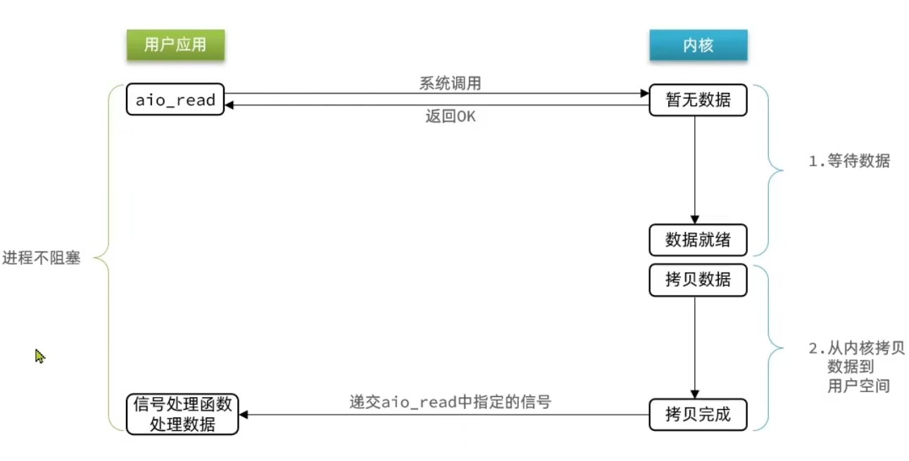

## 五种模型比较

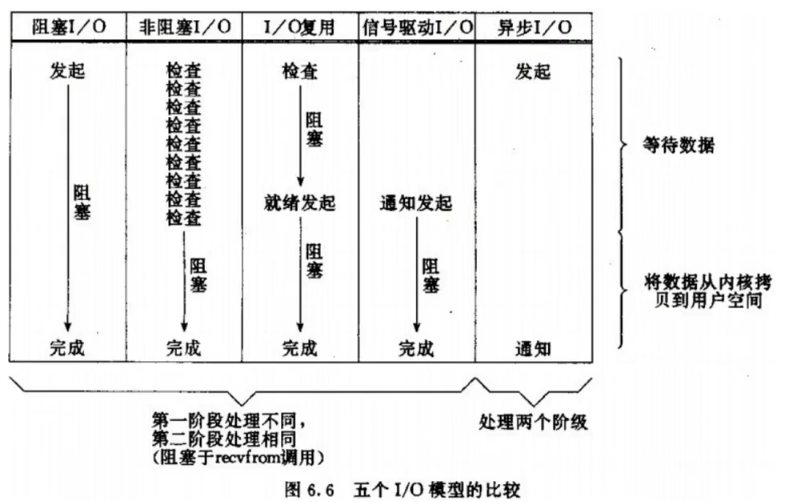

# 适用场景

①BIO方式适用于连接数目比较小且固定的架构，这种方式对服务器资源要求较高，并发局限于应用中，JDK1.4以前的唯一选择，但程序简单。

②NIO方式适用于连接数目多且连接比较短的架构，比如聊天服务器，弹幕系统，服务器间通讯等。编程复杂。JDK1.4开始支持。

③AIO方式适用于连接数目多且连接比较长的架构，比如相册服务器，充分调用OS参与并发操作。编程复杂。JDK1.7开始支持。

# Reactor模型

# Redis的IO多路复用模型


# Netty的多路复用模型


# 零拷贝
```
https://blog.csdn.net/qq_44786814/article/details/115132009
```

# IO问题排查思路及工具
```
https://blog.csdn.net/yangguosb/article/details/89853045
```
