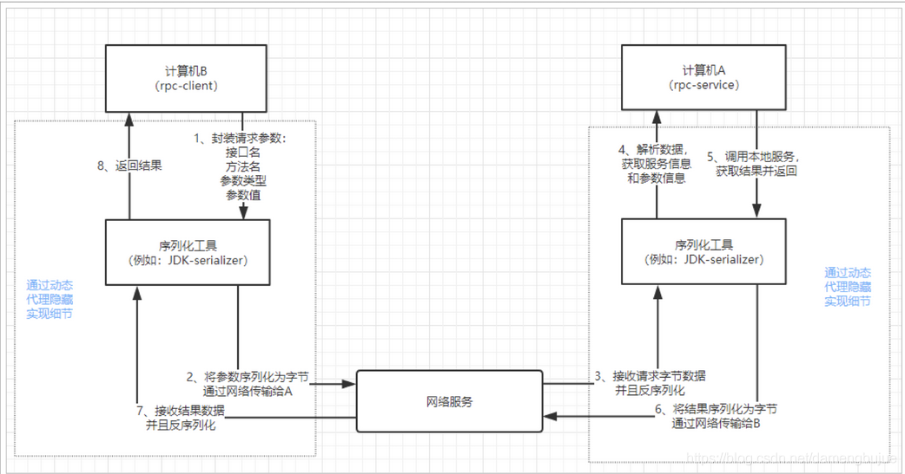

# Java如何实现远程通信
① 使用```webService```，效率不高，基于soap协议，项目中不推荐使用  
② 使用```restful```形式的服务，通过http + json去实现，很多项目中应用这种方法，缺点是当服务太多时，服务之间调用关系混乱  
③ 使用```dubbo```框架，通过rpc规范来进行远程调用，直接使用socket通信，传输效率高，并且可以统计出系统之间的调用关系及调用次数，
但需要注意，```dubbo```只能在Java语言环境中使用

# Http
### HTTP协议

HTTP本身就是一种网络传输协议，同样基于TCP，但是在这之上做了修改，规定了网络传输的请求格式、响应格式、资源定位和操作的方式等。
现在客户端浏览器与服务端通信基本都是采用Http协议。当然也可以用来进行远程服务调用。现在热门的Rest风格，就可以通过http协议来实现。
但是他的传输报文，基于统一的规定那个，覆盖面大，但是往往在实际使用中有一部分是通信所暂未使用的，这就导致消息臃肿

### HTTP协议框架-httpClient
HTTP允许传输任意类型的数据对象，正在传输的类型由Content-Type加以标记
```
text/html：HTML格式（默认格式）
text/plain：纯文本格式
text/xml：XML格式
image/gif：gif图片格式
image/jpeg：jpg图片格式
image/png：png图片格式

application/xhtml+xml：XHTML格式
application/xm：XML数据格式
application/atom+xml：ATOM XML聚合格式
application/json：JSON数据格式
application/pdf：PDF格式
application/msword：Word文档格式
application/octet-stream：二进制数据流（如常见的文件下载）
application/x-www-form-urlencoded：（<form encType="">中默认的encType，form表单数据被编码为key/value格式发送到服务器，这是表单默认的提交数据的格式）
multipart/form-data：需要在表单中进行文件上传时，就需要使用该格式
```

##### get请求
```
// ① 加请求头
// 模拟浏览器
httpGet.addHeader("User-Agent","Mozilla/5.0 (Windows NT 10.0; Win64; x64) AppleWebKit/537.36 (KHTML, like Gecko) Chrome/107.0.0.0 Safari/537.36");
// 防盗链
httpGet.addHeader("Referer","https://www.baidu.com");
// ② url编码
address=URLEncoder.encode(address,StandardCharsets.UTF_8.name());
```

##### 异步连接池

# RPC

RPC是远程过程调用，主要是通过自定义通信规则，自定义数据格式来实现通信。调用两端都需要统一通信规则，必须约定好数据传输格式，比如约定好请求和响应
的格式，在网络中传输需要进行序列化，所以还需要约定统一的序列化方式。这种通信方式可以降低通信过程中交互数据传输内容大小，从而提高通信数据传输效率。

### RPC优势
① 相较于HTTP1.1，数据包更小（主要是请求头里少了很多适配浏览器的字段）、序列化更快，所以传输效率很高  
② 基于TCP或HTTP2的自定义RPC协议，网络传输性能比HTTP1.1更快  
③ 适用于微服务架构，微服务集群下，每个微服务职责单一，有利于多团队的分工协作

### RPC不足
① RPC协议本身无法解决微服务集群的问题，例如：服务发现、服务治理等，需要工具来保障服务的稳定性  
② 调用方对服务端的RPC接口有强依赖关系，需要有自动化工具、版本管理工具来保证代码级别的强依赖关系。例如，stub桩文件需要频繁更新，否则接口调用方式可能出错

# RPC和HTTP的比较
① 从功能层面上来讲，HTTP主要用于网页端和服务端之间的数据传输上。RPC的作用是远程过程调用，是在不同应用之间的数据通信，屏蔽了通信的底层复杂度，
能够让开发者去像调用本地服务一样，去完成远程服务的一个调用  
② 从实现上来讲，HTTP定义了通信报文的一些格式，符合Request Header、Request Body、Response Header、Response Body这样一个协议特征的
通信协议才是HTTP协议。而RPC只是通信协议的一个规范，并没有具体的实现，只有按照RPC通信协议规范去实现的通信框架才是协议的真正实现，比如```Dubbo```。
在实现RPC框架的时候，自定义报文通信的一个协议规范，自定义序列化方式，或者自定义网络通信协议的类型等。从这个层面来讲，HTTP是成熟的应用层协议，而
RPC只是定义了不同服务之间数据通信的一个规范。因此HTTP协议和实现了RPC规范的框架都能实现跨网络节点之间的一些服务通信，并且底层都使用了TCP协议作为
通信基础  
③ 从使用场景上来讲，微服务架构下，多个内部服务调用频繁，适合用RPC。对外服务、单体服务、为前端提供的服务，适合用HTTP，特别是HTTP2性能也很好