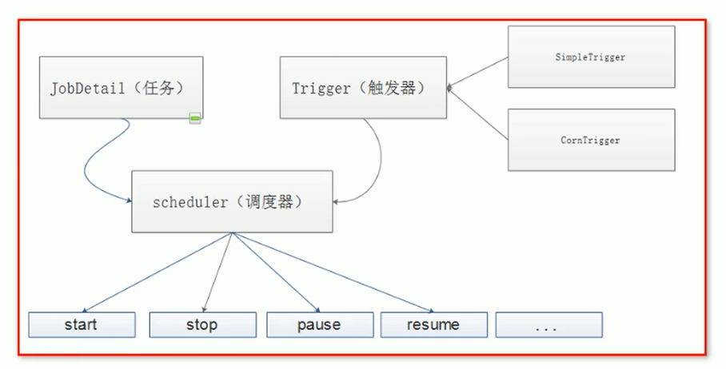

# Timer、TimerTask
Timer是jdk中提供的一个定时器工具，使用的时候会在主线程之外起一个单独的线程执行指定的计划任务，可以指定执行一次或者反复执行多次  
TimerTask是一个实现了Runnable接口的抽象类，代表一个可以被Timer执行的任务
```
// java.util.Timer ：可以通过创建 java.util.TimerTask 调度任务，在同一个线程中串行执行，相互影响。也就是说，对于同一个 Timer 里的多个 TimerTask 任务，
// 如果一个 TimerTask 任务在执行中，其它 TimerTask 即使到达执行的时间，也只能排队等待。
Timer t = new Timer();
t.scheduleAtFixedRate(new TimerTask() {
    @Override
    public void run() {
        System.out.println("hello world");
    }
}, 100, 1000);
```

# JDK1.5新增ScheduledExecutorService
在 JDK 1.5 新增，基于线程池设计的定时任务类，每个调度任务都会被分配到线程池中并发执行，互不影响。这样，ScheduledExecutorService 就解决了 Timer 串行的问题  

在日常开发中，很少直接使用 ````Timer```` 或 ```ScheduledExecutorService``` 来实现定时任务的需求  
① 仅支持按照指定频率，不直接支持指定时间的任务调度，需要结合Calendar自行计算，才能实现复杂时间的调度  
② 都是进程级别，而我们为了实现定时任务的高可用，需要部署多个进程，此时需要考虑下，多个进程下，同一个任务在相同时刻，不能重复执行  
③ 为了多所有定时任务进行统一管理，不得不进行二次封装，也就是不实用

# Spring Task
Spring Task提供了轻量级的定时任务的实现  
1 简单注解方式  
> @Scheduled  
> ① cron属性：以调用完成时刻为开始计时时间  
> ② fixedDelay属性：固定执行间隔，以调用完成时刻为开始计时时间  
> ③ fixedRate属性：固定执行间隔，以调用开始时刻为开始计时时间

```yml
# 对应 TaskSchedulingProperties 配置类
spring:
  task:
    scheduling: # Spring Task 调度任务的配置，对应 TaskSchedulingProperties 配置类
      thread-name-prefix: my-scheduling- # 线程池的线程名的前缀。默认为 scheduling- ，建议根据自己应用来设置
      pool:
        size: 10 # 线程池大小。默认为 1 ，根据自己应用来设置
      shutdown:
        await-termination: true # 应用关闭时，是否等待定时任务执行完成。默认为 false ，建议设置为 true
        await-termination-period: 60 # 等待任务完成的最大时长，单位为秒。默认为 0 ，根据自己应用来设置
```

> Spring Boot的TaskSchedulingAutoConfiguration 自动化配置类，实现 Spring Task 的自动配置，创建 ```ThreadPoolTaskScheduler``` 基于线程池的任务调度器。
> 本质上，```ThreadPoolTaskScheduler``` 是基于 ```ScheduledExecutorService``` 的封装，增强在调度时间上的功能

2 实现接口方式（动态配置cron）  
```
implements SchedulingConfigurer
```

# Quartz

在Quartz体系中，有三个组件非常重要：Scheduler（调度器）、Trigger（触发器）、Job（任务）  

## 单机模式
```yml
spring:
  # Quartz 的配置，对应 QuartzProperties 配置类
  quartz:
    job-store-type: memory # Job 存储器类型。默认为 memory 表示内存，可选 jdbc 使用数据库。
    auto-startup: true # Quartz 是否自动启动
    startup-delay: 0 # 延迟 N 秒启动
    wait-for-jobs-to-complete-on-shutdown: true # 应用关闭时，是否等待定时任务执行完成。默认为 false ，建议设置为 true
    overwrite-existing-jobs: false # 是否覆盖已有 Job 的配置
    properties: # 添加 Quartz Scheduler 附加属性，更多可以看 https://www.quartz-scheduler.org/documentation/2.4.0-SNAPSHOT/configuration.html 文档
      org:
        quartz:
          threadPool:
            threadCount: 25 # 线程池大小。默认为 10 。
            threadPriority: 5 # 线程优先级
            class: org.quartz.simpl.SimpleThreadPool # 线程池类型
```

## 集群模式
保证相同JobDetail在多个JVM进程中，有且仅有一个节点在执行  
不是以Quartz Job为维度，保证在多个JVM进程中，有且仅有一个节点在执行，而是以JobDetail为维度  
JobDetail的唯一标识是JobKey，使用name+group两个属性，一般情况下，我们只需要设置name属性即可，而Quartz会默认group=default  
通过在Job实现类上添加@DisallowConcurrentExecution，实现在相同Quartz Scheduler集群中，相同JobKey的JobDetail，保证在多个JVM进程中，有且仅有一个节点在执行

```
spring:
  # 用于创建多个数据源
  datasource:
    # 业务数据库
    user:
      url: jdbc:mysql://127.0.0.1:3306/lab-28-quartz-jdbc-user?useSSL=false&useUnicode=true&characterEncoding=UTF-8
      driver-class-name: com.mysql.jdbc.Driver
      username: root
      password:
    # quartz数据库
    quartz:
      url: jdbc:mysql://127.0.0.1:3306/lab-28-quartz-jdbc-quartz?useSSL=false&useUnicode=true&characterEncoding=UTF-8
      driver-class-name: com.mysql.jdbc.Driver
      username: root
      password:

  # Quartz 的配置，对应 QuartzProperties 配置类
  quartz:
    scheduler-name: clusteredScheduler # Scheduler 名字。默认为 schedulerName
    job-store-type: jdbc # Job 存储器类型。默认为 memory 表示内存，可选 jdbc 使用数据库。
    auto-startup: true # Quartz 是否自动启动
    startup-delay: 0 # 延迟 N 秒启动
    wait-for-jobs-to-complete-on-shutdown: true # 应用关闭时，是否等待定时任务执行完成。默认为 false ，建议设置为 true
    overwrite-existing-jobs: false # 是否覆盖已有 Job 的配置
    properties: # 添加 Quartz Scheduler 附加属性，更多可以看 https://www.quartz-scheduler.org/documentation/2.4.0-SNAPSHOT/configuration.html 文档
      org:
        quartz:
          # JobStore 相关配置
          jobStore:
            # 数据源名称
            dataSource: quartzDataSource # 使用的数据源
            class: org.quartz.impl.jdbcjobstore.JobStoreTX # JobStore 实现类
            driverDelegateClass: org.quartz.impl.jdbcjobstore.StdJDBCDelegate
            tablePrefix: QRTZ_ # Quartz 表前缀
            isClustered: true # 是集群模式
            clusterCheckinInterval: 1000
            useProperties: false
          # 线程池相关配置
          threadPool:
            threadCount: 25 # 线程池大小。默认为 10 。
            threadPriority: 5 # 线程优先级
            class: org.quartz.simpl.SimpleThreadPool # 线程池类型
    jdbc: # 使用 JDBC 的 JobStore 的时候，JDBC 的配置
      initialize-schema: never # 是否自动使用 SQL 初始化 Quartz 表结构。这里设置成 never ，我们手动创建表结构
```

# XXL-JOB
> 将调度行为抽象形成”调度中心“公共平台，而平台本身并不承担业务逻辑，”调度中心“负责发起调度请求  
> 将任务抽象成分散的JobHandler，交由”执行器“统一管理，”执行器“负责接收调度请求并执行对应的JobHandler中业务逻辑  
> 
> 中心化：调度中心和执行器分离，调度中心统一调度，通知某个执行器处理任务  
> 去中心化：调度中心和执行器一体化，自己调度自己执行处理任务

调度中心：负责管理调度信息，按照调度配置发出调度请求。支持监控调度结果以及执行日志，支持执行器failover  
执行器：负责接收调度请求并执行任务逻辑。接收”调度中心“的执行请求、终止请求和日志请求等  

# ScheduledThreadPoolExecutor
```
// 执行周期性或定时任务的线程池
@Bean(name = "scheduledExecutorService")
protected ScheduledExecutorService scheduledExecutorService()
{
    return new ScheduledThreadPoolExecutor(corePoolSize,
            new BasicThreadFactory.Builder().namingPattern("schedule-pool-%d").daemon(true).build(),
            new ThreadPoolExecutor.CallerRunsPolicy())
    {
        @Override
        protected void afterExecute(Runnable r, Throwable t)
        {
            super.afterExecute(r, t);
            Threads.printException(r, t);
        }
    };
}
```

```java
// 产生异步任务的工厂
public class AsyncFactory {
    // 产生记录操作日志这个异步任务
    public static TimerTask recordOperate(final SysOperLog operateLog)
    {
        return new TimerTask()
        {
            @Override
            public void run()
            {
                // 远程查询操作地点
                operLog.setOperLocation(AddressUtils.getRealAddressByIP(operLog.getOperIp()));
                SpringUtils.getBean(ISysOperLogService.class).insertOperlog(operLog);
            }
        };
    }
}
```

```java
/**
 * 异步任务管理器
 * 
 * @author ruoyi
 */
public class AsyncManager
{
    /**
     * 操作延迟10毫秒
     */
    private final int OPERATE_DELAY_TIME = 10;

    /**
     * 异步操作任务调度线程池
     */
    private ScheduledExecutorService executor = SpringUtils.getBean("scheduledExecutorService");

    /**
     * 单例模式
     */
    private AsyncManager(){}

    private static AsyncManager me = new AsyncManager();

    public static AsyncManager me()
    {
        return me;
    }

    /**
     * 执行任务
     * 
     * @param task 任务
     */
    public void execute(TimerTask task)
    {
        executor.schedule(task, OPERATE_DELAY_TIME, TimeUnit.MILLISECONDS);
    }

    /**
     * 停止任务线程池
     */
    public void shutdown()
    {
        Threads.shutdownAndAwaitTermination(executor);
    }
}
```

```
// 实际使用：保存至数据库
AsyncManager.me().execute(AsyncFactory.recordOper(operLog));
```

SpringBoot环境下：```@Scheduled``` + ```@EnableAsync```

# 定时任务自动配置类
```TaskSchedulingAutoConfiguration```向容器中注入```ThreadPoolTaskScheduler```。

# 异步任务自动配置类
```TaskExecutionAutoConfiguration```向容器中自动注入```ThreadPoolTaskExecutor```