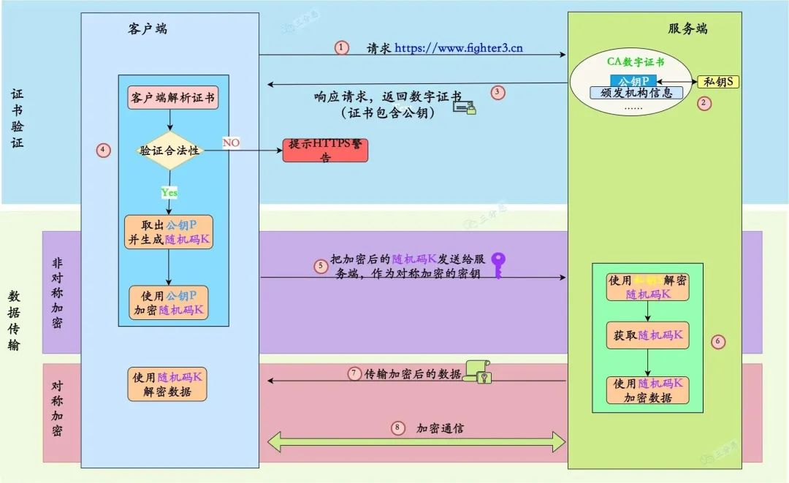

# MD5
```java
public class MD5 {
    private static final String MD5_ALGORITHM = "MD5";
    public static String encrypt(String data) throws Exception {
        // 获取MD5算法实例
        MessageDigest messageDigest = MessageDigest.getInstance(MD5_ALGORITHM);
        // 计算散列值
        byte[] digest = messageDigest.digest(data.getBytes());
        Formatter formatter = new Formatter();
        // 补齐前导0，并格式化
        for (byte b : digest) {
            formatter.format("%02x", b);
        }
        return formatter.toString();
    }

    public static void main(String[] args) throws Exception {
        String data = "Hello World";
        String encryptedData = encrypt(data);
        System.out.println("加密后的数据：" + encryptedData);
    }
}
```

# SHA-256
```java
public class SHA256 {
    private static final String SHA_256_ALGORITHM = "SHA-256";
    public static String encrypt(String data) throws Exception {
        //获取SHA-256算法实例
        MessageDigest messageDigest = MessageDigest.getInstance(SHA_256_ALGORITHM);
        //计算散列值
        byte[] digest = messageDigest.digest(data.getBytes());
        StringBuilder stringBuilder = new StringBuilder();
        //将byte数组转换为15进制字符串
        for (byte b : digest) {
            stringBuilder.append(Integer.toHexString((b & 0xFF) | 0x100), 1, 3);
        }
        return stringBuilder.toString();
    }

    public static void main(String[] args) throws Exception {
        String data = "Hello World";
        String encryptedData = encrypt(data);
        System.out.println("加密后的数据：" + encryptedData);
    }
}
```

# AES
```java
public class AES {
    private static final String AES_ALGORITHM = "AES";
    // AES加密模式为CBC，填充方式为PKCS5Padding
    private static final String AES_TRANSFORMATION = "AES/CBC/PKCS5Padding";
    // AES密钥为16位
    private static final String AES_KEY = "1234567890123456";
    // AES初始化向量为16位
    private static final String AES_IV = "abcdefghijklmnop";

    /**
     * AES加密
     *
     * @param data 待加密的数据
     * @return 加密后的数据，使用Base64编码
     */
    public static String encrypt(String data) throws Exception {
        // 将AES密钥转换为SecretKeySpec对象
        SecretKeySpec secretKeySpec = new SecretKeySpec(AES_KEY.getBytes(), AES_ALGORITHM);
        // 将AES初始化向量转换为IvParameterSpec对象
        IvParameterSpec ivParameterSpec = new IvParameterSpec(AES_IV.getBytes());
        // 根据加密算法获取加密器
        Cipher cipher = Cipher.getInstance(AES_TRANSFORMATION);
        // 初始化加密器，设置加密模式、密钥和初始化向量
        cipher.init(Cipher.ENCRYPT_MODE, secretKeySpec, ivParameterSpec);
        // 加密数据
        byte[] encryptedData = cipher.doFinal(data.getBytes(StandardCharsets.UTF_8));
        // 对加密后的数据使用Base64编码
        return Base64.getEncoder().encodeToString(encryptedData);
    }

    /**
     * AES解密
     *
     * @param encryptedData 加密后的数据，使用Base64编码
     * @return 解密后的数据
     */
    public static String decrypt(String encryptedData) throws Exception {
        // 将AES密钥转换为SecretKeySpec对象
        SecretKeySpec secretKeySpec = new SecretKeySpec(AES_KEY.getBytes(), AES_ALGORITHM);
        // 将AES初始化向量转换为IvParameterSpec对象
        IvParameterSpec ivParameterSpec = new IvParameterSpec(AES_IV.getBytes());
        // 根据加密算法获取解密器
        Cipher cipher = Cipher.getInstance(AES_TRANSFORMATION);
        // 初始化解密器，设置解密模式、密钥和初始化向量
        cipher.init(Cipher.DECRYPT_MODE, secretKeySpec, ivParameterSpec);
        // 对加密后的数据使用Base64解码
        byte[] decodedData = Base64.getDecoder().decode(encryptedData);
        // 解密数据
        byte[] decryptedData = cipher.doFinal(decodedData);
        // 返回解密后的数据
        return new String(decryptedData, StandardCharsets.UTF_8);
    }

    public static void main(String[] args) throws Exception {
        String data = "Hello World";

        String encryptedData = encrypt(data);
        System.out.println("加密后的数据：" + encryptedData);

        String decryptedData = decrypt(encryptedData);
        System.out.println("解密后的数据：" + decryptedData);
    }
}
```

# RSA
```java
public class RSA {
    private static final String RSA_ALGORITHM = "RSA";

    /**
     * 生成RSA密钥对
     *
     * @return RSA密钥对
     */
    public static KeyPair generateKeyPair() throws NoSuchAlgorithmException {
        KeyPairGenerator keyPairGenerator = KeyPairGenerator.getInstance(RSA_ALGORITHM);
        keyPairGenerator.initialize(2048); // 密钥大小为2048位
        return keyPairGenerator.generateKeyPair();
    }

    /**
     * 使用公钥加密数据
     *
     * @param data      待加密的数据
     * @param publicKey 公钥
     * @return 加密后的数据
     */
    public static String encrypt(String data, PublicKey publicKey) throws Exception {
        Cipher cipher = Cipher.getInstance(RSA_ALGORITHM);
        cipher.init(Cipher.ENCRYPT_MODE, publicKey);
        byte[] encryptedData = cipher.doFinal(data.getBytes(StandardCharsets.UTF_8));
        return Base64.getEncoder().encodeToString(encryptedData);
    }

    /**
     * 使用私钥解密数据
     *
     * @param encryptedData 加密后的数据
     * @param privateKey    私钥
     * @return 解密后的数据
     */
    public static String decrypt(String encryptedData, PrivateKey privateKey) throws Exception {
        byte[] decodedData = Base64.getDecoder().decode(encryptedData);
        Cipher cipher = Cipher.getInstance(RSA_ALGORITHM);
        cipher.init(Cipher.DECRYPT_MODE, privateKey);
        byte[] decryptedData = cipher.doFinal(decodedData);
        return new String(decryptedData, StandardCharsets.UTF_8);
    }

    public static void main(String[] args) throws Exception {
        KeyPair keyPair = generateKeyPair();
        PublicKey publicKey = keyPair.getPublic();
        PrivateKey privateKey = keyPair.getPrivate();

        String data = "Hello World";

        String encryptedData = encrypt(data, publicKey);
        System.out.println("加密后的数据：" + encryptedData);

        String decryptedData = decrypt(encryptedData, privateKey);
        System.out.println("解密后的数据：" + decryptedData);
    }
}
```

# HTTPS（加密、解密算法的应用）
HTTPS使用了对称加密算法、非对称加密算法、散列算法来保证数据的安全性和完整性，从而确保了通信双方的身份和数据的安全

① 客户端发起HTTPS请求：用户使用浏览器输入网址访问HTTPS站点，准备发起HTTPS请求  
② 服务端提供证书：服务器返回公钥证书，证书包含了服务器的公钥、颁发者（证书颁发机构）等信息  
③ 客户端校验证书：浏览器验证证书的有效性、合法性、来源等，校验证书的过程用到了非对称加密和散列算法  
    客户端使用证书颁发机构的公钥对证书进行验证，保证证书的真实性和合法性  
    客户端使用证书中的公钥对服务端的数字签名进行验证，保证服务器的身份和数据的完整性  
    客户端使用散列算法计算出散列值，和证书中的散列值进行对比，保证证书的完整性  
④ 客户端生成对称密钥：客户端生成一个随机数，作为对称密钥  
⑤ 对称密钥加密传输：客户端使用服务器的公钥对随机数进行加密，然后将加密后的信息传输给服务器  
⑥ 服务端获取对称密钥：服务端使用私钥解密客户端发送的对称密钥，得到对称密钥  
⑦ 客户端与服务器使用对称密钥进行通信：服务器与浏览器都使用对称密钥对数据进行加密和解密，以此确保数据传输的安全性  
⑧ 在数据传输的过程中，客户端和服务器都使用散列算法计算消息的散列值，对方收到消息后，会对散列值进行比较，确保传输数据的完整性

```
// 参考链接
https://mp.weixin.qq.com/s/7QAzyjn_VVxo_jEtbRpDIg
```