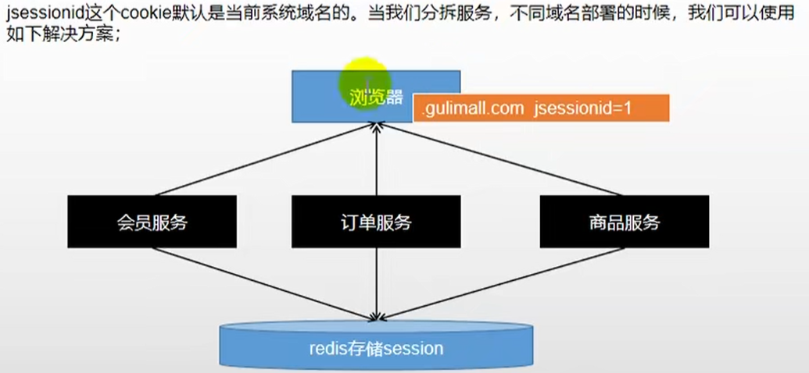

# 传统session方式在分布式下的问题
1 cookie不能跨不同域名进行共享；不同服务，session不能共享的问题  
2 即使是同一个服务，在部署多个时，也会存在session不同步的问题  

# session共享问题解决方案
### session复制
tomcat原生支持。但是任意一台web服务器保存的数据都是所有web服务器的session总和，在大型分布式集群情况下，所有web服务器都保存全量数据，是不可取的  
水平扩展支持不友好，受制于内存限制
### hash一致性
根据ip或者业务字段都能对一个客户端进行Hash  
1 只需要修改nginx配置，不需要修改应用代码。只要hash属性值是分布均匀的，多台web服务器的负载也是均匀的。较好支持web服务器水平扩展  
2 session还是存储在web服务器中，所以web服务器重启可能导致丢失部分session，需要用户重新进行登录  
如果web服务器水平扩展，rehash后session可能重新分布，会导致有一部分用户路由不到之前的服务  

### 统一存储


# SpringSession原理
1 ```@EnableRedisHttpSession```给容器中导入```RedisHttpSessionConfiguration```  
2 ```RedisHttpSessionConfiguration```给容器中加入一个组件：```RedisHttpSessionConfiguration```，这个组件是通过redis进行session的增删改查操作类  
3 ```SessionRepositoryFilter```即使session的存储过滤器，每次请求操作都经过这个filter  
4 原始的request、response都被包装成了```SessionRepositoryRequestWrapper```、```SessionRepositoryResponseWrapper```，以后```request.getSession()```其实是
从包装对象里获取session，而从包装对象里获取session其实是通过```SessionRepository```从redis中获取  

5 因为redis中的数据是有过期时间的，所以SpringSession其实也实现了自动续期功能
