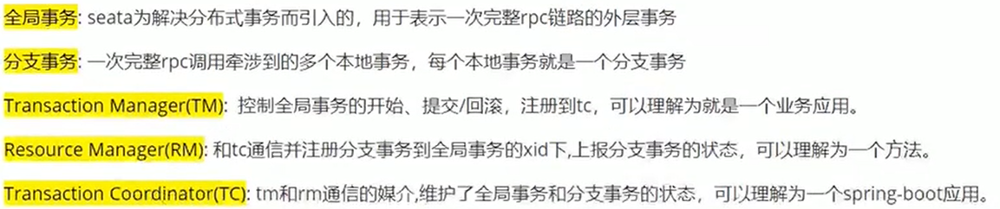
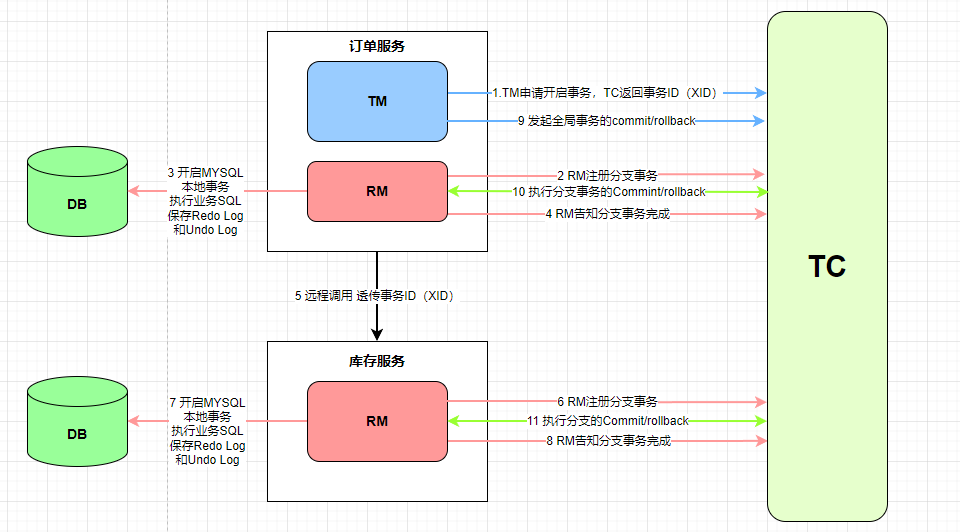

# 概述
同步场景下，使用```seata```的AT模式或者TCC模式解决一致性问题  
AT模式适合的场景：基于支持本地ACID事务的关系型数据库；Java应用，通过JDBC访问数据库  
TCC模式支持的场景：需要自定义实现```prepare```、```commit```、```rollback```的逻辑，适合非关系型数据库  

## 分布式事务解决方案之```seata```

通过对本地关系数据库的分支事务的协调来驱动完成全局事务，是工作在应用层的中间件。```Seata``` 把一个分布式事务理解成一个包含了若干分支事务的全局事务。
全局事务的职责是协调其下管辖的分支事务达成一致，要么一起成功提交，要么一起失败回滚。此外，通常分支事务本身就是一个关系数据库的本地事务

# ```Seata```
```global_table```：  
```branch_table```：  
```lock_table```：记录着被全局事务锁xid锁定的数据pk，各分支事务提交的时候先校验是否有被全局锁住的数据，如果冲突则分支事务无法进行提交，防止了脏写（都是被```seata```管理的事务）  
```undo_log```：

### ```seata```的使用
##### 下载解压```seata```的server端  
① 修改 conf/registry.conf 配置，设置 registry 和 config 节点中的type为```nacos```  
② 修改 conf/```nacos-config.txt```配置，将 ```store.mode``` 改为db，并修改数据库相关配置  
③ 初始化```seata```的```nacos```配置，成功后在```nacos```的配置列表中能看到```seata```的相关配置

##### 应用配置
① 需在业务相关的数据库中添加 undo_log 表，用于保存需要回滚的数据  
② 直接把 ```seata-server``` 中的registry.conf复制到每个服务中去即可，不需要修改  
③ 每个服务各自修改配置文件  
④ 配置数据源代理  
```Seata```是通过代理数据源实现分布式事务，所以需要配置```io.seata.rm.datasource.DataSourceProxy```的Bean，
且是@Primary默认的数据源，否则事务不会回滚，无法实现分布式事务
```java
public class DataSourceProxyConfig {
    @Bean
    @ConfigurationProperties(prefix = "spring.datasource")
    public DruidDataSource druidDataSource() {
        return new DruidDataSource();
    }

    @Primary
    @Bean
    public DataSourceProxy dataSourceProxy(DruidDataSource druidDataSource) {
        return new DataSourceProxy(druidDataSource);
    }
}
```
因为使用了mybatis的starter所以需要排除DataSourceAutoConfiguration，不然会产生循环依赖  
```java
@SpringBootApplication(exclude = {DataSourceAutoConfiguration.class})
```
⑤ 事务发起者添加全局事务注解````@GlobalTransactional````  

# ```Seata```原理详解

> 流程说明：  
> ① 订单服务中TM向TC申请开启一个全局事务，一般通过@GlobalTransactional标注开启，TC会返回一个全局事务ID(XID)，订单服务在执行本地事务之前，RM会先向TC注册一个分支事务，
> 订单服务依次生成undo log 执行本地事务，生成redo log 提交本地事务，向TC汇报，事务执行OK  
> ② 订单服务发起远程调用，将事务ID传递给库存服务，库存服务在执行本地事务之前，先向TC注册分支事务，库存服务同样生成undo Log和redo Log，向TC汇报，事务状态成功  
> 如果正常全局提交，TC通知RM一步清理掉本地undo和redo日志，如果存在一个服务执行失败，那么发起回滚请求。通过undo log进行回滚  
> ③ 在这里还会存在一个问题，因为每个事务从本地提交到通知回滚这段时间里面，可能这条数据已经被其他事务进行修改，如果直接用undo log进行回滚，可能会导致数据不一致的情况，  
> 这个时候 RM会用 redo log进行验证，对比数据是否一样，从而得知数据是否有别的事务进行修改过，undo log是用于被修改前的数据，可以用来回滚，redo log是用于被修改后的数据，用于回滚校验
> 如果数据没有被其他事务修改过，可以直接进行回滚，如果是脏数据，redo log校验后进行处理。

### AT模式的核心要点
AT模式分成两个阶段，主要逻辑全部在第一个阶段，第二阶段主要做回滚或日志清理工作  

① 一阶段中将业务数据和回滚日志记录在同一个本地事务中提交，然后释放本地锁和连接资源  
在第一阶段中，```seata```会拦截业务SQL，首先解析SQL语义，找到要操作的业务数据，在数据被操作前，保存下来记录undo log，然后执行业务SQL更新数据，更新之后再次保存数据redo log，
这些操作都在本地数据库事务内完成，这样保证了一阶段的原子性  

② 二阶段提交时异步化，非常快速的完成；回滚时通过一阶段的回滚日志进行反向补偿  
相比一阶段，二阶段比较简单，负责整体的回滚和提交，如果之前的一阶段中有本地事务没有通过，那么就执行全局回滚，否则执行全局提交，回滚用到的就是一阶段记录的undo log，通过回滚记录生成
反向更新SQL并执行，以完成分治的回滚。当然事务完成后会释放所有资源和删除所有日志

# 总结
总的来说在```Seata```的中AT模式基本可以满足百分之80的分布式事务的业务需求，AT模式实现的是最终一致性，所以可能存在中间状态，而XA模式实现的强一致性，所以效率较低一点，
而Saga可以用来处理不同开发语言之间的分布式事务，所以关于分布式事务的四大模型，基本可以满足所有的业务场景，其中XA和AT没有业务侵入性，而Saga和TCC具有一定的业务侵入。


