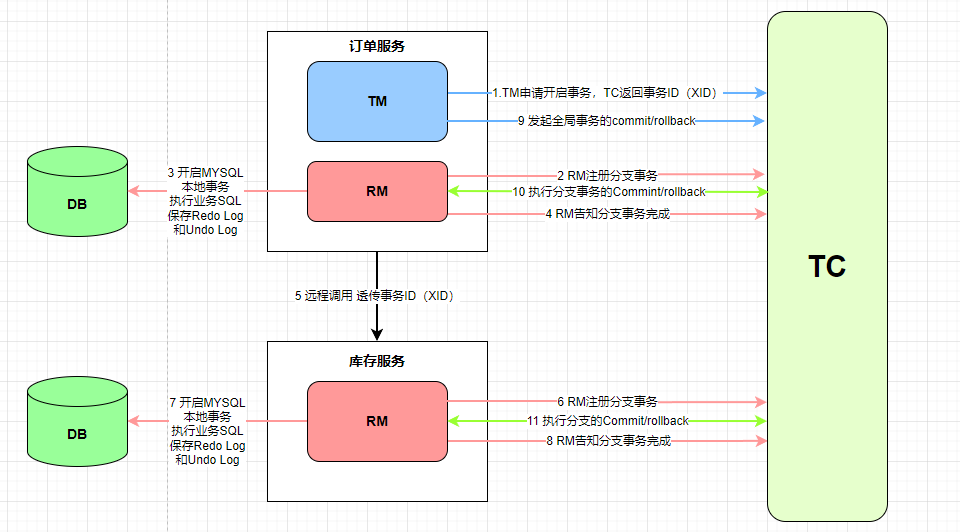

# 概述
①同步场景下，使用```seata```的AT模式或者TCC模式解决一致性问题。
AT模式适合的场景：基于支持本地ACID事务的关系型数据库；Java应用，通过JDBC访问数据库。
TCC模式支持的场景：需要自定义实现```prepare```、```commit```、```rollback```的逻辑，适合非关系型数据库。
②通过对本地关系数据库的分支事务的协调来驱动完成全局事务，是工作在应用层的中间件。```Seata``` 把一个分布式事务理解成一个包含了若干分支事务的全局事务。
③全局事务的职责是协调其下管辖的分支事务达成一致，要么一起成功提交，要么一起失败回滚。此外，通常分支事务本身就是一个关系数据库的本地事务。


① TM 向 TC 申请开启一个全局事务，全局事务创建成功并生成一个全局唯一的 XID  
② XID 在微服务调用链路的上下文中传播  
③ RM 向 TC 注册分支事务，将其纳入 XID 对应全局事务的管辖  
④ TM 向 TC 发起针对 XID 的全局提交或回滚决议  
⑤ TC 调度 XID 下管辖的全部分支事务完成提交或回滚请求

### 数据源代理
```Seata```是通过代理数据源实现分布式事务，所以需要配置```io.seata.rm.datasource.DataSourceProxy```的Bean，且是@Primary默认的数据源，否则事务不会回滚，无法实现分布式事务

```java
// 因为使用了mybatis的starter所以需要排除DataSourceAutoConfiguration，不然会产生循环依赖  
// @SpringBootApplication(exclude = {DataSourceAutoConfiguration.class})
public class DataSourceProxyConfig {
    @Bean
    @ConfigurationProperties(prefix = "spring.datasource")
    public DruidDataSource druidDataSource() {
        return new DruidDataSource();
    }

    @Primary
    @Bean("dataSourceProxy")
    public DataSource dataSource(DruidDataSource druidDataSource) {
        // DataSourceProxy for AT mode
        // return new DataSourceProxy(druidDataSource);

        // DataSourceProxyXA for XA mode
        return new DataSourceProxyXA(druidDataSource);
    }
}
```

# AT模式

### 概述

①最终一致的分阶段事务模型，无业务侵入，也是seata的默认模式

②性能较XA模式高

③只在第一阶段获取锁，在第一阶段进行提交后释放锁

### 实现原理

AT模式分成两个阶段，主要逻辑全部在第一个阶段，第二阶段主要做回滚或日志清理工作  

①一阶段中将```业务数据```和```回滚日志记录```在同一个本地事务中提交，然后释放本地锁和连接资源 。

```
在第一阶段中，seata会拦截业务SQL，解析SQL语义，找到要操作的业务数据，将前镜像数据和后镜像数据以及业务sql都保存下来记录undo log，然后执行业务SQL更新数据，更新之后再次保存数据redo log。这些操作都在本地事务内完成，这样保证了一阶段的原子性
```

一阶段本地事务提交前，需要确保先拿到全局锁。拿不到全局锁，不能提交本地事务，拿全局锁的尝试被限制在一定范围内（一般为300ms），超出范围将放弃，并回滚本地事务，释放本地锁。

②二阶段提交时```异步化```，非常快速的完成；回滚时通过一阶段的回滚日志进行反向补偿。

```
相比一阶段，二阶段比较简单，负责整体的回滚和提交，如果之前的一阶段中有本地事务没有通过，那么就执行全局回滚，否则执行全局提交，回滚用到的就是一阶段记录的undo log，通过回滚记录生成反向更新SQL并执行，以完成分治的回滚。当然事务完成后会释放所有资源和删除所有日志
```

### 写隔离和读隔离

①本地事务提交前，需要拿到全局锁，这保证了不会发生脏写的问题

②AT模式默认的全局隔离级别是读未提交。如果必须要求全局的读已提交，目前seata的方式是通过代理```select for update```实现

# XA模式

### 概述

```强一致性```分阶段事务模型，牺牲了一定的可用性，无业务侵入

### 实现原理

一阶段：注册分支事务到TC，执行分支业务sql但不提交，报告执行状态到TC

二阶段：TC检测各分支事务的执行状态，如果都成功，通知所有RM提交事务。如果都失败，通知所有RM回滚事务。

​			   RM在二阶段时，接收TC的指令，提交或回滚事务。

# 总结

①```Seata```的AT模式基本可以满足80%的分布式事务的业务需求，AT模式实现的是最终一致性，所以可能存在中间状态，而XA模式实现的强一致性，所以效率较低一点。
②```saga```可以用来处理不同开发语言之间的分布式事务，所以关于分布式事务的四大模型，基本可以满足所有的业务场景，其中XA和AT没有业务侵入性，而Saga和TCC具有一定的业务侵入。

③如AT模式等补偿性事务存在脏数据问题，因为他存在中间状态，如果中间状态回滚而不是提交，那么页面看到的数据不是准确的