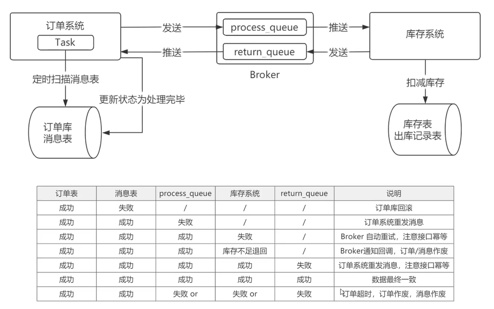

# CAP理论
1 一致性特点  
① 由于存在数据同步的过程，写操作的响应会有一定的延迟  
② 为了保证数据一致性会对资源暂时锁定，待数据同步完成释放锁定资源  
③ 如果请求数据同步失败的结点则会返回错误信息，一定不会返回旧数据  

2 可用性特点  
① 写入主数据库后要将数据同步到从数据库。
② 由于要保证从数据库的可用性，不可将从数据库中的资源进行锁定。
③ 即时数据还没有同步过来，从数据库也要返回要查询的数据，哪怕是旧数据，如果连旧数据也没有则可以按照约定返回一个默认信息，但不能返回错误或响应超时。

3 分区容错性特点  
① 主数据库向从数据库同步数据失败不影响读写操作  
② 其一个结点挂掉不影响另一个结点对外提供服务

> 分区容错性是分布式系统具备的基本能力

4 CAP的组合  
① AP：这是很多分布式系统的选择。保证最终一致性即可  
② CP：zookeeper追求的就是强一致性  
③ CA：典型实现是关系型数据库  

5 BASE理论
① Basically Available（基本可用）  
② Soft state（软状态）  
③ Eventually consistent（最终一致性）  

> BASE理论是对AP的扩展，通过牺牲强一致性来获得可用性，当出现故障允许部分不可用但要保证核心功能可用，允许数据在一段时间内是不一致的，但最终达到一致状态。  

# 分布式事务解决方案
### 一 2PC
整个事务过程由事务管理器和参与者组成，事务管理器负责决策整个分布式事务的提交和回滚，事务参与者负责自己本地事务的提交和回滚  
1 准备阶段  
事务管理器给每个参与者发送 Prepare 消息，每个数据库参与者在本地执行事务，并写本地的 Undo/Redo 日志，此时事务没有提交。  
```
Undo 日志是记录修改前的数据，用于数据库回滚，
Redo 日志是记录修改后的数据，用于提交事务后写入数据文件）  
```

2 提交阶段  
如果事务管理器收到了参与者的执行失败，或者协调者节点在第一阶段的询问超时之前无法获取所有参与者节点的响应消息时，
直接给每个参与者发送回滚（Rollback）消息；否则，发送提交（Commit）消息。  
参与者根据事务管理器的指令执行提交或者回滚操作，并释放事务处理过程中使用的锁资源。注意：必须在最后阶段释放锁资源

3 优缺点  
尽量保证了数据的强一致性，适合对数据强一致性要求很高的场景。
① 需要本地数据库支持XA协议。参与节点都是事务阻塞型的，资源锁需要等到两个阶段结束才释放，性能较差  
② 参与者发生故障，协调者需要给每个参与者额外指定超时机制，超时后整个事务失败。协调者发生故障，参与者会一直阻塞下去，需要额外的备机进行容错  
③ 二阶段协调者在发出commit消息之后宕机，而接收消息的参与者同时也宕机了，那么即使通过选举协议产生了新的协调者，这条事务的状态也是不确定的，没人知道事务是否已经被提交

### 二 3PC
3PC把2PC的准备阶段分成事务询问（该阶段不会阻塞）和事务预提交,则三个阶段分别为 CanCommit、PreCommit、DoCommit

### 三 本地消息表


### 四 可靠消息

### 五 最大努力通知

# 最佳实践
① AT模式需要资源管理器(mysql, redis)支持XA协议，且整个事务的执行期间需要锁住事务资源，会降低性能。故先排除；  
② TCC的模式，需要事务接口提供try,confirm,cancel三个接口，提高了编程的复杂性。需要依赖于业务方来配合提供这样的接口。推行难度大，暂时排除；  
③ 最大努力通知型，应用于异构或者服务平台当中；  
④ 可以看到ebay的经典模式中，分布式的事务，是通过本地事务+可靠消息，来达到事务的最终一致性的。但是出现了事务消息，就把本地事务的工作给涵盖在事务消息当中了