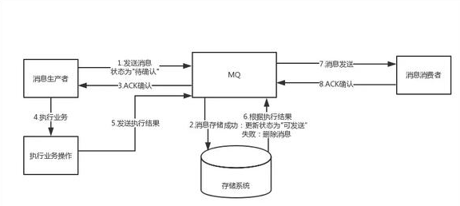

# 事务消息
由于传统的处理方式无法解决消息生产者本地事务处理成功与消息发送成功两者的一致性，因此事务消息就诞生了，它实现了消息生成者本地事务与消息发送的原子性，保证了消息生成者本地事务处理成功与消息发送成功的最终一致性问题

注意点：由于MQ通常都会保证消息能够投递成功，因此，如果业务没有及时返回ACK结果，那么就有可能造成MQ的重复消息投递问题。因此，对于消息最终一致性的方案，消息的消费组必须要对消息的消费
支持幂等，不能造成同一条消息的重复消费的情况

### 事务消息的异常情况分析
##### 如果预发送消息失败，是不是业务就不执行了？
对于基于消息最终一致性的方案，一般都会强依赖这步，如果这个步骤无法得到保证，那么也就不可能做到最终一致性了

##### 为什么要增加一个预发送机制，增加两次发布出去消息的重试机制，为什么不在业务成功之后，发送失败的话使用一次重试机制？
如果业务执行成功，再去发消息，此时如果还没来得及发消息，业务系统就已经宕机了，系统重启后，根本没有记录之前是否发送过消息，这样就会导致业务执行成功，消息最终没发出去的情况

##### 如果consumer消费失败，是否需要producer做回滚了？
这里的事务消息，producer并不会因为consumer消费失败而做回滚，采用事务消息的应用，其所追求的高可用和最终一致性，消息消费失败的话，MQ自己会负责重推消息，直到消费成功。因此，
事务消息是针对生产端而言的。对于消费端，消费端的一致性是通过MQ的重试机制来完成的

##### 如果consumer端因为业务异常而导致回滚，那么岂不是两边最终无法保证一致性？
基于消息的最终一致性方案必须保证消费端在业务上的操作没障碍，它只允许系统异常的失败，不允许业务上的失败，比如你在业务上跑出个NPE之类的问题，导致你消费端执行事务失败，那么就很难做到一致了

# 具体实现
异步场景下，使用RocketMQ的事务消息特性来解决一致性问题，事务消息的本质就是用来保证本地事务和MQ消息发送的原子性