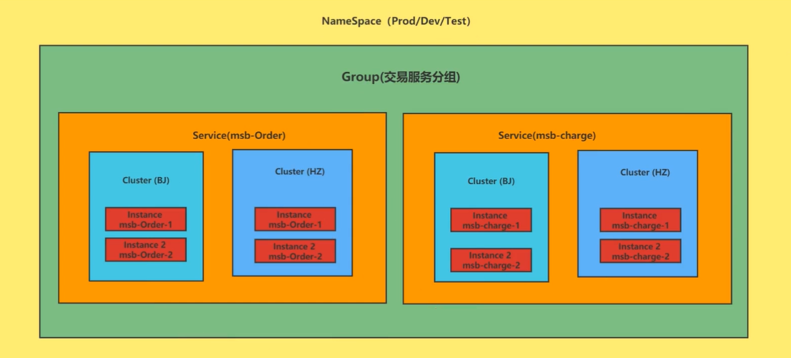
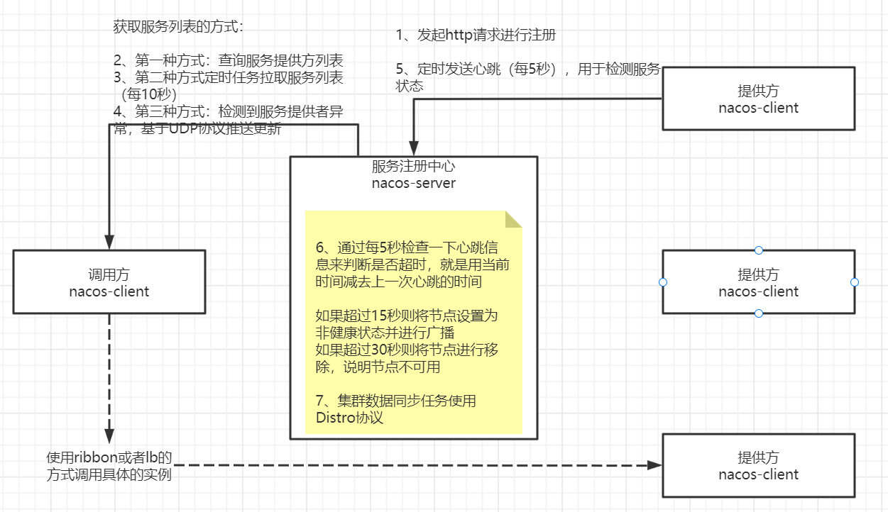
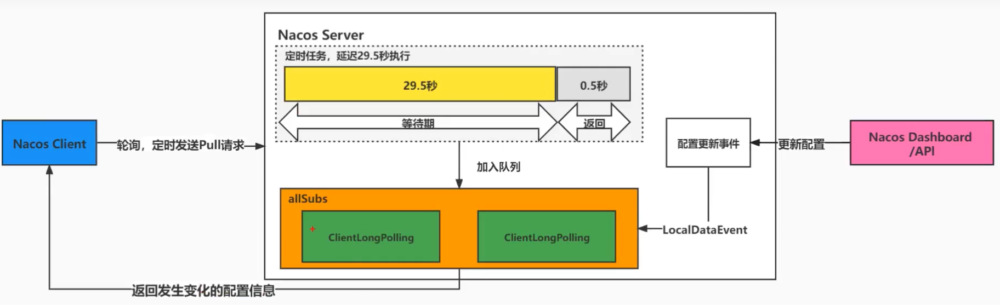

# 注册中心的核心要点
① 服务如何注册到注册中心  
② 调用方主动发现服务列表  
③ 注册中心中注册表的变动，如何通知服务调用方。在订阅之后，服务端主动推送消息给调用方  
④ 服务是否下线，通过心跳机制来检查  
⑤ 注册中心集群之间的数据同步问题

# 注册中心
### ```nacos```服务领域模型的应用


### ```nacos1.X```作为注册中心的原理


### Distro协议

### ```nacos2.x```客户端探活机制

# ```nacos2.x```的服务上下线和1.x的区别
```nacos1.x```的客户端会开启定时任务，去注册中心获取服务列表，然后存到本地，要用的时候从本地获取服务的ip地址。服务上下线后，
server端也会向client端推送服务上下线的消息通知，然后client因此也能获得最新的服务列表。  
```nacos2.x```通过grpc的方式在client端和server端之间维持长连接，因此服务上下线后，server端能很快感知到服务的状态。

# 配置中心
### ```nacos1.x```配置中心长轮询机制
客户端会轮询向服务端发出一个长连接请求，这个长连接最多30s就会超时，服务端收到客户端的请求会先判断当前是否有配置更新，有则立即返回，
如果没有服务端会将这个请求拿住"hold"29.5s加入队列，最后0.5s再检测配置文件无论有没有更新都进行正常返回，但等待的29.5s期间有配置更新可以提前结束并返回


### 配置中心管理
①命名空间：用于配置隔离。默认使用public命名空间下的配置。  
在bootstrap.properties上指定使用哪个命名空间的配置```spring.cloud.nacos.config.namespace=7fd7e137-21c4-4723-a042-d527149e63e0```  

②配置分组：默认所有的配置集都属于DEFAULT_GROUP。  
指定配置分组```spring.cloud.nacos.config.ext-config[0].group=provider```

③加载多配置文件  
在bootstrap.properties中添加：  
```
spring.cloud.nacos.config.ext-config[0].data-id=redis.properties  
# 开启动态刷新配置，否则配置文件修改，工程无法感知  
spring.cloud.nacos.config.ext-config[0].refresh=true
```

### 最佳实践
1 命名空间区分业务功能，分组区分环境  
2 配置中心配置数据集DataID和配置内容  
3 开启动态刷新配置```@RefreshScope```  
4 获取配置项的值```@Value```  
5 优先使用配置中心的配置  
6 使用命名空间nameSpace来创建各服务的配置  
7 使用分组group来区分不同的环境  
8 使用多配置集extension-configs区分不同类型的配置