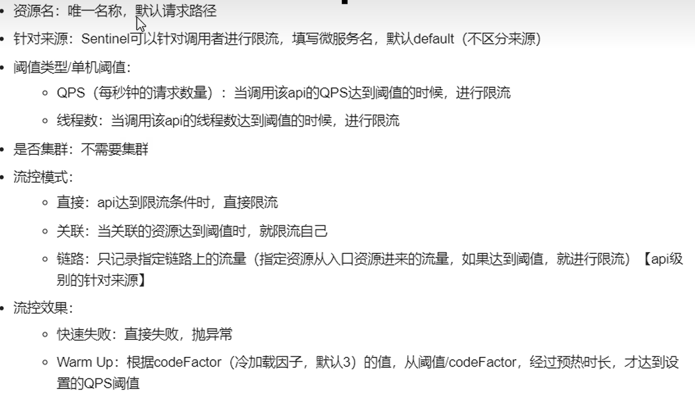

# 核心概念
### 资源
可以是 Java 应用程序中的任何内容，例如，由应用程序提供的服务，或由应用程序调用的其它应用提供的服务，甚至可以是一段代码。只要通过 Sentinel API 定义的代码，就是资源，
能够被 Sentinel 保护起来。大部分情况下，可以使用方法签名，URL，甚至服务名称作为资源名来标示资源

### 规则
围绕资源的实时状态设定的规则，可以包括流量控制规则、熔断降级规则以及系统保护规则。所有规则可以动态实时调整

# 设计理念
① 通过并发线程数进行限制。当某个资源出现不稳定的情况下，例如响应时间变长，对资源的直接影响就是会造成线程数的逐步堆积。当线程数在特定资源上堆积到一定的数量之后，对该资源的新请求就会被拒绝。堆积的线程完成任务后才开始继续接收请求  
② 通过响应时间对资源进行降级。除了对并发线程数进行控制以外，Sentinel 还可以通过响应时间来快速降级不稳定的资源。当依赖的资源出现响应时间过长后，所有对该资源的访问都会被直接拒绝，直到过了指定的时间窗口之后才重新恢复。

# 限流埋点
① 默认为所有的HTTP服务提供了限流埋点，如果只想对HTTP服务进行限流，那么只需要引入依赖，无需修改代码  
② 如果需要对某个特定的方法进行限流或降级，可以通过```@SentinelResource```注解来完成限流的埋点

# 自定义限流处理逻辑
### 实现BlockExceptionHandler接口

### 使用 @SentinelResource 注解的 blockHandler 和 blockHandlerClass 两个参数指定限流处理逻辑方法

# BlockHandler与FallBack
fallback：若本接口出现未知异常，则调用fallback指定的接口  
blockHandler：若本次访问被限流或服务降级，则调用blockHandler指定的接口

# 熔断降级配置
Sentinel提供的熔断策略：慢调用比例、异常比例、异常数

Sentinel采用的懒加载机制，需要执行一次访问，这个熔断框架才监控微服务，相比Hystrix不同的是，Sentinel的优势在于不需要大量的环境搭建的工作

Sentinel的降级策略
① 平均响应时间：当1s内持续进入5个请求时，并且对应时刻的平均响应时间均超过阈值，那么在接下来的时间窗口之内，对这个方法的调用都会自动的熔断。注意Sentinel默认的统计上限是4900ms  
② 异常比例：当资源的每秒请求量>=5，并且每秒异常总数占通过量的比值超过阈值之后，资源进入降级状态，即在接下来的时间窗口之内，对这个方法的调用都会自动的返回。异常比率的阈值范围是[0.0,1.0]，代表0%~100%  
③ 异常数：当资源近1分钟的异常数目超过阈值之后进行熔断。注意由于统计时间窗口是分钟级别的，若timeWindow小于60s，则结束熔断状态后仍可能再进入熔断状态


