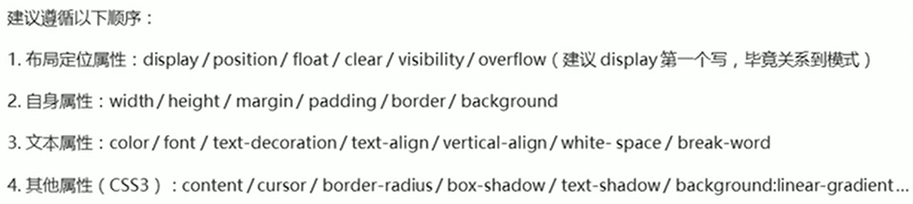

# 常见样式
1 伪类标签   :first-child  
2 元素模式转换  display: block、inline、inline-block  
3 文字垂直居中  line-height(等于盒子高度时是垂直居中)  
4 背景图片垂直居中  
```css
background-image: url(images/icon.png);
background-repeat: no-repeat;
background-position: left center;
```
5 超大图片做背景  
```css
background-image: url(images/bj.png);
background-repeat: no-repeat;
background-position: center top;
```
6 行内元素为了照顾兼容性，尽量只设置左右内外边距，不要设置上下内外边距，将其转换为块级元素和行内块元素就可以了  
7 CSS3新增样式  
```css
/*圆角边框*/
border-radius: 10px;
/*盒子阴影(阴影不占用空间，不会影响其他盒子排列)*/
box-shadow:
 /*文字阴影*/
text-shadow: 
```

# 盒子模型
### 水平居中  
①块级元素：给块级元素指定宽度和高度，然后
```css
margin: 0 auto;
```
②行内元素和行内块元素  
```css
/*给父元素添加如下属性*/
text-align:center;
```
### 嵌套块元素塌陷解决方案  
①可以为父元素定义上边框  
```css
border:1px solid transparent;
```
②可以为父元素定义上内边距  
③可以为父元素添加
```css
/*不会增加盒子大小*/
overflow:hidden;
```
### 清楚内外边距
布局前，清除网页元素的内外边距
```css
* {
    padding: 0;
    margin: 0;
}
```

# 网页布局
### 普通流
按照标签元素默认的排列方式进行排列

### 浮动流
①块级元素横向排列用浮动  
②浮动元素宽度由内容决定，不占有父元素的高度  
③浮动的盒子中间没有缝隙，是紧挨在一起的
④具有行内块元素的特性

##### 浮动布局注意点
①先用标准流的父元素排列上下位置，之后内部子元素采取浮动排列左右位置  
②浮动的盒子只会影响浮动盒子后面的标准流，不会影响前面的标准流盒子

### 清除浮动
①由于父级盒子很多情况下，不方便给定高度，但是子盒子浮动又不占有位置，最后导致父级盒子高度为0时，就会影响下面的标准流盒子  
②清除浮动的本质是清除浮动元素造成的影响，清除浮动之后，父级就会根据浮动的子盒子自动检测高度。父级有了高度，就不会影响下面的标准流了  

##### 清除浮动的方法
① 额外标签法：在浮动元素末尾添加一个空的标签，例如<div style="clear:both"></div>，或者其他块级元素标签  
② 父级添加overflow:hidden、auto、scroll  
③ :after伪元素
```css
.clearfix:after {
    content: "";
    display: block;
    height: 0;
    clear: both;
    visibility: hidden;
}

/* IE6、7专有 */
.clearfix{
    *zoom: 1;
}
```
④ 双伪元素清除浮动  
```css
.clearfix:before,.clearfix:after {
    content: "";
    display: table;
}

/* 照顾低版本浏览器 */
.clearfix:after {
    clear: both;
}
.clearfix {
    *zoom: 1;
}
```

# 样式书写顺序


# 


