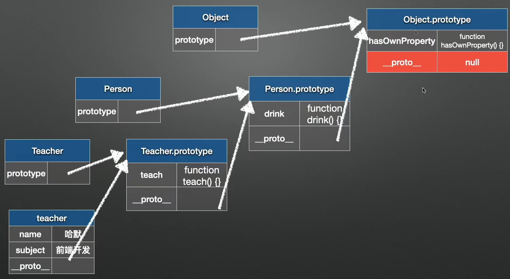

# 原型及原型链


①  
```teacher.__proto__（隐式原型） === Teacher.prototype（显示原型）```  

② teacher.hasOwnProperty('name')  
为true表示name是对象本身的属性，否则不是对象本身的属性，有可能是原型对象身上的属性  

③ instanceof  
[] instanceof Object  
如果Object类是在[]这个对象的原型链上，则返回true，否则返回false  

# WebPack
① 打包的配置
```javascript
module: {
    rules: [
        {
            test: /.(jpg|png|gif)$/,
            use: {
                loader: 'url-loader',   // 用于根据配置打包图片
                options: {
                    name: '[name]_[hash].[ext]',
                    outputPath: 'images/',
                    limit: 2048 // 超过2KB会发http请求加载图片资源，未超过直接base64
                }
            }
        },
        {
            test: /.scss$/,
            use: [
                // 以下执行顺序从下往上
                'style-loader',     // 将css样式挂载到html上
                // 'css-loader',       // 处理css文件
                {
                    loader: 'css-loader',   // 启用css模块化
                    options: {
                        modules: true
                    }
                },
                'postcss-loader',   // 给css3样式增加厂商前缀
                'sass-loader'       // 将scss转成css
            ]
        }
    ]
}
```

② sourceMap  
```javascript
devtool: 'eval-cheap-module-source-map' // 开发环境下建议配置，既可以保证速度，也能提示错误位置
// 线上不建议开启该配置
```
建立打包后的文件和源代码之间的关系，便于开发阶段排错  

③ WebPackDevServer  
```javascript
devServer: {                // 仅开发环境下使用
    contentBase: './dist',  // 自动打包，即修改后自动更新
    proxy: {                // 请求转发
        '/api/getData': {
            target: 'http://aliyun.com/', 
            pathRewrite: {
                '^/api': ''
            },
            changeOrigin: true
        }
    }
}
```

④ 