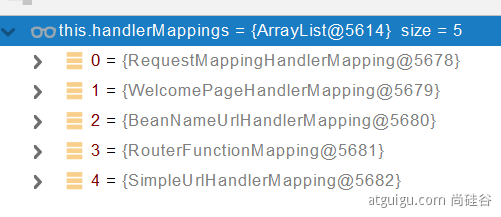
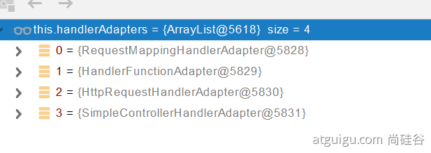
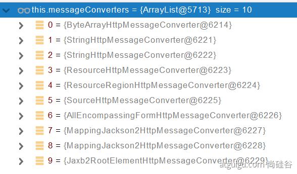
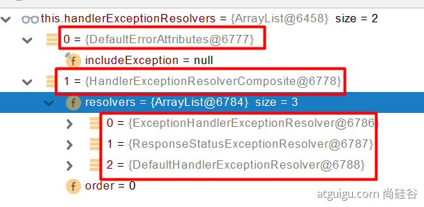

***
待处理内容：  
1、自定义处理器映射handlerMapping  
2、自定义请求匹配条件RequestCondition     https://blog.csdn.net/liuyueyi25/article/details/103671809
***

# 自动配置
自动配好Tomcat、Spring MVC、WEB常见功能(字符编码问题、文件上传等)、默认包结构 ...  
```@SpringBootApplication```注解是合成注解
```
①@EnableAutoConfiguration  
该注解上标注有AutoConfigurationPackage注解，该注解又给容器中注册了AutoConfigurationPackages.Registrar.class组件  
AutoConfigurationPackages.Registrar.class，该组件指定了默认的包扫描路径
// 利用静态内部类给容器中导入一系列组件，实现是通过获取AutoConfigurationPackage该注解标注的类所在包名，将该包下所有组件导入进容器中，这是包扫描的原理
```

```
②@EnableAutoConfiguration  
该注解向容器中导入了AutoConfigurationImportSelector组件  
1、getAutoConfigurationEntry(annotationMetadata);                                                 // 给容器中批量导入一些组件  
2、调用List<String> configurations = getCandidateConfigurations(annotationMetadata, attributes)    // 获取到所有需要导入到容器中的配置类  
3、利用工厂加载 Map<String, List<String>> loadSpringFactories(@Nullable ClassLoader classLoader)     // 得到所有的组件  
4、classLoader.getResources(FACTORIES_RESOURCE_LOCATION)                                          // 扫描当前系统里面所有jar包下/META-INF/spring.factories位置的文件（核心是spring-boot-autoconfigure包下的配置文件）
```

```
虽然自动配置类在项目启动时会全部被加载一遍，但是在条件装配规则之下，最终会按需配置  
@ConditionalOnBean              // 当容器里有指定的bean的条件下  
@ConditionalOnMissingBean       // 当容器里不存在指定bean的条件下  
@ConditionalOnClass             // 当类路径下有指定类下  
@ConditionalOnMissingClass      // 当类路径下不存在指定类的条件下  
@ConditionalOnProperty          // 指定的属性是否有指定的值
比如@ConditionalOnProperties(prefix=”xxx.xxx”, value=”enable”, matchIfMissing=true)，
代表当xxx.xxx为enable时条件的布尔值为true，如果没有设置的情况下也为true。
```
### 自动配置总结
① SpringBoot先加载所有的自动配置类```xxxxxAutoConfiguration```  
② 每个自动配置类按照条件进行生效，默认都会绑定配置文件指定的值。从```xxxxProperties```里面拿。```xxxProperties```和配置文件进行绑定  
③ 生效的配置类就会给容器中装配很多组件  
④ 只要容器中有这些组件，相当于这些功能就有了  
⑤ 定制化配置。用户直接自己@Bean替换底层的组件，这个组件获取的配置文件中的值，用户可以修改

# yml配置
1 单引号会将```\n```作为字符串输出，双引号会将```\n```作为换行符输出  
2 自定义的类和配置文件绑定一般没有提示
```
<dependency>
    <groupId>org.springframework.boot</groupId>
    <artifactId>spring-boot-configuration-processor</artifactId>
    <optional>true</optional>
</dependency>

<build>
    <plugins>
        <plugin>
            <groupId>org.springframework.boot</groupId>
            <artifactId>spring-boot-maven-plugin</artifactId>
            <configuration>
                <excludes>
                    <exclude>
                        <groupId>org.springframework.boot</groupId>
                        <artifactId>spring-boot-configuration-processor</artifactId>
                    </exclude>
                </excludes>
            </configuration>
        </plugin>
    </plugins>
</build>
```

# 静态资源
1 默认情况下，访问 ```项目根路径（/）+静态资源名```就能查看静态资源。请求进来，先去找Controller动态处理器看能不能处理，不能处理的请求才交给静态资源处理器，静态资源也找不到则响应404面。  
2 静态资源相关配置
```
spring:
  mvc:
    static-path-pattern: /res/**                    # 配置静态资源请求路径前缀，默认无前缀，主要目的区别动态请求，然后再拦截动态请求做相应处理就方便了
  resources:
    static-locations: [classpath:/mystatic/]        # 配置静态资源目录，配置之后，默认的四个位置会失效
    add-mappings: false                             # 禁用所有静态资源规则
```

### 静态资源访问原理
分析SpringMVC功能的自动配置类WEBMvcAutoConfiguration  
资源处理的定义规则是在内部类WebMvcAutoConfigurationAdapter的addResourceHandlers()里

# 请求映射
1 表单提交请求需要开启Rest功能，其他方式发送请求可直接发送（比如ajax、客户端工具）
```
spring:
  mvc:
    hiddenmethod:
      filter:
        enabled: true   #开启页面表单的Rest功能
```
2 在SpringMVC中要支持Rest风格，需要增加```HiddenHttpMethodFilter```组件。Spring Boot在自动配置类中有。

3 请求映射原理  
① 在```spring mvc```中，通过```DispatchServlet```接收客户端发起的一个请求之后，会通过```HanderMapping```来获取对应的请求处理器；
而```HanderMapping```如何找到可以处理这个请求的处理器呢，这就需要 ```RequestCondition``` 来决定了。  
② HandlerMapping中找到能处理请求的Handler，为当前Handler找一个适配器HandlerAdapter（RequestMappingHandlerAdapter），适配器执行目标方法并确定方法参数的每一个值。  
③ 确定方法参数值的时候，使用HandlerMethodArgumentResolver进行解析  
④ 确定方法返回值的时候，使用HandlerMethodReturnValueHandlerComposite进行解析  
⑤ 自定义类型参数封装  
通过```ServletRequestMethodArgumentResolver.resolveArgument()```解析自定义类型，

> RequestMappingHandlerMapping：保存了所有的@RequestMapping和handler的映射规则  
  
RequestMappingHandlerAdapter：保存了适配Handler的适配器，便于执行目标方法，将参数值确定交由适配器处理


# 返回值解析
1 返回值处理器判断是否支持这种放回值类型（supportReturnType）  
2 如果支持，调用handleReturnValue进行处理  
3 RequestResponseBodyMethodProcessor 可以处理标注了 @ResponseBody 注解的返回值  
4 返回值处理器利用消息转换器，将能处理的消息转换器找出来，最终```MappingJackson2HttpMessageConverter```把对象转为JSON（利用底层的jackson的objectMapper转换的）

> 处理方法
> 利用 MessageConverters 进行处理，将数据写为json  
1、内容协商（浏览器默认会以请求头的方式告诉服务器他能接受什么样的内容类型）  
2、服务器最终根据自己自身的能力，决定服务器能生产出什么样内容类型的数据  
3、SpringMVC会挨个遍历所有容器底层的 HttpMessageConverter ，看谁能处理  
①、得到MappingJackson2HttpMessageConverter可以将对象写为json  
②、利用MappingJackson2HttpMessageConverter将对象转为json再写出去

> HttpMessageConverter: 看是否支持将 此 Class类型的对象，转为MediaType类型的数据  
> 
0 - 只支持Byte类型的  
1 - String  
2 - String  
3 - Resource  
4 - ResourceRegion  
5 - ```DOMSource.class``` \ ```SAXSource.class``` \ ```StAXSource.class``` \ ```StreamSource.class``` \ ```Source.class```  
6 - MultiValueMap  
7 - true  
8 - true  
9 - 支持注解方式xml处理的

# 内容协商
通过控制请求头中的Accept字段。Http协议中规定的，告诉服务器本客户端可以接收的数据类型。

# 视图解析原理
1 目标方法处理的过程中，所有数据都会被放在 ModelAndViewContainer 里面。包括数据和视图地址；  
2 方法的参数是一个自定义类型对象（从请求参数中确定的），还会把他重新放在 ModelAndViewContainer；  
3 任何目标方法执行完成以后都会返回 ModelAndView（数据和视图地址）；  
4 processDispatchResult  处理派发结果（页面改如何响应）；

# 拦截器
1 根据当前请求，找到HandlerExecutionChain【可以处理请求的handler以及handler的所有 拦截器】  
2 先来顺序执行 所有拦截器的 preHandle方法  
① 如果当前拦截器 ```prehandler``` 返回为true。则执行下一个拦截器的preHandle  
② 如果当前拦截器返回为false。直接    倒序执行所有已经执行了的拦截器的  afterCompletion  
3 如果任何一个拦截器返回false。直接跳出不执行目标方法  
4 所有拦截器都返回True。执行目标方法  
5 倒序执行所有拦截器的postHandle方法  
6 前面的步骤有任何异常都会直接倒序触发 afterCompletion  
7 页面成功渲染完成以后，也会倒序触发 afterCompletion

# 文件上传
1 文件上传自动配置类 MultipartAutoConfiguration-MultipartProperties。自动配置好了 StandardServletMultipartResolver【文件上传解析器】  
2 请求进来使用文件上传解析器判断（isMultipart）并封装（resolveMultipart）然后返回MultipartHttpServletRequest文件上传请求  
3 参数解析器（RequestPartMethodArgumentResolver）来解析请求中的文件内容封装成MultipartFile  
4 将request中文件信息封装为一个Map；MultiValueMap<String, MultipartFile>  

# 异常处理
1 ErrorMvcAutoConfiguration 自动配置异常处理规则  
2 执行目标方法，目标方法运行期间有任何异常都会被catch，并且标志当前请求结束；并且用 dispatchException封装  
3 进入视图解析流程  
4 ```mv = processHandlerException``` 处理handler发生的异常，处理完成返回ModelAndView  
5 遍历所有的 handlerExceptionResolvers【处理器异常解析器】，看谁能处理当前异常  
6 DefaultErrorAttributes先来处理异常。把异常信息保存到request域，并且返回null  
7 如果没有任何人能处理最终底层就会发送 /error 请求。会被底层的BasicErrorController处理  
8 解析错误视图；遍历所有的  ErrorViewResolver  看谁能解析  
9 默认的 DefaultErrorViewResolver，作用是把响应状态码作为错误页的地址，error/500.html，模板引擎最终响应这个页面 error/500.html



# WEB原生组件注入


# WEB开发定制化常见方式

