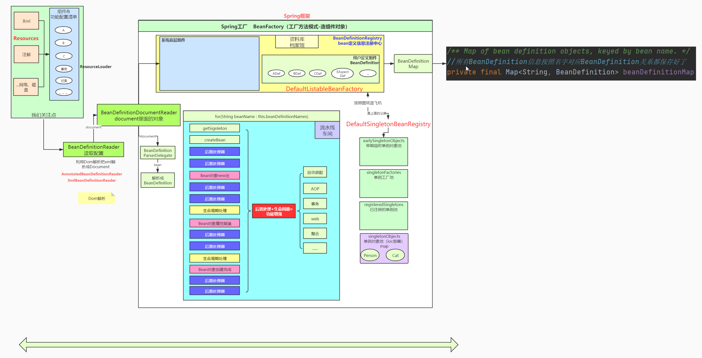
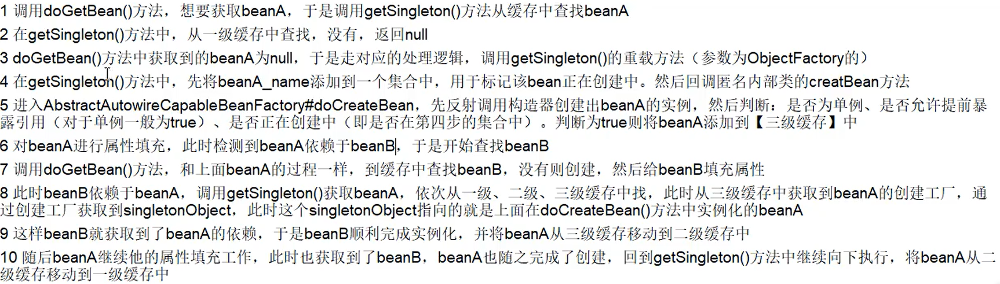

# Spring设计图


# 源码分析核心点
① DefaultListableBeanFactory这个工厂实现的具体功能  
② BeanDefinitionRegistry中放入BeanDefinition的过程  

# 注解分析
单例依赖多例，确保多例生效，可以用@Lookup注解，此时不能再用@Autowired。而且单例不能通过@Bean的方式注入容器中，这种方式也是不生效的

# 基础接口
1 Resource + ResourceLoader  
ResourceLoader接口的实现是策略模式的体现。注意ApplicationContext也间接继承了该接口  

### BeanFactory
1 HierarchicalBeanFactory（定义父子工厂）  
    我们常用的ioc容器```AnnotationConfigApplicationContext```，继承于GenericApplicationContext，该容器组合了下面的功能  

2 ListableBeanFactory（能列举所有组件）
    此接口的实现是DefaultListableBeanFactory，可以提供ioc容器中的Bean定义信息相关功能，因为实现了```BeanDefinitonRegistry```  

3 AutowireCapableBeanFactory（提供自动装配共功能）  
    此接口的实现类也是DefaultListableBeanFactory，也是被我们常用的ioc容器所持有  

3 BeanDefinition  

4 BeanDefinitionReader  

5 BeanDefinitionRegistry  

6 ApplicationContext  
ioc容器持有Bean工厂，Bean工厂只是ioc容器的功能之一

7 Aware  
给普通组件装配一些Spring底层组件  
```
自动装配Spring底层组件也可以如下实现  
@Autowired
private ApplicationContext applicationContext;
```

8 DefaultListableBeanFactory（最重要）  
提供访问Bean、BeanDefinition等信息的功能，它被ioc容器所组合  

9 DefaultSingletonBeanRegistry  

10 FactoryBean和Bean  
区别：普通Bean给容器中注册的是该Bean对象，而FactoryBean给容器中注册的是工厂Bean调用getObject()返回的对象，类型是getObjectType()指定的类型  
应用场景：MyBatis和Spring的整合中，所用工厂Bean```SqlSessionFactoryBean```  

11 

# 生命周期中的后置处理器
① BeanFactoryPostProcessor  
② BeanPostProcessor  
③ InitializingBean  
④ BeanDefinitionRegistryPostProcessor  
⑤ ImportBeanDefinitionRegistrar：实现该接口将自定义的组件添加到IOC容器中。
⑥ __outline__beanFactory的三个子接口bean组件实现aware接口，可以装配底层的一些组件，此处利用到的是回调机制，ApplicationContextAwareProcessor的
postProcessBeforeInitialization实现了此机制Bean的功能增强全部是由BeanPostProcessor + InitializaingBean 两个接口完成的FactoryBean和普通Bean的差别，
在遍历所有的beanNames的时候，两者的执行逻辑

# 循环依赖

① Spring是如何解决循环依赖的问题的？  
② 一级可以吗？  
③ 是否可以关闭循环依赖？  
④ 为什么要用三级缓存，用二级缓存可以吗？

# BeanFactory和ApplicationContext的异同
相同：
- Spring提供了两种不同的IOC 容器，一个是BeanFactory，另外一个是ApplicationContext，它们都是Java  interface，ApplicationContext继承于BeanFactory(ApplicationContext继承ListableBeanFactory。
- 它们都可以用来配置XML属性，也支持属性的自动注入。
- 而ListableBeanFactory继承BeanFactory)，BeanFactory 和 ApplicationContext 都提供了一种方式，使用getBean("bean name")获取bean。

不同：
- 当你调用getBean()方法时，BeanFactory仅实例化bean，而ApplicationContext 在启动容器的时候实例化单例bean，不会等待调用getBean()方法时再实例化。
- BeanFactory不支持国际化，即i18n，但ApplicationContext提供了对它的支持。
- BeanFactory与ApplicationContext之间的另一个区别是能够将事件发布到注册为监听器的bean。
- BeanFactory 的一个核心实现是XMLBeanFactory 而ApplicationContext  的一个核心实现是ClassPathXmlApplicationContext，Web容器的环境我们使用WebApplicationContext并且增加了getServletContext 方法。
- 如果使用自动注入并使用BeanFactory，则需要使用API注册AutoWiredBeanPostProcessor，如果使用ApplicationContext，则可以使用XML进行配置。
- 简而言之，BeanFactory提供基本的IOC和DI功能，而ApplicationContext提供高级功能，BeanFactory可用于测试和非生产使用，但ApplicationContext是功能更丰富的容器实现，应该优于BeanFactory

# 简述Spring中Bean的生命周期
1 实例化Bean对象：通过反射的方式进行对象的创建，此时的创建只是在堆空间中申请空间，属性都是默认值  
2 设置对象属性：给对象中的属性设值  
3 检查Aware相关接口并设置相关依赖：如果对象中需要引用容器内部的对象，那么需要调用aware接口的子类方法来进行统一的设置  
4 BeanPostProcessor的前置工作：对生成的Bean对象进行前置的处理工作  
5 检查是否是InitialingBean的子类来决定是否调用afterPropertiesSet方法：判断当前Bean对象是否设置了InitialingBean接口，然后进行属性的设值等基本工作  
6 检查是否配置有自定义的init-method方法：如果当前Bean对象定义了初始化方法，那么在此处调用初始化方法  
7 BeanPostProcessor后置处理：对生成的Bean对象进行后置的处理工作  
8 注册必要的Destruction相关回调接口：为了方便对象的销毁，在此处调用注销的回调接口，方便对象进行销毁操作  
9 获取并使用Bean对象：通过容器来获取对象并进行使用  
10 是否实现DisposableBean接口：判断是否实现了DisposableBean接口，并调用具体的方法来进行对象的销毁工作  
11 是否配置有自定义的destroy方法：如果当前Bean对象定义了销毁方法，那么在此处调用销毁方法

# Spring中单例Bean是线程安全的吗？
Spring中的Bean对象默认是单例的，框架并没有对Bean进行多线程的封装处理  
如果Bean是有状态（即有数据存储的能力）的，那么需要开发人员自己保证线程安全，最简单的办法就是改变Bean的作用域把singleton改成prototype，
这样每次请求Bean对象就相当于是创建新的对象来保证线程的安全  
如果Bean是无状态（即不会存储数据）的，比如controller、service、dao本身并不是线程安全的，只是调用里面的方法，而且多线程调用一个实例的方法，
会在内存中复制遍历，这是自己线程的工作内存，是最安全的  
因此在进行使用的时候，不要在Bean中声明任何有状态的实例变量或者类变量，如果必须如此，也推荐大家使用ThreadLocal把变量变成线程私有，
如果Bean的实例变量或者类变量需要在多个线程之间共享，那么就只能使用synchronized、lock、cas等这些实现线程同步的方法了


# 一 IOC
## 1.1 bean的生命周期

## 1.2 循环依赖
一级缓存：成品对象
二级缓存：半成品对象
三级缓存：lambda表达式

### 1.2.1 三级缓存的泛型研究
ObjectFactory函数式接口的getObject()方法 ：当作一个参数传递到方法中，一般情况下传的是lambda表达式，
可以通过getObject()方法来执行lambda表达式

### 1.2.2 创建流程中的核心步骤
getBean()->doGetBean()->createBean()->doCreateBean()->createBeanInstance()->populateBean()

### 1.2.3 缓存个数
如果只有一个缓存，能不能解决循环依赖：不能区分成品对象和半成品对象。不能解决。  
如果有两个缓存，能不能解决循环依赖：能解决。但是循环依赖过程中包含了代理对象的创建，那么就必须要使用三级缓存了。

三级缓存能解决的原因