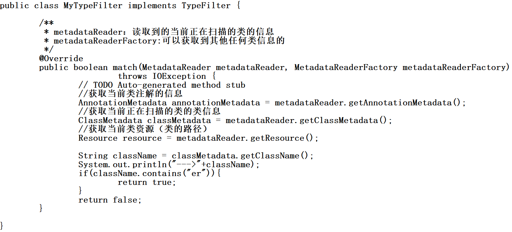

# @ComponentScan
包扫描配置：等同于<context:component-scan base-package="com.atguigu" use-default-filters="false"></context:component-scan>
```
@ComponentScans(
		value = {
				@ComponentScan(value="com.atguigu",includeFilters = {
/*						@Filter(type=FilterType.ANNOTATION,classes={Controller.class}),
						@Filter(type=FilterType.ASSIGNABLE_TYPE,classes={BookService.class}),*/
						@Filter(type=FilterType.CUSTOM,classes={MyTypeFilter.class})
				},useDefaultFilters = false)	
		}
		)
//@ComponentScan  value:指定要扫描的包
//excludeFilters = Filter[] ：指定扫描的时候按照什么规则排除那些组件
//includeFilters = Filter[] ：指定扫描的时候只需要包含哪些组件，需要useDefaultFilters = false禁用默认过滤规则
//FilterType.ANNOTATION：按照注解
//FilterType.ASSIGNABLE_TYPE：按照给定的类型；
//FilterType.ASPECTJ：使用ASPECTJ表达式
//FilterType.REGEX：使用正则指定
//FilterType.CUSTOM：使用自定义规则
```
FilterType.CUSTOM使用样例：  


# @Scope
指定该bean的作用域范围。  
Prototype：多实例的：ioc容器启动并不会去调用方法创建对象放在容器中，每次获取的时候才会调用方法创建对象。  
Singleton：单实例的（默认值）：ioc容器启动会调用方法创建对象放到ioc容器中，以后每次获取都是直接从容器中拿（map.get()）。  
Request：同一次请求创建一个实例  
Session：同一个session创建一个实例  
request和session基本上不用，如果要在web环境下让同一个请求或会话使用同一个对象，那么将对象放入请求域或者session域中即可  

# @Lazy
①单实例的bean，默认在容器启动的时候创建对象。
②使用该注解，可以实现懒加载的效果：容器启动不创建对象，第一次使用（获取）Bean时创建对象，并初始化。

# @Conditional
按照条件进行判断，满足条件给容器中注册Bean。  
①@Conditional({xxx.class})加在方法上，对当前方法有效，加在类上，满足当前条件，这个类中配置的所有bean注册才能生效  
②@Conditional({xxx.class})，xxx.class是实现了Condition接口的类，在实现方法（matches）中，
ConditionContext：判断条件能使用的上下文（环境），AnnotatedTypeMetadata是注释信息