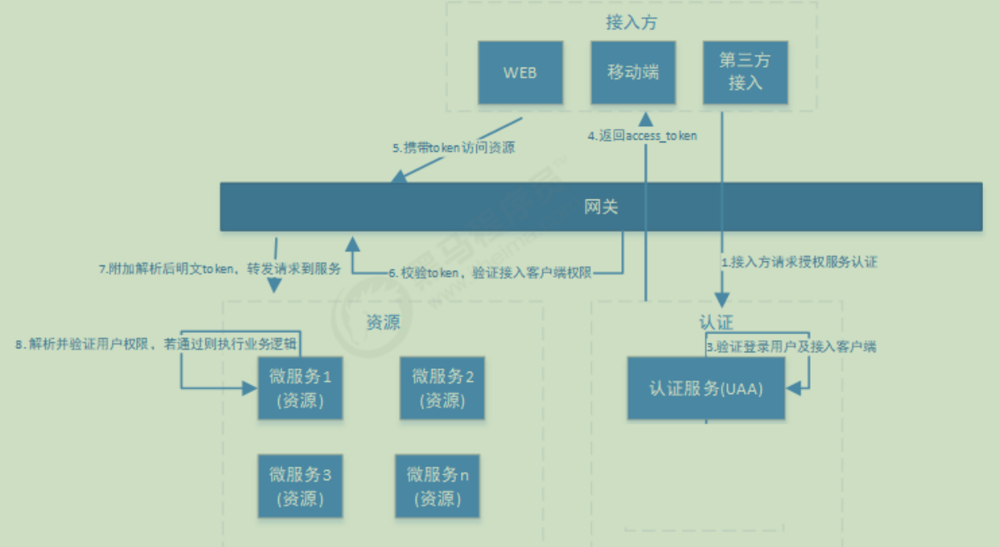
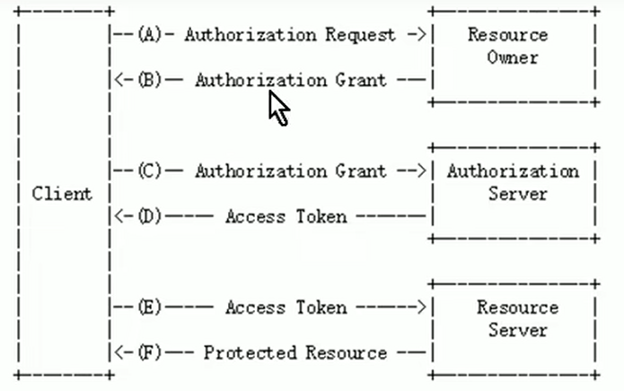
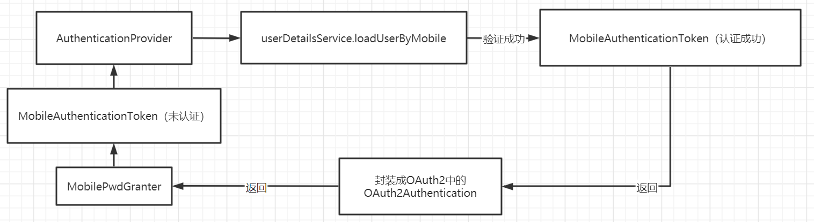
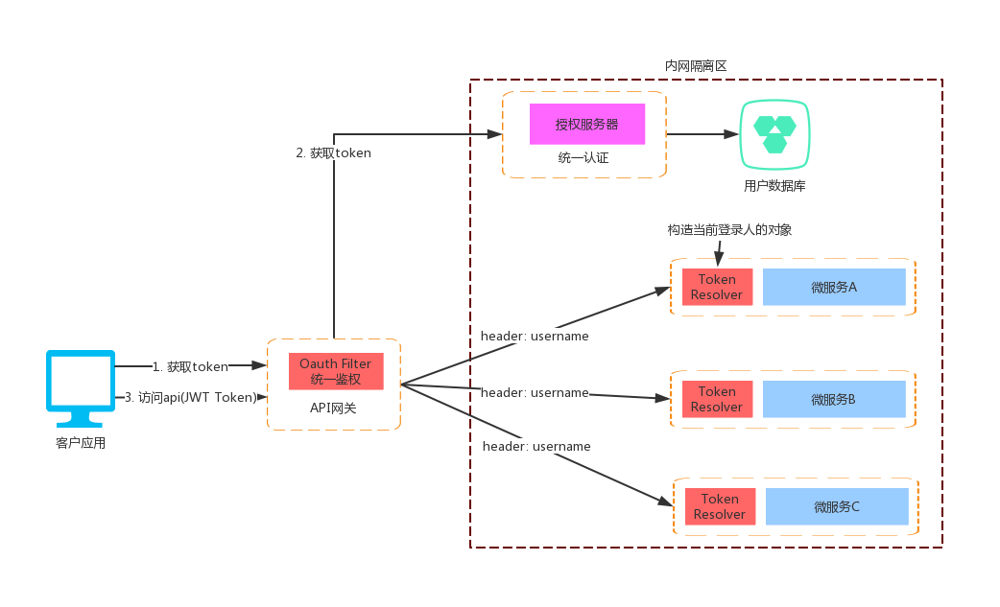

# 认证
### 基于Session的认证方式
1 基于Session的认证机制由Servlet规范定制，Servlet容器已实现，用户通过HttpSession的操作方法即可实现  
2 会话是指用户登录系统后，系统会记住用户的登录状态。在认证成功后，可以把认证成功的信息存入session中，在后续请求中，系统能够从session中获得当前用户信息

### 基于token的认证方式


# 授权
### 授权的数据模型
关键问题是在功能资源和数据资源的权限分配时，是怎么处理的

## RBAC
### 基于角色的访问控制

### 基于资源/权限的访问控制
更灵活

# OAuth2
  
① OAuth2.0包含以下角色：客户端、资源拥有者、授权服务器（也称为认证服务器）、资源服务器  
② 除了校验用户信息是否合法，还会校验客户端信息（即client_id和client_secret）  

# Spring Security中增加OAuth2协议授权模式
### 整个授权流程的关键点如下两部分
第一部分： 关于授权类型```grant_type```的解析  
① 每种```grant_type```都会有一个对应的```TokenGranter```实现类  
② 所有的```TokenGranter```实现类都通过```CompositeTokenGranter```中的```tokenGranters```集合存起来  
③ 然后通过判断```grantType```参数来定位具体使用哪个```TokenGranter```实现类来处理授权

第二部分： 关于授权登录逻辑  
① 每种授权方式都会有一个对应的```AuthenticationProvider```实现类来实现  
② 所有```AuthenticationProvider```实现类都通过```ProviderManager```中的```providers```集合存起来  
③ ```TokenGranter```类会new一个```AuthenticationToken```实现类，如```UsernamePasswordAuthenticationToken```传给```ProviderManager```类  
④ 而```ProviderManager```则通过```AuthenticationToken```来判断具体使用哪个```AuthenticationProvider```实现类来处理授权  
⑤ 具体的登录逻辑由```AuthenticationProvider```实现类来实现，如```DaoAuthenticationProvider```




# 认证服务设计


1 认证授权服务器  
负责登录认证、token派发、token刷新、应用接入管理等功能  

2 API网关  
添加认证中心的依赖负责所有请求的鉴权，包括登录验证和url级别的权限判断，主要的JWT原理如下：  
① 拦截请求获取判断是否带有token参数(parameter和header)  
② 通过公钥```pubkey.txt```解密token  
③ 判断token中的权限信息能否访问当前url  
④ 把用户名和角色信息放到请求的header中，传给后面的微服务  

3 ```OncePerRequestFilter```的实现类，嵌入在微服务程序中负责获取当前登陆人信息，并存入SpringSecurity上下文中

# token自动续签设计


# url级权限控制

# 
