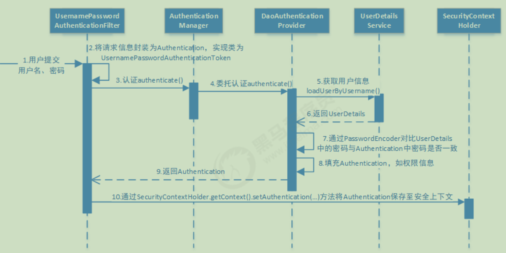
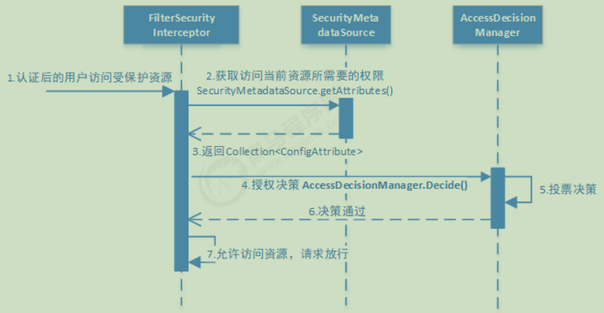

# 认证流程


# 授权流程


# 框架分析
FilterChainProxy是一个代理，真正起作用的是FilterChainProxy中SecurityFilterChain所包含的各个Filter，同时这些Filter作为Bean被Spring管理，
它们是Spring Security核心，各有各的职责，但他们并不直接处理用户的认证，也不直接处理用户的授权，而是把它们交给了认证管理器（AuthenticationManager）和决策管理器（AccessDecisionManager）进行处理

### 核心过滤器
`UsernamePasswordAuthenticationFilter`  
用于处理基于表单的登录请求，从表单中获取用户名和密码。默认情况下处理来自 /login 的请求。从表单中获取用户名和密码时，默认使用的表单的值为 username 和 password，
这两个值可以通过设置这个过滤器的 usernameParameter 和 passwordParameter 两个参数的值进行修改。  

`ExceptionTranslationFilter`
是个异常过滤器，用来处理在认证和授权过程中抛出的 ```AccessDeniedException``` 和 ```AuthenticationException``` 等异常  

`FilterSecurityInterceptor`  
该过滤器在过滤器链中靠后，根据资源权限配置来判断当前请求是否有权限访问对应的资源。如果访问受限会抛出相关异常，并由 ExceptionTranslationFilter 过滤器进行捕获和处理。

# 相关API
### 资源访问控制相关
在配置文件中，通过以下几个方法指定访问资源需要什么样的角色或权限。主体拥有的角色或权限是在认证过程中给其加上的。  
1、hasAuthority 方法  
2、hasAnyAuthority 方法  
3、hasRole 方法  
4、hasAnyRole 方法  
注意配置文件中不需要添加”ROLE_“，因为上述的底层代码会自动添加与之进行匹配，而在认证过程中返回用户对象的时候，需要加上  
http.authorizeRequests()
    .antMatchers("/find").hasRole("admin")
return new User(userInfo.getUserName(),userInfo.getPassWord(),AuthorityUtils.commaSeparatedStringToAuthorityList("delete,ROLE_admin"))

### 权限控制相关注解  
1 、@Secured  
前提：@EnableGlobalMethodSecurity(securedEnabled=true)  
功能：判断是否具有角色，另外需要注意的是这里匹配的字符串需要添加前缀"ROLE_"。  
用法：@Secured({"ROLE_normal","ROLE_admin"})  

2、@PreAuthorize  
前提：@EnableGlobalMethodSecurity(prePostEnabled = true)  
功能：注解适合进入方法前的权限验证， @PreAuthorize 可以将登录用户的 roles/permissions 参数传到方法中。  
用法：@PreAuthorize("hasAnyAuthority('menu:system')")  

3、@PostAuthorize  
前提：@EnableGlobalMethodSecurity(prePostEnabled = true)  
功能：@PostAuthorize 注解使用并不多，在方法执行后再进行权限验证，适合验证带有返回值的权限  
用法：@PostAuthorize("hasAnyAuthority('menu:system')")  

4、@PostFilter  
功能：权限验证之后对数据进行过滤，留下用户名是 admin1 的数据  
用法：@PostFilter("filterObject.username == 'admin1'")  

5、@PreFilter  
功能：进入控制器之前对数据进行过滤  
用法：@PreFilter(value = "filterObject.id%2==0")  

# Token
### 普通令牌
基于redis存储用户信息的方式，认证服务器将用户信息存储到指定的redis库中，在资源服务获取到access_token时，进而实现权限角色的限制，会到redis中获取用户信息，适合微服务场景

### JWT令牌
① 对于Token来说，需要查库或者和服务器中的Token比对是否有效  
② JWT包含三个部分：Header头部、Payload负载和Signature签名。由三部分生成JwtToken，三部分之间用“.”号做分割。校验也是JWT内部自己实现的，并且可以将你存储时候的信息从JwtToken中取出来无须查库  
③ JWT不用查库，客户端将登录时收到的jwtToken传到后端，直接在服务端进行校验，因为用户的信息、加密信息和过期时间都在jwtToken中，而且校验的过程也是JWT自己实现的

# 如何动态更新已登录用户的信息

# 授权流程-投票机制

# SpringSecurity各个过滤器说明
SpringSecurity 采用的是责任链的设计模式，它有一条很长的过滤器链。现在对这条过滤器链的 15 个过滤器进行说明:  
(1) `WebAsyncManagerIntegrationFilter`：将Security上下文与Spring Web中用于处理异步请求映射的 WebAsyncManager 进行集成。  
(2) `SecurityContextPersistenceFilter`：  
这个Filter是整个拦截过程的入口和出口（也就是第一个和最后一个拦截器），会在请求开始时从配置好的 SecurityContextRepository 中获取 SecurityContext，
然后把它设置给SecurityContextHolder。在请求完成后将 SecurityContextHolder 持有的 SecurityContext 再保存到配置好的 SecurityContextRepository，
同时清除 securityContextHolder 所持有的 SecurityContext  
(3) `HeaderWriterFilter`：用于将头信息加入响应中。  
(4) `CsrfFilter`：用于处理跨站请求伪造。  
(5) `LogoutFilter`：用于处理退出登录。
(7) `DefaultLoginPageGeneratingFilter`：如果没有配置登录页面，那系统初始化时就会配置这个过滤器，并且用于在需要进行登录时生成一个登录表单页面  
(8) `BasicAuthenticationFilter`：检测和处理 http basic 认证  
(9) `RequestCacheAwareFilter`：用来处理请求的缓存。  
(10) `SecurityContextHolderAwareRequestFilter`：主要是包装请求对象 request。  
(11) `AnonymousAuthenticationFilter`：检测 SecurityContextHolder 中是否存在Authentication 对象，如果不存在为其提供一个匿名 Authentication。  
(12) `SessionManagementFilter`：管理 session 的过滤器    
(15) `RememberMeAuthenticationFilter`：当用户没有登录而直接访问资源时, 从 cookie 里找出用户的信息, 如果 Spring Security 能够识别出用户提供的 remember me cookie,
用户将不必填写用户名和密码, 而是直接登录进入系统，该过滤器默认不开启。