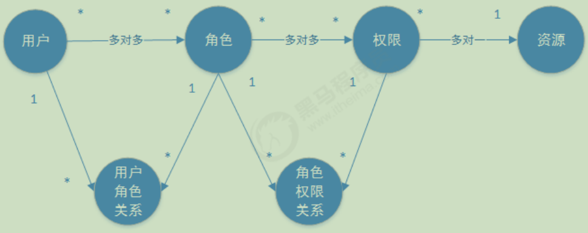

# 认证
用户认证：判断用户的身份是否合法的过程；  
用户名密码登录，二维码登录，手机短信登录，指纹认证等方式

# 会话
会话就是系统为了为了避免每次操作都要进行认证，将用户的登录状态保存在会话中
### 基于session
用户认证成功后，在服务端生成用户相关的数据保存在session(当前会话)中，发给客户端的session_id 存放到 cookie 中，这样用户客户端请求时带上 session_id
就可以验证服务器端是否存在 session 数据，以此完成用户的合法校验，当用户退出系统或session过期销毁时，客户端的session_id也就无效了

### 基于token
用户认证成功后，服务端生成一个token发给客户端，客户端可以放到 cookie 或 localStorage 等存储中，每次请求时带上 token，服务端收到token通过验证后即可确认用户身份

> 1 基于session的认证：
>
> 用户认证成功后，在服务端生成用户相关的数据保存在session中，发给客户端的session_id存放到cookie中，
> 这样用户客户端请求时带上 session_id 就可以验证服务器端是否存在 session 数 据，以此完成用户的合法校验，
> 当用户退出系统或session过期销毁时,客户端的session_id也就无效了。  
> 2 基于token的认证：  
> 用户认证成功后，服务端生成一个token发给客户端，客户端可以放到 cookie 或 localStorage 等存储中，
> 每次请求时带上 token，服务端收到token通过验证后即可确认用户身份。

# 授权
用户授权：指的是验证某个用户是否有权限执行某个操作  
授权的数据模型如下图  

授权的实现方案：RBAC
① 基于角色的访问控制  
② 基于资源的访问控制

# 加签

# 验签