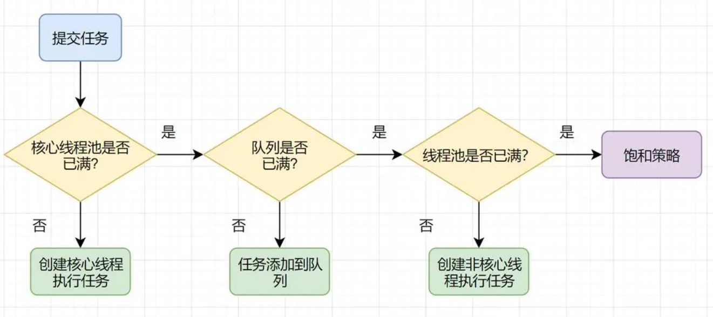
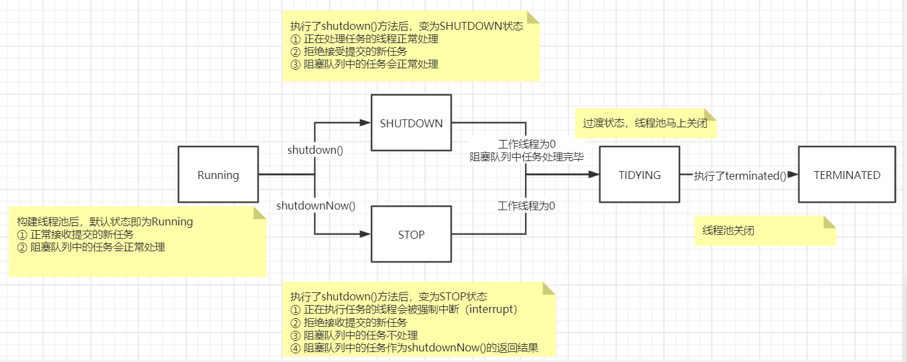
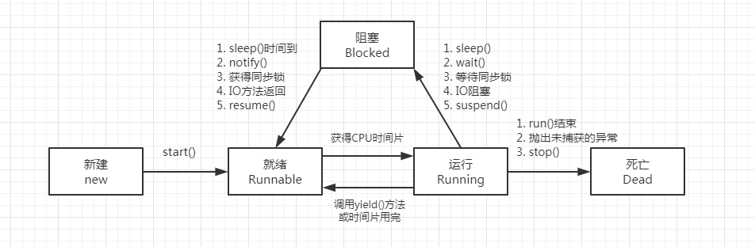
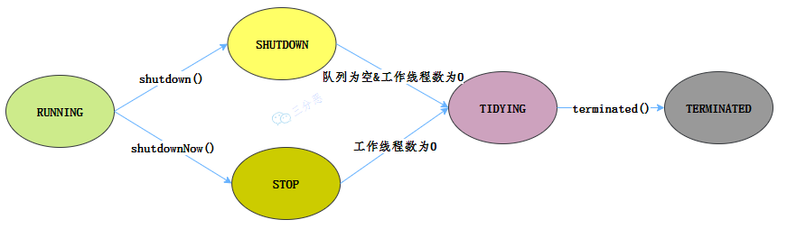

---------------------------------

①synchronized原理  
②常见锁相关面试题

③锁重入原理


---------------------------------

# 线程基础
进程：指在系统中正在运行的一个应用程序；程序一旦运行就是进程；进程是资源分配的最小单位。  
线程：系统分配处理器时间资源的基本单元，或者说进程之内独立执行的一个单元执行流。线程是程序执行的最小单位。

1 run()方法由JVM调用，什么时候调用，执行的过程控制都由操作系统的CPU调度决定  
2 一个线程对象只能调用一次start()方法，重复调用则会抛出异常"IllegalThreadStateException"  
3 守护线程和用户线程
在start()方法前调用thread.setDaemon(true)可以把一个用户线程变成一个守护线程  
若JVM中都是守护线程，JVM将退出


# 线程的同步
### 同步基础
synchronized  
① 该关键字不能被继承，所以子类中方法默认情况下不是同步的  
② 执行完代码块或者线程的执行发生异常，都会释放对锁的占有  

lock  
①  

区别：  
1 Lock是显式锁（手动开启和关闭锁，别忘记关闭锁），synchronized是隐式锁，出了作用域自动释放  
2 Lock只有代码块锁，synchronized有代码块锁和方法锁  
3 使用Lock锁，JVM将花费较少的时间来调度线程，性能更好。并且具有更好的扩展性（提供更多的子类）  
  优先使用顺序： Lock  同步代码块（已经进入了方法体，分配了相应资源）  同步方法 （在方法体之外）

### 集合的线程安全
解决list类型线程安全问题  
①vector  
②Collections.synchronizedList(new ArrayList());  
③copyOnWriteArrayList()（JUC提供，常用）

解决set类型线程安全  
①copyOnWriteArraySet()  

解决map类型线程安全  
①concurrentHashMap  

### 锁的分类
①公平锁和非公平锁（synchronized是非公平锁，ReentrantLock可指定）  
②synchronized（隐式可重入锁）、lock（显示可重入锁）  
③验证死锁：```jstack 进程id```

### 死锁的场景
① 表锁不会发生死锁，行锁会发生死锁  
② 读锁、写锁都可能会发生死锁  


# 线程的通信
三种让线程等待和唤醒的机制：  
①使用Object中的wait()方法让线程等待，使用Object中的notify()方法唤醒线程。（且这两个方法必须在同步代码块和同步方法中使用）  
notify()：唤醒正在排队等待同步资源的线程中优先级最高者结束等待。notifyAll ()：唤醒正在排队等待资源的所有线程结束等待  
这三个方法只有在synchronized方法或synchronized代码块中才能使用，否则会报java.lang.IllegalMonitorStateException异常。
因为这三个方法必须有锁对象调用，而任意对象都可以作为synchronized的同步锁，因此这三个方法只能在Object类中声明。  
②使用JUC包中Condition的await()方法让线程等待，使用signal()方法唤醒线程。  
③LockSupport类可以阻塞当前线程以及唤醒指定被阻塞的线程  

### 虚假唤醒
this.await()使当前线程在此处等待，下一次被唤醒的时候继续从此处开始执行，没有再次判断是否等待。所以用while代替if判断可以解决这个问题。  

# 线程池主要的任务处理流程
1、当前线程数小于corePoolSize，则调用addWorker创建核心线程执行任务  
2、如果不小于maxPoolSize，则将任务添加到workQueue队列  
2.1、如果isRunning返回false（状态检查），则remove这个任务，然后执行拒绝策略。  
2.2、线程池处于running状态，但是没有线程，则创建线程  
3、如果放入workQueue失败，则创建非核心线程执行任务，如果这时创建非核心线程失败（当前线程总数不小于maximumPoolSize时），就会执行拒绝策略  


### 线程池的状态变化


### 线程的状态变化


### 线程池的execute方法执行
的执行.png)

### 线程池的坑
① 用```submit```提交任务，不会把异常直接抛出来，可以改为execute方法执行，当然最好就是try...catch捕获  
② Spring内部线程池，其实是SimpleAsyncTaskExecutor，这玩意有点坑，它不会复用线程的  
③ 把拒绝策略设置为DiscardPolicy或DiscardOldestPolicy，Future对象调用get()方法,那么调用线程会一直被阻塞。  
> FutureTask的状态大于COMPLETING才会返回，要不然都会一直阻塞等待。又因为拒绝策略啥没做，没有修改FutureTask的状态，因此FutureTask的状态一直是NEW，所以它不会返回，会一直等待  
> 这个问题，可以使用别的拒绝策略，比如CallerRunsPolicy，它让主线程去执行拒绝的任务，会更新FutureTask状态。如果确实想用DiscardPolicy，则需要重写DiscardPolicy的拒绝策略  
> 使用 Future.get() 时，尽量使用带超时时间的，因为它是阻塞的。

# 线程池参数设置多少合理
```
最佳线程数目 = （（线程等待时间+线程CPU时间）/线程CPU时间 ）* CPU数目
```

# 多线程事务

# 线程池的状态变化



线程池
为什么线程池的submit不抛出异常

submit中提交的是runnable任务，底层代码会将runnable转换成callable，然后调用call()方法，调用call()方法的时候会用try...catch捕获异常，然后调用setException()方法将异常信息设置给Object，然后要获取异常信息需要调用get()方法

线程池的拒绝策略
①抛弃掉最早的任务
②抛弃掉最新的任务
③抛出异常
④让提交线程去执行当前任务，使异步执行变成同步执行
线程编排
先用CompletableFuture的supplySync方法去封装任务，得到返回的任务的类型也是completableFuture类型的，然后调用completableFuture的allOf()、anyOf()方法编排任务的执行顺序，除了这两个api外，completableFuture也还提供了其他的api，可以用来任意编排任务的执行顺序，也还可以处理返回结果，捕获异常等都是completableFuture提供的api能操作的
线程锁
① 使用synchronized实现代码块加锁，加的锁对于所有线程来说必须是同一把锁才能保证线程安全性，比如用当前对象作为锁，因为当前对象是单例的，所以所有线程都使用的是同一把锁
② 使用synchronized实现同步方法，普通方法其实可以理解成代码块加当前对象锁，而静态方法可以理解成代码块把类对象作为锁
③第三个就是使用Java代码加锁，比如使用lock接口的实现类加锁，一般常用的是ReentrantLock。在加锁前调用锁的lock()方法进行加锁，解锁的时候是在finally方法中调用unlock方法进行解锁。
④synchronized和ReentrantLock的区别
实现上不同，一个是通过Java代码加锁，一个是JVM层面加锁
在出现异常时，synchronized加锁后，会由JVM自动将加的锁释放掉，不会因为出现了异常没有释放锁造成线程死锁。而用lock加的锁必须在finally中解锁，否则就可能会出现死锁情况
lock能实现准确的唤醒通过机制，而synchronized只能实现唤醒一个或者唤醒全部。
比如用lock调用newCondition()方法后得到一个condition实例，然后线程通过这个condition实例进行阻塞，再别的线程调用这个condition实例的singal()方法就能唤醒这个线程。
一个对象调用wait()方法就会阻塞当前线程，并释放锁，其他线程在调用同样对象的notify()方法时就会将被阻塞的线程唤醒，但是唤醒的线程是随机的。
虚假唤醒
在唤醒线程的时候，唤醒了多余的线程，主要是因为在执行线程阻塞的时候，使用了if判断，这样的话，当不满足条件时，就没有阻塞当前线程，而是跳过if判断执行后面的代码了，相当于被唤醒了。因此可以通过使用while循环来解决if判断的问题，同时虚假唤醒的问题也就被解决了


