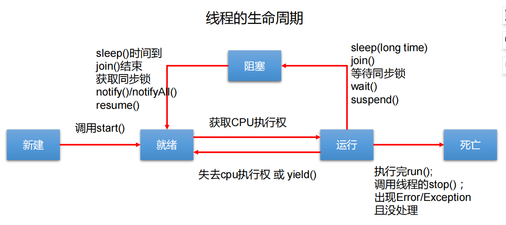

---------------------------------
①synchronized原理  
②常见锁相关面试题

③锁重入原理

---------------------------------

# 线程基础
进程：指在系统中正在运行的一个应用程序；程序一旦运行就是进程；进程是资源分配的最小单位。  
线程：系统分配处理器时间资源的基本单元，或者说进程之内独立执行的一个单元执行流。线程是程序执行的最小单位。

1 run()方法由JVM调用，什么时候调用，执行的过程控制都由操作系统的CPU调度决定  
2 一个线程对象只能调用一次start()方法，重复调用则会抛出异常"IllegalThreadStateException"  
3 守护线程和用户线程
在start()方法前调用thread.setDaemon(true)可以把一个用户线程变成一个守护线程  
若JVM中都是守护线程，JVM将退出


# 线程的同步
### 同步基础
synchronized  
① 该关键字不能被继承，所以子类中方法默认情况下不是同步的  
② 执行完代码块或者线程的执行发生异常，都会释放对锁的占有  

lock  
①  

区别：  
1 Lock是显式锁（手动开启和关闭锁，别忘记关闭锁），synchronized是隐式锁，出了作用域自动释放  
2 Lock只有代码块锁，synchronized有代码块锁和方法锁  
3 使用Lock锁，JVM将花费较少的时间来调度线程，性能更好。并且具有更好的扩展性（提供更多的子类）  
  优先使用顺序： Lock  同步代码块（已经进入了方法体，分配了相应资源）  同步方法 （在方法体之外）

### 集合的线程安全
解决list类型线程安全问题  
①vector  
②Collections.synchronizedList(new ArrayList());  
③copyOnWriteArrayList()（JUC提供，常用）

解决set类型线程安全  
①copyOnWriteArraySet()  

解决map类型线程安全  
①concurrentHashMap  

### 锁的分类
①公平锁和非公平锁（synchronized是非公平锁，ReentrantLock可指定）  
②synchronized（隐式可重入锁）、lock（显示可重入锁）  
③验证死锁：```jstack 进程id```

### 死锁的场景
① 表锁不会发生死锁，行锁会发生死锁  
② 读锁、写锁都可能会发生死锁  


# 线程的通信
三种让线程等待和唤醒的机制：  
①使用Object中的wait()方法让线程等待，使用Object中的notify()方法唤醒线程。（且这两个方法必须在同步代码块和同步方法中使用）  
notify()：唤醒正在排队等待同步资源的线程中优先级最高者结束等待。notifyAll ()：唤醒正在排队等待资源的所有线程结束等待  
这三个方法只有在synchronized方法或synchronized代码块中才能使用，否则会报java.lang.IllegalMonitorStateException异常。
因为这三个方法必须有锁对象调用，而任意对象都可以作为synchronized的同步锁，因此这三个方法只能在Object类中声明。  
②使用JUC包中Condition的await()方法让线程等待，使用signal()方法唤醒线程。  
③LockSupport类可以阻塞当前线程以及唤醒指定被阻塞的线程  

### 虚假唤醒
this.await()使当前线程在此处等待，下一次被唤醒的时候继续从此处开始执行，没有再次判断是否等待。所以用while代替if判断可以解决这个问题。  

# 线程池主要的任务处理流程
1、当前线程数小于corePoolSize，则调用addWorker创建核心线程执行任务  
2、如果不小于maxPoolSize，则将任务添加到workQueue队列  
2.1、如果isRunning返回false（状态检查），则remove这个任务，然后执行拒绝策略。  
2.2、线程池处于running状态，但是没有线程，则创建线程  
3、如果放入workQueue失败，则创建非核心线程执行任务，如果这时创建非核心线程失败（当前线程总数不小于maximumPoolSize时），就会执行拒绝策略  


### 线程池的状态变化


### 线程的状态变化


### 线程池的execute方法执行
的执行.png)

### 线程池的坑
① 用```submit```提交任务，不会把异常直接抛出来，可以改为execute方法执行，当然最好就是try...catch捕获  
② Spring内部线程池，其实是SimpleAsyncTaskExecutor，这玩意有点坑，它不会复用线程的  
③ 把拒绝策略设置为DiscardPolicy或DiscardOldestPolicy，Future对象调用get()方法,那么调用线程会一直被阻塞。  
> FutureTask的状态大于COMPLETING才会返回，要不然都会一直阻塞等待。又因为拒绝策略啥没做，没有修改FutureTask的状态，因此FutureTask的状态一直是NEW，所以它不会返回，会一直等待  
> 这个问题，可以使用别的拒绝策略，比如CallerRunsPolicy，它让主线程去执行拒绝的任务，会更新FutureTask状态。如果确实想用DiscardPolicy，则需要重写DiscardPolicy的拒绝策略  
> 使用 Future.get() 时，尽量使用带超时时间的，因为它是阻塞的。

# 线程池参数设置多少合理
```
最佳线程数目 = （（线程等待时间+线程CPU时间）/线程CPU时间 ）* CPU数目
```

# 多线程事务

# 线程池的状态变化


线程池
为什么线程池的submit不抛出异常

submit中提交的是runnable任务，底层代码会将runnable转换成callable，然后调用call()方法，调用call()方法的时候会用try...catch捕获异常，然后调用setException()方法将异常信息设置给Object，然后要获取异常信息需要调用get()方法

线程池的拒绝策略
①抛弃掉最早的任务
②抛弃掉最新的任务
③抛出异常
④让提交线程去执行当前任务，使异步执行变成同步执行
线程编排
先用CompletableFuture的supplySync方法去封装任务，得到返回的任务的类型也是completableFuture类型的，然后调用completableFuture的allOf()、anyOf()方法编排任务的执行顺序，除了这两个api外，completableFuture也还提供了其他的api，可以用来任意编排任务的执行顺序，也还可以处理返回结果，捕获异常等都是completableFuture提供的api能操作的
线程锁
① 使用synchronized实现代码块加锁，加的锁对于所有线程来说必须是同一把锁才能保证线程安全性，比如用当前对象作为锁，因为当前对象是单例的，所以所有线程都使用的是同一把锁
② 使用synchronized实现同步方法，普通方法其实可以理解成代码块加当前对象锁，而静态方法可以理解成代码块把类对象作为锁
③第三个就是使用Java代码加锁，比如使用lock接口的实现类加锁，一般常用的是ReentrantLock。在加锁前调用锁的lock()方法进行加锁，解锁的时候是在finally方法中调用unlock方法进行解锁。
④synchronized和ReentrantLock的区别
实现上不同，一个是通过Java代码加锁，一个是JVM层面加锁
在出现异常时，synchronized加锁后，会由JVM自动将加的锁释放掉，不会因为出现了异常没有释放锁造成线程死锁。而用lock加的锁必须在finally中解锁，否则就可能会出现死锁情况
lock能实现准确的唤醒通过机制，而synchronized只能实现唤醒一个或者唤醒全部。
比如用lock调用newCondition()方法后得到一个condition实例，然后线程通过这个condition实例进行阻塞，再别的线程调用这个condition实例的singal()方法就能唤醒这个线程。
一个对象调用wait()方法就会阻塞当前线程，并释放锁，其他线程在调用同样对象的notify()方法时就会将被阻塞的线程唤醒，但是唤醒的线程是随机的。
虚假唤醒
在唤醒线程的时候，唤醒了多余的线程，主要是因为在执行线程阻塞的时候，使用了if判断，这样的话，当不满足条件时，就没有阻塞当前线程，而是跳过if判断执行后面的代码了，相当于被唤醒了。因此可以通过使用while循环来解决if判断的问题，同时虚假唤醒的问题也就被解决了

#JMM
### 定义
1 JMM本身是一种抽象的概念，并不真实存在，仅仅描述的是一组约定或规范，通过这组规范定义了程序中（尤其是多线程情况下）各个变量的读写访问方式并决定了一个线程对共享变量的写入以及何时如何变成对另一个线程可见。  
2 Java内存模型的关键都是围绕多线程的原子性、可见性和有序性展开的  
3 通过JMM实现线程和主内存之间的抽象关系，线程之间的共享变量存储在主内存中，每一个线程都有一个私有的本地工作内存，本地工作内存存储了该线程用来读写共享变量的副本  
4 屏蔽各个硬件平台和操作系统的内存访问差异以实现让Java程序在各种平台下都能达到 一致的 访问效果

### 可见性
1 是指当一个线程修改了某一个共享变量的值，其他线程是否能够立即知道该变更。  
2 JMM规定了所有的变量都存储在主内存中，线程的修改都是通过拷贝共享变量副本实现修改的  
3 线程间 变量值的传递均需要通过主内存来完成，即通过可见性让其他线程感知到主内存中共享变量已被修改

### 原子性
指一个操作是不可打断的，即在多线程环境下，操作不能被其他线程干扰

### 有序性
为了提升性能，编译器和处理器通常会对指令序列进行重排序。JMM规定只要程序最终结果一致，可以对指令执行顺序进行**重排序**  
指令重排可以保证串行语义一致，但没有义务保证多线程间的语义也一致，简单说，在执行的时候，执行顺序会被优化  
**所以多线程环境中线程交替执行，由于指令重排的存在，两个线程中使用的变量不能保证一致性。因此，需要禁止指令重排**

### JMM规范下，多线程对变量的读写过程

### JMM规范下，多线程的先行发生原则（happens-before）
1 次序规则：一个线程内，按照代码顺序，写在前面的操作优先发生于写在后面的操作  
2 锁定规则：一个unlock操作优先发生于后面对同一个锁的lock操作  
3 volatile变量规则：对一个volatile变量的写操作先行发生于后面对这个变量的读操作，即前面的写对后面的读是可见的  
4 传递规则：A先于B，B先于C，那么A肯定先于C  
5 线程启动规则：Thread对象的start()方法先行发生于此线程的每一个动作  
6 线程中断规则：对线程interrupt()方法的调用先行发生于被中断线程的代码检测到中断事件的发生。可以通过Thread.interrupted()检测到是否发生中断。也就是说要先调用interrupt()方法设置过中断标志位，后面才能检测到中断发送  
7 线程终止规则：线程中的所有操作都先行发生于对此线程的终止检测，可以通过isAlive()等手段检测线程是否已经终止执行  
8 线程终结规则：一个对象的初始化完成（执行构造函数结束）先行发生于它的finalize()方法的开始

# volatile
保证了以下两个特性：  
① 可见性：写时，会把共享变量副本立即刷新回主内存中，读时，线程私有工作内存的数据失效，重新回主内存中读取最新共享变量  
② 有序性：不存在数据依赖关系，可以重排序；存在数据依赖关系，禁止指令重排  
③ 不保证原子性：volatile变量不适合参与到依赖当前值的运算，比如i++操作等

### volatile实现原理
1 内存屏障  
JVM在把字节码生成机器码的时候，发现操作的是volatile变量的话，会按照JMM的规范，在相应位置插入内存屏障  
所谓的内存屏障是一种指令屏障，使得CPU或编译器对屏障指令的 前和后进行重排序，也叫内存栅栏或栅栏指令

2 读屏障  
在读指令之前插入读屏障，让工作内存或CPU高速缓存当中的缓存数据（共享变量副本）失效，重新回到主内存中获取最新数据
> 插入内存屏障策略一：在每个volatile读操作的后面插入一个LoadLoad屏障，可以禁止处理器把上面的volatile读与下面的普通读重排序；  
插入内存屏障策略二：在每个volatile读操作的后面插入一个LoadStore屏障，可以禁止处理器把上面的volatile与下面的普通写重排序

3 写屏障  
在写指令之后插入写屏障，强制把写缓冲区的数据刷回到主内存中
> 插入内存屏障策略三：在volatile写操作的前面插入一个StoreStore屏障，可以保证volatile写之前，前面的所有普通读写操作都已经刷新到主内存中  
插入内存屏障策略四：在volatile写操作的后面插入一个StoreLoad屏障，可以避免volatile写与后面的volatile读写进行重排序

> 内存屏障指令总结：  
> ① volatile写之前的操作，都禁止重排序到volatile之后  
> ② volatile读之后的操作，都禁止重排序到volatile之前  
> ③ volatile写之后volatile读，禁止指令重排序

### volatile变量的读写过程
Java内存模型定义了8种原子操作，为每个线程操作自己的工作内存和主内存之间进行服务  
read(读取)->load(加载)->use(使用)->assign(赋值)->store(存储)->write(写入)->lock(锁定)->unlock(解锁)

### volatile的使用场景
1 利用volatile保证读取操作的可见性，利用synchronized保证复合操作的原子性  
2 作为状态标志，判断业务是否结束  
3 双端检索下，不给单例变量加volatile，可能会导致对创建实例的逻辑进行指令排序（分配内存、初始化对象、将变量指向分配的内存空间），第二步和第三步重排，导致其他线程获得的是一个未完全初始化的实例

