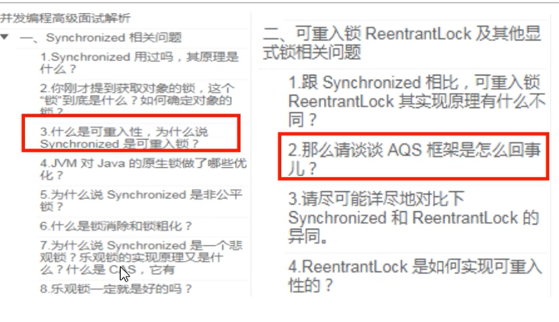
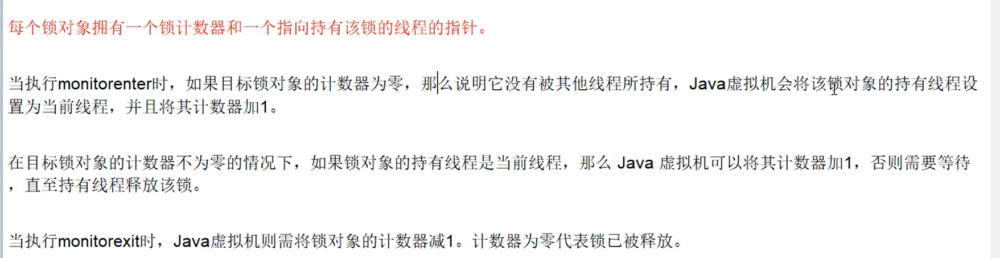
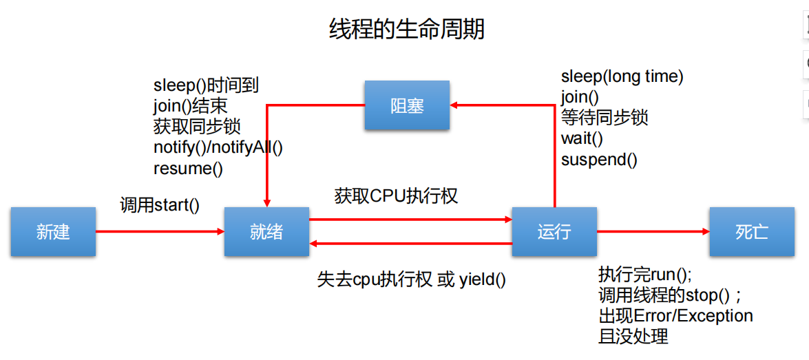

---------------------------------

①synchronized原理  
②常见锁相关面试题

③锁重入原理


---------------------------------

# 线程基础
进程：指在系统中正在运行的一个应用程序；程序一旦运行就是进程；进程是资源分配的最小单位。  
线程：系统分配处理器时间资源的基本单元，或者说进程之内独立执行的一个单元执行流。线程是程序执行的最小单位。

1 run()方法由JVM调用，什么时候调用，执行的过程控制都由操作系统的CPU调度决定  
2 一个线程对象只能调用一次start()方法，重复调用则会抛出异常"IllegalThreadStateException"  
3 守护线程和用户线程
在start()方法前调用thread.setDaemon(true)可以把一个用户线程变成一个守护线程  
若JVM中都是守护线程，JVM将退出


# 线程的同步
### 同步基础
synchronized  
① 该关键字不能被继承，所以子类中方法默认情况下不是同步的  
② 执行完代码块或者线程的执行发生异常，都会释放对锁的占有  

lock  
①  

区别：  
1 Lock是显式锁（手动开启和关闭锁，别忘记关闭锁），synchronized是隐式锁，出了作用域自动释放  
2 Lock只有代码块锁，synchronized有代码块锁和方法锁  
3 使用Lock锁，JVM将花费较少的时间来调度线程，性能更好。并且具有更好的扩展性（提供更多的子类）  
  优先使用顺序： Lock  同步代码块（已经进入了方法体，分配了相应资源）  同步方法 （在方法体之外）

### 集合的线程安全
解决list类型线程安全问题  
①vector  
②Collections.synchronizedList(new ArrayList());  
③copyOnWriteArrayList()（JUC提供，常用）

解决set类型线程安全  
①copyOnWriteArraySet()  

解决map类型线程安全  
①concurrentHashMap  

### 锁的分类
①公平锁和非公平锁（synchronized是非公平锁，ReentrantLock可指定）  
②synchronized（隐式可重入锁）、lock（显示可重入锁）  
③验证死锁：```jstack 进程id```

### 死锁的场景
① 表锁不会发生死锁，行锁会发生死锁  
② 读锁、写锁都可能会发生死锁  


# 线程的通信
三种让线程等待和唤醒的机制：  
①使用Object中的wait()方法让线程等待，使用Object中的notify()方法唤醒线程。（且这两个方法必须在同步代码块和同步方法中使用）  
notify()：唤醒正在排队等待同步资源的线程中优先级最高者结束等待。notifyAll ()：唤醒正在排队等待资源的所有线程结束等待  
这三个方法只有在synchronized方法或synchronized代码块中才能使用，否则会报java.lang.IllegalMonitorStateException异常。
因为这三个方法必须有锁对象调用，而任意对象都可以作为synchronized的同步锁，因此这三个方法只能在Object类中声明。  
②使用JUC包中Condition的await()方法让线程等待，使用signal()方法唤醒线程。  
③LockSupport类可以阻塞当前线程以及唤醒指定被阻塞的线程  

### 虚假唤醒
this.await()使当前线程在此处等待，下一次被唤醒的时候继续从此处开始执行，没有再次判断是否等待。所以用while代替if判断可以解决这个问题。  

# 线程池主要的任务处理流程
1、当前线程数小于corePoolSize，则调用addWorker创建核心线程执行任务  
2、如果不小于corePoolSize，则将任务添加到workQueue队列  
2.1、如果isRunning返回false（状态检查），则remove这个任务，然后执行拒绝策略。  
2.2、线程池处于running状态，但是没有线程，则创建线程  
3、如果放入workQueue失败，则创建非核心线程执行任务，如果这时创建非核心线程失败（当前线程总数不小于maximumPoolSize时），就会执行拒绝策略  
