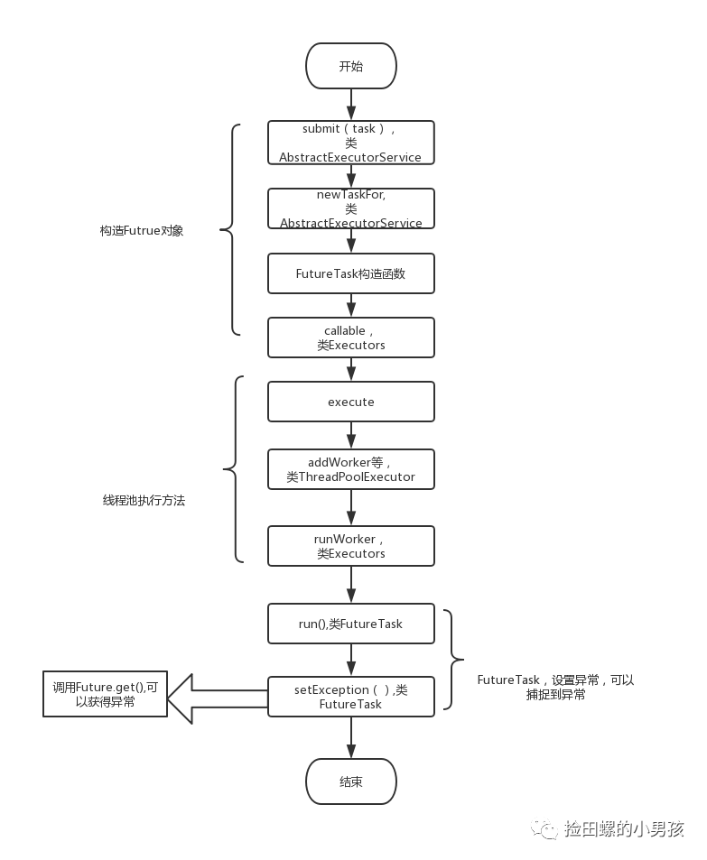

# 执行流程



# 线程池异常处理

①在任务代码try/catch捕获异常

②通过Future对象的get方法接收抛出的异常

③为工作者线程设置```UncaughtExceptionHandler```，在```uncaughtException```方法中处理异常

④重写THreadPoolExecutor的afterExecute方法，处理传递的异常引用

```java
class ExtendedExecutor extends ThreadPoolExecutor {
  // ...
  protected void afterExecute(Runnable r, Throwable t) {
    super.afterExecute(r, t);
    if (t == null && r instanceof Future<?>) {
      try {
        Object result = ((Future<?>) r).get();
      } catch (CancellationException ce) {
          t = ce;
      } catch (ExecutionException ee) {
          t = ee.getCause();
      } catch (InterruptedException ie) {
          Thread.currentThread().interrupt(); // ignore/reset
      }
    }
    if (t != null)
      System.out.println(t);
  }
}}
```


# 自定义拒绝策略

线程池的拒绝策略是一项非常重要的配置，它主要用于处理那些无法提交到队列中的任务  
自定义拒绝策略时，需要注意以下几点：  
2.1 保证原子性：应该确保该操作是原子性的，也就是两个线程不会同时执行这个操作  
2.2 避免死锁：要避免因为线程等待而引起的死锁问题  
2.3 避免内存泄漏：要确保除了正常失败的任务之外，其他任务可以得到清理和回收  

```
// 自定义拒绝策略CustomRejectedExecutionHandler，当线程池的工作队列已满并且无法继续添加新任务时，ExecutorService 会调用这个拒绝策略进行处理
// 当线程池的工作队列已满时，我们使用 while 循环来等待队列有空余位置，从而避免任务执行失败
public class CustomRejectedExecutionHandler implements RejectedExecutionHandler {
 
    @Override
    public void rejectedExecution(Runnable r, ThreadPoolExecutor executor) {
        try {
            // 阻塞等待队列空闲
            while (!executor.getQueue().offer(r, 1, TimeUnit.SECONDS)) {
                System.out.println("inner offer over");
            }
        } catch (InterruptedException e) {
            Thread.currentThread().interrupt();
        }
    }
}
```
# 线程池状态切换


### RUNNING

①该状态的线程池会接收新任务，并处理阻塞队列中的任务；

②调用线程池的```shutdown()```方法，可以切换到SHUTDOWN状态

③调用线程池的```shutdownNow()```方法，可以切换到STOP状态

### SHUTDOWN

①该状态的线程池不会接收新任务，但会处理阻塞队列中的任务

②队列为空，并且线程池中执行的任务也为空，进入TIDYING状态

### STOP

①该状态不会接收新任务，也不会处理阻塞队列中的任务，而且会中断正在运行的任务

②线程池中执行的任务为空，进入TIDYING状态

### TIDYING

①该状态表明所有的任务已经终止运行，记录的任务数量为0

②terminated()执行完毕，进入TERMINATED状态

### TERMINATED

该状态标识线程池彻底终止

# 常用线程池

### ```Executors.newFixedThreadPool()```

线程池如果使用无界的阻塞队列```LinkedBlockingQueue```，线程获取任务后执行时间又比较长，会导致任务越积越多，最终出现OOM。

### ```Executors.newCachedThreadPool()```

创建的线程池，线程数量默认是```Integer.MAX_VALUE```，也有可能引发OOM。常见在三方包里，会出现这样的问题。阻塞队列用的是```SynchronousQueue```，这是一个不存储元素的阻塞队列，每个插入操作必须等到另一个线程调用移除操作，否则插入操作一直处于阻塞状态。适用于并发执行大量短期的小任务。

### ```Executors.newSingleThreadExecutor```

适用于串行执行任务的场景，一个任务一个任务地执行。

### ```Executors.newScheduledThreadPool```

①添加一个任务

②线程池中的线程从DelayQueue中取任务

③线程从DelayQueue中获取time大于等于当前时间的task

④执行完修改这个task的time为下次被执行的时间

⑤这个task放回DelayQueue队列中

特点：

- 最大线程数为Integer.MAX_VALUE
- 阻塞队列是DelayedWorkQueue
- keepAliveTime为0
- scheduleAtFixedRate() ：按某种速率周期执行
- scheduleWithFixedDelay()：在某个延迟后执行

# 线程池常见坑

### 线程池隔离

避免所有业务共用一个线程池，可能会出现次要业务拖垮主要逻辑的问题。应当做好```线程池隔离```

### 拒绝策略的坑

把拒绝策略设置为```DiscardPolicy```或```DiscardOldestPolicy```，如果是抛弃在被拒绝的任务，同时Future对象调用get()方法，那么线程会一直被阻塞。因为这种拒绝策略在实现方法里啥都没做，没有修改FutureTask的状态，因此FutureTask的状态一致是NEW，但是FutureTask的状态大于```COMPLETING```才会返回，要不然都会一直阻塞等待。解决办法是重写这种拒绝策略，或者使用Future.get()带超时时间的。

```java
// 拒绝策略啥都没做
public static class DiscardPolicy implements RejectedExecutionHandler {
    /**
      * Creates a {@code DiscardPolicy}.
      */
    public DiscardPolicy() { }

    /**
      * Does nothing, which has the effect of discarding task r.
      */
    public void rejectedExecution(Runnable r, ThreadPoolExecutor e) {
    }
}

// FutureTask置状态为NEW
public FutureTask(Runnable runnable, V result) {
  this.callable = Executors.callable(runnable, result);
  this.state = NEW;  //Future的初始化状态是New
}

//状态大于COMPLETING，才会返回，要不然都会阻塞等待
  public V get() throws InterruptedException, ExecutionException {
        int s = state;
        if (s <= COMPLETING)
            s = awaitDone(false, 0L);
        return report(s);
    }
```


拒绝策略设置为```CallerRunsPolicy```，让主线程去执行拒绝的任务，会更新FutureTask的状态，但是如果是主线程运行被拒绝的任务，那么主线程会阻塞，直至任务完成。

### @Async的坑

默认的线程池是```SimpleAsyncTaskExecutor```，它不会复用线程的，简单用于执行大量的短时间的任务，所以实际应用中，一定要自定义线程池

### 使用线程池时，没有自定义名字

不便于排查问题

### 线程池参数设置不合理

```
最佳线程数目 = （（线程等待时间+线程CPU时间）/线程CPU时间 ）* CPU数目
```

### 线程池异常处理的坑

①submit提交任务，不会直接抛出异常，execute方法会。最好在线程里try...catch捕获

②为工作者线程设置```UncaughtExceptionHandler```，在```uncaughtException```方法中处理异常

```Thread.setDefaultUncaughtExceptionHandler(new MyUncaughtExceptionHandler());  ```

### 线程池使用完毕后，忘记关闭

线程池使用完毕后，忘记关闭，有可能会导致```内存泄漏```问题

### ThreadLocal与线程池搭配，线程复用，导致信息错乱

> 线程池会重用固定的几个线程，一旦线程重用，那么很可能从ThreadLocal中获取的值是之前请求遗留下来的值，这时，ThreadLocal中的值就是其他的信息。
>
> 一定在代码运行完后，显示去删除ThreadLocal中的数据，确保数据不串

