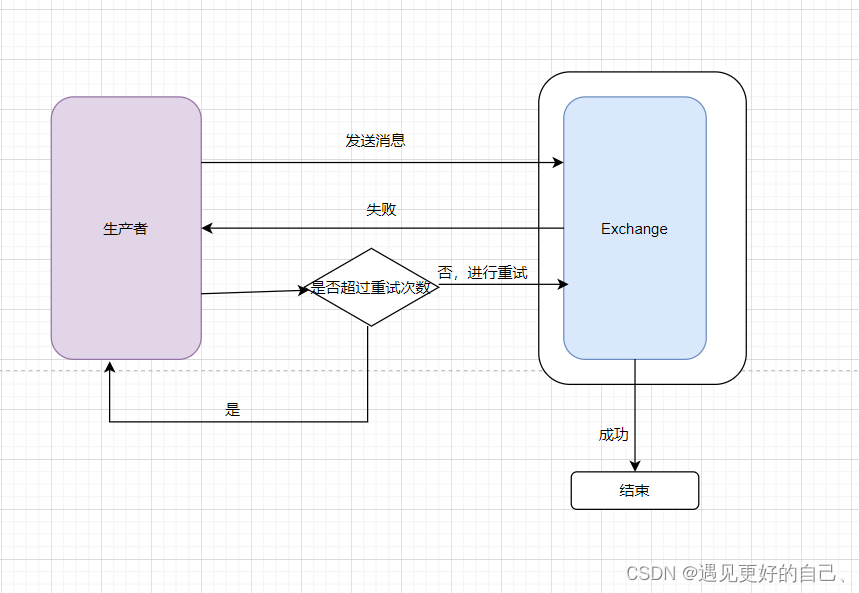
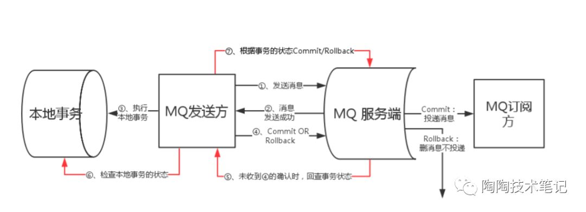

# 消息防丢失
### 生产阶段
① 生产者在收到客户端确认响应后，就代表完成了一次正常的消息发送请求  
② 定时补偿，继续投送未正常发送的消息。达到一定时间或次数后，将错误消息记录日志，并发送预警信息


### 存储阶段
如果broker出现故障，仍然有可能出现消息丢失的。可以通过配置broker参数来避免因为宕机而丢失消息  
① 对于单个节点的broker，可以配置成在收到消息后，将消息写入磁盘后再给producer返回确认响应，这样即使发生宕机，由于消息已经被写入磁盘，恢复后还可以继续使用  
> 比如在RocketMQ中，需要将刷盘方式配置为SYNC_FLUSH同步刷盘方式

② 对于broker集群，需要将broker配置成至少将消息发送到2个以上的节点，再给客户端回复确认响应，这样broker宕机后，其他broker还可以代替其工作

### 消费阶段
也应该通过确认机制来保证。要注意的是消费者应该在执行完所有消费业务逻辑后，再去给服务端响应消费成功，这样下次就不会再拉取到同样的消息

### 总结
① 在生产阶段，需要捕获消息发送的错误，并重发消息  
② 在存储阶段，可以通过配置刷盘和复制相关参数，让消息写入到多个副本的磁盘上，来确保消息不会因为某个Broker宕机或者磁盘损坏而丢失  
③ 在消费阶段，需要在处理完全部消费业务逻辑之后，再发送消费确认

# 重复消费
### 消息重复的情况必然存在
在MQTT协议中，传递消息时定义了三种标准；At most once、At least once、Exactly once。现在绝大部分消息队列都提供的标准是At least once，也就是说，消息队列很难保证不重复

### 幂等性解决重复消息问题
① 利用数据库的唯一约束实现幂等  
② 为更新的数据设置前置条件
> 判断消息中数据和当前数据是否一致，一致则更新，不一致则不处理

③ Token机制，在执行数据更新操作之前，先检查一下是否执行过这个更新操作
> 检查消费状态、更新数据、设置已消费状态，这三个操作需要保证原子性，才能真正实现幂等，所以这个方案实现比较困难

# 消息积压如何处理
① 消费端的性能优化除了优化消费业务逻辑以外或者多线程处理等  
② 还可以通过水平扩容，增加消费端的并发数来提升总体的消费性能

> 对于RocketMQ，在扩容 Consumer 的实例数量的同时，必须同步扩容主题中的分区（队列）数量，确保 Consumer 的实例数和分区数量是相等的

# 顺序消费
① 消费者开启多线程后，可以创建多个内存队列，每个线程消费者去消费内存队列里面的消息  
首先如果这个队列的消费者只有一个，那由于队列的先进先出的特性就能保证消息的顺序消费，此方案适用于数据量较小的情况，如果消息数量较少，
可以直接放在内存的队列结构中，比如list结构，然后在内存中排队，再去按照排队后的顺序执行就能保证消息消费的顺序性，根据关键值进行hash操作，
将关键值相同的数据放到内存队列中，然后在内部排序后，由一个线程去处理
如果这个队列有多个消费者，那么将队列拆分成多个，然后的操作就是把对相同id的更改放入同一个队列，这样就能保证对同一条数据的更新操作是有序的。
```
https://blog.csdn.net/qq_40722604/article/details/118304853
```

# 如何利用事务消息实现分布式事务
### RocketMQ事务消息解决分布式事务
由于传统的处理方式无法解决消息生产者本地事务处理成功与消息发送成功两者的一致性，因此事务消息就诞生了，它实现了消息生成者本地事务与消息发送的原子性，
保证了消息生成者本地事务处理成功与消息发送成功的最终一致性问题


注意点：由于MQ通常都会保证消息能够投递成功，因此，如果业务没有及时返回ACK结果，那么就有可能造成MQ的重复消息投递问题。因此，
对于消息最终一致性的方案，消息的消费组必须要对消息的消费支持幂等，不能造成同一条消息的重复消费的情况

### 事务消息的异常情况分析
##### 如果预发送消息失败，是不是业务就不执行了？
对于基于消息最终一致性的方案，一般都会强依赖这步，如果这个步骤无法得到保证，那么也就不可能做到最终一致性了

##### 为什么要增加一个预发送机制，增加两次发布出去消息的重试机制，为什么不在业务成功之后，发送失败的话使用一次重试机制？
如果业务执行成功，再去发消息，此时如果还没来得及发消息，业务系统就已经宕机了，系统重启后，根本没有记录之前是否发送过消息，这样就会导致业务执行成功，消息最终没发出去的情况

##### 如果consumer消费失败，是否需要producer做回滚了？
这里的事务消息，producer并不会因为consumer消费失败而做回滚，采用事务消息的应用，其所追求的高可用和最终一致性，消息消费失败的话，MQ自己会负责重推消息，直到消费成功。因此，
事务消息是针对生产端而言的。对于消费端，消费端的一致性是通过MQ的重试机制来完成的

##### 如果consumer端因为业务异常而导致回滚，那么岂不是两边最终无法保证一致性？
基于消息的最终一致性方案必须保证消费端在业务上的操作没障碍，它只允许系统异常的失败，不允许业务上的失败，比如你在业务上跑出个NPE之类的问题，导致你消费端执行事务失败，那么就很难做到一致了

### 事务消息在一阶段对用户不可见
首先是，事务消息相对普通消息最大的特点是在一阶段发送的消息对用户是不可见的。那么，如何做到写入消息但是对用户不可见呢？如果是half消息，
将备份原消息的主题与消息消费队列，然后改变主题为```RMQ_SYS_TRANS_HALF_TOPIC```。由于消费组未订阅该主题，所以消费端无法消费half类型的消息。
然后二阶段会显示执行提交或回滚half消息（逻辑删除）。当然为了防止二阶段操作失败，RocketMQ会开启一个定时任务， 从主题为```RMQ_SYS_TRANS_HALF_TOPIC```
中拉取消息进行消费，根据生产组获取一个服务提供者发送回查事务状态请求，根据事务状态来决定是提交或回滚消息。

RocketMQ的具体实现策略是：写入的如果是事务消息，对消息的Topic和Queue等属性进行替换，同时将原来的Topic和Queue存储到消息的属性中，正因为消息主题被替换，故消息并不会转发到该原
主题的消息消费队列，消费组无法感知消息的存在，不会消费。其实改变消息主题是RocketMQ的常用套路。

