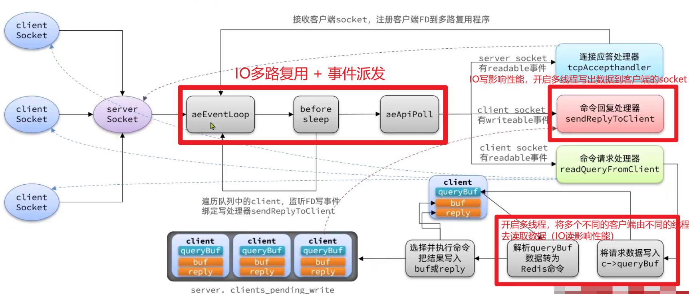
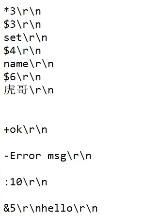
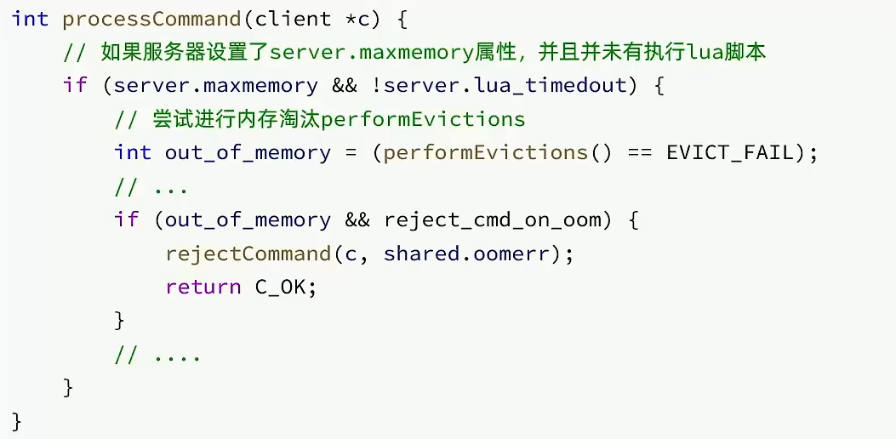
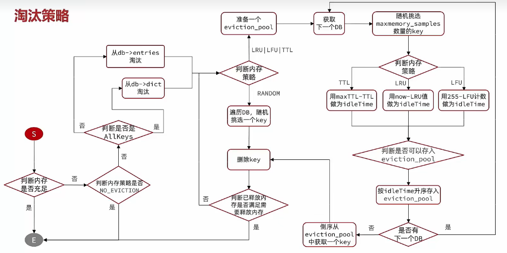
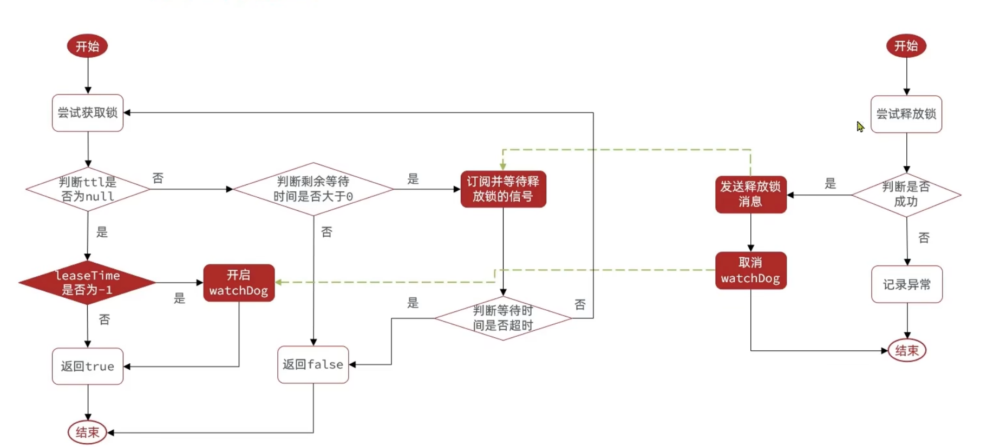

# redis概述

指redis的网络IO和键值对读写是由一个线程来完成的，redis在处理客户端的请求时包括读取（socket读）、解析、执行、内容返回（socket写）等都由一个顺序串行的主线程处理，这就是所谓的单线程。redis采用reactor模式的网络模型，对于一个客户端请求，主线程负责一个完整的处理过程。但是Redis的其他功能，比如RDB或AOF持久化、异步删除、集群数据同步等，是由额外的线程执行的。因此Redis命令工作线程是单线程的，但是整个Redis来说，是多线程的。

当del bigKey时，被删除的key是一个大对象时，del指令就会造成Redis主线程卡顿，等待很久这个线程才会释放，类似加了一个锁，在高并发场景中是不允许的。引入多线程来实现数据的异步删除。但处理读写请求命令仍然只有一个线程，所以仍然算是狭义的单线程。

### redis单线程的好处

①基于内存操作，性能高，性能瓶颈是网络延迟而不是执行速度。

②使用多线程会面临线程安全问题，必然要引入线程所这样的安全手段，实现难度变大，而且性能也会大打折扣。单线程模型避免了不必要的上下文切换和多线程竞争，这样省去了多线程带来的时间和性能上的消耗。单线程模型使redis的开发和维护更简单。

③使用单线程模型也能并发的处理多客户端的请求，主要使用的是IO多路复用机制和非阻塞IO。使用IO多路复用机制来监听多个socket连接客户端，这样就可以使用一个线程连接来处理多个请求，减少线程切换的开销，同时也避免了IO阻塞操作。

### redis之后为什么引入多线程

①在Redis v4.0时，引入多线程异步处理一些耗时较长的任务，例如异步删除命令unlink；

②为了提高网络 I/O 的并行度，Redis 6.0 对于网络 I/O 采用多线程来处理，进一步提高对于多核CPU的利用率。但是对于命令的执行，Redis 仍然使用单线程来处理。

### 网络模型



在Redis6.0版本中引入了多线程，目的是为了提高IO读写效率。因此在**解析客户端命令、写响应结果** 时采用了多线程。核心的命令执行、IO多路复用模块依然是由主线程执行。

### RESP协议

```set name 虎哥```



# 数据结构

### SDS：动态字符串

①获取字符串长度的时间复杂度为O(1)

②支持动态扩容

③减少内存分配次数

④二进制安全

### IntSet

①Redis会确保IntSet中的元素唯一、有序

②具备类型升级机制，可以节省内存空间

③底层采用二分查找方式来查询

### Dict

①类似Java的HashTable，底层是数组加链表来解决哈希冲突

②Dict包含两个哈希表，ht[0]平常用，ht[1]用来rehash

### ZipList

①压缩列表可以看做一种连续内存空间的“双向链表”

②列表的节点之间不是通过指针连接，而是记录上一节点和本节点长度来寻址，内存占用较低

③如果列表数据过多，导致链表过长，可能影响查询性能

④增或删较大数据时有可能发生连续更新问题

### QuickList

①是一个节点为ZipList的双端链表

②节点采用ZipList，解决了传统链表的内存占用问题

③控制了ZipList大小，解决连续内存空间申请效率问题

④中间节点可以压缩，进一步节省了内存

### SkipList

①跳跃表是一个双向链表，每个节点都包含scoure和ele值

②节点按照score值排序，score值一样则按照ele字典排序

③每个节点都可以包含多层指针，层数是1到32之间的随机数

④不同层指针到下一个节点的阔度不同，层级越高，跨度越大

⑤增删改查效率与红黑树基本一致，实现却更简单

### RedisObject结构

Redis中的任意数据类型的键和值都会被封装为一个RedisObject，也叫做Redis对象。

```c
typedef struct redisObject {
  unsigned type:4; // 对象类型，分别是string、hash、list、set、zSet，占4个bit位
  unsigned encoding:4; // 底层编码方式，共有11中，占4个bit位
  unsigned lru:LRU_BITS; // lru表示该对象最后一次被访问的时间，其占用24个bit位，便于判断空闲时间太久的key
  int refcount; // 对象引用计数器，计数器为0则说明对象无人引用，可以被回收
  void *ptr; // 指针，指向存放实际数据的空间
} robj;
```

# 数据类型
### String
缓存对象、常规计数、分布式锁、共享session信息等。

①其基本编码方式是RAW，基于简单动态字符串SDS实现，存储上限为512mb

②如果存储的SDS长度小于44字节，则会采用EMBSTR编码，此时object head与SDS是一段连续空间。申请内存时只需要调用一次内存分配函数，效率更高。

③如果存储的字符串是整数值，并且大小在LONG_MAX范围内，则会采用INT编码：直接将数据保存在RedisObject的ptr指针位置（刚好8字节），不再需要SDS了。

### List
消息队列、获取最新列表(```lpush```、```lrange```)等

### Hash
缓存对象结构

### Set
聚合计算（并集、交集、差集）场景，比如点赞、共同关注、抽奖活动等

### ZSet
排序场景，比如排行榜、电话和姓名排序等

```ZRANGE z1 0 4```

### GEO

使用GEOSEARCH命令实现查找附近的人的功能

### BitMap

把每一个bit位对应当月的每一天，形成了映射关系，用0和1标示业务状态，这种思路就是位图。业务场景可以是签到。

### HyperLogLog

是从Loglog算法派生的概率算法，用于确定非常大的集合的基数，而不需要存储其所有值。Redis的HLL是基于String结构实现的，单个HLL的内存永远小于16kb，内存占用低的令人发指，作为代价，其测量结果是概率性的，有小于0.81%的误差。

# 持久化
### RDB
将某一时刻的内存数据，以二进制的方式写入磁盘。恢复时是将快照文件移动到安装目录后启动服务器即可，它会读取到内存中。RDB保存的是dump.rdb文件。  

##### 如何实现
Redis 提供了两个命令来生成 RDB 文件，分别是save和bgsave。

save命令执行同步操作将当前redis实例的数据快照以文件形式保存到磁盘，此种方式阻塞主进程。

bgsave命令会fork出子进程，而原来父进程继续处理客户端的请求，子进程负责将数据保存到磁盘。

执行flushAll命令，也会产生dump.rdb文件，但里面是空的。  

```
①Redis 还可以通过配置文件的选项来实现每隔一段时间自动执行一次bgsave命令，默认会提供以下配置：
save 900 1      // 900 秒之内，对数据库进行了至少 1 次修改  
save 300 10     // 300 秒之内，对数据库进行了至少 10 次修改  
save 60 10000   // 60 秒之内，对数据库进行了至少 10000 次修改
②fork的作用是复制一个与当前进程一样的进程，新进程的所有数据（变量、环境变量、程序计数器等）数值都和原进程一致，但是是一个全新的进程，并作为原进程的子进程。
```


##### 特点

①如果**需要进行大规模数据的恢复**，且**对于数据恢复的完整性不是非常敏感**，那RDB方式要比AOF方式更加的高效

②可以按照业务定时备份。RDB文件在内存中的加载速度要比AOF快很多

③在间隔一定时间做一次备份，可能会丢失从当前至最近一次快照期间的数据

④内存数据的全量同步，如果数据量太大会导致IO严重影响服务器性能

##### 其他命令

save "" 						// 禁用RDB

appendonly no 				// 禁用AOF

config set save ""  			// 动态停止RDB保存规则

config get dir      				// 获取安装目录

redis-check-rdb ./redisconfig/dump.rdb // 检查修复dump.rdb文件

##### 触发RDB时机

①配置文件中的快照配置

②手动save/bgsave命令

③执行flushdb/flushall命令也会产生dump.rdb文件，但是这个文件无作用

④执行shutdown且没有设置开启AOF持久化

⑤主从复制时，主节点自动触发

### AOF
**以日志形式来记录每个写操作**。 将redis执行过的所有写指令记录下来（读操作不记录），只许追加文件但是不可改写文件，redis启动之处会读取该文件重新构建数据，实际上就是根据日志文件的内容将写指令从前到后执行一次以完成数据的恢复工作。

开启AOF功能需要设置配置：```appendonly yes```。

AOF保存的是appendOnly.aof文件。  

因为执行写操作命令和记录日志是两个过程，那当 Redis 在还没来得及将命令写入到硬盘时，服务器发生宕机了，这个数据就会有丢失的风险。

##### AOF写日志策略

命令到达Server后并不是直接写入AOF文件，而是先放入AOF缓存中进行保存，当这些命令达到一定量以后再写入磁盘，避免了频繁的磁盘IO操作。

①```appendfsync always```，同步写回，每个写命令执行完立刻同步地将日志写入磁盘，性能较差但数据完整性比较好。
② ```appendfsync everysec```，每秒写回，每个写命令执行完，只是先把日志写到AOF文件的内存缓冲区，每隔1秒把缓冲区的内容写入到磁盘。

③```appendfsync no```， 每个写命令执行完，只是先把日志写到AOF文件的内存缓冲区，由操作系统决定何时将缓冲区内容写回到磁盘。

##### AOF重写机制

为避免AOF文件膨胀，会根据规则进行命令的合并（又称AOF重写），从而起到AOF文件压缩的目的。简单说就是启动AOF文件的内容压缩，只保留可以恢复数据的最小指令集。Redis的重写AOF过程是由后台子进程来完成的，重写过程中，主进程依然可以正常处理命令，接收到的新命令会在子进程生成新的AOF文件后被写入其中。

①手动触发方式

客户端向服务器发送bgrewriteaof命令

②自动触发方式

满足配置文件中的选项后，redis会记录上次重写时的AOF大小，默认配置是当AOF文件大小是上次rewrite后大小的一倍且文件大于64m时。

##### AOF恢复异常
先修改appendOnly no为yes，将有数据的aof文件复制一份保存到安装目录，若文件异常，则启动会报错，需要先用```redis-check-aof --fix```指令进行修复，然后重启redis即可。程序将会对文件修复，扫描aof文件找出第一个出错的命令，
并且删除出错命令之后的所有命令，只保留那些没出错的命令，在大多情况下，被删除的都是aof文件末尾的不完整的命令。

##### 特点

①数据丢失更少，只丢失1秒钟的写入。

②相同数据集的AOF文件和RDB文件，AOF文件恢复速度慢于RDB。

③一般将AOF设置成每秒同步策略效率较好。

### 混合持久化（推荐）

①在redis.conf文件中设置以下参数，可以开启混合持久化

```
aof-use-rdb-preamble yes # 设置yes表示开启，no表示禁用
```

②RDB镜像做全量持久化，AOF做增量持久化 先使用RDB进行快照存储，然后使用AOF持久化记录所有的写操作，当重写策略满足或手动触发重写的时候，将最新的数据存储为新的RDB记录。这样的话，重启服务的时候会从RDB和AOF两部分恢复数据，既保证了数据完整性，又提高了恢复数据的性能。简单来说:混合持久化方式产生的文件一部分是RDB格式，一部分是AOF格式。

# pipeline

管道可以一次性发送多条命令给服务端，减少了客户端和服务端的通信次数。实现原理是队列，先进先出的特性保证了数据的顺序性。

管道技术本质上是客户端提供的功能，而非 Redis 服务器端的功能。使用管道技术可以解决多个命令执行时的网络等待。

MSET虽然可以批处理，但是却只能操作部分数据类型，因此如果有对复杂数据类型的批处理需要，建议使用Pipeline功能。

```java
public void testPipeline() {
  // 创建管道
  Pipeline pipeline = jedis.pipeline();
  
  for (int i=1;i <= 10000; i++) {
    // 放入命令到管道
    pipeline.set("test:key_" + i, "value_" + i);
    if (i % 1000 == 0) {
      // 每放入1000条命令，批量执行
      pipeline.sync();
    }
  }
}
```

### 特点

①原生批量命令是原子性的（例如mset、mget），**pipeline是非原子性的**。

②原生批量命令一次只能执行一种命令，pipeline支持批量执行不同命令。

③管道中的某个命令执行失败，客户端需要单独处理每个命令的错误。

### 注意点

①pipeline缓冲的指令只是会依次执行，**不保证原子性**，如果执行中指令发生异常，将会继续执行后续的指令。

②使用pipeline组装的**命令个数不能太多**，不然数量过大客户端阻塞的时间可能过久，同时服务端也被迫回复一个队列的答复，占用很多内存。

### 集群下的批处理

如MSET或Pipeline这样的批处理需要在一次请求中携带多条命令，而此时如果Redis是一个集群，那批处理命令的多个key必须落在一个插槽中，否则就会导致执行失败。

①串行slot

在客户端计算每个key的slot，将slot一致分为一组，每组都利用Pipeline批处理。串行执行各组命令。

②并行slot

与①不同的是，并行执行各组命令

③Hash_Tag

将所有key设置相同的Hash_Tag，则所有key的slot一定相同。也就是key的有效部分相同。（容易产生数据倾斜等问题）

# 发布订阅

发送者(PUBLISH)发送消息，订阅者(SUBSCRIBE)接收消息。

但是不推荐使用该功能。

```
PUB/SUB缺点
①发布的消息在Redis系统中不能持久化，因此，必须先执行订阅，在等待消息发布。如果先发布了消息，那么该消息由于没有订阅者，消息将被直接丢弃。
②消息只管发送，对于发布者而言消息是即发即失，不管接受，也没有ACK机制，无法保证消息的消费成功。
以上的缺点导致Redis的Pub/Sub模式就像个小玩具，在生产环境中几乎无用武之地，为此Redis5.0版本新增了Stream数据结构，不但支持多播，还支持数据持久化，相比Pub/Sub更加的强大。
```

# Lua脚本

lua脚本在redis服务器上执行时具有原子性

①`EVAL`执行一段lua脚本，每次都需要将完整的lua脚本传递给redis服务器  
②`SCRIPT LOAD`将一段lua脚本缓存到redis中并返回一个tag串，并不会执行  
③`EVAL SHA`执行一个脚本，不过传入参数是②中返回的tag，节省网络带宽  
④`SCRIPT EXISTS`判断②返回的tag串是否存在服务器中  
⑤`SCRIPT FLUSH`清除服务器上的所有缓存的脚本  
⑥`SCRIPT KILL`杀死正在运行的脚本  
⑦`SCRIPT DEBUG`设置调试模式，可设置同步、异步、关闭，同步会阻塞所有请求  

# 内存回收

### 相关问题

①Redis是如何知道一个key是否过期了？

利用两个Dict分别记录key-value对以及key-ttl对。通过查这个Dict，来判断当前key的过期时间是否达到。

②是不是TTL到期就立即删除了？

不是，采用**惰性删除**和**定期删除**策略。

③如何查看内存大小？

在配置文件中的859行 ```maxmemory <bytes>```，注意此处内存大小是bytes字节类型，注意单位转换。
④如果不设置最大内存大小或者设置最大内存大小为0，在64位操作系统下不限制内存大小，在32位操作系统下最多使用3GB内存。还可以通过```info maxmemory```命令查看redis的内存使用情况。
⑤一般生产上的配置：一般推荐redis设置内存为最大物理内存的四分之三。既可以通过修改配置文件的大小，也可以通过```config set maxmemory``` 内存大小进行设置。
⑥redis打满了，会报错：(error) OOM command not allowed when used memory > ```maxmemory```

### 过期删除策略
① 惰性删除：不主动删除过期键，每次访问 key 时，都检测 key 是否过期，如果过期则删除该 key。
③ 定期删除：通过定时任务，周期性的抽样部分过期的key 进行检查，并删除其中的过期key。

> 定期清理的两种模式：
>
> ①SLOW模式执行频率默认为10，每次不超过25ms
>
> ②FAST模式执行频率不固定，但两次间隔不低于2ms，每次耗时不超过1ms

Redis 选择「惰性删除+定期删除」这两种策略配和使用，以求在合理使用 CPU 时间和避免内存浪费之间取得平衡。

### 内存淘汰策略
如果内存使用仍然达到阈值时，就会触发内存淘汰策略。

Redis在处理客户端命令的方法```processCommand()``` 中尝试做内存淘汰，即任何命令执行前都会做内存检查。



生产上，在配置时一般使用```maxmemory-policy allkeys-lru```，命令（```config set maxmemory-policy allkeys-lru```）和修改配置文件都可

> 内存淘汰策略（八种）
> ```noeviction```：不会淘汰任何key，在新加时会报异常（6.0.8默认）  
>
> ①在设置了过期时间的数据中进行淘汰 
>
> ```volatile-random```：随机淘汰设置了过期时间的任意键值
> ```volatile-ttl```：优先淘汰更早过期的键值
> ```volatile-lru```：淘汰所有设置了过期时间的键值中，最久未使用的键值 ```volatile-lfu```：淘汰所有设置了过期时间的键值中，最少使用的键值
>
> ②在所有数据范围内进行淘汰
>
> ```allkeys-random```：随机淘汰任意键值
> ```allkeys-lru```：淘汰整个键值中最久未使用的键值（生产上常用）
> ```allkeys-lfu```：淘汰整个键值中最少使用的键值



### LRU

最少最近使用。用当前时间减去最后一次访问时间，这个值越大则淘汰优先级越高。

LRU 算法的实现是基于链表结构，链表中的元素按照操作顺序从前往后排列，最新操作的键会被移动到表头，当需要内存淘汰时，
只需要删除链表尾部的元素即可，因为链表尾部的元素就代表最久未被使用的元素 
Redis 实现的是一种近似 LRU 算法，目的是为了更好 的节约内存，它的实现方式是在 Redis 的对象结构体中添加一个额外的字段，
用于记录此数据的最后一次访问时间。
### LFU

最少频率使用。会统计每个key的访问频率，值越小淘汰优先级越高。

LFU 算法会记录每个数据的访问次数。当一个数据被再次访问时，就会增加该数据的访问次数。这样就解决了偶尔被访问一次之后，
数据留存在缓存中很长一段时间的问题，相比于 LRU 算法也更合理一些。

# 基于redis实现分布式锁

### 关键点

①lock加锁

加锁要设置过期时间（可以使用lua脚本保证设值和设值过期时间的原子性）

使用hash数据结构保证加锁功能和锁的可重入性

加锁不成，需要while进行重试并自旋

在过期时间内，业务未完成，锁要自动续期

②unlock解锁

在finally中释放锁时，删除自己的锁（判断和删除可以使用lua脚本保证原子性）

考虑可重入性，加锁几次就要解锁几次

### 存在问题

①不可重入。同一个线程无法多次获取同一把锁

②不可重试。获取锁只尝试一次就返回false，没有重试机制

③超时释放。锁超时释放虽然可以避免死锁，但是业务执行耗时的情况下，也会导致锁释放，存在安全问题

④主从一致性。redis集群主从复制时，由于master节点数据未来得及同步到slave，slave上位后，可能出现多个线程都写入了键值对，此时出现了多个线程加锁成功的错误现象。

# Redisson原理



Redis实现分布式锁中问题的解决方案：

①解决可重入问题：利用hash结构记录线程id和重入次数

②解决可重试问题：利用信号量和PubSub功能实现等待、唤醒，获取锁失败的重试机制

③解决超时续约问题：利用watchDog，每隔一段时间（releaseTime / 3），重置超时时间

④解决主从一致性问题：使用联锁，大概意思就是不建立主从关系，都是独立节点，全部加锁成功才表示加锁成功。

```java
lock = redissonClient.getMultiLock(lock1, lock2, lock3);
```

