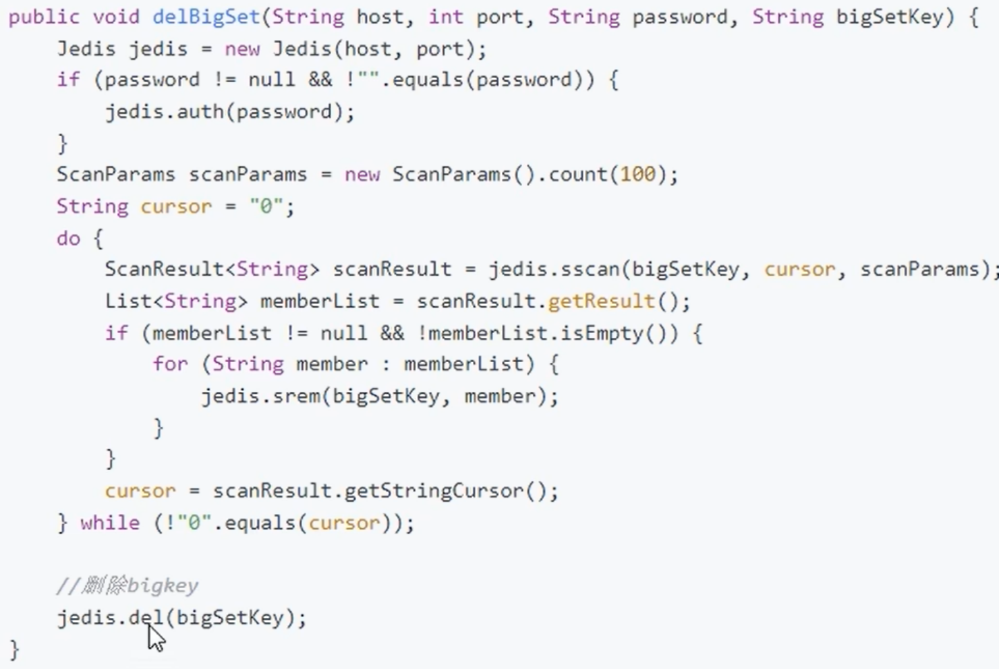
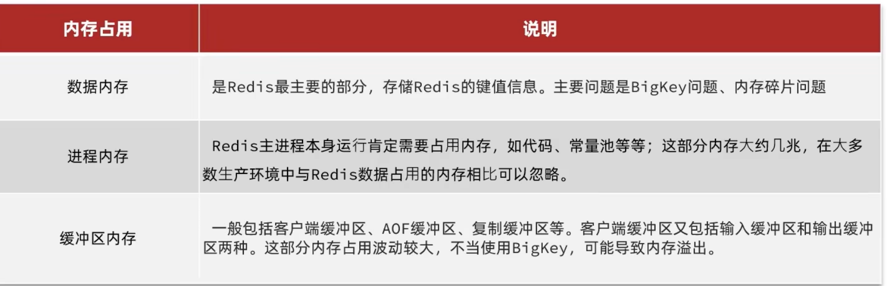

# 缓存预热

将热点数据提前加载到redis缓存中，可以通过@PostConstruct提前运行某个程序，将其加载到redis中。

# 缓存雪崩

缓存雪崩是指在我们设置缓存时key采用了相同的过期时间，导致缓存在某一时刻同时失效，请求全部转发到数据库，数据库瞬时压力过重雪崩。Redis服务宕机，也会导致大量请求到达数据库，带来巨大压力。
### 解决缓存雪崩
①将缓存失效时间随机打散。这样每个缓存的过期时间都不重复了，也就降低了缓存集体失效的概率。

②利用Redis集群提高服务的可用性。

③给业务添加多级缓存。

# 缓存击穿
缓存击穿问题也叫热点Key问题，就是一个被高并发访问的key突然失效了，大量请求访问会在瞬间给数据库带来巨大的冲击。

### 解决缓存击穿
①互斥锁

保证同一时间只有一个业务线程请求缓存，未能获取互斥锁的请求，要么等待锁释放后重新读取缓存，要么就返回空值或者默认值。

# 缓存穿透
当用户访问的数据，```既不在缓存中，也不在数据库中```，导致请求在访问缓存时，发现缓存缺失，再去访问数据库时，发现数据库中也没有要访问的数据，那么当有大量这样的请求到来时，数据库的压力骤增，这就是缓存穿透的问题。

### 解决缓存穿透
①缓存空对象
对于没有查到的请求，设置空值或者默认值，返回给应用，也能避免继续查询数据库。

②布隆过滤器
使用布隆过滤器快速判断数据是否已存在，避免通过查询数据库来判断数据是否存在。

# 如何高效判断一个元素不在集合中了
使用布隆过滤器，研究布隆过滤器原理

# 如何设计一个缓存策略，可以动态缓存热点数据呢

# redis实现队列和延时队列
### 实现队列
使用redis的list结构来作为消息队列使用，用```rpush```和```lpush```操作入队列，用```lpop```和```rpop```出队列  

### 队列为空时的解决方案
① 如果从队列中pop出数据为空时，就让线程睡一会，这样空轮询就不会拉高客户端的CPU消耗  
② 线程睡一会会让消息延迟增大，通过```blpop```和```brpop```既能解决空轮询问题，也能解决消息延迟问题，因为这是阻塞读的方式，
阻塞读在队列没有数据的时候，会立即进入休眠状态，一旦数据到来，则立即醒过来，消息的延迟几乎为零  
③ 阻塞读会使得客户端连接成为闲置连接，闲置过久，服务器一般会主动断开连接，减少闲置资源占用，这个时候```blpop```和```brpop```会抛出异常，
所以编写客户端的时候，如果捕获到异常，要有重试机制

### 实现延时队列
① 使用ZADD命令把消息添加到sorted set中，并将当前时间作为score（分数） ```ZADD delay-queue <timestamp> <message>```  
② 后台开启一个任务线程不断地轮询zSet，查找score <= 当前时间的元素，取出任务执行  
③ 执行完任务后，将其从zSet中删除  
④ 在多进程环境中，为确保每个任务只执行一次，可以使用分布式锁来保证。对于超时或失败的任务，还可以将其移动到另一个zSet中，以便后续处理

> 用```zadd```向zSet中添加任务，```zrangebyscore```命令获取需要被执行的任务，```zrem```命令删除已经被执行的任务

# Key-Value的设计

### Key和Value的最佳实践

①Key的最佳实践

遵循基本格式：[业务名称]:[数据名]:[id]

key的字节占用不超过44字节

不包含特殊字符

②Value的最佳实践

合理的拆分数据，拒绝BigKey

选择合适的数据结构

Hash结构的entry数量不要超过1000

设置合理的超时时间

### Bigkey如何处理

##### Bigkey危害

①内存不均，集群迁移困难

②删除超时，大key删除作梗

##### 如何查找BigKey

应该在redis.conf配置文件中，使用rename命令禁用keys。

数据量大时，扫描可用scan、sscan、hscan、zscan，其实现过程可理解为分页查，但不是按顺序从第零位遍历到末尾。scan命令用于迭代数据库中的数据库键，然后再用strlen、hlen等命令判断key的长度

```
scan 0 match k* count 15
```

##### 大key如何删除

> ①String类型的value大于10KB被称为大key
> ②Hash、List、Set、ZSet类型的value，其元素的个数超过5000个

##### 分批次删除

①对于String，一般用del命令，如果过于庞大可以使用unlink key删除

②对于Hash，使用```hscan```命令，每次获取100个字段，再用```hdel```命令每次删除field

③对于List，通过```ltrim```命令，每次删除少量元素，```ltrim``` 命令只保留指定区间内的元素，不在指定区间之内的元素都将被删除

④对于Set，使用```sscan```命令，每次获取部分元素，再用```srem```命令删除每个元素

⑤对于ZSet，使用```zscan``` 每次获取部分元素，再使用```zremrangebyrank```命令删除每个元素



##### 异步删除
从redis 4.0版本开始，可以采用异步删除法，用unlink命令代替del来删除，这样redis会将这个key放入到一个异步线程中进行删除，这样不会阻塞主线程。

**要使用惰性删除功能，需要将lazyfree相关配置打开**

# 内存淘汰策略
redis key没设置过期时间为什么被redis主动删除了?

当redis已用内存超过```maxmemory```限定时，触发了内存淘汰策略

# 缓存一致性问题

### 强一致性

如果追求强一致性，则更新数据库后，应该直接从数据库获取新值，不走缓存。使用缓存通常考虑的，都是最终一致性。强一致性同步成本太高，如果追求强一致，那么没必要用缓存了，直接用mysql即可。通常考虑的，都是最终一致性。

### 最终一致性

1 **同步双写**

​	先写数据库，再删除缓存。

①保证缓存与数据库操作的原子性？```利用分布式事务保证```

②重试机制 
采用异步延时删除策略，如果缓存因为各种问题删除失败，将需要删除的缓存key发送至消息队列，然后自己写代码去消费消息，重试删除缓存操作，直到成功。业务应该要能容忍一段时间的缓存不一致问题。

2 **设置有效期**

​	缓存失效，自动删除，时效性要求低的业务

3 **异步通知**

修改数据库时发送事件通知，相关服务监听到通知后修改缓存数据

①基于MQ的异步通知

②基于canal的异步通知

比如利用canal订阅mysql binlog，再操作缓存


# 服务端优化

### 持久化配置

①用来做缓存的数据，可以放到单独的Redis实例，尽量不要开启持久化功能。做分布式锁、订单库存、流水等重要数据需要开启持久化。

②建议关闭RDB持久化功能，使用AOF持久化数据。

③利用脚本定期在slave节点做RDB，实现数据备份。

④设置合理的rewrite阈值，避免频繁的bgrewrite。

⑤配置no-appendfsync-on-rewrite=yes，禁止在rewrite期间做aof，避免因aof引起的阻塞。

⑥Redis实例的物理机要预留足够内存，应对fork和rewrite。

⑦单个Redis实例内存上限不要太大，例如4G或8G，可以加快fork的速度、减少主从同步、数据迁移压力。

### 慢查询优化

### 命令及安全配置

①Redis一定要设置密码

②禁止使用下面命令：keys、flushall、flushdb、config set等命令，可以利用rename -command禁用

③bind：限制网卡，禁止外网网卡访问

④开启防火墙

⑤不要使用Root账户启动Redis

### 内存配置



# 集群问题

### 集群完整性问题

如果发现任意一个插槽不可用，则整个集群会停止对外服务。为了保证高可用特性，建议配置```cluster-require-full-coverage false```

### 集群带款问题

①避免大集群，集群节点数不要太多，最好小于1000，业务非常大，可以建立多个集群

②避免在单个物理机中运行太多Redis实例

③配置合适的cluster-node-timeout值

### 数据倾斜问题

### 客户端性能问题

### 命令的集群兼容性问题

### Lua和事务问题

# redis宕机

1 事发前要通过主从架构和哨兵机制尽量保证整个 redis 集群的高可用性，发现机器宕机尽快补上，选择合适的内存淘汰策略  
2 事发中可以通过多级缓存机制和限流降级机制保证服务可用  
> ① 对于一个请求，先查本地ehcache缓存，如果没查到再查redis。 如果redis和ehcache都没有，再查数据库，将数据库中的结果，写入ehcache和redis中  
> ② 限流组件，可以设置每秒的请求，有多少能通过组件，剩余的未通过的请求可以走降级，可以返回一些默认的指，或者友情提示  
> 这样做的好处是保证数据库不会挂掉，只要数据库不死，对用户来说，多点几次，至少能刷出一次页面来

3 事发后再利用 redis 持久化机制保存的数据，重启服务，尽快恢复缓存  

   