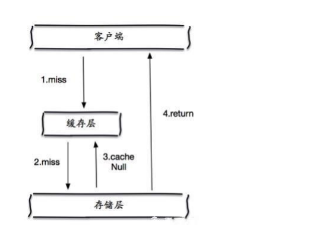

# 缓存穿透
指查询一个一定不存在的数据，导致每次请求都要到数据库去查询。如发起查询id为"-1"的数据或id为特别大不存在的数据，这时的用户很可能是攻击者，攻击会导致数据库压力过大。  
解决方式：  
1 布隆过滤器：将所有可能存在的数据哈希到一个足够大的bitmap中，一个一定不存在的数据会被这个bitmap拦截掉，从而避免了对底层存储系统的查询压力  

2 缓存空对象：对于每次没有查到的请求，设置一个空缓存  
> 缓存空对象存在的问题：  
> ① 如果空值能够被缓存起来，这就意味着缓存需要更多的空间存储更多的键，因为这当中可能会有很多的空值的键  
> ② 即使对空值设置了过期时间，还是会存在缓存层和存储层的数据会有一段时间窗口的不一致，这对于需要保持一致性的业务会有影响

# 缓存雪崩
缓存雪崩是指在我们设置缓存时key采用了相同的过期时间，导致缓存在某一时刻同时失效，请求全部转发到数据库，数据库瞬时压力过重雪崩。  
解决方案：  
1 给缓存业务添加降级限流策略  
> 在缓存失效后，通过加锁或者队列来控制都数据库写缓存的线程数量，比如对某个key只允许一个线程查询数据和写缓存，其他线程等待

2 给业务添加多级缓存  

3 数据预热
> 数据预热的含义就是在正式部署之前，我先把可能的数据先预先访问一遍，这样部分可能大量访问的数据就会加载到缓存中。
> 在即将发生大并发访问前手动触发加载缓存不同的key，设置不同的过期时间，让缓存失效的时间点尽量均匀

# 缓存击穿
缓存击穿问题也叫热点Key问题，就是一个被高并发访问并且缓存重建业务较复杂的key突然失效了，无数的请求访问会在瞬间给数据库带来巨大的冲击  
缓存击穿指并发查同一条数据。缓存击穿是指缓存中没有但数据库中有的数据（一般是缓存时间到期），这时由于并发用户特别多，同时读缓存没读到数据，又同时去数据库去取数据，引起数据库压力瞬间增大，造成过大压力  
缓存雪崩是不同数据都过期了，很多数据都查不到从而查数据库  

解决方案：  
1 设置热点数据永远不过期  

2 互斥锁  
使用分布式锁，保证对于每个key同时只有一个线程去查询后端服务，其他线程没有获得分布式锁的权限，因此只需要等待即可。这种方式将高并发的压力转移到了分布式锁
```java
/**
 * 尝试获取锁
 *
 * @param key
 * @return
 */
private boolean tryLock(String key) {
    Boolean flag = stringRedisTemplate.opsForValue().setIfAbsent(key, "1", 10, TimeUnit.SECONDS);
    return BooleanUtil.isTrue(flag);
}

/**
 * 删除锁
 *
 * @param key
 */
private void unLock(String key) {
    stringRedisTemplate.delete(key);
}
```
```java
public Shop queryWithMutex(Long id) throws InterruptedException {
    //从Redis查询商铺缓存
    String cacheShop = stringRedisTemplate.opsForValue().get(SHOPCACHEPREFIX + id);

    //判断缓存中数据是否存在
    if (!StringUtil.isNullOrEmpty(cacheShop)) {
        //缓存中存在则直接返回
        try {
            // 将子字符串转换为对象
            Shop shop = objectMapper.readValue(cacheShop, Shop.class);
            return shop;
        } catch (JsonProcessingException e) {
            e.printStackTrace();
        }
    }

    // 因为上面判断了cacheShop是否为空，如果进到这个方法里面则一定是空，直接过滤，不打到数据库
    if (null != cacheShop) {
        return null;
    }

    Shop shop = new Shop();
    // 缓存击穿，获取锁
    String lockKey = "lock:shop:" + id;
    try {
        boolean b = tryLock(lockKey);
        if (!b) {
            // 获取锁失败了
            Thread.sleep(50);
            return queryWithMutex(id);
        }
        //缓存中不存在，则从数据库里进行数据查询
        shop = getById(id);

        //数据库里不存在，返回404
        if (null == shop) {
            // 缓存空对象
            stringRedisTemplate.opsForValue().set(SHOPCACHEPREFIX + id, "", 2, TimeUnit.MINUTES);
            return null;
        }
        //数据库里存在，则将信息写入Redis
        try {
            String shopJSon = objectMapper.writeValueAsString(shop);
            stringRedisTemplate.opsForValue().set(SHOPCACHEPREFIX + id, shopJSon, 30, TimeUnit.MINUTES);
        } catch (JsonProcessingException e) {
            e.printStackTrace();
        }
    } catch (Exception e) {

    } finally {
        // 释放互斥锁
        unLock(lockKey);
    }
    //返回
    return shop;
}
```

# 缓存和数据库一致性问题说明
1 场景说明：  
通常在开发中，都会使用mysql作为存储，而redis作为缓存，加速和保护mysql。但是，当mysql数据更新之后，redis怎么保持同步呢。
强一致性同步成本太高，如果追求强一致，那么没必要用缓存了，直接用mysql即可。通常考虑的，都是最终一致性  
2 解决方案：  
常用更新数据库后删除缓存，查询时再添加缓存。并且在单体架构中通过采用事务方式保证缓存与数据库的操作同时成功或失败
```java
@Override
@Transactional
public Result updateShop(Shop shop) {
    Long id = shop.getId();
    if (null==id){
        return Result.fail("店铺id不能为空");
    }
    // 更新数据库
    boolean b = updateById(shop);
    // 删除缓存
    stringRedisTemplate.delete(SHOPCACHEPREFIX+shop.getId());
    return Result.ok();
}
```

# redis宕机
1 事发前  
通过主从架构和哨兵机制尽量保证整个 redis 集群的高可用性，发现机器宕机尽快补上，选择合适的内存淘汰策略...  

2 事发中：本地ehcache缓存 + hystrix限流&降级  
① 对于一个请求，先查本地ehcache缓存，如果没查到再查redis。 如果redis和ehcache都没有，再查数据库，将数据库中的结果，写入ehcache和redis中  
② 限流组件，可以设置每秒的请求，有多少能通过组件，剩余的未通过的请求可以走降级，可以返回一些默认的指，或者友情提示  
***这样做的好处是保证数据库不会挂掉，只要数据库不死，对用户来说，多点几次，至少能刷出一次页面来***

3 事发后：利用 redis 持久化机制保存的数据，重启服务，尽快恢复缓存  


Redis

redis的理解
单线程概念
redis命令的执行是一个线程顺序执行的，所以redis是并发安全的

redis执行快的原因
①命令执行基于内存操作
②命令执行是单线程操作，没有线程切换开销，效率有一定的提升
③基于IO多路复用机制提升redis的I/O利用率
④高效的数据存储结构：全局hash表以及多种高效数据结构，比如跳表、压缩列表、链表等

Redis的大key如何处理
什么是redis的大key
① String类型的值大于10KB
② hash、list、set、zset元素个数超过5000个
异步删除法：用unlink代替del来删除，这样redis会将这个key放入到一个异步线程中，进行删除，这样不会阻塞主线程

redis对过期key的删除策略
①惰性删除：当读写一个已经过期的key时，会触发惰性删除策略，判断Key是否已过期，如果过期了直接删除掉这个key
②定时删除：由于惰性策略无法保证冷数据被及时删掉，所以redis会定期（默认每100ms）主动淘汰一批已过期的key，这里的一批只是部分过期key，所以可能会出现部分key已经过期但还没有被清理掉的情况，导致内存并没有被释放。

redis key没设置过期时间为什么被redis主动删除了
当redis已用内存超过maxmemory限定时，会触发主动清理策略
针对设置了过期时间的key做处理
①volatile-ttl：在筛选时，会针对设置了过期时间的键值对，根据过期时间的先后进行删除，越早过期的越先被删除
②volatile-random：在设置了过期时间的键值对中，进行随机删除
③volatile-lru：会使用LRU算法筛选设置了过期时间的键值对删除
④volatile-lfu：会使用LFU算法筛选设置了过期时间的键值对删除
针对所有的Key做处理
①allkeys-random：从所有键值对中随选择并删除数据
②allkeys-lru：使用LRU算法在所有数据中进行筛选删除
③allkeys-lfu：使用LFU算法在所有数据中进行筛选删除
不做处理
①noeviction：不会剔除任何数据，拒绝所有写入操作并返回客户端错误信息（OOM command not allowed when used memory），此时redis只响应读操作


持久化机制
rdb：对内存数据进行快照存储，保存的文件后缀是rdb，当redis重新启动时，可以读取快照文件进行恢复，一般可以通过save命令触发，也可以在redis.conf配置文件中进行配置然后触发
aof：每次对服务器的写指令都会以日志的形式记录下来，然后追加到文件末尾，在恢复的时候就是读入aof文件然后把里面的命令全部执行一遍，就可以还原之前的状态。

redis集群原理
主从复制：
复制的实现是分为同步sync和命令传播两个步骤。
①主服务器收到sync命令后，生成rdb快照文件，然后发送给从服务器同步执行
②主服务器收到客户端修改数据的命令后，数据库数据发生变化，同时将命令缓存起来，然后将缓存命令发送给从服务器，从服务器通过执行缓存命令来达到主从数据一致
哨兵模式：
在主从模式的基础上，当主节点宕机导致不可写的时候，然后在从节点间竞选出新的主节点。
哨兵会每隔1秒向所有服务器发送ping命令检查服务器是否正常，如果发现主服务器挂了，会自动选择一个从服务器提升成主服务器，这个选举的过程遵循一个数据一致性算法，即raft算法
哨兵模式解决了主从模式中master故障不可以自动切换主节点的问题。

redis缓存常见问题
缓存穿透：
①查询一定不存在的数据，比如查询id为-1的数据，这样查询的话缓存中根本没有，每次查询请求都会落到数据库，给数据库造成了压力。
解决办法是：①将所有可能存在的数据放到一个足够大的bitmap中，不存在的数据就会被拦截掉，这样就能避免对数据库的查询压力；②缓存空对象
缓存击穿：
并发查同一条数据。高并发请求过来时，某个缓存键恰好失效了，然后又是大量的请求去查这个热点的key时，查不到，就会去查数据库，给数据库也造成了压力。
解决办法：① 使用分布式锁，只允许一个线程去查询这个热点key，然后把查到的结果放入缓存，之后的线程就能直接从缓存中读到数据；②设置热点key永不过期
缓存雪崩：
大量缓存键失效，很多数据查不到从而去查数据库，这时会导致数据库瞬时压力过大而雪崩。
解决办法：①设置不同的过期时间，让缓存失效的时间点尽量均匀点
分布式锁原理：
基于MySQL的唯一索引去实现分布式锁：线程在执行前，将自身信息存储到表中，在方法名称这个字段上加唯一索引，如果再有线程在执行这个方法时，他也要将自身信息加入表中，此时就会由于唯一索引，因此其他线程就不能加锁成功，可以直接返回错误，也可以自旋的方式
数据库表字段：id、method_name、thread_name、count(锁的可重入次数)
问题是：①数据库挂了，锁不可用；②没有超时时间，线程超时了，锁没释放；

①利用setnx key value ex 100加锁并设置过期时间，设置过期时间的目的是避免执行错误导致不能及时释放锁
②使用lua脚本保证在释放锁的过程中判读是自己加的锁然后删除锁这两个操作的原子性
③在lua脚本中通过hincrby命令保证自身线程可重复加锁，避免不可重入导致死锁
④起一个定时任务，保证自动续期成功

使用到了redis的什么功能：
① 缓存热点数据和令牌。缓存场景下既用到了string，也用到了hash数据结构
② 分布式锁 setnx key value ex 100 （ex是秒，px是毫秒）
③ 用redis的incr命令记录访问次数，以访问者的ip地址作为key，目的就是为了限流
④ lpush、rpush这样的命令可以用来从左边或者右边插入多个值，而lpop或者rpop可以从左边或者从右边取出一个值。这两个命令就可以实现队列的功能
⑤ 利用set结构的无序性实现随机选择一个元素，这可以实现抽奖等场景
sadd key v1;
sadd key v2;
sadd key v3;
spop key;//随机选出一个元素
smembers key;

缓存一致性问题：
①先更新数据库，后删除缓存。如果缓存删除失败了，缓存中的数据又没有过期时间，用户就会一直读取旧数据。
②一个请求A做查询操作，一个请求B做更新操作。缓存刚好失效；请求A查询数据库，得一个旧值；请求B将新值写入数据库；请求B删除缓存；请求A将查到的旧值写入缓存。这种情况下也会产生脏数据。
接下来要解决的是两个操作（更新数据库和删除缓存）失败导致的不一致：①给缓存设置较小的过期时间，这样的话就要系统能容忍一段时间的缓存不一致问题
②采用异步延时删除策略，如果缓存因为各种问题删除失败，将需要删除的缓存key发送至消息队列，然后自己写代码去消费消息，重试删除缓存操作，直到成功，这是最终一致性的方案，也要容忍一段时间的缓存不一致问题
③如果不能容忍redis数据的不一致，要保证强一致性，那么可以通过加锁的方式，在加上分布式锁后，再去做更新数据库和删除缓存的操作，操作完成之后解锁，这样可以保证不会redis和mysql的数据是一致的，不会出现缓存不一致的情况。
rdb和aof的区别
rdb通过fork出一个子进程来将数据写入到rdb临时文件中，这个文件是此时完整的数据备份，生成快照文件的方式速度很快，但是无法保证数据的安全性比如说你一分钟持久化一次，就可能会丢失第1分钟到第2分钟之间的数据。
aof的操作是把对数据的修改指令全部记录下来，在数据量同样大小的时候，aof的文件比rdb的文件要大，因此在恢复数据时，通过aof方式要比rdb慢。如果aof的持久化策略是每次修改数据都写入aof文件，那么他不会丢失数据，安全性方面比rdb方式要高。
一般的操作是同时开启rdb和aof方式来做持久化，rdb可以实现一天生成一份快照文件，aof方式是每秒写入一次文件，这样可以在利用rdb后再利用aof，既兼顾了效率，又兼顾了数据安全性。

