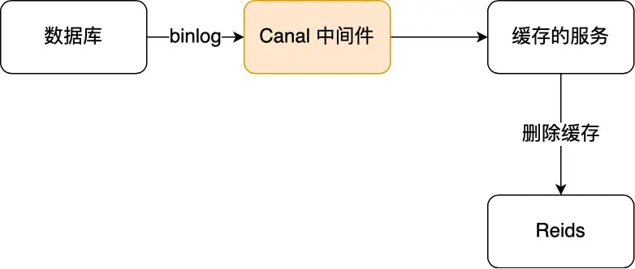

# 缓存雪崩
缓存雪崩是指在我们设置缓存时key采用了相同的过期时间，导致缓存在某一时刻同时失效，请求全部转发到数据库，数据库瞬时压力过重雪崩。  
### 解决缓存雪崩
1 给业务添加多级缓存  

2 将缓存失效时间随机打散  
这样每个缓存的过期时间都不重复了，也就降低了缓存集体失效的概率  

# 缓存击穿
缓存击穿问题也叫热点Key问题，就是一个被高并发访问的key突然失效了，大量请求访问会在瞬间给数据库带来巨大的冲击  

> 缓存击穿指并发查同一条数据，同时读缓存没读到数据，又同时去数据库去取数据，引起数据库压力瞬间增大，造成过大压力  
> 缓存雪崩是不同数据同时都过期了，很多数据都查不到从而查数据库  

### 解决缓存击穿
1 设置热点数据永远不过期，由后台异步更新缓存，或者在热点数据准备要过期前，提前通知后台线程更新缓存以及重新设置过期时间  

2 互斥锁  
保证同一时间只有一个业务线程请求缓存，未能获取互斥锁的请求，要么等待锁释放后重新读取缓存，要么就返回空值或者默认值  

# 缓存穿透
当用户访问的数据，既不在缓存中，也不在数据库中，导致请求在访问缓存时，发现缓存缺失，再去访问数据库时，发现数据库中也没有要访问的数据，
来服务后续的请求。那么当有大量这样的请求到来时，数据库的压力骤增，这就是缓存穿透的问题。

### 解决缓存穿透
1 非法请求的限制  
在入口处判断请求参数是否合理，请求参数是否含有非法值，请求字段是否存在，如果判断出是错误请求直接返回error，避免进一步访问缓存和数据库  

2 设置空值和默认值  
对于没有查到的请求，设置空值或者默认值，返回给应用，也能避免继续查询数据库  

3 布隆过滤器  
使用布隆过滤器快速判断数据是否已存在，避免通过查询数据库来判断数据是否存在  

> 在写入数据库数据时，使用布隆过滤器做个标记，然后在用户请求到来时，业务线程确认缓存失效后，可以通过查询布隆过滤器快速判断数据是否存在，
> 如果不存在，就不用通过查询数据库来判断数据是否存在，即使发生了缓存穿透，大量请求只会查询 Redis 和布隆过滤器，而不会查询数据库，
> 保证了数据库能正常运行，Redis 自身也是支持布隆过滤器的。

# 如何高效判断一个元素不在集合中了
使用布隆过滤器，研究布隆过滤器原理

# 如何设计一个缓存策略，可以动态缓存热点数据呢

# redis实现队列和延时队列
### 实现队列
使用redis的list结构来作为消息队列使用，用```rpush```和```lpush```操作入队列，用```lpop```和```rpop```出队列  

### 队列为空时的解决方案
① 如果从队列中pop出数据为空时，就让线程睡一会，这样空轮询就不会拉高客户端的CPU消耗  
② 线程睡一会会让消息延迟增大，通过```blpop```和```brpop```既能解决空轮询问题，也能解决消息延迟问题，因为这是阻塞读的方式，
阻塞读在队列没有数据的时候，会立即进入休眠状态，一旦数据到来，则立即醒过来，消息的延迟几乎为零  
③ 阻塞读会使得客户端连接成为闲置连接，闲置过久，服务器一般会主动断开连接，减少闲置资源占用，这个时候```blpop```和```brpop```会抛出异常，
所以编写客户端的时候，如果捕获到异常，要有重试机制

### 实现延时队列
① 使用ZADD命令把消息添加到sorted set中，并将当前时间作为score（分数） ```ZADD delay-queue <timestamp> <message>```  
② 后台开启一个任务线程不断地轮询zSet，查找score <= 当前时间的元素，取出任务执行  
③ 执行完任务后，将其从zSet中删除  
④ 在多进程环境中，为确保每个任务只执行一次，可以使用分布式锁来保证。对于超时或失败的任务，还可以将其移动到另一个zSet中，以便后续处理

> 用```zadd```向zSet中添加任务，```zrangebyscore```命令获取需要被执行的任务，```zrem```命令删除已经被执行的任务

# redis的大key如何处理
> String类型的值大于10KB被称为大key  
> Hash、List、Set、ZSet类型的元素的个数超过5000个

### 大key的处理方案
就是要删除大key，具体怎么说

##### 分批次删除
① 对于大Hash，使用```hscan```命令，每次获取100个字段，再用```hdel```命令每次删除1个字段  
② 对于大List，通过```ltrim```命令，每次删除少量元素  
③ 对于大Set，使用```sscan```命令，每次扫描集合中100个元素，再用```srem```命令每次删除一个键  
④ 对于大ZSet，使用```zremrangebyrank```命令，每次删除top 100个元素

##### 异步删除
从redis 4.0版本开始，可以采用异步删除法，用unlink命令代替del来删除，这样redis会将这个key放入到一个异步线程中进行删除，这样不会阻塞主线程  
除了主动调用 unlink 命令实现异步删除之外，我们还可以通过配置参数，达到某些条件的时候自动进行异步删除

# redis管道的说明
管道技术本质上是客户端提供的功能，而非 Redis 服务器端的功能。使用管道技术可以解决多个命令执行时的网络等待

# redis key没设置过期时间为什么被redis主动删除了
当redis已用内存超过```maxmemory```限定时，触发了内存淘汰策略

# redis事务支持回滚吗
redis中并没有提供回滚机制。虽然redis提供了```discard```命令，但是这个命令只能用来主动放弃事务执行，把暂存的命令清空，起不到回滚的效果  
事务执行过程中，如果命令入队时没报错，而事务提交后，实际执行时报错了，正确的命令依然可以正常执行，所以这可以看出 Redis 并不一定保证原子性

# 缓存和数据库一致性问题说明
```https://zhuanlan.zhihu.com/p/91770135```
通常在开发中，都会使用mysql作为存储，而redis作为缓存，加速和保护mysql。但是，当mysql数据更新之后，redis怎么保持同步呢。
强一致性同步成本太高，如果追求强一致，那么没必要用缓存了，直接用mysql即可。通常考虑的，都是最终一致性  

### 保证删除缓存操作成功的方法
① 重试机制  
采用异步延时删除策略，如果缓存因为各种问题删除失败，将需要删除的缓存key发送至消息队列，然后自己写代码去消费消息，重试删除缓存操作，直到成功，
这是最终一致性的方案，也要容忍一段时间的缓存不一致问题  

② 订阅mysql binlog，再操作缓存  


# redis宕机
1 事发前要通过主从架构和哨兵机制尽量保证整个 redis 集群的高可用性，发现机器宕机尽快补上，选择合适的内存淘汰策略  
2 事发中可以通过多级缓存机制和限流降级机制保证服务可用  
> ① 对于一个请求，先查本地ehcache缓存，如果没查到再查redis。 如果redis和ehcache都没有，再查数据库，将数据库中的结果，写入ehcache和redis中  
> ② 限流组件，可以设置每秒的请求，有多少能通过组件，剩余的未通过的请求可以走降级，可以返回一些默认的指，或者友情提示  
> 这样做的好处是保证数据库不会挂掉，只要数据库不死，对用户来说，多点几次，至少能刷出一次页面来

3 事发后再利用 redis 持久化机制保存的数据，重启服务，尽快恢复缓存  

# rdb和aof的区别
rdb通过fork出一个子进程来将数据写入到rdb临时文件中，这个文件是此时完整的数据备份，生成快照文件的方式速度很快，但是无法保证数据的安全性比如
说你一分钟持久化一次，就可能会丢失第1分钟到第2分钟之间的数据。aof的操作是把对数据的修改指令全部记录下来，在数据量同样大小的时候，
aof的文件比rdb的文件要大，因此在恢复数据时，通过aof方式要比rdb慢。如果aof的持久化策略是每次修改数据都写入aof文件，那么他不会丢失数据，
安全性方面比rdb方式要高。一般的操作是同时开启rdb和aof方式来做持久化，rdb可以实现一天生成一份快照文件，aof方式是每秒写入一次文件，
这样可以在利用rdb后再利用aof，既兼顾了效率，又兼顾了数据安全性。

