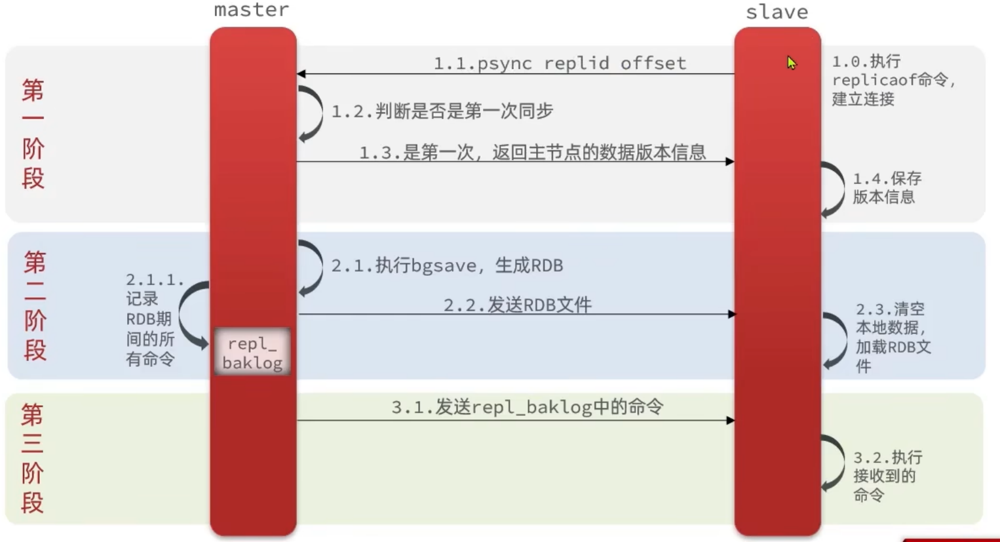

# 集群特性

①具有主从复制能力

②具有高可用能力

③具有分片特性

# redis主从复制

主从复制是 Redis 高可用服务的最基础的保证，实现方案就是将从前的一台 Redis 服务器，同步数据到多台从 Redis 服务器上，即一 主多从的模式，
可以实现读写分离和容灾恢复


### 实现方法  
主节点不用做任何修改，直接启动服务即可。从节点需要修改```redis.conf```配置文件，加入配置```slaveof <主节点ip地址> <主节点端口号>```，
并且开启daemonize yes，然后指定pid文件名字，指定端口号，修改log文件名字，修改dump.rdb文件名字。master节点负责写操作，slave节点负责读操作。
因此可以通过这种方式配置多个从节点进行读操作，主节点进行写操作，实现读写分离

> ① 切入点问题？slave1、slave2是从头开始复制还是从切入点开始复制？比如从k4进来后，那么之前的123是否也可以复制？  
> ② 从机是否可以写？set可否？  
> ③ 主机shutdown后情况如何？从机是上位还是原地待命？  
> ④ 主机又回来了后，主机新增记录，从机还能否顺利复制？  
> ⑤ 其中一台从机down掉后，依照原有它能跟上大部队吗？  
> ⑥ 中途变更转向：会清除之前的数据，重新建立拷贝最新的  
> ⑦ ```salveof no one```：使当前数据库停止与其他数据库的同步，转成主数据库  

### 主从复制过程
```
https://www.xiaolincoding.com/redis/cluster/master_slave_replication.html
```
①主从库之间建立连接、协商同步（建立连接）

> 主库收到从库的```psync```命令后，响应```	FULLRESYNC```命令（它表示第一次复制采用全量复制），并带上主库runID和主库目前的复制进度offset

②主库把数据同步到从库，从库收到数据后，完成本地加载（全量复制）

> 主库执行bgsave命令，生成RDB文件，接着将文件发给从库。从库接收到RDB文件后，会先清空当前数据库，然后加载RDB文件
>
> 主库把数据同步到从库的过程中，新来的写操作，会记录到```replication buffer```

③主库把新写的命令，发送到从库（增量复制）

> 主库完成RDB发送后，会把replication buffer中的修改操作发给从库，从库再重新执行这些操作

### 主从复制缺陷  
①主从库网路延迟。从库收到主库命令，但是它正在执行阻塞性的命令（如hgetall等）。上述两种情况会导致主从数据不一致的问题。
②**主从复制模式下对于主节点没有实现高可用，需要人工将从节点晋升为主节点，同时还要通知应用方更新主节点地址**

### 其他问题

①一主多从，全量复制时主库压力问题

让部分从库再建立主从关系

②网络断开，重连后是否还需要进行一次全量复制？

主从库完成全量复制后，它们之间会维护一个网络长连接，用于主库后续收到写命令传输到从库。网络断开后，主从库重连后，利用```repl_backlog_buffer```实现增量复制，并不需要进行一次全量复制。

# 哨兵机制
### 概述

redis具备主从复制的功能，但是当主服务器发生故障时，需要人工干预，修改每个实例的配置文件，然后重启，这样不仅费时费力，出错概率比较高，导致服务不可用。那么哨兵机制解决了这个问题，帮我们自动实现故障转移，不需要人工干预，高效、精准的实现故障转移。

### 作用

① 集群**监控**。监控主从节点是否正常工作

```
哨兵有哪些监控
① 哨兵节点每隔10秒向主节点和从节点发送info指令，获取最新的拓扑结构，更新自身保存的节点信息
② 每隔2秒哨兵节点向redis指定频道上发送哨兵节点对主节点的判断和哨兵节点自身的信息，其他哨兵节点也会订阅这个频道，来了解其他节点的信息及对主节点的判断  
③ 每隔1秒哨兵向redis节点和其他哨兵节点发送ping信息，进行心跳检测
```

②**故障转移**。如果主节点挂掉了，哨兵会负责从多个从库中按照一定规则选择一个当做主库。

③ **通知**。如果选出了新的主节点，把新主库的连接信息发给其他从库，让他们和新主库建立主从关系，并且通知client客户端新的master地址。

```
sentinel命令说明：  
① sentinel monitor mymaster 127.0.0.1 6379 1  
mymaster主节点名，可以任意起名，但必须和后面的配置保持一致  
127.0.0.1 主节点连接地址  
1 将主服务器判断为失效需要投票，这里设置至少需要1个sentinel同意  

② sentinel down-after-milliseconds mymaster 10000  
设置sentinel认为服务器已经短线所需的毫秒数  

③ sentinel failover-timeout mymaster 60000  
设置failover（故障转移）的过期时间。当failover开始后，在此时间内仍然没有触发任何failover操作，当前sentinel会认为此次failover失败  

④ sentinel parallel-syncs mymaster 1  
故障转移之后，进行新的主从复制，配置项指定了最多有多少个slave对新的master进行同步，那可以理解为1是串行复制，大于1是并行复制
```

### 工作模式

①每个哨兵以每秒钟一次的频率向它所知的主库、从库以及其他哨兵实例发送PING命令

②如果一个实例节点距离最后一次有效回复PING命令的时间超过down-after-milliseconds选项所指定的值，则这个实例会被哨兵标记为主观下线

③如果主库被标记为主观下线，则正在监视这个主库的所有哨兵要以每秒一次的频率确认主库的确进入了主观下线状态

④当有足够数量的哨兵（大于等于配置文件指定的值）在指定的时间范围内确认主库的确进入了主观下线状态，则主库会被标记为客观下线

⑤当主库被哨兵标记为客观下线时，就会进入选主模式

⑥若没有足够数量的哨兵同意主库已经进入主观下线，主库的主观下线状态就会被移除；若主库重新向哨兵的PING命令返回有效回复，主库的主观下线状态也会被移除

```
①主观下线：哨兵进程向主库、从库发送PING命令，如果没有在规定的时间内响应PING命令，哨兵就把它标记为主观下线。如果是从库，则可以标记为客观下线，不会影响集群对外提供服务。如果是主库，需要其他哨兵节点共同判断，以减少没有必要的主从切换，减少不必要的开销。
②客观下线：如果被标记主观下线的redis实例是主节点，则还需要获得其他sentinel节点的判断，如果超过一定数量的投票认为该主节点不可用，则标记该主节点为客观下线，就可以做主从切换了。
```

### 故障转移

主节点客观下线后，怎么进行故障转移。主要是两步，第一步是选举哨兵leader，第二步是由哨兵leader负责故障转移

##### 选举哨兵leader

① 当master下线后，每个哨兵都可以选择自己作为leader，向其他哨兵发送命令 
② 其他哨兵接收到请求后，可以选择同意或者不同意（根据判定基础决定）  
③ 如果最终某个哨兵节点获得了超过半数的投票，则该哨兵节点就成为了leader，负责故障转移 

##### 选举新的主节点
① 过滤与哨兵断开连接时间比较长的节点  
② 优先选择replica-priority低的  
③ 选择偏移量比较大的（表明复制的数据越多）  
④ 运行id越小

##### 执行故障转移
① sentinel leader向新主节点发送```slave no one```命令，让它成为独立节点  
② sentinel leader向其他从节点发送```slave ip port```，让它从新的主节点同步

##### client是和哨兵通信还是和redis主从通信

① client连接集群，首先会连接sentinel，然后订阅相关的频道获取主从切换、切换进度、新master地址等信息  
② 拿到redis连接地址后，则会与redis master建立连接  
③ 当sentinel执行了故障转移，选举了新的redis master之后，也会在client订阅的频道中发送最新的master redis地址  
④ client拿到最新的地址后，还是同样的建立新的redis连接

# redis-cluster

①Redis cluster采用16384个哈希槽存储所有键值对，各实例节点分别处理一部分槽

②Moved重定向发生在计算出的槽不是当前节点时


③ASK重定向发生在集群伸缩导致哈希槽迁移时


③cluster集群节点通过Gossip协议将本节点存储的信息传播出去，直到所有节点信息一致，即算法收敛了

### 故障转移

①主观下线：某个节点认为另一个节点不可用，即下线状态，这个状态并不是最终的故障判定，只能代表一个节点的意见，可能存在误判的情况。

②客观下线：指标记一个节点真正的下线，集群内多个节点都认为该节点不可用，从而达成共识的结果。如果是持有槽的主节点故障，需要为该节点进行故障转移。

③故障转移：故障发现后，如果下线的是主节点，则需要在它的从节点中选一个替换它，以保证集群的高可用。

# 集群分片

从一个节点将哈希槽移动到另一个节点并不会停止服务，所以无论添加删除或者改变某个节点的哈希槽的数量都不会造成集群不可用的状态。

### 键值映射方案

①哈希取余分区。根据```hash(key)%N ``` 得到值来决定数据映射到哪一个节点上。

②一致性哈希算法分区。目的是当服务器个数发生变动时，减少影响客户端到服务器的映射关系。

```
三大步骤实现：（未完）
①算法构建一致性哈希环
②服务器IP节点映射
③key落到服务器的落键规则
```

③哈希槽分区。Redis集群中内置了16384个哈希槽，redis 会根据节点数量大致均等的将哈希槽映射到不同的节点。当需要在Redis集群中放置一个key-valuel时，使用```CRC16(key) % 16384``` 计算key对应的哈希槽编号，也就是映射到某个节点上。

```
①cluster nodes（集群各节点信息）
②cluster keyslot k1（k1所在槽位）
③cluster countkeysinslot 槽位（槽位所在节点号）
④不在同一个slot槽位下的键值无法使用mset、mget等多键操作。可以通过{}来定义同一个组的概念，使key中{}内相同内容的键值对放到一个slot槽位去
示例：
mset k1{z} z1 k2{z} z2 k3{z} z3
mget k1{z} k2{z} k3{z}
```

# redis集群不保证强一致性

这意味着在特定条件下，redis集群可能会丢掉一些被系统接收到的写入请求命令。

# 常见问题

### SpringBoot客户端没有动态感知到RedisCluster的最新集群信息

SpringBoot2.X版本，redis默认的连接池采用Lettuce，当集群节点发生变化后，比如主从切换了等，Lettuce默认是不会刷新节点拓扑信息的。

解决方案：

①排除lettuce采用jedis（不推荐）

②添加配置刷新集群节点拓扑动态感应

```yaml
# 支持集群拓扑动态感应刷新，自适应拓扑刷新是否使用所有可用的更新，默认false关闭
spring.redis.lettuce.cluster.refresh.adaptive=true
# 定时刷新
spring.redis.lettuce.cluster.refresh.period=2000
```


