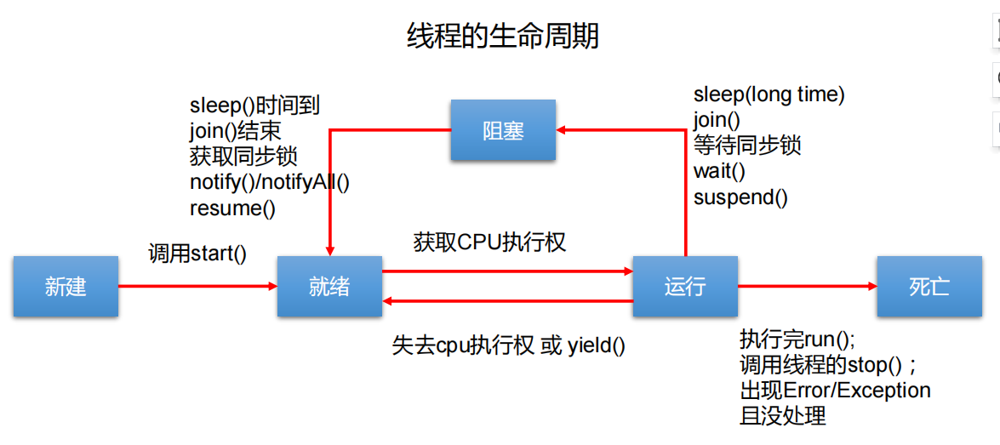

# 线程

### 线程的生命周期



### 线程通信

①使用Object中的wait()方法让线程等待，使用Object中的notify()、notifyall()方法唤醒线程（这三个方法必须在同步代码块和同步方法中使用，否则会报java.lang.IllegalMonitorStateException异常，因为这三个方法必须有锁对象调用，而任意对象都可以作为synchronized的同步锁，因此这三个方法只能在Object类中声明）。
②使用JUC包中Condition的await()方法让线程等待，使用signal()方法唤醒线程（在lock()，unlock()对里面才能正确调用condition中线程等待和唤醒的方法）。
③LockSupport类可以阻塞当前线程以及唤醒指定被阻塞的线程。

虚假唤醒：使当前线程等待，下一次被唤醒的时候继续从此处开始执行，没有再次判断是否等待。要用while代替if判断可以解决这个问题。

### 线程安全类

①String、Integer、StringBuffer、Random...

>  这里的线程安全是指多个线程调用同一实例的某个方法时，是线程安全的。多个方法的组合使用不是原子的。

②Vector、HashTable

③使用Collections修饰的线程安全集合，原理是重写方法，并加synchronized锁

④JUC下的类之Blocking

Blocking大部分实现基于锁，并提供用来阻塞的方法

⑤JUC下的类之CopyOnWrite

CopyOnWrite之类容器采用修改时拷贝的方式，开销相对较重。

>  比如：使用```CopyOnWriteArrayList```代替```ArrayList```
>
>  使用```CopyOnWriteArraySet```代替```HashSet```

⑥JUC下的类之Concurrent

内部很多操作使用cas优化，可以提供较高吞吐量。

### 中断机制

| 方法名称            | 说明                                       |
| --------------- | ---------------------------------------- |
| interrupt()     | interrupt()仅仅是设置线程的中断状态为true，发起一个协商而不会立刻停止线程 |
| isInterrupted() | 通过检查中断标志位，判断当前线程是否被中断                    |
| interrupted()   | Thread.interrupted()；判断线程是否被中断并清除当前中断状态（返回当前线程的中断状态，并将当前线程的中断状态清零并重新设为false） |

当对一个线程调用interrupt()时：

1 如果线程处于正常活动状态，那么将该线程的中断标志设置为true，仅此而已。被设置中断标志的线程将继续正常运行，不受影响。所以，interrupt()并不能真正的中断线程，需要被调用的线程自己进行配合才行

2 如果线程处于被阻塞状态（例如处于sleep、wait、join等状态），在别的线程中调用当前线程对象的interrupt方法，那么线程将立即退出阻塞状态，并抛出一个InterruptedException异常，需要重置打断标记为true

中断只是一种协商机制，修改中断标识位仅此而已，不是立刻stop打断；

```java
Thread monitorThread = new Thread(() -> {
            while (true) {
                Thread current = Thread.currentThread();
                // 是否被打断
                if (current.isInterrupted()) {
                    log.debug("停止线程前的操作");
                    break;
                }
                try {
                    Thread.sleep(1000);
                } catch (InterruptedException e) {
                    // 因为sleep出现异常后，会清除打断标记，所以需要重置打断标记
                    // 该方法的打断标记设置为true
                    current.interrupt();
                }
            }
});

Thread t = new Thread(() -> {
            log.debug("park...");
            LockSupport.park();
            log.debug("unPark...");
            log.debug("打断状态：{}", Thread.currentThread().isInterrupted()); // true

  // 返回打断标记为true，并且重置打断标记为false，这样后续的park()才会生效，否则阻塞失败
            Thread.interrupted(); 
            LockSupport.park();
});
```

# 悲观锁

synchronized关键字和Lock的实现类都是悲观锁。适合写操作多的场景，先加锁可以保证写操作时数据正确。

### synchronized

JVM中的同步是基于进入和退出监视器对象（Monitor、锁、管程对象）来实现的，每个对象实例都会有一个Monitor对象，并且Monitor对象和Java对象一同创建并销毁，它的底层是由C++语言实现的。

从字节码角度理解synchronized的原理

① 高并发时，同步调用应该去考量锁的性能损耗，能用无所结构，就不要用锁；能用锁区块，就不要锁整个方法体；能用对象锁，就不要用类锁
② 对于普通同步方法，锁的是当前实例对象本身；对于静态同步方法，锁的是当前类的Class对象；对于同步方法块，锁的是synchronized括号内的对象
③ 如果锁的是当前对象this，被锁定后，其他线程都不能进入到当前对象的其他synchronized方法，类对象锁也是如此，但是这两者不冲突
④ ACC_STATIC,ACC_SYNCHRONIZED访问标志被用来区分该方法是否是静态同步方法
⑤ 调用指令将会检查方法的ACC_SYNCHRONIZED访问标志是否被设置，如果设置了，执行线程将先持有monitor锁，然后再执行方法，最后方法完成时（无论时正常完成还是非正常完成）释放锁

可重入

1 每个锁对象拥有一个锁计数器和一个指向持有该锁的线程的指针
2 当执行```monitorenter```时，如果目标锁对象的计数器为零，那么说明它没有被其他线程所持有，Java虚拟机会将该锁对象的持有线程设置为当前线程，并且将计数器加1
3 在目标锁对象的计数器不为零的情况下，如果锁对象的持有线程是当前线程，那么Java虚拟机可以将其计数器加1，否则需要等待，直至持有线程释放该锁
4 当执行```monitorexit```时，Java虚拟机则需将锁对象的计数器减1，计数器为零代表锁已被释放

### Lock

相比synchronized，它具备如下特点：

①可以设置超时时间

②可以设置为公平锁

③支持多个条件变量

### 互斥

使用synchronized或Lock达到共享资源互斥效果，保证指令执行时的原子性

### 同步

使用wait/notify或Lock的条件变量来达到线程间通信效果

# JMM

JMM规定的是一个规范，通过规范定义了程序中各个变量的访问方式。

### 特性

①原子性：保证指令不会受到线程上下文切换的影响。Monitor相关实现主要关注的是访问共享变量时，保证临界区代码的原子性。

②可见性：保证指令不会受到CPU缓存的影响。volatile关键字保证了线程不再从工作内存获取值，而是从主存中获取值，因此其他线程对主存中值的修改，工作线程能得到结果。即线程操作volatile变量都是直接操作主存。

③有序性：保证指令不会受CPU指令并行优化的影响。

### volatile原理

不保证原子性：volatile变量不适合参与到依赖当前值的运算，比如i++操作等。内存屏障JVM在把字节码生成机器码的时候，发现操作的是volatile变量的话，会按照JMM的规范，在相应位置插入内存屏障。所谓的内存屏障是一种指令屏障，使得CPU或编译器对屏障指令的 前和后进行重排序，也叫内存栅栏或栅栏指令

### volatile如何保证可见性

①在读指令之前插入读屏障，保证在该屏障之后，对共享变量的读取，加载的是主存中最新数据。

②在写指令之后插入写屏障，保证在该屏障之前对共享变量的改动，都同步到主存当中。

### volatile如何保证有序性

①写屏障会确保指令重排序时，不会将写屏障之前的代码排在写屏障之后。

②读屏障会确保指令重排序时，不会将读屏障之后的代码排在读屏障之后。

内存屏障指令总结：
① volatile写之前的操作，都禁止重排序到volatile之后
② volatile读之后的操作，都禁止重排序到volatile之前
③ volatile写之后volatile读，禁止指令重排序

# 无锁并发

### CAS

结合CAS和volatile可以实现无锁并发，适合用于线程数少、多核CPU的场景下。

执行CAS操作的时候，将**内存位置的值（实际值）**与**预期值**进行比较，如果匹配，那么处理器将会自动将该位置的值更新为**新值**。如果不匹配，那么处理器不做任何操作。注意，多个线程同时执行CAS操作只有一个会成功，其他线程在重试的这种行为称为**自旋** 。

缺点

1 如果CAS失败，会一直进行尝试，一直不成功的话会给CPU带来很大的开销。
2 通过增加版本号解决存在的ABA问题。具体应用就是可以用```AutomicStampedReference```代替```AutomicInteger```解决ABA问题。

### 原子类

```AtomicStampedReference``` 给原子引用加上版本号，追踪原子引用整个的变化过程。

```AtomicMarkableReference``` 并不关心引用变量更改了几次，只是单纯的关心是否更改过。

### 原子数组

### 字段更新器

### 原子累加器

LongAdder比AtomicLong性能更好。LongAdder在累加时操作不同的变量，因此减少了CAS重试失败，从而提高了性能。

> LongAdder原理讲解：https://www.bilibili.com/video/BV16J411h7Rd?spm_id_from=333.788.videopod.episodes&vd_source=c196da6813319b1445f97da18efd9d27&p=177

### Unsafe

### 享元模式

①包装类

②String串池

③BigDecimal、BigInteger

④连接池

# AQS

### 特点

①用state属性来表示资源的状态（分独占模式和共享模式），子类需要定义如何维护这个状态，控制如何获取锁和释放锁

getState 获取state状态

setState 设置state状态

compareAndSetState cas机制设置state状态

独占模式是只有一个线程能够访问资源，而共享模式可以允许多个线程访问资源

②提供了基于FIFO的等待队列，类似于Monitor的EntryList

③条件变量来实现等待、唤醒机制，支持多个条件变量，类似于Monitor的WaitSet

AQS使用一个volatile修饰的int类型的成员变量来表示同步状态，通过内置的FIFO队列来完成资源获取的排队工作，将每条要去抢占资源的线程封装成一个Node节点来实现锁的分配，通过CAS完成对State值的修改。通过CAS、自旋以及LockSupport.park()的方式，维护state变量的状态，使并发达到同步的控制效果。

### 非公平锁和公平锁
对比公平锁和非公平锁的tryAcquire()方法的实现代码，其实差别就在于非公平锁获取锁时比公平锁中少了一个判断```!hasQueuedPredecessors()```
该方法中判断了是否需要排队，导致公平锁和非公平锁的差异如下：
公平锁：公平锁讲究先来先到，线程在获取锁时，如果这个锁的等待队列中已经有线程在等待，那么当前线程就会进入等待队列中；
非公平锁：不管是否有等待队列，如果可以获取锁，则立刻占用锁对象，也就是说队列的第一个排队线程在```unpark()```之后还是需要竞争锁（存在线程竞争的情况下）

# 读写锁

读写锁的使用场景是一个共享资源被大量读取操作，而只有少量的写操作。

### ReentrantReadWriteLock

①读读可以并发，读写不能并发

②ReentrantReadWriteLock描述的是一个资源能够被多个读线程访问，或被一个写线程访问，但是不能同时存在读写线程

③同一个线程可以拥有writeLock与readLock，但必须先获取 writeLock 再获取 readLock, 反过来进行获取会导致死锁。

### StampedLock

为了进一步优化读性能，在加读锁之前验戳，如果戳一致，不必加锁直接直接读取数据，否则需要重新获取读锁，保证数据安全。不支持条件变量，不支持可重入。

```java
public int read(int readTime) {
  long stamp = lock.tryOptimisticRead();
  // 读数据
  ...
  // 验戳
  if (lock.validate(stamp)) {
    // 验戳成功
    return data;
  }
  // 验戳失败，加读锁读取数据
  ...
}
```

# 常用工具类

### CountDownLatch

CountDownLatch可以实现类似计数器的功能，计数器的初始值为指定的线程的数量，每当一个线程完成了自己的任务，计数器的值就会减1，当计数器的值达到了0时，它表示所有的线程都完成了任务，然后在闭锁上等待的线程就可以恢复执行任务。构造器上的计数值实际上就是闭锁需要等待的线程数量，这个值只能被设置一次，而且CountDownLatch没有提供任何机制去重新设置这个值。

可以用来等待多个远程调用结束。可以用来等待多线程准备完毕。

```java
public CountDownLatch(int count);   // 指定计数的线程
public void await();                // 让当前线程等待
public vod countDown();             // 减少需要等待的线程数量
```

### CyclicBarrier

让一组线程到达一个屏障（也可以叫同步点）时被阻塞，直到最后一个线程到达屏障时，屏障才会开门，所有被 屏障拦截的线程才会继续下面的业务

```java
public CyclicBarrier(int parties, Runnable barrierAction);
// 参数1:parties表示这组线程的数量;
// 参数2:barrierAction 表示一组线程都到达之后需要执行的任务;
    
public int await();             // 让当前线程阻塞   
```

### Semaphore

适合单机控制限流。信号量用来限制能同时访问共享资源的```线程上限```。限制线程数，而不是资源数。

```java
public Semaphore(int permits);  // 参数permits称为许可证，即最大的线程并发数量
public void acquire();          // 表示获取许可证
public void release();          // 表示释放许可证
```

### Exchanger

Exchanger是用于线程间协作的工具类，用于线程间的数据交换，它提供一个同步点，在这个同步点两个线程可以交换彼此的数据。
这两个线程通过exchange方法交换数据， 如果第一个线程先执行exchange方法，它会一直等待第二个线程也执行exchange，当两个线程都到达同步点时，
这两个线程就可以交换数据，将本线程生产出来的数据传递给对方

### ConcurrentHashMap

##### 原理

