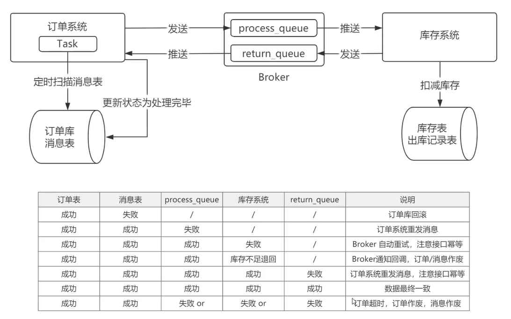

# CAP理论
①Consistency（一致性）：数据一致被更新，所有数据的变动都是同步的；  
②Availability（可用性）：系统整体是否可用；  
③Partition tolerance（分区容错性）：一个节点挂掉不影响另外一个节点对外提供服务。
> 分区容错性是分布式系统具备的基本能力

①AP：这是很多分布式系统的选择。保证最终一致性即可；  
②CP：zookeeper追求的就是强一致性；  
③CA：典型实现是关系型数据库。  

# BASE理论
①Basically Available（基本可用）：分布式系统出现故障时，允许损失部分可用功能，保证核心功能可用；  
②Soft state（软状态）：允许系统中存在中间状态，这个状态不影响系统可用性；  
③Eventually consistent（最终一致性）：经过一段时间后，系统中所有节点数据都将会达到一致。
> BASE理论是对AP的扩展，通过牺牲强一致性来获得可用性，当出现故障允许部分不可用但要保证核心功能可用，
> 允许数据在一段时间内是不一致的，但最终达到一致状态。  

# 分布式事务解决方案
## 2PC
整个事务过程由```事务管理器```和```参与者```组成，事务管理器负责决策整个分布式事务的提交和回滚，事务参与者负责自己本地事务的提交和回滚  
① 准备阶段：事务管理器给每个参与者发送 Prepare 消息，每个数据库参与者在本地执行事务，并写本地的日志，此时事务没有提交。
```
Undo 日志是记录修改前的数据，用于数据库回滚，
Redo 日志是记录修改后的数据，用于提交事务后写入数据文件）  
```

② 提交阶段：如果事务管理器收到了参与者的执行失败，或者协调者节点在第一阶段的询问超时之前无法获取所有参与者节点的响应消息时，
直接给每个参与者发送回滚（Rollback）消息；否则，发送提交（Commit）消息。  
参与者根据事务管理器的指令执行提交或者回滚操作，并释放事务处理过程中使用的锁资源。注意：必须在最后阶段释放锁资源

③ 优缺点  
尽量保证了数据的强一致性，适合对数据强一致性要求很高的场景。
① 需要本地数据库支持XA协议。参与节点都是事务阻塞型的，资源锁需要等到两个阶段结束才释放，性能较差  
② 参与者发生故障，协调者需要给每个参与者额外指定超时机制，超时后整个事务失败。协调者发生故障，参与者会一直阻塞下去，需要额外的备机进行容错  
③ 二阶段协调者在发出commit消息之后宕机，而接收消息的参与者同时也宕机了，那么即使通过选举协议产生了新的协调者，这条事务的状态也是不确定的，没人知道事务是否已经被提交

## 3PC
3PC把2PC的准备阶段分成事务询问（该阶段不会阻塞）和事务预提交,则三个阶段分别为 CanCommit、PreCommit、DoCommit

## 本地消息表


## 可靠消息

## 最大努力通知

# 最佳实践
① AT模式需要资源管理器(mysql, redis)支持XA协议，且整个事务的执行期间需要锁住事务资源，会降低性能。故先排除；  
② TCC的模式，需要事务接口提供try,confirm,cancel三个接口，提高了编程的复杂性。需要依赖于业务方来配合提供这样的接口。推行难度大，暂时排除；  
③ 最大努力通知型，应用于异构或者服务平台当中；  
④ 可以看到ebay的经典模式中，分布式的事务，是通过本地事务+可靠消息，来达到事务的最终一致性的。但是出现了事务消息，就把本地事务的工作给涵盖在事务消息当中了