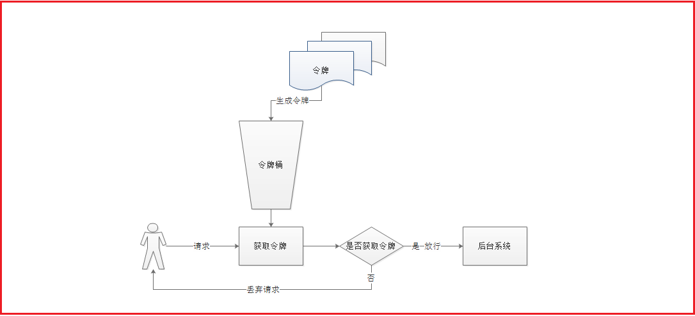

# 路由核心概念(Route)
### Predicate
这是一个 Java8函数式断言。允许开发人员匹配来自HTTP请求的任何内容，例如请

求头或参数。[断言工厂的配置方式](https://cloud.spring.io/spring-cloud-static/spring-cloud-gateway/2.1.0.RELEASE/single/spring-cloud-gateway.html)

① -Host：断言用户请求的域名

② -Path：断言用户请求的路径

### Filter
可以在发送下游请求之前或之后修改请求和响应。[过滤器工厂的配置方式](https://cloud.spring.io/spring-cloud-static/spring-cloud-gateway/2.1.0.RELEASE/single/spring-cloud-gateway.html)

① -PrefixPath：可以给用户请求路径加统一前缀

② -StripPrefix：将请求路径中过滤掉

##### 自定义过滤器

①GateWayFilter：路由过滤器，作用于任意指定的路由，默认不生效，要配置到路由后生效

②GlobalFilter：全局过滤器，作用范围是所有路由，声明后自动生效

### 路由规则

请求到达网关后，先经过断言Predicate判断，是否符合某个路由规则，如果符合，

则按路由规则路由到指定地址。请求和响应都可以通过过滤器filter进行过滤。

> Spring Cloud Gateway创建Route对象时， 使用RoutePredicateFactory创建Predicate对象，Predicate对象可以赋值给Route。
> 其中路由断言工厂```RoutePredicateFactory```包含许多实现类，包括DateTime、请求的远端地址、路由权重、请求头、Host 地址、请求方法、请求路径和请求参数等类型的路由断言。
>
> 路由地址有三种配置方式：
>
> ① webSocket配置方式；
> ② http地址配置方式；
> ③ 注册中心配置方式

### 客户端负载均衡

使用```LoadBalancerClientFilter```来实现负载均衡调用，它会作用在url以lb开头的路由中，然后利用```loadBalancer```来获取服务实例，构造目标```requestUrl```
# 网关限流
常见的限流算法有：计数器算法，漏桶（Leaky Bucket）算法，令牌桶（Token Bucket）算法  
```Spring Cloud GateWay```官方提供了```RequestRateLimiterGatewayFilterFactory```过滤器工厂，使用redis和lua脚本实现了令牌桶的方式

### 使用令牌桶进行请求次数限流
> ① 所有的请求在处理之前都需要拿到一个可用的令牌才会被处理  
> ② 根据限流大小，设置按一定的速率往桶里添加令牌  
> ③ 桶设置最大的放置令牌限制，当桶满时，新添加的令牌就被丢弃或者拒绝  
> ④ 请求到达之后首先要获取令牌桶中的令牌，拿着令牌才可以进行其他的业务逻辑，处理完业务逻辑之后，将令牌直接删除  
> ⑤ 令牌桶有最低限额，当桶中的令牌达到最低限额的时候，请求处理完之后将不会删除令牌，以此保证足够的限流



### 具体做法
SpringCloudGateway 默认使用redis的```RateLimter```限流算法来实现  
1 KeyResolver用于计算某一个类型的限流的KEY也就是说，可以通过KeyResolver来指定限流的Key。根据IP来限流，比如每个IP每秒钟只能请求一次，
在GatewayWebApplication定义key的获取，获取客户端IP，将IP作为key
```
// 根据IP进行限流
@Bean(name="ipKeyResolver")
public KeyResolver userKeyResolver() {
    return new KeyResolver() {
        @Override
        public Mono<String> resolve(ServerWebExchange exchange) {
            //获取远程客户端IP
            String hostName = exchange.getRequest().getRemoteAddress().getAddress().getHostAddress();
            System.out.println("hostName:"+hostName);
            return Mono.just(hostName);
        }
    };
}
```

2 指定限制流量的配置以及REDIS的配置
```yaml
-name: RequestRateLimiter # 根据请求数进行限流，名字不能随便写，使用默认的factory
args: 
  key-resolver: "#{@ipKeyResolver}"
  redis-rate-limiter.replenishRate: 1     # 您希望允许用户每秒执行多少请求，而不会丢弃任何请求。这是令牌桶填充的速率
  redis-rate-limiter.burstCapacity: 1     # 指令牌桶的容量，允许在一秒钟内完成的最大请求数,将此值设置为零将阻止所有请求
```

# 动态路由

gateway的核心逻辑是路由转发和执行过滤器链。要实现动态路由首先要将路由配置保存到Nacos，当Nacos中的路由配置变更时，推送最新配置到网关，实时更新网关中的路由信息。

因此，实现动态路由需要做下面两件事：

①监听Nacos中配置变更的消息

```java
public void initRouteConfigListener() throws NacosException {
  // 1、注册监听器并首次拉取配置
  String configInfo = nacosConfigManager.getConfigService()
    .getConfigAndSignListener(dataId, group, 5000, new Listener() {
      @Override
      public Executor getExecutor() {
        return null;
      }
      
      @Override
      public void receiveConfigInfo(String configInfo) {
        // TODO 监听到配置变更，更新一次配置
      }
    });
  
  // TODO 首次启动时，更新一次配置
}
```


②当配置变更时，将最新的路由信息更新到网关路由表。监听到路由信息后，可以利用```RouteDefinitionWriter```来更新路由表

```java
public interface RouteDefinitionWriter() {
  // 更新路由到路由表，如果路由id重复，则会覆盖旧的路由
  Mono<Void> save(Mono<RouteDefinition> route);
  
  // 根据路由id删除某个路由
  Mono<Void> delete(Mono<String> routeId);
}
```

# 其他

注意：nginx转发后，会丢失host头，造成网关不知道原host。在进行网关匹配的时候需要将头信息添加上。（网关匹配是优先匹配）
```
  location / {
        proxy_pass https://baidu.com;
        proxy_set_header Host $host;
    }
```
