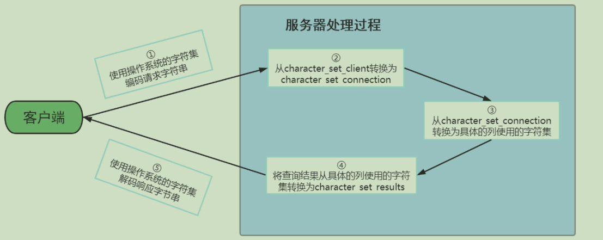

# 各级别的字符集

① character_set_server：服务器级别的字符集
```
[server]  
character_set_server=gbk # 默认字符集  
collation_server=gbk_chinese_ci #对应的默认的比较规则
```
② character_set_database：当前数据库的字符集  
③ character_set_client：服务器解码请求时使用的字符集  
④ character_set_connection：服务器处理请求时会把请求字符串从character_set_client转为  
⑤ character_set_connection character_set_results：服务器向客户端返回数据时使用的字符集

# 常用命令
```sql
# 查看默认使用得字符集
show variables like 'character%';
# mysql5.7或之前版本，可以通过character_set_server=utf8设置修改字符集。mysql8默认字符集是utf-8

# 查看SQL大小写区分设置
show variables like '%lower_case_table_names%';

# 查看sql检查的方式
show variables like '%sql_mode%';

# 查看数据库文件的存放路径
show variables like '%datadir%';

# on代表使用独立表空间
show variables like 'innodb_file_per_table';

# 在Mysql8中，到存储ibd文件的目录下，执行以下命令可以查看表结构
ibd2sdi --dump-file=student.txt student.ibd;
```