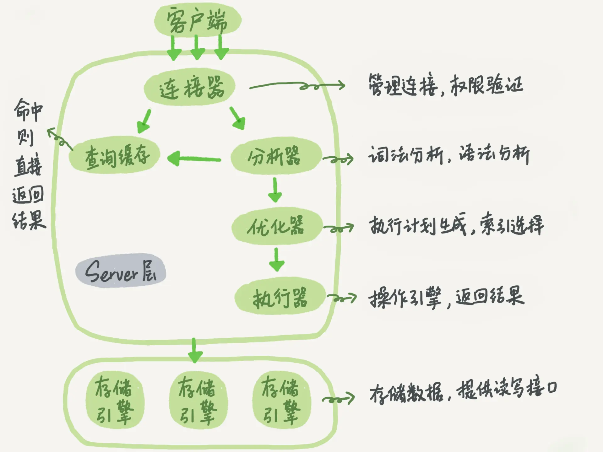
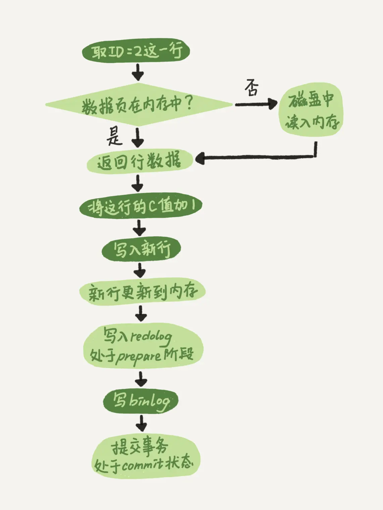
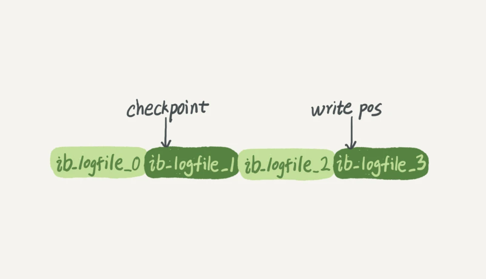
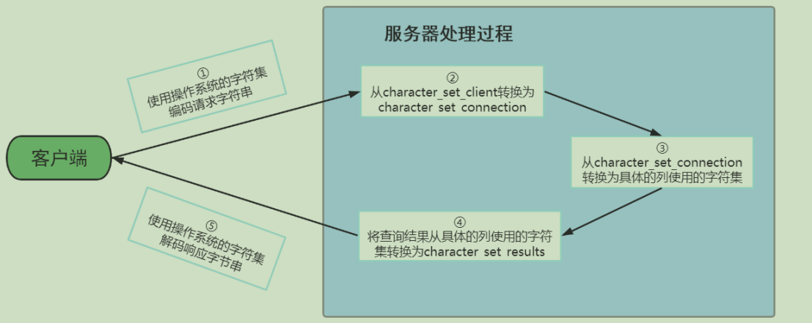

# 架构示意图


## 各个组件的作用
### 连接层（第一层）
连接器的职责是负责认证、获取权限信息（授权）、维持和管理连接  
① 用户名密码认证通过，连接器会到权限表里查出你拥有的权限。之后，这个连接里面的权限判断逻辑，都将依赖于此时读到的权限。  
② 数据库里面长连接是指连接成功后，如果客户端持续有请求，则一直使用同一个连接。短连接则是指每次执行完很少的几次查询就断开连接，下次查询再重新建立一个。  
尽量使用长连接。但是全部使用长连接后，因为在执行过程中，临时使用的内存是管理在连接对象里面的。这些资源在连接断开的时候才释放，所以如果长连接累积下来，可能导致内存占用太大，被系统强行抹杀掉（OOM），从现象看就是MySQL异常重启了。  
```
长连接存在问题，需要处理：  
① 定期断开长连接。使用一段时间，或者程序里面判断执行过一个占用内存的大查询后，断开连接，之后要查询再重连。  
② 如果你用的是MySQL 5.7或更新版本，可以在每次执行一个比较大的操作后，通过执行mysql_reset_connection来重新初始化连接资源。这个过程不需要重连和重新做权限验证，
但是会将连接恢复到刚刚创建完时的状态
```

### 服务层（第二层）
##### 查询缓存
之前执行过的语句及结果会以key-value对的形式，被直接缓存在内存中。不建议使用查询缓存，对于更新压力大的数据表来说，命中率非常低。8.0版本直接将查询缓存的整块功能删掉了。
MySQL提供的“按需使用”的方式，将参数query_cache_type设置成DEMAND，对于默认的SQL语句都不使用查询缓存，而对于确定使用查询缓存的语句，可以用SQL_CACHE显示指定。查询缓存可以在不同客户端之间共享  
```select SQL_CACHE * from T where ID=10```

##### 分析器
在分析器中对SQL语句进行语法分析、语义分析，并为其创建语法树  
先做“语法分析”，识别出SQL语句里面的字符串分别代表什么  
再做“语义分析”，判断你输入的SQL语句是否满足MySQL语法

##### 查询优化器(Optimizer)
在语法分析之后，查询数据执行之前，会用查询优化器确定SQL语句的执行路径，生成一个执行计划。在这个执行计划里面，决定使用哪些索引进行查询，在多表关联的时候，决定各表的关联顺序。  

##### 执行器
根据这个执行计划调用存储引擎提供的接口来真正执行查询，开始执行的时候，判断当前连接是否有对这个表的查询权限。如果没用，则返回没用权限的错误。  
```ERROR 1142 (42000): SELECT command denied to user 'b'@'localhost' for table 'T'```
在慢查询日志中，rows_examined字段表示这个语句执行过程中扫描了多少行，是执行器每次调用引擎获取数据行的时候累加的。  
注意：在有些场景下，执行器调用一次，在引擎内部则扫描了多行，因此引擎扫描行数跟rows_examined并不是完全相同的。

### 存储引擎层（第三层）
插件式存储引擎将查询处理和其他的系统任务（数据的存储提取）相分离。存储引擎真正负责了MySQL中数据的存储和提取。

### 存储层
最终存储在文件系统上，以文件的方式存在，并完成与存储引擎的交互。

# 更新语句执行流程
【图解】  

【说明】  
浅色框表示是在InnoDB内部执行的，深色框表示是在执行器中执行的。  
【执行流程】  
① 执行器先找引擎取ID=2这一行。ID是主键，引擎直接用树搜索找到这一行。如果ID=2这一行所在的数据页本来就在内存中，就直接返回给执行器；否则，需要先从磁盘读入内存，然后再返回。  
② 执行器拿到引擎给的行数据，把这个值加上1，比如原来是N，现在就是N+1，得到新的一行数据，再调用引擎接口写入这行新数据。  
③ 引擎将这行新数据更新到内存中，同时将这个更新操作记录到redo log里面，此时redo log处于prepare状态。然后告知执行器执行完成了，随时可以提交事务。  
④ 执行器生成这个操作的binlog，并把binlog写入磁盘。  
⑤ 执行器调用引擎的提交事务接口，引擎把刚刚写入的redo log改成提交（commit）状态，更新完成  

【其他相关概念】  
① 预写入日志：关键点是先写日志，再写磁盘  
② crash-safe：使用redo log实现

### 两阶段提交
目的是为了让redo log合binlog这两份日志之间的逻辑一致  

① 跨系统维持数据逻辑一致性时的常用方案；  
② 两阶段提交可以保证数据库的状态和用它的日志（binlog）恢复出来的库的状态一致。完整redo log能保证异常重启后数据是更新后的状态；  
③ 正确的两阶段提交除了能保证恢复临时库时的准确性，还能避免主从数据库不一致的情况；  

**反证两阶段提交的必要性：**  
① 先写redo log后写binlog  
系统崩溃恢复后，由于redo log写完，所以仍然能把数据恢复回来。在备份数据库时，由于存起来的binlog里没有这条语句，所以用这个binlog恢复临时库时，临时库会少一次更新，
恢复出来的值与原库值不同  

② 先写binlog后写redo log  
崩溃恢复以后，由于redo log还没写完，所以这个事务无效，此次更新未完成。在数据库备份时，由于binlog里面多了一个事务出来，所以备份出的数据多了一部分未提交的更新，导致原库值不同

> 【参数设置】  
> ① 参数innodb_flush_log_at_trx_commit设置成1，表示每次事务的redo log都能直接持久化到磁盘，可以保证MySQL异常重启之后数据不丢失。  
> ② 参数sync_binlog设置成1，表示每次事务的binlog都能持久化到磁盘，可以保证MySQL异常重启之后binlog不丢失

### redo log和binlog
从整体上看，MySQL就两层。Server层做的是功能层面的事情；引擎层负责存储相关的具体事宜。  
redo log是InnoDB引擎特有的日志，而Server层也有自己的日志，称为binlog（归档日志，即binlog日志只能用于归档）。  
【不同点】
1、redo log是InnoDB引擎特有的。binlog是MySQL的Server层实现的，所有引擎都可以使用。  
2、redo log是物理日志，记录的是“在某个数据页上做了什么修改”；binlog是逻辑日志，记录的是这个语句的原始逻辑，比如“给ID=2这一行的c字段加1”。  
3、redo log是循环写的，空间固定会用完；binlog是可以追加写入的。“追加写”是指binlog文件写到一定大小后会切换到下一个，并不会覆盖以前的日志。

##### redo log

write pos是当前记录的位置，一边写一边后移，写到第3号文件末尾后就回到0号文件开头。  
checkpoint是当前要擦除的位置，也是往后推移并且循环的，擦除记录前要把记录更新到数据文件。
总结：  
redoLog可以保证即使数据库发生异常重启，之前提交的记录都不会丢失，这个能力称为crash-safe。write pos和checkpoint之间空着的部分可以用来记录新的操作。如果write pos追上
checkpoint，这时候不能再执行新的更新，得停下来擦掉一些记录，把checkpoint推进一下。
InnoDB通过redo log可以保证即使数据库发生异常重启，之前提交的记录都不会丢失。这个能力称为crash-safe。

# SQL语句执行顺序


# 各级别的字符集

① character_set_server：服务器级别的字符集
```
[server]  
character_set_server=gbk # 默认字符集  
collation_server=gbk_chinese_ci #对应的默认的比较规则
```
② character_set_database：当前数据库的字符集  
③ character_set_client：服务器解码请求时使用的字符集  
④ character_set_connection：服务器处理请求时会把请求字符串从character_set_client转为  
⑤ character_set_connection character_set_results：服务器向客户端返回数据时使用的字符集

# 两种存储引擎的比较
①myisam  
优势是访问速度快，对事务完整性没有要求或者以select、insert为主的应用可以选用myisam，问题是崩溃后无法安全恢复，且不支持事务、行级锁、外键。  
针对数据统计有额外的常数存储，故而count(*)的查询效率很高  
只缓存索引，不缓存真实数据

②innodb  
缓存索引和真实数据，对内存要求较高，而且内存大小对性能有决定性的影响

myisam的索引方式都是非聚簇的，索引文件仅仅保存的是数据记录的地址。  
innodb包含一个聚簇索引  
① 在InnoDB存储引擎中，我们只需要根据主键值对 聚簇索引 进行一次查找就能找到对应的记录，而在MyISAM 中却需要进行一次 回表 操作，意味着MyISAM中建立的索引相当于全部都是 二级索引。
② InnoDB的数据文件本身就是索引文件，而MyISAM索引文件和数据文件是 分离的 ，索引文件仅保存数据记录的地址。
③ InnoDB的非聚簇索引data域存储相应记录 主键的值 ，而MyISAM索引记录的是 地址 。换句话说， InnoDB的所有非聚簇索引都引用主键作为data域。
④ MyISAM的回表操作是十分 快速 的，因为是拿着地址偏移量直接到文件中取数据的，反观InnoDB是通过获取主键之后再去聚簇索引里找记录，虽然说也不慢，但还是比不上直接用地址去访问。
⑤ InnoDB要求表 必须有主键 （ MyISAM可以没有 ）。如果没有显式指定，则MySQL系统会自动选择一个可以非空且唯一标识数据记录的列作为主键。如果不存在这种列，
则MySQL自动为InnoDB表生成一个隐含字段作为主键，这个字段长度为6个字节，类型为长整型。

# 常见模型比较
## 2.1 哈希表
哈希表是一种以键-值（key-value）存储数据的结构。存在hash冲突问题。  
实现过程：把值放在数组里，用一个哈希函数把key换算成一个确定的位置，然后把value放在数组的这个位置。hash冲突时拉出一个链表。  
哈希表这种结构适用于只有等值查询的场景。因为元素不是有序的，所以做区间查询时必须全部扫描一遍。

## 2.2 有序数组
有序数组这种结构在等值查询和范围查询场景中的性能都非常优秀。缺陷是在需要更新数据时，往中间插入一个记录必须得挪动后面所有的记录，成本太高。  
有序数组只适用于静态存储引擎。

## 2.3 二叉树
会退化成链表

## 2.4 红黑树
无法满足大数量的存储，高度太高

## 2.5 B树、B+树
B树特点：  
① 叶子节点具有相同的深度，叶子节点的指针为空  
② 所有索引元素不重复  
③ 节点中的数据索引从左到右递增排列  
B+树特点：  
① 非叶子节点不存储data，只存储索引（冗余），可以放更多的索引  
② 叶子节点包含所有索引字段  
③ 叶子节点用指针连接，提高区间访问的性能

> mysql索引结构模型解读：  
> 为了让查询尽量少地读磁盘，就必须让查询过程访问尽量少的数据块。所以应该使用“N叉”树。  
> 在InnoDB中，表都是根据主键顺序以索引的形式存放的，这种存储方式的表称为索引组织表。InnoDB使用了B+树索引模型，所以数据都是存储在B+树中的。每一个索引在InnoDB里面对应一颗B+树。  
> 1、InnoDB索引模型
> ①根据叶子节点的内容，索引类型分为主键索引和非主键索引。
> ②主键索引的叶子节点存的是整行数据，在InnoDB里，主键索引也被称为聚簇索引。非主键索引的叶子节点内容是主键的值，在InnoDB里，非主键索引也被称为二级索引。
> 两者比较：基于非主键索引的查询需要多扫描一颗索引树。到主键索引树搜索的这个过程称为回表。
>
> 2、索引维护过程
> 如果所在数据页已经满了，根据B+树的算法，需要申请一个新的数据页，然后挪动部分数据过去，这个过程称为页分裂。当相邻两个页由于删除数据，利用率很低之后，会将数据页做合并。合并的过程，可以
> 认为是分裂过程的逆过程。
>
> 3、自增主键
> ① 自增主键是指自增列上定义的主键（写法：not null primary key auto_increment），插入新记录的时候，可以不用指定ID的值，系统会获取当前ID的最大值作为下一条记录的ID值。
> 自增主键的插入数据模式，即是追加操作，都不涉及挪动其他记录，也不会触发叶子节点的分裂。而用业务逻辑字段做主键，往往不容易保证有序插入，写数据成本相对较高。
> ② 主键长度越小，普通索引的叶子节点就越小，普通索引占用的空间就越小。所以身份证号（占用约18个字节）和自增字段比较时，还是选择自增字段（整型占4个字节，长整型占8个字节）做主键合适。
> 所以，从性能和存储空间方面考量，自增主键往往是更合理的选择。

## 2.6 跳表

## 2.7 LSM树

## 2.8 倒排索引