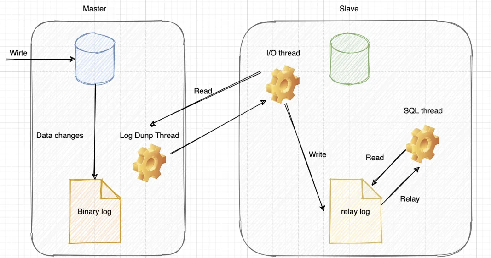

# 主从复制应用场景
① 读写分离：从库提供查询，减少主库压力，提升性能  
② 高可用：故障时可切换从库，保证服务高可用  
③ 数据备份：数据备份到从库，防止服务器宕机导致数据丢失

# 主从复制原理
主从复制就是将binlog中的数据从主库传输到从库上，一般这个过程是异步的，即主库上的操作不会等待binlog同步完成  

① 主库写binlog：主库对所有DDL和DML产生binlog，binlog是顺序写，所以效率很高  
② 主库发送binlog：主库创建一个log dump线程来发送binlog给从库  
③ 从库写relay log：从库在连接到主节点时会创建Slave_IO_Running线程会到主库取日志，以请求主库更新的binlog，
并且把接收到的binlog信息写入一个叫做relay log的日志文件  
④ 从库回放：Slave的Slave_SQL_Running线程将主库的DDL和DML操作都在Slave实施，DML和DDL的IO操作是随机的，不是顺序的，因此成本会很高，
还可能是 Slave 上的其他查询产生 lock 争用，由于 Slave_SQL_Running 也是单线程的，所以一个 DDL 卡住了，需要执行 10 分钟，
那么所有之后的 DDL 会等待这个 DDL 执行完才会继续执行，这就导致了延时。

> 主从延迟主要出现在"从库回放"这一步，当主库的TPS并发较高，产生的DDL数量超过超过从库一个sql线程所能承受的范围，那么延时就产生了，
> 当然还有就是可能与从库的大型查询语句产生了锁等待

# 保证主从一致
### 保证主从数据一致
① statement格式的binlog日志记录的是SQL原文  
② row格式的binlog日志记录的就是要删除的主键id信息，因此不会出现主从不一致的问题  
③ mixed格式的binlog其实是row和statement格式混合使用，当MySQL判断可能数据不一致时，就用row格式，否则使用就用statement格式

### 保证主从查询一致
第一步是缩短主从延迟的时间，可以从以下几个方面入手：  
① 提升从库机器性能  
② 从库压力大，可以搞一 主多从的架构，还可以把binlog接入到Hadoop这类系统，让他们提供查询的能力  
③ 从库数据一般以3-5个为宜  
④ 如果一个事务执行了10分钟，给到从库执行，很有可能会导致从库延迟10分钟。不要一次性delete太多SQL，大表的DDL语句，都会导致大事务  
⑤ 网络延迟，优化网络，升级带宽  
⑥ 低版本的主从复制只支持单线程复制，高版本的支持多线程复制  

第二步的原理是尽量不查询从库，这样不就解决了：  
① 使用缓存。在同步写数据库的时候，也把数据写到缓存，查询数据时，会先查询缓存，不过这种情况会带来MySQL和Redis数据一致性问题（不建议）  
② 查询主库。直接查询主库，这种情况会给主库带来压力，不建议  
③ 数据冗余。对于一些异步处理的场景，如果只扔数据id，消费数据时，需要查询从库，我们可以把数据全扔给消息队列，这样消费者就无需再查询从库