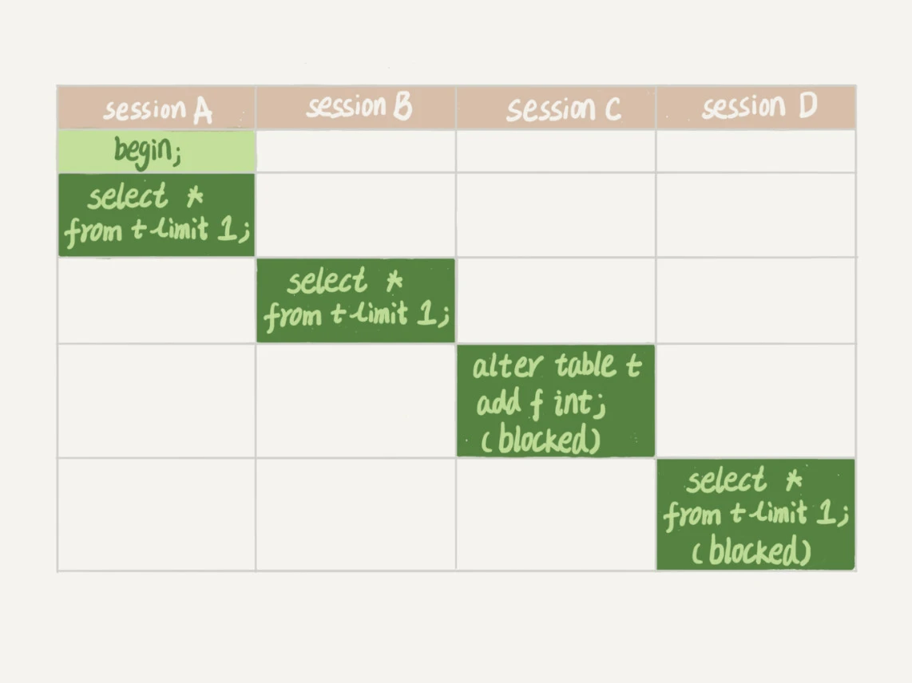

# 一 锁
## 1.1 全局锁
全局锁就是对整个数据库实例加锁。加全局读锁的命令是Flush tables with read lock (FTWRL)。  
之后其他线程的以下语句会被阻塞：数据更新语句（数据的增删改）、数据定义语句（包括建表、修改表结构等）和更新类事务的提交语句。  
MDL会直到事务提交才释放，在做表结构变更的时候，你一定要小心不要导致锁住线上查询和更新。
> 【数据库备份】
> (1)以前加全局读锁，做整库备份存在问题：  
> ①在主库上备份，备份期间都不能执行更新，业务基本上就得停摆。  
> ②在从库上备份，备份期间从库不能执行主库同步过来的binlog，会导致主从延迟。  
> ③不加锁进行备份，备份系统备份得到的库不是一个逻辑时间点，这个视图是逻辑不一致的。  
> (2)官方自带的逻辑备份工具是mysqldump  
> ①当mysqldump使用参数-single-transaction的时候，导数据之前就会启动一个事务，来确保拿到一致性视图。而由于MVCC的支持，这个过程中数据是可以正常更新的。  
> ②对于MyISAM这种不支持事务的引擎，如果备份过程中有更新，总是只能取到最新的数据，这就破坏了备份的一致性。这时，就需要使用FTWRL命令了。
> (3)使用set global readonly=true
> ①在有些系统中，readonly的值会被用来做其他逻辑，比如用来判断一个库是主库还是备库。修改global变量的方式影响面更大，不建议使用  
> ②在异常处理机制上有差异。如果执行FTWRL命令之后由于客户端发生异常断开，那么MySQL会自动释放这个全局锁，整个库回到可以正常更新的状态。
> 而将整个库设置为readonly之后，如果客户端发生异常，则数据库就会一直保持readonly状态，这样会导致整个库长时间处于不可写状态，风险较高。

## 1.2 表级锁
### 1.2.1 表锁（偏读）
【概念】  
偏向MyISAM存储引擎，开销小，加锁快，无死锁，锁定粒度大，发生锁冲突概率最高，并发最低。MyISAM在执行查询语句前，会自动给涉及的所有表加读锁，在执行增删改操作前，会自动给涉及的表加写锁。   
```
lock table 表名字 read(write),表名字 read(write)  （手动增加表锁）
show open tables                                （查看表上加过的锁）
unlock tables                                   （释放表锁、或者在客户端断开的时候自动释放）
```
【表锁定分析】  
```
show status like 'table%'  
值1：Table_locks_immediate：产生表级锁定的次数，表示可以立即获取锁的查询次数，每立即获取锁值加1  
值2：出现表级锁定争用而发生等待的次数（不能立即获取锁的次数，每等待一次锁值加1），此值高说明存在着较严重的表级锁争用情况
```
【特点】  
①读锁会阻塞写，但是不会阻塞读。而写锁则会把读和写都阻塞。并且除了会限制别的线程的读写外，也会限定本线程接下来的操作对象。    
②MyISAM的读写锁调度是写优先，这也是MyISAM不适合做写为主表的引擎。因为写锁导致其他线程不能做任何操作，大量的更新会使查询很难得到锁，从而造成永远阻塞。

### 1.2.2 元数据锁（meta data lock，MDL）
【概念】  
MDL不需要显示使用，在访问一个表的时候会被自动加上。当对一个表做增删改查操作的时候，加MDL读锁；当要对表做结构变更操作的时候，加MDL写锁。  
事务中的MDL锁，在语句执行开始时申请，但是语句结束后并不会马上释放，而会等到整个事务提交后再释放。  
【特点】  
①读锁之间不互斥，因此你可以有多个线程同时对一张表增删改查  
②读写锁、写锁之间是互斥的，用来保证变更表结构操作的安全性。因此，如果有两个线程要同时给一个表加字段，其中一个要等另一个执行完才能开始执行  
【如何安全的给小表加字段】  
问题描述：

①sessionA先启动，会对表加一个MDL读锁，由于sessionB也需要MDL读锁，因此可以正常执行。  
②sessionC会被阻塞，因为sessionA的MDL读锁还没释放，而sessionC需要MDL写锁，因此只能被阻塞。  
③sessionC阻塞之后，之后所有在表上新申请MDL读锁的请求也会被sessionC阻塞，等于这个表完全不可读写了。  
解决办法：  
①首先要解决长事务，事务不提交，就会一直占用MDL锁。在MySQL的information_schema库的innodb_trx表中，可以查到当前执行中的事务。如果要做DDL变更的表刚好有长事务在执行，要先考虑
暂停DDL，或者kill掉这个长事务。  
②热点表上加字段，kill也未必管用，因为新的请求马上就来了，在alter table语句里面设定等待时间，在指定等待时间里面能拿到MDL写锁最好，  
拿不到也不要阻塞后面的业务语句，先放弃。之后再重试这个过程。
```
ALTER TABLE tbl_name NOWAIT add column ...  
ALTER TABLE tbl_name WAIT N add column ...
```

## 1.3 行锁（偏写）
【概念】  
偏向InnoDB存储引擎，开销大，加锁慢，会出现死锁，锁定粒度最小，发生锁冲突的概率最低，并发度也最高。  
【间隙锁问题】  

结论：在使用不当的时候，InnoDB的整体性能表现不仅不能比MyISAM高，甚至可能会更差。  
【行锁定分析】  
```
show status like 'innodb_row_lock%';  
值1：innodb_row_lock_current_waits    当前正在等待锁定的数量；  
值2：innodb_row_lock_time             从系统启动到现在锁定总时间长度（常用）  
值3：innodb_row_lock_time_avg         每次等待所花平均时间（常用）  
值4：innodb_row_lock_time_max         从系统启动到现在等待最长的一次所花的时间  
值5：innodb_row_lock_waits            系统启动后到现在总共等待的次数（常用）
```
【行锁变表锁问题】  
①varchar不用''导致系统自动转换类型，行锁变表锁  
②select ... for update 锁定某一行后，其它的操作会被阻塞，直到锁定行的会话提交commit  
③如果一个表批量更新，大量使用行锁，可能导致其他事务长时间等待，严重影响事务的执行效率。此时，MySQL会将行锁升级为表锁  
④行锁是针对索引加的锁，如果条件索引失效，那么行锁也会升级为表锁  

【优化建议】  
①尽可能让所有数据检索都通过索引来完成，避免无索引行锁升级为表锁  
②合理设计索引，尽量缩小锁的范围  
③尽可能较少检索条件，避免间隙锁  
④尽量控制事务大小，减少锁定资源量和时间长度  
⑤尽可能低级别事务隔离  

【行锁相关】  
> (1)两阶段锁  
> 在InnoDB事务中，行锁是在需要的时候才加上的，但并不是不需要了就立刻释放，而是要等到事务结束时才释放。这个就是两阶段锁协议。  
> 原则：如果你的事务中需要锁多个行，要把最可能造成锁冲突、最可能影响并发度的锁的申请时机尽量往后放。  
> (2)死锁  
> 互相等待对方资源释放，就是进入了死锁状态。当出现死锁后，有两种策略：  
> ①直接进入等待，直到超时。这个超时时间可以通过参数innodb_lock_wait_timeout来设置。在InnoDB中，默认值是50s。不常用。设置短时间可能会出现误伤锁等待的事务。  
> ②发起死锁检测，发现死锁后，主动回滚死锁链条中的某一个事务，让其他事务得以继续执行。将参数innodb_deadlock_detect设置为on，表示开启这个逻辑。
> 死锁检测需要耗费大量的CPU资源，现象就是CPU利用率很高，但是每秒却执行不了几个事务。  
> 解决办法：  
> 热点行更新时，需要在数据库服务端控制并发度。思路就是对于相同行的更新，在进入引擎之前排队，这样引擎内部就不会有大量的死锁检测了；  
> 考虑通过将一行改成逻辑上的多行来减少锁冲突。

## 1.4 页锁
开销和加锁时间界于表锁和行锁之间：会出现死锁，锁定粒度界于表锁和行锁之间，并发度一般

## 1.5 间隙锁

## 1.6 总结
① 全局锁主要用在逻辑备份过程中。对于全部是InnoDB引擎的库，我建议你选择使用–single-transaction参数，对应用会更友好。  
② 表锁一般是在数据库引擎不支持行锁的时候才会被用到的。如果你发现你的应用程序里有lock tables这样的语句，你需要追查一下，比较可能的情况是：  
要么是你的系统现在还在用MyISAM这类不支持事务的引擎，那要安排升级换引擎；
要么是你的引擎升级了，但是代码还没升级。我见过这样的情况，最后业务开发就是把lock tables 和 unlock tables 改成 begin 和 commit，问题就解决了。

# 事务
在Mysql中，事务支持是在引擎层实现的。而Mysql原生的MyISAM引擎就不支持事务，这是MyISAM被InnoDB取代的重要原因。  

### 事务及其ACID属性


### 并发事务处理带来的问题
①更新丢失  
  
②脏读  
  
③不可重复读  
  
④幻读  


### 如何使用事务
① 显示事务  
```start transaction```或者```begin```开启一个事务  
> start transaction read only 标识当前事务是一个只读事务  
> start transaction write only 标识当前事务是一个读写事务  
> start transaction with consistent snapshot 启动一致性读

② 提交事务或中止事务  
commit：提交事务  
rollback：回滚事务  
rollback to [savepoint]：将事务回滚到某个保存点  

③ 隐式事务  
要么显示开启事务，这样本次事务的提交或回滚会关闭掉自动提交功能 
或者把系统变量autocommit的值设置为off

### 事务隔离级别
【概念】  
"脏读"、“不可重复读“、”幻读“，其实都是数据库读一致性问题，必须由数据库提供一定的事务隔离机制来解决。
事务隔离实质上就是使事务在一定程度上“串行化”进行，显然与“并发”是矛盾的。  
【查看当前数据库事务隔离级别】  
```show variables like 'tx_isolation'```

| 读数据一致性及允许的并发副作用隔离级别 | 读数据一致性 | 脏读 | 不可重复读 | 幻读 | 含义 |
|  ---  |  ---  |  ---  |   ---  |  ---  |  ---  |
| 读未提交 | 最低级别，只能保证不读物理上损坏的数据 | √ | √ | √ | 一个事务还没提交时，它做的变更就能被别的事务看到。 |
| 读已提交 | 语句级 | × | √ | √ | 一个事务提交之后，它做的变更才会被其他事务看到。 |
| 可重复读 | 事务级 | × | × | √ | 一个事务执行过程中看到的数据，总是跟这个事务在启动时看到的数据是一致的。当然在可重复读隔离级别下，未提交变更对其他事务也是不可见的。 |
| 可序列化 | 最高级别，事务级 | × | × | × | 对于同一行记录，“写”会加“写锁”，“读”会加“读锁”。当出现读写锁冲突的时候，后访问的事务必须等前一个事务执行完成，才能继续执行。 |

【隔离级别实现原理】  
```show variables like 'transaction_isolation'```
在实现上，数据库里面会创建一个视图，访问的时候以视图的逻辑结果为准。在“可重复读”隔离级别下，这个视图是在事务启动时创建的，整个事务存在期间都用这个视图。在“读已提交”隔离级别下，
这个视图是在每个SQL语句开始执行的时候创建的。这里需要注意的是，“读未提交”隔离级别下直接返回记录上的最新值，没有视图概念；而“串行化”隔离级别下直接用加锁的方式来避免并行访问。
我们可以看到在不同的隔离级别下，数据库行为是有所不同的。Oracle数据库的默认隔离级别其实就是“读提交”，因此对于一些从Oracle迁移到MySQL的应用，为保证数据库隔离级别的一致，
你一定要记得将MySQL的隔离级别设置为“读提交”。配置的方式是，将启动参数transaction-isolation的值设置成READ-COMMITTED。你可以用show variables来查看当前的值。

【事务隔离实现原理】  

> 尽量不要使用长事务的原因：  
> 记录在更新的时候，都会同时记录一条回滚操作。不同时刻启动的事务会有不同的read-view，对于指定的read-view，要得到对应的该记录的值，就必须将当前值依次执行所有的回滚操作到
> 指定事务那一个时刻对应的回滚操作。因此回滚日志会被保留至当没有事务需要用到这些回滚日志时，回滚日志才会被删除。
> 而长事务意味着系统里面会存在很老的事务视图，由于这些事务随时可能访问数据库里面的任何数据，所以这个事务提交之前，数据库里面它可能用到的回滚记录都必须保留，这就会导致大量占用存储空间。  
> 除了对回滚段的影响，长事务还占用锁资源，也可能拖垮整个库。

【事务的启动方式】  
①显示启动事务语句，begin或start transaction，对应的提交语句是commit，回滚语句是rollback；  
> begin/start transaction 命令并不是一个事务的起点，在执行到它们之后的第一个操作InnoDB表的语句，事务才真正启动。如果你想要马上启动一个事务，
> 可以使用start transaction with consistent snapshot 这个命令。

②set autocommit = 0，这个命令会将这个线程的自动提交关闭，意味着如果你只执行一个select语句，这个事务就启动了，而且并不会自动提交。这个事务持续存在直到你主动执行commit或rollback
语句，或者断开连接。这种启动方式在开始时都不需要主动执行一次“begin”，减少了语句的交互次数，但是因为接下来的查询都在事务中，如果是长链接，就导致了意外的长事务。  
因此建议在autocommit=1的情况下，用begin显示启动事务，执行commit work and chain，表示提交事务并自动启动下一个事务，这样也省去了再次执行begin语句的开销。
**建议：使用set autocommit = 1，通过显示语句的方式来启动事务。**
```
select * from information_schema.innodb_trx where TIME_TO_SEC(timediff(now(),trx_started))>60（查找持续时间超过60s的事务）
```

> 避免长事务对业务的影响    
> 应用开发端注意事项：  
> 1、确认是否使用了set autocommit=0。这个确认工作可以在测试环境中开展，把MySQL的general_log开起来，然后随便跑一个业务逻辑，通过general_log的日志来确认。
> 一般框架如果会设置这个值，也就会提供参数来控制行为，你的目标就是把它改成1。  
> 2、确认是否有不必要的只读事务。有些框架会习惯不管什么语句先用begin/commit框起来。我见过有些是业务并没有这个需要，但是也把好几个select语句放到了事务中。这种只读事务可以去掉。
> 3、业务连接数据库的时候，根据业务本身的预估，通过SET MAX_EXECUTION_TIME命令，来控制每个语句执行的最长时间，避免单个语句意外执行太长时间。
>
> 数据库端注意事项：  
> 1、监控 information_schema.Innodb_trx表，设置长事务阈值，超过就报警/或者kill；
> 2、Percona的pt-kill这个工具不错，推荐使用；
> 3、在业务功能测试阶段要求输出所有的general_log，分析日志行为提前发现问题；
> 4、如果使用的是MySQL 5.6或者更新版本，把innodb_undo_tablespaces设置成2（或更大的值）。如果真的出现大事务导致回滚段过大，这样设置后清理起来更方便。

## 隔离级别
在读提交隔离级别下，语句执行完成后，是只有行锁的。而且语句执行完成后，InnoDB就会把不满足条件的行行锁去掉。当然了，c=5这一行的行锁，还是会等到commit的时候才释放的。  
在可重复读隔离级别下，普通的查询是快照读，是不会看到别的事务插入的数据的。因此，幻读在”当前读”下才会出现。并且幻读专指“新插入的行”。  
> 当前读可通过加for update实现，就是要能读到所有已经提交的记录的最新值。  
> 幻读产生的问题：①破坏语义，即满足条件的行都应被锁住不再成立；②数据一致性问题，存在数据库数据和日志在逻辑上不一致的问题。  

## 加锁策略
原则1：加锁的基本单位是next-key lock。希望你还记得，next-key lock是前开后闭区间。  
原则2：查找过程中访问到的对象才会加锁。  
优化1：索引上的等值查询，给唯一索引加锁的时候，next-key lock退化为行锁。  
优化2：索引上的等值查询，向右遍历时且最后一个值不满足等值条件的时候，next-key lock退化为间隙锁。  
一个bug：唯一索引上的范围查询会访问到不满足条件的第一个值为止。  


