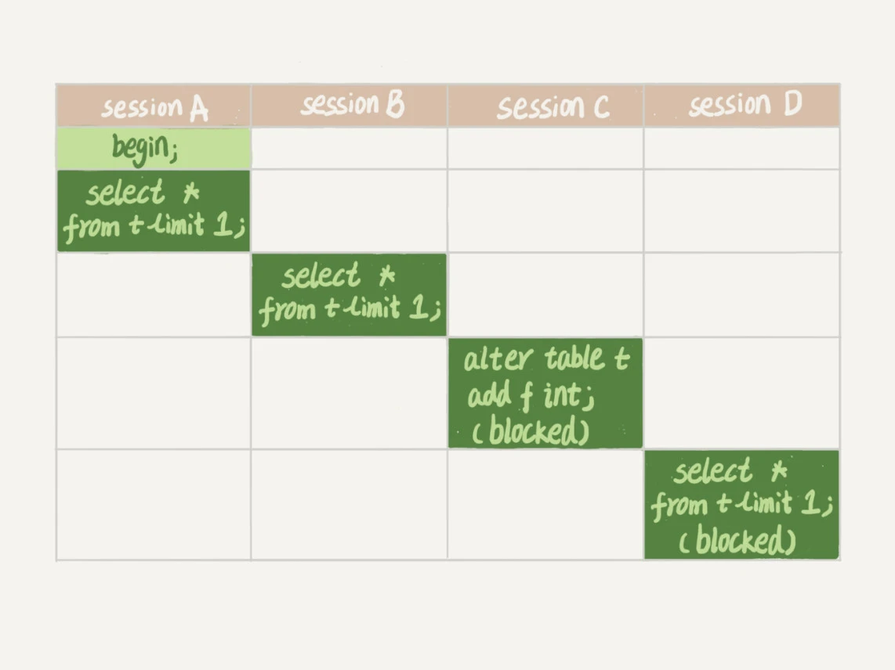

# 事务
在Mysql中，事务支持是在引擎层实现的。而Mysql原生的MyISAM引擎就不支持事务，这是MyISAM被InnoDB取代的重要原因。

### 事务及其ACID属性


### 并发事务处理带来的问题
写写场景下（存在一个问题）  
脏写  


读写场景下（存在三个问题）  
1 脏读  
  
2 不可重复读  
  
3 幻读  


### 事务隔离级别
【概念】  
任何一种隔离级别都不会允许脏写的问题发生。  
另外三个问题："脏读"、"不可重复读"、"幻读"，其实都是数据库一致性读问题，必须由数据库提供一定的事务隔离机制来解决。  
事务隔离实质上就是使事务在一定程度上“串行化”进行，显然与“并发”是矛盾的。

【查看当前数据库事务隔离级别】  
```show variables like 'tx_isolation'``` 或者 ```show variables like 'transaction_isolation'```

| 读数据一致性及允许的并发副作用隔离级别 | 读数据一致性              | 脏读   | 不可重复读 | 幻读   | 含义                                       |
| ------------------- | ------------------- | ---- | ----- | ---- | ---------------------------------------- |
| 读未提交                | 最低级别，只能保证不读物理上损坏的数据 | √    | √     | √    | 一个事务还没提交时，它做的变更就能被别的事务看到。                |
| 读已提交                | 语句级                 | ×    | √     | √    | 一个事务提交之后，它做的变更才会被其他事务看到。                 |
| 可重复读                | 事务级                 | ×    | ×     | √    | 一个事务执行过程中看到的数据，总是跟这个事务在启动时看到的数据是一致的。当然在可重复读隔离级别下，未提交变更对其他事务也是不可见的。 |
| 可序列化                | 最高级别，事务级            | ×    | ×     | ×    | 对于同一行记录，“写”会加“写锁”，“读”会加“读锁”。当出现读写锁冲突的时候，后访问的事务必须等前一个事务执行完成，才能继续执行。 |

【事务隔离级别】  
在读提交隔离级别下，语句执行完成后，是只有行锁的。而且语句执行完成后，InnoDB就会把不满足条件的行行锁去掉。当然了，c=5这一行的行锁，还是会等到commit的时候才释放的。  
在可重复读隔离级别下，普通的查询是快照读，是不会看到别的事务插入的数据的。因此，幻读在”当前读”下才会出现。并且幻读专指“新插入的行”。
> 当前读可通过加for update实现，就是要能读到所有已经提交的记录的最新值。  
> 幻读产生的问题：①破坏语义，即满足条件的行都应被锁住不再成立；②数据一致性问题，存在数据库数据和日志在逻辑上不一致的问题。

① 在实现上，数据库里面会创建一个视图，访问的时候以视图的逻辑结果为准。在“可重复读”隔离级别下，这个视图是在事务启动时创建的，整个事务存在期间都用这个视图。在“读已提交”隔离级别下，
这个视图是在每个SQL语句开始执行的时候创建的。这里需要注意的是，“读未提交”隔离级别下直接返回记录上的最新值，没有视图概念；而“串行化”隔离级别下直接用加锁的方式来避免并行访问。

② 我们可以看到在不同的隔离级别下，数据库行为是有所不同的。Oracle数据库的默认隔离级别其实就是“读提交”，因此对于一些从Oracle迁移到MySQL的应用，为保证数据库隔离级别的一致，
你一定要记得将MySQL的隔离级别设置为“读提交”。配置的方式是，将启动参数transaction-isolation的值设置成READ-COMMITTED。你可以用show variables来查看当前的值。

【事务隔离实现原理】  


① 记录在更新的时候，都会同时记录一条回滚操作  
② 在不同时刻启动的事务都会有不同的read-view，他所能看到的回滚操作是不一样的  
③ 事务所能看到的值，即对应于指定的read-view，将当前最新值依次执行所有的```回滚操作```到事务启动时对应的readView所能看到的那个回滚操作，所得到的值就是该事务能看到的值，
所以同一条记录在系统中可以存在多个版本，这就是数据库的多版本并发控制机制（MVCC）  
④ 因此回滚日志会被保留至当没有事务需要用到这些回滚日志时，回滚日志才会被删除

> 尽量不要使用长事务的原因：  
> ① 长事务意味着系统里面会存在很老的read-view，由于这些事务随时可能访问数据库里面的任何数据，所以这个事务提交之前，数据库里面它可能用到的回滚记录都必须保留，这就会导致大量占用存储空间。  
> ② 除了对回滚段的影响，长事务还占用锁资源，也可能拖垮整个库。

【事务的启动方式】  
①显示启动事务语句，begin或start transaction，对应的提交语句是commit，回滚语句是rollback；
> begin/start transaction 命令并不是一个事务的起点，在执行到它们之后的第一个操作InnoDB表的语句，事务才真正启动。如果你想要马上启动一个事务，
> 可以使用start transaction with consistent snapshot 这个命令。

②set autocommit = 0，这个命令会将这个线程的自动提交关闭，意味着如果你只执行一个select语句，这个事务就启动了，而且并不会自动提交。这个事务持续存在直到你主动执行commit或rollback
语句，或者断开连接。这种启动方式在开始时都不需要主动执行一次“begin”，减少了语句的交互次数，但是因为接下来的查询都在事务中，如果是长链接，就导致了意外的长事务。  
因此建议在autocommit=1的情况下，用begin显示启动事务，执行commit work and chain，表示提交事务并自动启动下一个事务，这样也省去了再次执行begin语句的开销。
**建议：使用set autocommit = 1，通过显示语句的方式来启动事务。**
```sql
-- 查找持续时间超过60s的事务
select * from information_schema.innodb_trx where TIME_TO_SEC(timediff(now(),trx_started)) > 60
```

> 【事务最佳实践】  
> ① 使用set autocommit = 1，通过显示语句的方式来启动事务  
> ② 在autocommit为1的场景下，执行```commit word and chain```，则是提交事务并自动启动下一个事务，不需要再次执行```begin```从而多一次交互  
> 避免长事务对业务的影响    
> 应用开发端注意事项：  
> 1、确认是否使用了set autocommit=0。这个确认工作可以在测试环境中开展，把MySQL的general_log开起来，然后随便跑一个业务逻辑，通过general_log的日志来确认。
> 一般框架如果会设置这个值，也就会提供参数来控制行为，你的目标就是把它改成1。  
> 2、确认是否有不必要的只读事务。有些框架会习惯不管什么语句先用begin/commit框起来。我见过有些是业务并没有这个需要，但是也把好几个select语句放到了事务中。这种只读事务可以去掉。
> 3、业务连接数据库的时候，根据业务本身的预估，通过SET MAX_EXECUTION_TIME命令，来控制每个语句执行的最长时间，避免单个语句意外执行太长时间。
>
> 数据库端注意事项：  
> 1、监控 information_schema.Innodb_trx表，设置长事务阈值，超过就报警/或者kill；
> 2、Percona的pt-kill这个工具不错，推荐使用；
> 3、在业务功能测试阶段要求输出所有的general_log，分析日志行为提前发现问题；
> 4、如果使用的是MySQL 5.6或者更新版本，把innodb_undo_tablespaces设置成2（或更大的值）。如果真的出现大事务导致回滚段过大，这样设置后清理起来更方便。

### 如何使用事务
1 显示事务  
```start transaction```或者```begin```开启一个事务
> start transaction read only 标识当前事务是一个只读事务  
> start transaction read write（默认） 标识当前事务是一个读写事务  
> start transaction (read only / read write) with consistent snapshot 启动一致性读

提交事务或中止事务  
commit：提交事务  
rollback：回滚事务  
rollback to [savepoint]：将事务回滚到某个保存点。不是事务的最终状态，还需要后续操作直至commit或rollback

2 隐式事务  
要么```显示开启事务```，这样本次事务的提交或回滚会关闭掉自动提交功能，或者```把系统变量autocommit的值设置为off```

隐式提交数据的情况  
① 数据定义语言（DDL）  
② 当我们使用alter user、create user、drop user、grant、rename user、revoke、set password等语句时也会隐式的提交前边语句所属于的事务  
③ 使用start transaction或begin开启另外一个事务时，会隐式的提交上一个事务  
④ 关于MySQL复制的语句：start slave、stop slave、reset slave、change master to等语句时会隐式的提交前边语句所属的事务  
⑤ ...

### 大事务

##### 存在问题

①大事务长时间占用数据库资源，导致其他事务等待时间过长，降低整体性能

②大事务引发锁冲突，导致其他事务阻塞，甚至死锁

③大事务产生的日志量较大，导致日志文件迅速增长，占用磁盘空间

④大事务一旦回滚，可能需要较长时间，导致数据库处于不可用状态

##### 优化方法

①将大事务拆分为多个小事务，每个小事务只包含必要的操作，这样可以减小锁的粒度，降低锁冲突的概率

②考虑使用合适的数据库隔离级别，如READ COMMITED，以降低锁的竞争

③减少数据量，优化查询和索引，进行性能优化

# 锁
### 并发事务场景

① 读-读场景  
读操作本身不会对记录有任何影响，并不会引起什么问题，所以允许这种情况的发生  
② 写-写场景  
写写场景下会发生脏写的问题，任何一种隔离级别都不允许这种问题的发生。所以在多个未提交事务相继对一条记录做改动时，需要让他们排队执行，这个排队的过程其实是通过锁来实现的  
③ 读-写场景  
这种场景下可能会发生脏读、不可重复读、幻读的问题  

> 解决并发事务问题的方案：  
> 第一种方案是读操作利用多版本并发控制（MVCC），写操作进行加锁，写操作针对最新版本的记录进行修改。读记录的历史版本和改动记录的最新版本并不冲突，因此采用MVCC方案时，读写操作并不冲突  
> 第二种方案是读和写操作都采用加锁的方式

### 表级别锁
##### 共享锁/S锁，排他锁/X锁
```
lock tables t read（对表t加表级别的S锁）  
lock tables t write（对表t加表级别的X锁）  
unlock tables（释放表锁、或者在客户端断开的时候自动释放）  
show open tables where in_use > 0（查看表上加过的锁）
```
注意：尽量避免在InnoDB引擎使用 lock tables 这样的手动锁表语句，会降低并发能力  

MyISAM存储引擎一般用表级别锁，开销小，加锁快，无死锁。但是锁定粒度大，发生锁冲突概率高，并发低。  
MyISAM在执行查询语句前，会自动给涉及的所有表加读锁，在执行增删改操作前，会自动给涉及的表加写锁。   

| 锁类型   | 自己可读 | 自己可写 | 自己可操作其他表 | 他人可读  | 他人可写  |
| ----- | ---- | ---- | -------- | ----- | ----- |
| 给表加读锁 | 是    | 否    | 否        | 是     | 否，会等待 |
| 给表加写锁 | 是    | 是    | 否        | 否，会等待 | 否，会等待 |

##### 意向锁
如果我们给某一行数据加上了排他锁，数据库就会```自动```给更大一级的空间，比如数据页或数据表加上意向锁，告诉其他人这个数据页或数据表已经有人上过排他锁了，这样当其他人想要获取数据表排他锁的时候，只需要了解是否有人已经获取了这个数据表的意向排他锁即可。

事务对表加锁时，需要保证没有其他事务持有这个表的排它锁，同时还要保证没有其他事务持有表中任意一行的排他锁。如果实现方案是遍历每一行，效率会很差，因此提出了意向锁。

```
-- 事务获取了某些行的S锁，自动给表加上IS锁  
select ... from table lock in share mode;
```

```
-- 事务获取了某些行的X锁，自动给表加上IX锁  
select ... from table for update;
```

| 锁类型       | 意向共享锁(IS) | 意向排他锁(IX) |
| --------- | --------- | --------- |
| 意向共享锁(IS) | 兼容        | 兼容        |
| 意向排他锁(IX) | 兼容        | 兼容        |

以上结论：意向锁之间是互通的，虽然意向锁和自家兄弟互相兼容，但是它会与```普通的排他/共享锁```互斥  

| 锁类型    | 意向共享锁(IS) | 意向排他锁(IX) |
| ------ | --------- | --------- |
| 共享锁(S) | 兼容        | 互斥        |
| 排他锁(X) | 互斥        | 互斥        |

【意向锁结论】  
1 InnoDB支持多粒度锁，特定场景下，行级锁可以与表级锁共存  
2 意向锁之间互不排斥，但除了IS与S兼容外，意向锁会与共享锁/排他锁互斥  
3 IS、IX是表级锁，不会和行级的X、S锁发生冲突，只会和表级别的X、S锁发生冲突  
4 意向锁在保证并发性的前提下，实现了行锁和表锁共存

##### 自增锁（Auto-Inc锁）
表级别锁。是专门针对AUTO_INCREMENT类型的列，对于这种列，如果表中新增数据时就会去持有自增锁。简言之，如果一个事务正在往表中插入记录，所有其他事务的插入必须等待，以便第一个事务插入的行，是连续的主键值。

##### 元数据锁（meta data lock，MDL）
【概念】  
MDL不需要显示使用，在访问一个表的时候会被自动加上。当对一个表做增删改查操作的时候，加MDL读锁；当要对表做结构变更操作的时候，加MDL写锁。  
事务中的MDL锁，在语句执行开始时申请，但是语句结束后并不会马上释放，而会等到整个事务提交后再释放。  
【特点】  
①读锁之间不互斥，因此你可以有多个线程同时对一张表增删改查  
②读写锁、写锁之间是互斥的，用来保证变更表结构操作的安全性。因此，如果有两个线程要同时给一个表加字段，其中一个要等另一个执行完才能开始执行  
【如何安全的给小表加字段】  
问题描述：

①sessionA先启动，会对表加一个MDL读锁，由于sessionB也需要MDL读锁，因此可以正常执行。  
②sessionC会被阻塞，因为sessionA的MDL读锁还没释放，而sessionC需要MDL写锁，因此只能被阻塞。  
③sessionC阻塞之后，之后所有在表上新申请MDL读锁的请求也会被sessionC阻塞，等于这个表完全不可读写了。  
解决办法：  
①首先要解决长事务，事务不提交，就会一直占用MDL锁。在MySQL的information_schema库的innodb_trx表中，可以查到当前执行中的事务。如果要做DDL变更的表刚好有长事务在执行，要先考虑
暂停DDL，或者kill掉这个长事务。  
②热点表上加字段，kill也未必管用，因为新的请求马上就来了，在alter table语句里面设定等待时间，在指定等待时间里面能拿到MDL写锁最好，  
拿不到也不要阻塞后面的业务语句，先放弃。之后再重试这个过程。
```
ALTER TABLE tbl_name NOWAIT add column ...  
ALTER TABLE tbl_name WAIT N add column ...
```

【表锁定分析】  
```
show status like 'table%'  
值1：Table_locks_immediate：产生表级锁定的次数，表示可以立即获取锁的查询次数，每立即获取锁值加1  
值2：出现表级锁定争用而发生等待的次数（不能立即获取锁的次数，每等待一次锁值加1），此值高说明存在着较严重的表级锁争用情况
```
【特点】  
①读锁会阻塞写，但是不会阻塞读。而写锁则会把读和写都阻塞。并且除了会限制别的线程的读写外，也会限定本线程接下来的操作对象。    
②MyISAM的读写锁调度是写优先，这也是MyISAM不适合做写为主表的引擎。因为写锁导致其他线程不能做任何操作，大量的更新会使查询很难得到锁，从而造成永远阻塞。

### 行级别锁
##### 共享锁/S锁，排他锁/X锁

读操作可共享```select ... lock in share mode```，也可排他```select ... for update```

| 锁类型  | X锁   | S锁   |
| ---- | ---- | ---- |
| X锁   | 不兼容  | 不兼容  |
| S锁   | 不兼容  | 兼容   |

##### 记录锁

记录锁永远都是加在索引字段上的，如果表没有索引，那么InnoDB也会隐式的创建一个索引，并使用这个索引实施记录锁。它会阻塞其他事务对这行记录的插入、更新、删除

### 间隙锁 (Gap Lock)

Mysql在可重复读隔离级别下是可以解决幻读问题的，解决方案有两种，可以使用MVCC方案解决，也可以采用加锁方案解决。但是在使用加锁方案解决时有个大问题，就是事务在第一次执行读取操作时，那些幻影记录尚不存在，我们无法给这些幻影记录加上记录锁，因此，InnoDB提出了间隙锁。  

> 间隙锁加锁规则
>
> 

### 临键锁（Next-Key Locks）

next-key锁本质是记录锁和间隙锁的组合，它既能保护该条记录，又能阻止别的事务将新记录插入被保护记录前边的间隙。所以这种锁既体现了记录锁的作用，也体现了间隙锁的作用  

### 插入意向锁

间隙锁导致别的事务在插入间隙记录时，会产生插入意向锁。插入意向锁之间互不冲突

### 页锁
开销和加锁时间界于表锁和行锁之间：会出现死锁，锁定粒度界于表锁和行锁之间，并发度一般

### 其他角度归纳锁

> ### 从对待锁的态度进行划分
>
> ##### 乐观锁
>
> 乐观锁不采用数据库自身的锁机制，而是通过程序来实现。乐观锁适用于多读的应用类型，这样可以提高吞吐量  
> 乐观锁可以采用版本号机制或者CAS机制  
>
> ##### 悲观锁
>
> 1 悲观锁大多数情况下依靠数据库的锁机制来实现  
> 2 ```select ... for update```语句执行过程中所有扫描的行都会被锁上，因此在MySQL中用悲观锁必须确定使用了索引，而不是全表扫描，否则将会把整个表锁住
>
> ### 从加锁的方式划分
>
> ##### 显示锁
>
> ```sql
> select * from performance_schema.data_lock_waits;
> ```
>
> ##### 隐式锁
>
> 在插入一行记录时，如果当前事务未结束，那么不准其他事务访问这行记录（也不准访问全表记录），会被阻塞，是因为给这行记录加了隐式锁

### 其他锁相关

##### 全局锁
全局锁就是对整个数据库实例加锁。加全局读锁的命令是```Flush tables with read lock```  
之后其他线程的以下语句会被阻塞：数据更新语句（数据的增删改）、数据定义语句（包括建表、修改表结构等）和更新类事务的提交语句。  
MDL会直到事务提交才释放，在做表结构变更的时候，你一定要小心不要导致锁住线上查询和更新。
> 【数据库备份】
> (1)以前加全局读锁，做整库备份存在问题：  
> ①在主库上备份，备份期间都不能执行更新，业务基本上就得停摆。  
> ②在从库上备份，备份期间从库不能执行主库同步过来的binlog，会导致主从延迟。  
> ③不加锁进行备份，备份系统备份得到的库不是一个逻辑时间点，这个视图是逻辑不一致的。  
> (2)官方自带的逻辑备份工具是mysqldump  
> ①当mysqldump使用参数-single-transaction的时候，导数据之前就会启动一个事务，来确保拿到一致性视图。而由于MVCC的支持，这个过程中数据是可以正常更新的。  
> ②对于MyISAM这种不支持事务的引擎，如果备份过程中有更新，总是只能取到最新的数据，这就破坏了备份的一致性。这时，就需要使用FTWRL命令了。
> (3)使用set global readonly=true
> ①在有些系统中，readonly的值会被用来做其他逻辑，比如用来判断一个库是主库还是备库。修改global变量的方式影响面更大，不建议使用  
> ②在异常处理机制上有差异。如果执行FTWRL命令之后由于客户端发生异常断开，那么MySQL会自动释放这个全局锁，整个库回到可以正常更新的状态。
> 而将整个库设置为readonly之后，如果客户端发生异常，则数据库就会一直保持readonly状态，这样会导致整个库长时间处于不可写状态，风险较高。

##### 死锁
两个事务都持有对方需要的锁，并且在等待对方释放，并且双方都不会释放自己的锁  

死锁处理办法：  
1 等待，直到超时：```innodb_lock_wait_timeout```;  
2 使用死锁检测进行死锁处理（1w次就要检测1kw次，性能损耗大）  

如何避免死锁：  
1 合理设计索引，使业务SQL尽可能通过索引定位更少的行，减少锁竞争  
2 调整业务逻辑SQL的执行顺序，避免update/delete长时间持有锁的SQL在事务前面  
3 避免大事务，尽量将大事务拆分成多个小事务来处理，小事务缩短资源的锁定时间，发生锁冲突的几率也更小  
4 在并发比较高的系统中，不要显式加锁，特别时在事务里显示加锁。如```select ... for update```语句，
如果是在事务里运行了start transaction或设置了autocommit等于0，那么就会锁定所查找到的记录  
5 降低隔离级别，如果业务允许，将隔离级别调低也是较好的选择，比如将隔离级别从RR调整为RC，可以避免掉很多因为gap锁造成的死锁

## 锁总结
① 全局锁主要用在逻辑备份过程中。对于全部是InnoDB引擎的库，我建议你选择使用–single-transaction参数，对应用会更友好。  
② 表锁一般是在数据库引擎不支持行锁的时候才会被用到的。如果你发现你的应用程序里有lock tables这样的语句，你需要追查一下，比较可能的情况是：  
要么是你的系统现在还在用MyISAM这类不支持事务的引擎，那要安排升级换引擎；
要么是你的引擎升级了，但是代码还没升级。我见过这样的情况，最后业务开发就是把lock tables 和 unlock tables 改成 begin 和 commit，问题就解决了。

## 锁的内存结构

## 锁监控
```
innodb_row_lock_current_waits（当前正在等待锁定的数量）  
innodb_row_lock_time（等待总时长，从系统启动到现在锁定总时间长度）  
innodb_row_lock_time_avg（等待平均时长，每次等待所花平均时间）  
innodb_row_lock_time_max（从系统启动到现在等待最长的一次所花的时间）  
innodb_row_lock_waits（等待总次数，系统启动后到现在总共等待的次数）
```

Mysql把事务和锁的信息都记录在了information_schema库中，涉及到的三张表分别是innodb_trx、innodb_locks、innodb_lock_waits  
```
information_schema.innodb_trx查看事务的锁情况，只能看到阻塞事务的锁，如果事务并未阻塞，则在该表中看不到该事务的锁情况
```

```
在8.0用performance_schema.data_locks代替information_schema.innodb_locks  
在该表中，不仅可以看到阻塞该事务的锁，还可以看到该事务所持有的锁
```

用performance_schema.data_locks_waits代替information_schema.innodb_lock_waits

## 间隙锁加锁策略

原则1：加锁的基本单位是next-key lock。希望你还记得，next-key lock是前开后闭区间。  
原则2：查找过程中访问到的对象才会加锁。  
优化1：索引上的等值查询，给唯一索引加锁的时候，next-key lock退化为行锁。  
优化2：索引上的等值查询，向右遍历时且最后一个值不满足等值条件的时候，next-key lock退化为间隙锁。  
一个bug：唯一索引上的范围查询会访问到不满足条件的第一个值为止。

## 行锁变表锁问题


结论：在使用不当的时候，InnoDB的整体性能表现不仅不能比MyISAM高，甚至可能会更差。  
【行锁定分析】  

```
show status like 'innodb_row_lock%';  
值1：innodb_row_lock_current_waits    当前正在等待锁定的数量；  
值2：innodb_row_lock_time             从系统启动到现在锁定总时间长度（常用）  
值3：innodb_row_lock_time_avg         每次等待所花平均时间（常用）  
值4：innodb_row_lock_time_max         从系统启动到现在等待最长的一次所花的时间  
值5：innodb_row_lock_waits            系统启动后到现在总共等待的次数（常用）
```

【行锁变表锁问题】  
①varchar不用''导致系统自动转换类型，行锁变表锁  
②select ... for update 锁定某一行后，其它的操作会被阻塞，直到锁定行的会话提交commit  
③如果一个表批量更新，大量使用行锁，可能导致其他事务长时间等待，严重影响事务的执行效率。此时，MySQL会将行锁升级为表锁  
④行锁是针对索引加的锁，如果条件索引失效，那么行锁也会升级为表锁  

【优化建议】  
①尽可能让所有数据检索都通过索引来完成，避免无索引行锁升级为表锁  
②合理设计索引，尽量缩小锁的范围  
③尽可能较少检索条件，避免间隙锁  
④尽量控制事务大小，减少锁定资源量和时间长度  
⑤尽可能低级别事务隔离  

【行锁相关】  

> (1)两阶段锁  
> 在InnoDB事务中，行锁是在需要的时候才加上的，但并不是不需要了就立刻释放，而是要等到事务结束时才释放。这个就是两阶段锁协议。  
> 原则：如果你的事务中需要锁多个行，要把最可能造成锁冲突、最可能影响并发度的锁的申请时机尽量往后放。  
> (2)死锁  
> 互相等待对方资源释放，就是进入了死锁状态。当出现死锁后，有两种策略：  
> ①直接进入等待，直到超时。这个超时时间可以通过参数innodb_lock_wait_timeout来设置。在InnoDB中，默认值是50s。不常用。设置短时间可能会出现误伤锁等待的事务。  
> ②发起死锁检测，发现死锁后，主动回滚死锁链条中的某一个事务，让其他事务得以继续执行。将参数innodb_deadlock_detect设置为on，表示开启这个逻辑。
> 死锁检测需要耗费大量的CPU资源，现象就是CPU利用率很高，但是每秒却执行不了几个事务。  
> 解决办法：  
> 热点行更新时，需要在数据库服务端控制并发度。思路就是对于相同行的更新，在进入引擎之前排队，这样引擎内部就不会有大量的死锁检测了；  
> 考虑通过将一行改成逻辑上的多行来减少锁冲突。

## select * for update

事务1使用这条SQL去执行，事务2去更新同一行记录会被阻塞。但是事务1会因为不同的查询条件，加不一样的锁。

### RC

①查询条件是唯一索引。加```IX意向排他锁```（表级别的锁，不影响插入），两把```X排他锁```（行锁，分别对应唯一索引，主键索引）。不加两把X锁，无法保证同一记录上的更新/删除需要串行执行的约束。

②查询条件是主键。加的```IX意向排他锁```，和```X排他锁```（行锁，对应主键索引）。

③查询条件是普通索引。加```IX意向排他锁```，两把X排他锁（行锁，分别对应普通索引的X锁，对应主键的X锁）。如果查询条件没有命中记录，仅仅加```IX意向排他锁```

④查询条件是无索引。加```IX意向排他锁```,和```X排他锁```（行锁，对应主键的X锁）

### RR

①和②一致

③除了IX锁和两把X锁，还会加Gap锁。

④除了IX锁，每一行记录都会加X锁，还会加最后一行之后的间隙锁。相当于锁表。

# 并发事务问题解决方案：MVCC
```
https://blog.csdn.net/qq_41361506/article/details/108538702
https://blog.csdn.net/weixin_43477531/article/details/121963884
```
## MVCC
通过数据行的多个版本管理来实现数据库的并发控制。主要是通过```三个隐藏字段```、```Undo log```、```ReadView```三个部分来实现  
三个隐藏字段：  
① row_id：创建的表中有主键，或者非null的unique键时都不会包含row_id列  
② trx_id：事务id，每次一个事务对某条记录进行改动时，都会把该事务的事务id值赋值给trx_id隐藏列  
③ roll_pointer：回滚指针，每次对某条记录进行改动时，都会把旧的版本写入到undo日志中，然后这个隐藏列就相当于一个指针，可以通过它来找到该记录
修改前的信息  

read View中的三个全局属性：  
① trx_list：一个数值列表，用来维护Read View生成时刻系统正活跃的事务id  
② up_limit_id：记录trx_list列表中事务id的最小值  
③ low_limit_id：Read View生成时刻系统尚未分配的下一个事务id

## 快照读与当前读
快照读又叫一致性读，读取的是快照数据。不加锁的简单 select 都属于快照读，即不加锁的非阻塞读。  
之所以出现快照读的情况，是基于提高并发性能的考虑，快照读的实现基于MVCC，在很多情况下，避免了加锁，降低了开销  
快照读的前提是隔离级别不是串行级别，串行级别下的快照读会退化成当前读
```select * from studeng where id =1;```

当前读读取的是记录的最新版本，而不是历史版本的数据，读取时还要保证其他并发事务不能修改当前记录，会对读取的记录进行加锁。加锁的select，或者对数据进行增删改都会进行当前读
```select * from studeng where id =1 lock in share mode;```

## MVCC对隔离级别的补充
在SQL标准中，不可重复读隔离级别没有解决并发事务时幻读的问题，只有串行化的隔离级别才解决了并发事务时幻读的问题。但是在MySQL中，
因为存在MVCC这样的机制，其实已经解决了幻读的问题，即Mysql中不可重读隔离级别下，幻读的问题不存在了。但是和串行化解决幻读问题不同的是，
串行化隔离级别通过加锁完全阻止了事务并发运行的产生，这样效率较低，而MVCC机制下，读操作不用排队，提高了并发效率

## Read View的判断流程
在RC隔离级别下，每个快照读都会生成并获取最新的Read View；而在RR隔离级别下，则是同一个事务中的第一个快照读才会创建Read View，之后的快照读
获取的都是同一个Read View

① 首先比较db_trx_id < up_limit_id，如果小于，则当前事务能看到db_trx_id所在的记录，如果大于等于则进入下一个判断  
② 接下来判断db_trx_id >= low_limit_id，如果大于等于则代表db_trx_id所在的记录在Read View生成后才出现的，那么对于当前事务肯定不可见，
如果小于，则进入下一步判断  
③ 判断db_trx_id是否在活跃事务中，如果在，则代表在Read View生成时刻，这个事务还是活跃状态，还没有commit，修改的数据，当前事务也是看不到，
如果不存在，则说明这个事务在Read View生成之前就已经开始commit，那么修改的结果是能够看得见的

## MVCC如何解决幻读
