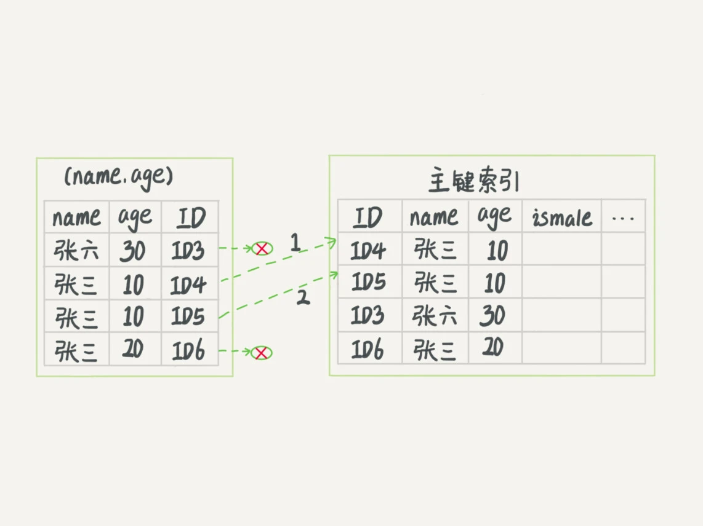

# 一 基础
索引是帮助Mysql高效获取数据的数据结构。可以理解为排好序的快速查找数据结构。阿里巴巴开发者手册建议单表索引数量控制在5个以内，组合索引字段数不允许超过5个

## 1.1 哪些情况下需要创建索引
1 主键列自动建立以主键为关键字段的索引  
2 作为 ```where条件、或者Distinct去重``` 的字段应该建立索引  
3 对分组或者排序的字段进行索引。如果分组或排序的字段有多个，那么可以在这些列上建立组合索引，注意group by先于order by执行，所以使用索引也是以group by 相关的字段优先  
4 字段的数值有唯一性的限制，即使是组合字段，也必须建成唯一索引  
5 多表 JOIN 连接操作时，创建索引的注意事项  
> ① 连接表的数量尽量不要超过 3 张  
> ② 对 WHERE 条件创建索引  
> ③ 对用于连接的字段创建索引，并且该字段在多张表中的 类型必须一致

6 使用列的类型小的创建索引（tinyInt、mediumInt、Int、BigInt）  
7 使用字符串前缀创建索引，注意使用前缀索引的方式是无法支持使用索引排序，只能使用文件排序  
> 在 varchar 字段上建立索引时，必须指定索引长度，没必要对全字段建立索引，根据实际文本区分度决定索引长度  
> 可以使用 count(distinct left(列名, 索引长度))/count(*)的区分度来确定

8 区分度高(散列性高)的列适合作为索引  
9 使用 最频繁、区分度最高 的列放到联合索引的左侧  
10 在多个字段都要创建索引的情况下，联合索引优于单值索引  
11 限制索引的数目，建议单张表索引数量不超过6个

## 1.2 哪些情况下不需要创建索引
1 表记录太少不创建索引  
2 经常增删改的表  
3 where条件里用不到的字段不创建索引  
4 数据重复且分布平均的表字段。因此应该只为经常查询和经常排序的数据列建立索引
5 不建议用无序字段作为索引  
6 不要定义冗余或重复索引

## 1.3 索引分类
1 从功能逻辑上说，索引主要有4种，分别是普通索引、唯一索引、主键索引、全文索引。  
2 按照物理实现方式 ，索引可以分为2种：聚簇索引和非聚簇索引。  
3 按照作用字段个数进行划分，分成单列索引和联合索引。

## 1.4 聚簇索引与非聚簇索引
聚簇索引并不是一种单独的索引类型，而是一种数据存储方式。具体细节依赖于其实现方式。聚簇索引就是按照每张表的主键构造一颗 B+ 树，同时叶子节点中存放的就是整张表的行记录数据，
也将聚集索引的叶子节点称为数据页。自行添加的索引都是非聚簇索引，非聚簇索引是一个为了寻找主键索引的二级索引，找到主键索引值再通过主键索引找数据。  
相关资料：  
①[聚簇索引与非聚簇索引](https://www.cnblogs.com/jiawen010/p/11805241.html)

## 1.5 索引使用注意事项
1 索引不会包含有NULL值的列  
2 使用短索引。对串列进行索引，如果可能应该指定一个前缀长度。例如，如果有一个CHAR(255)的列，如果在前10个或20个字符内，多数值是惟一的，那么就不要对整个列进行索引。
短索引不仅可以提高查询速度而且可以节省磁盘空间和I/O操作。  
3 MySQL查询只使用一个索引，因此如果where子句中已经使用了索引的话，那么order by中的列是不会使用索引的。因此数据库默认排序可以符合要求的情况下不要使用排序操作；
尽量不要包含多个列的排序，如果需要最好给这些列创建复合索引。

# 二 常见模型比较
## 2.1 哈希表
哈希表是一种以键-值（key-value）存储数据的结构。存在hash冲突问题。  
实现过程：把值放在数组里，用一个哈希函数把key换算成一个确定的位置，然后把value放在数组的这个位置。hash冲突时拉出一个链表。  
哈希表这种结构适用于只有等值查询的场景。因为元素不是有序的，所以做区间查询时必须全部扫描一遍。

## 2.2 有序数组
有序数组这种结构在等值查询和范围查询场景中的性能都非常优秀。缺陷是在需要更新数据时，往中间插入一个记录必须得挪动后面所有的记录，成本太高。  
有序数组只适用于静态存储引擎。

## 2.3 二叉树
会退化成链表

## 2.4 红黑树
无法满足大数量的存储，高度太高

## 2.5 B树、B+树
B树特点：  
① 叶子节点具有相同的深度，叶子节点的指针为空  
② 所有索引元素不重复  
③ 节点中的数据索引从左到右递增排列  
B+树特点：  
① 非叶子节点不存储data，只存储索引（冗余），可以放更多的索引  
② 叶子节点包含所有索引字段  
③ 叶子节点用指针连接，提高区间访问的性能

> mysql索引结构模型解读：  
> 为了让查询尽量少地读磁盘，就必须让查询过程访问尽量少的数据块。所以应该使用“N叉”树。  
> 在InnoDB中，表都是根据主键顺序以索引的形式存放的，这种存储方式的表称为索引组织表。InnoDB使用了B+树索引模型，所以数据都是存储在B+树中的。每一个索引在InnoDB里面对应一颗B+树。  
> 1、InnoDB索引模型
> ①根据叶子节点的内容，索引类型分为主键索引和非主键索引。
> ②主键索引的叶子节点存的是整行数据，在InnoDB里，主键索引也被称为聚簇索引。非主键索引的叶子节点内容是主键的值，在InnoDB里，非主键索引也被称为二级索引。
> 两者比较：基于非主键索引的查询需要多扫描一颗索引树。到主键索引树搜索的这个过程称为回表。
> 
> 2、索引维护过程
> 如果所在数据页已经满了，根据B+树的算法，需要申请一个新的数据页，然后挪动部分数据过去，这个过程称为页分裂。当相邻两个页由于删除数据，利用率很低之后，会将数据页做合并。合并的过程，可以
> 认为是分裂过程的逆过程。
> 
> 3、自增主键
> ① 自增主键是指自增列上定义的主键（写法：not null primary key auto_increment），插入新记录的时候，可以不用指定ID的值，系统会获取当前ID的最大值作为下一条记录的ID值。
> 自增主键的插入数据模式，即是追加操作，都不涉及挪动其他记录，也不会触发叶子节点的分裂。而用业务逻辑字段做主键，往往不容易保证有序插入，写数据成本相对较高。
> ② 主键长度越小，普通索引的叶子节点就越小，普通索引占用的空间就越小。所以身份证号（占用约18个字节）和自增字段比较时，还是选择自增字段（整型占4个字节，长整型占8个字节）做主键合适。
> 所以，从性能和存储空间方面考量，自增主键往往是更合理的选择。

## 2.6 跳表

## 2.7 LSM树

## 2.8 倒排索引

# 三 数据库服务器的优化步骤
## 慢查询日志相关
1 慢查询日志开启参数：```slow_query_log```（是global级参数）  
2 慢查询的时间阈值：```long_query_time```（既是global级又是session级参数）  
3 ```SHOW GLOBAL STATUS LIKE '%Slow_queries%';``` 查询当前系统中有多少条慢查询记录  
4 ```min_examined_row_limit``` 查询扫描过的最少记录数  

## mysqlDumpSlow

## explain
1 id  
1.1 id如果相同，可以认为是一组，从上往下顺序执行  
1.2 在所有组中，id值越大，优先级越高，越先执行  
1.3 注意：id每个数字，表示一趟独立的查询，一个sql的查询次数越少越好  

2 select_type  
SIMPLE（普通查询，即没有联合查询、子查询）、PRIMARY（主查询）、UNION（UNION 中后面的查询）、```SUBQUERY```（子查询）  

3 type  
执行方式，是 SQL 优化中一个很重要的指标，结果值从好到差依次是：system > const > eq_ref > ref > range > index > ALL  
> system/const：表中只有一行数据匹配，此时根据索引查询一次就能找到对应的数据  
> eq_ref：使用唯一索引扫描，常见于多表连接中使用主键和唯一索引作为关联条件  
> ref：非唯一索引扫描，还可见于唯一索引最左原则匹配扫描  
> range：索引范围扫描，比如，<，>，between 等操作  
> index：索引全表扫描，此时遍历整个索引树  
> ALL：表示全表扫描，需要遍历全表来找到对应的行

4 possible_keys  
可能用到的索引  

5 key  
实际用到的索引

6 key_len  
索引长度  

7 ref  
关联 id 等信息  

8 rows  
查找到记录所扫描的行数，SQL优化重要指标，扫描的行数越少，性能越高  

9 filtered  
查找到所需记录占总扫描记录数的比例  

10 Extra  
额外的信息

## Show Profile
通过```show profiles```命令获取query Id后，再执行```show profile for query Id```，可以查看sql语句在执行过程中各个阶段的资源消耗情况

# 四 索引分析
用不用索引，是由优化器决定的。优化器基于cost开销，选择开销最小的执行计划。SQL语句是否使用索引，跟数据库版本、数据量、数据选择度都有关系
## 4.1 索引失效
① 不要在索引列上做任何操作（表达式计算、函数式操作、（自动或手动）类型转换），会导致索引失效而转向全表扫描；  
② 存储引擎不能使用索引中范围条件右边的列，即范围条件右边的列索引失效；  
```sql
create INDEX inx_age_classId_name on student(age,classId,name)
select sql_no_cache * from student where age = 25 and classId > 20 and name = 'zkh'
```
③ mysql在使用  ```以下连接符``` 时会导致索引失效变成全表扫描操作  
> ①不等于（!=或<>）  
> ②Null值不存储在索引中，因此在索引列上带Is null 条件的查询不会使用索引，而是使用Table Access Full 操作解析查询语句
> 如果在索引列上改条件为 Is Not Null ，因为索引列的所有非空值都存储在索引中，按道理也是可以走索引的。但是，在大多数情况下，执行全表扫描比为索引返回的所有值执行索引扫描（相关的```Table Access By Index Rowid```操作）效率更高  
> ③or的前后条件中有一个列没有索引，涉及的索引都不会被使用到  
> ④in（备注：in里面如果只有一个值，例如：age in(12) 是等同于age=12的，会使用到索引。）  
> ⑤like以通配符开头(如%abc)(解决办法：使用覆盖索引，当建索引的字段和查询的字段一致可以让type由all变成index。当覆盖索引指向的字段是varchar(380)及380以上的字段时，覆盖索引会失效！)

④ 复合索引不满足最左前缀原则会导致索引失效  
⑤ 字符串不加单引号会隐式转换导致索引失效

# 五 索引优化
## 常用优化规则
① 全值匹配我最爱  
② 最佳左前缀法则（如果索引了多列，要遵守最左前缀法则。指的是查询从索引的最左前列开始并且不跳过索引中的列。）  
③ 主键插入顺序依次递增，即让主键具有auto_increment  
④ 数据库和表的字符集统一使用utf8mb4，可以避免由于不同的字符集进行比较前需要进行转换而导致索引失效的问题  
⑤ 单列索引和组合索引的选用
> 对于单列索引，尽量选择针对当前查询过滤性更好的索引  
> 在选择组合索引的时候，当前查询中过滤性最好的字段在索引字段顺序中，位置越靠前越好  
> 在选择组合索引的时候，尽量选择能够包含当前查询中的where子句中更多字段的索引  
> 在选择组合索引的时候，如果某个字段可能出现范围查询时，尽量把这个字段放在索引次序的最后面

③ 尽量使用覆盖索引（只访问索引的查询，索引列和查询列一致），减少select *
④ 在选择组合索引的时候，当前query中过滤性最好的字段在索引字段顺序中，位置越靠前越好，还要能包含当前query中的where子句中更多字段的索引  
⑤ 尽可能通过分析统计信息和调整query的写法来达到选择合适索引的目的  
⑥ 索引不会包含有null值的列，只要列中包含有null值都将不会被包含在索引中，复合索引中只要有一列含有null值，那么这一列对于此复合索引就是无效的。
所以我们在数据库设计时不要让字段的默认值为null。**（不理解）**  
⑦ 使用短索引，对串列进行索引，如果可能应该指定一个前缀长度。例如，如果有一个char(255)的列，如果在前10个或20个字符内，多数值是惟一的，那么就不要对整个列进行索引。
短索引不仅可以提高查询速度而且可以节省磁盘空间和I/O操作。**（不理解，倒排索引是否更合适）**  
⑧ 索引列排序，查询只使用一个索引，因此如果where子句中已经使用了索引的话，那么order by中的列是不会使用索引的。因此数据库默认排序可以符合要求的情况下不要使用排序操作；
尽量不要包含多个列的排序，如果需要最好给这些列创建复合索引。**（不理解）**

## 关联查询优化
### 左外连接
```
explain select * from class left join book on class.card = book.card
```
① 左连接条件用于确定如何从右表搜索行，左边一定有，所以右表是关键点，右表需要建立索引  
② 保证join语句中```被驱动表```上join条件字段已经被索引，当无法保证被驱动表的join条件字段被索引且内存资源充足的前提下，不要太吝惜joinBuffer的设置

### 内连接
① 对于内连接来说，查询优化器可以决定谁作为驱动表，谁作为被驱动表出现的  
② 如果表的连接条件中只能有一个字段有索引，那么查询优化器会将该表作为```被驱动表```出现能提高性能  
③ 在两个表的连接条件都存在索引的情况下，会选择小表作为驱动表

### 关联查询总结
① 为被驱动表的JOIN字段增加索引（减少内层表的循环匹配次数）  
② 需要JOIN的字段，数据类型保持绝对一致  
③ LEFT JOIN时，永远用小结果集驱动大结果集（这样做的本质是减少外层循环次数）  
④ INNER JOIN时，Mysql会自动将小结果集的表选为驱动表，选择相信Mysql的优化策略  
⑤ 能够直接多表关联的尽量直接关联（减少查询次数）  
⑥ 将子查询SQL拆开结合程序多次查询，不建议使用子查询，或者使用join来代替子查询  
⑦ 增大join buffer size的大小（一次缓存的数据越多，那么内层包的扫表次数就越少）  
⑧ 减少驱动表不必要的字段查询（字段越少，join buffer所缓存的数据就越多）  
⑨ 衍生表建不了索引

## 子查询优化
子查询的执行效率不高，原因是：  
① 执行子查询时，MySQL需要为内层查询语句的查询结果建立一个临时表，然后外层查询语句从临时表中查询记录。查询完毕后，再撤销这些临时表。这样会消耗过多的CPU和IO资源，产生大量的慢查询  
② 子查询的结果集存储的临时表，不论是内存临时表还是磁盘临时表都不会存在索引，所以查询性能会受到一定的影响  
③ 对于返回结果集比较大的子查询，其对查询性能的影响也就越大  

总结：  
尽量不使用not in或者not exists，用left join XXX on XX WHERE XX is null替代

## 排序优化
在MySQL中，支持两种排序方式，分别是FileSort和Index排序  
① Index排序中，索引可以保证数据的有序性，不需要再进行排序，效率更高  
② FileSort排序则一般在内存中进行排序，占用CPU较多。如果待排结果较大，会产生临时文件I/O到磁盘进行排序的情况，效率较低  

排序优化总结：  
① SQL中，可以在WHERE子句和ORDER BY子句中使用索引，目的是在WHERE子句中避免全表扫描，在ORDER BY子句避免使用FileSort排序。当然，某些情况下全表扫描，或者FileSort排序不一定
比索引慢。但总的来说，我们还是要避免，以提高查询效率  
② 尽量使用Index完成ORDER BY排序。如果WHERE和ORDER BY后面是相同的列就使用单索引列，如果不同就使用联合索引  
③ 无法使用Index时，需要对FileSort方式进行调优  
④ order by时规则不一致（索引字段顺序不符，或者索引字段方向相反），会导致索引失效  
⑤ 当```范围条件```和```group by或者order by```的字段出现二选一时，优先观察条件字段的过滤数量，如果过滤的数据足够多，而需要排序的数据并不多时，优先把索引放在范围字段上，反之亦然  

## GROUP BY优化
① GROUP BY使用索引的原则几乎跟ORDER BY一致，GROUP BY即使没有过滤条件用到索引，也可以直接使用索引  
② 当无法使用索引列时，增大```max_length_for_sort_data```和```sort_buffer_size```参数的设置  
③ where效率高于having，能写在where限定的条件就不要写在having中了  
④ 包含了order by、group by、distinct这些查询的语句，一是尽量将排序放到程序段去做；二是保证where条件过滤出来的结果集请保持在1000行以内，否则SQL会很慢

## 分页查询优化
思路1：  
```sql
-- 在索引上完成排序分页操作，最后根据主键关联回原表查询所需要的其他列内容
select * from student t,(select id from student order by id limit 2000000 5) a where t.id = a.id;
```

思路2：
```sql
-- 适用于主键自增的表，可以把limit查询转换成某个位置的查询，这种翻页方式只支持上一页、下一页，不支持跨越式翻页
select * from student where id > 2000000 limit 10;
```

## 覆盖索引
覆盖索引可以减少树的搜索次数，显著提升查询性能，所以使用覆盖索引是一个常用的性能优化手段。  

总结：  
① 避免InnoDB表进行索引的回表操作  
② 可以把随机IO变成顺序IO加快查询效率  

## 字符串前缀索引
使用前缀索引，定义好长度，就可以做到既节省空间，又不用额外增加太多的查询成本。
>①问题是可能会增加记录扫描次数  
>②使用前缀索引就用不上覆盖索引对查询性能的优化了

选取重复率最低的前缀索引：```select 1.0*count(distinct left(name,4))/count(*) from test;```  
添加前缀索引：```alter table test add key(name(4));```

> 前缀的区分度不够好的情况时，例如身份证号字段  
> ①使用倒序存储  
> ②使用hash字段：在表上再创建一个整数字段，来保存身份证的校验码，同时在这个字段上创建索引  
> 上面两种方式都不支持范围查询，

## 最左前缀原则
① 因为支持最左前缀，所以当已经有了(a,b)这个联合索引后，一般就不需要单独在a上建立索引了。即通过调整顺序，可以少维护一个索引，那么这个顺序往往就是需要优先考虑采用的。  
② 最左前缀可以是联合索引的最左N个字段，也可以是字符串索引的最左M个字符。  
③ 有基于a,b各自的查询，又查询条件里面只有b的语句，这是无法使用(a,b)这个联合索引的，建议维护(a,b)、(b)这两个索引。  

## 索引下推
```sql
select * from student where key1 > 'z' and key1 like '%a'
```
mysql5.6以前，根据索引找到记录（在普通索引树的叶子节点存的是主键id值）后需要回表，到主键索引上找出数据行，再对比字段值。  
mysql5.6引入的索引下推优化，可以在索引遍历过程中，对索引中包含的字段先做判断，直接过滤掉不满足条件的记录，减少回表次数。  


## 普通索引 vs 唯一索引
① 对于普通索引来说，查找到满足条件的第一个记录后，需要查找下一个记录，直到碰到第一个不满足条件的记录。  
对于唯一索引来说，由于索引定义了唯一性，查到第一个满足条件的记录后，就会停止继续检索。  
但是，这个差异对性能的影响微乎其微  

② 唯一索引的更新不能使用change buffer，实际上也只有普通索引可以使用  

## 选错索引的优化
优化器选择索引时需要判断【索引统计信息，扫描行数，还会结合是否使用临时表、是否排序等因素】进行综合判断。  
当explain的结果预估的rows值和实际情况相差较大时，用analyze table t命令可以重新统计索引信息，帮助优化器在选择正确的索引时提供判断信息。

## 其他查询优化策略
##### Exists和In的区分

##### count(*)、count(1)、count(主键字段)、count(非主键字段)效率  

##### limit 1对优化的影响
当确定结果集只有一条时，加上limit 1，这样当找到一条结果的时候就不会继续扫描了，这样会加快查询速度  


##### select(*)
在表查询中，建议明确字段，不要使用*作为查询的列表字段  
① mysql在查询过程中，会通过```查询数据字典```将"*"转换成所有列名，这会耗费资源和时间  
② 不能使用到覆盖索引对查询性能的优化

##### change buffer的使用
① 普通索引和唯一索引在查询能力上没太大的差别。即使用普通索引时，查找的下一个记录在不同的数据页上，可能会复杂一些。但是整体平均性能差异可以忽略不计。  
对更新语句的影响：当需要更新一个数据页时，如果数据页在内存中就直接更新，而如果这个数据页还没有在内存中的话，在不影响数据一致性的前提下，InnoDB会将这些更新操作缓存在
change buffer中，这样就不需要从磁盘中读入这个数据页了。在下次查询需要访问这个数据页的时候，将数据页读入内存，然后执行change buffer中与这个页有关的操作。
通过这种方式就能保证这个数据逻辑的正确性。将change buffer中的操作应用到原数据页，得到最新结果的过程称为merge。除了访问这个数据页会触发merge外，系统有后台线程会定期merge。
在数据库正常关闭（shutdown）的过程中,也会执行merge操作。  

② 在实际使用中，普通索引和change buffer的配合使用，对于数据量大的表的更新优化还是很明显的。如果所有更新后面，都马上伴随着对这个记录的查询操作，那么应该关闭change buffer。  
但是在其他情况下，change buffer都能提升更新性能  

③ 由于唯一索引用不上change buffer的优化机制，因此在业务允许情况下，从性能角度出发建议优先考虑非唯一索引

> 【什么条件下可以使用change buffer呢】  
> 唯一索引的更新不能使用change buffer，因为要先判断表中是否已经存在待插入的记录，这就必须将数据页读入内存才能判断，但是如果都已经读入内存了，那么直接更新内存会更快，就没必要使用change buffer了。
> 实际上也只有普通索引可以使用。  
> change buffer用的是buffer pool里的内存，因此不能无限增大。change buffer的大小，可以通过参数innodb_change_buffer_max_size来动态设置。
> 这个参数设置为50的时候，表示change buffer的大小最多只能占用buffer pool的50%。  
> 【change buffer的副作用】  
> ①如果所有的更新后面，都马上伴随着对这个记录的查询，那么你应该关闭change buffer。而在其他情况下，change buffer都能提升更新性能。  
> ②change buffer的主要目的就是将记录的变更动作缓存下来，所以在一个数据页做merger之前，change buffer记录的变更越多（也就是这个页面上更新的次数越多），收益就越多。  
> ③当写完以后马上被访问到的概率比较小，此时change buffer的使用效果最好。反之写入之后马上做查询，那么由于马上访问这个数据页，会立即触发merge过程。这样随机访问IO的次数不会减少，
> 反而增加了change buffer的维护代价，所以起到了副作用。  
> 【redo log和change buffer的对比】  
> redo log 主要节省的是随机写磁盘的IO消耗（转成顺序写），而change buffer主要节省的则是随机读磁盘的IO消耗。

##### 多使用commit
多使用commit，能提高程序性能，需求也会因为commit所释放的资源而减少  
commit可以释放如下资源：  
① 回滚段上用于恢复数据的信息  
② 被程序语句获得的锁  
③ redo/undo log buffer中的空间  
