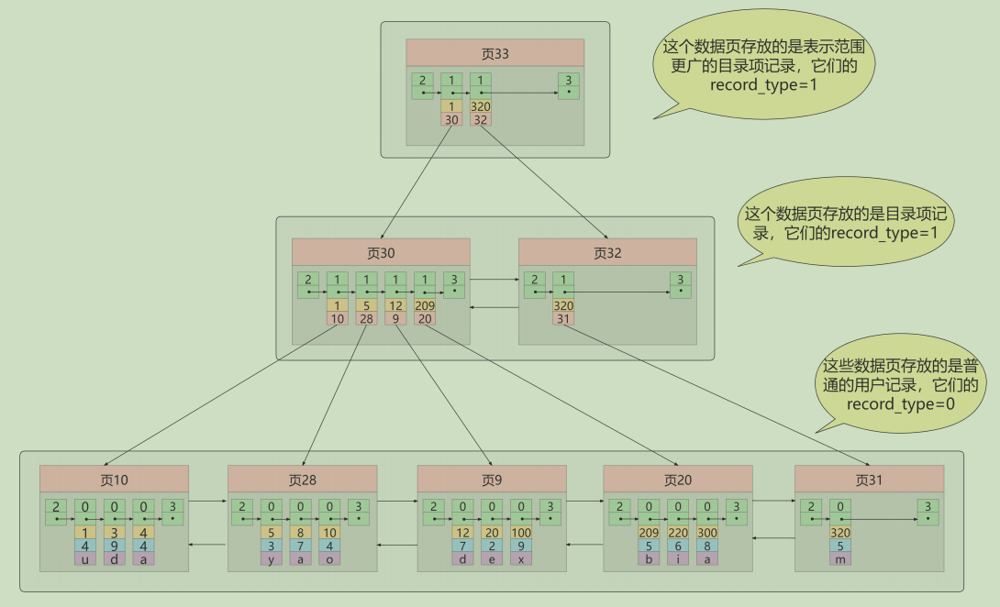
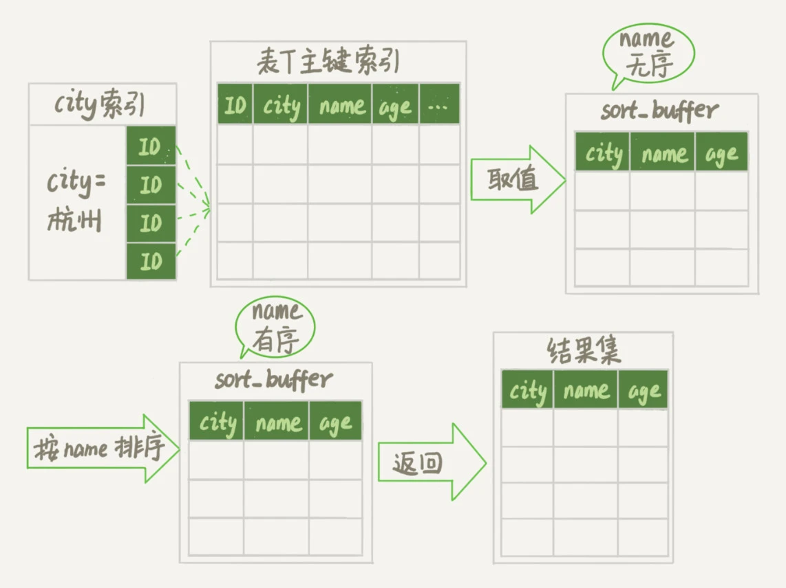
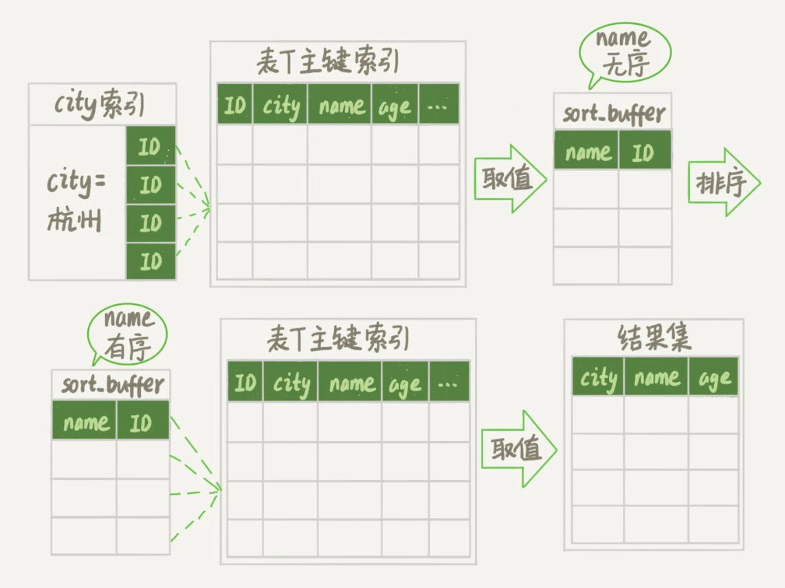
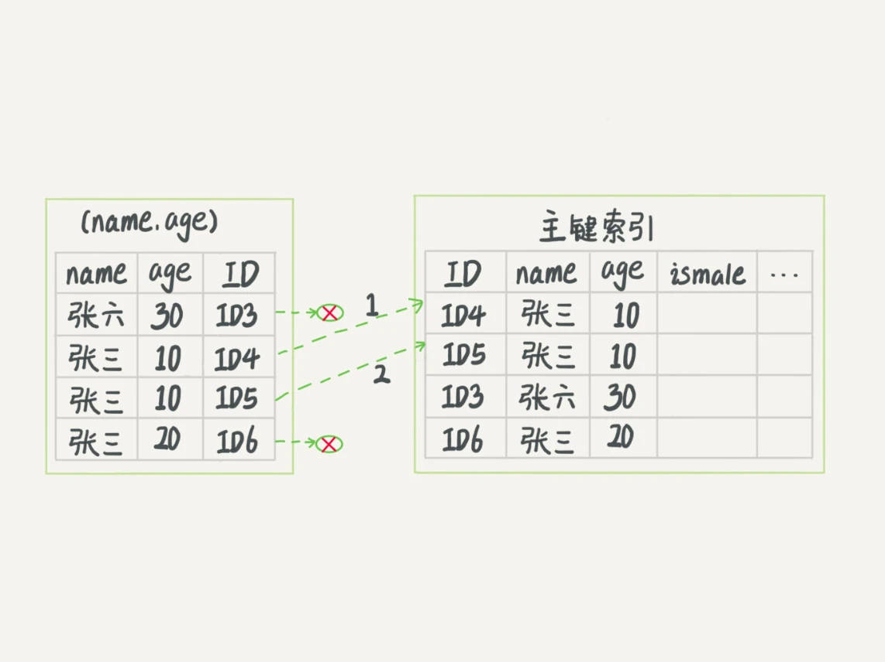

# 索引

索引是帮助Mysql高效获取数据的数据结构。可以理解为排好序的快速查找数据结构。阿里巴巴开发者手册建议单表索引数量控制在5个以内，组合索引字段数不允许超过5个

## 1.1 哪些情况下需要创建索引
1 主键列```自动建立```以主键字段为关键字段的索引  
2 作为 ```where条件过滤或者distinct字段去重```的字段应该建立索引  
3 对分组或者排序的字段进行索引。如果分组或排序的字段有多个，那么可以在这些列上建立组合索引，```注意group by先于order by执行```，所以使用索引也是以group by 相关的字段优先  
4 业务上字段的值有唯一性的限制，即使是组合字段，也必须建成唯一索引。对于插入速度的影响可以忽略，但是对于查找速度的提升很明显  
5 多表 JOIN 连接操作时，创建索引的注意事项  
```
① 连接表的数量尽量不要超过 3 张  
② 对 WHERE 条件创建索引  
③ 对用于连接的字段创建索引，并且该字段在多张表中的类型必须一致
```
6 使用列的类型小的创建索引（tinyInt、mediumInt、Int、BigInt）  
7 使用字符串前缀创建索引，注意使用前缀索引的方式是无法支持使用索引排序，只能使用文件排序  
```
在 varchar 字段上建立索引时，必须指定索引长度，没必要对全字段建立索引，根据实际文本区分度决定索引长度  
可以使用如下语句确定区分度，区分度越高越好  
select count(distinct left(列名, 索引长度)) / count(*)
```
8 区分度高(散列性高)的列适合作为索引  
9 使用```最频繁、区分度最高```的列放到联合索引的左侧  
10 在多个字段都要创建索引的情况下，联合索引优于单值索引  
11 限制索引的数目，建议单张表索引数量不超过6个  

## 1.2 哪些情况下不需要创建索引
1 表记录太少不创建索引  
2 经常增删改的表，因此应该只为经常查询和经常排序的数据列建立索引  
3 where条件里用不到的字段不创建索引  
4 数据重复且分布平均的字段  
5 不建议用无序字段作为索引  
6 不要定义冗余或重复索引

## 1.3 索引分类
1 从功能逻辑上说，索引主要有4种，分别是普通索引、唯一索引、主键索引、全文索引。  
2 按照物理实现方式 ，索引可以分为2种：聚簇索引和非聚簇索引。  
3 按照作用字段个数进行划分，分成单列索引和联合索引。

## 1.4 聚簇索引与非聚簇索引
聚簇索引并不是一种单独的索引类型，而是一种数据存储方式。聚簇索引就是按照每张表的主键构造一颗 B+ 树，同时叶子节点中存放的就是行记录数据，将聚集索引的叶子节点称为数据页，也是索引即数据，数据即索引。  
自行添加的索引都是非聚簇索引，非聚簇索引是一个为了寻找主键索引的二级索引，找到主键索引值再通过主键索引找数据。  
> 相关资料：
> [聚簇索引与非聚簇索引](https://www.cnblogs.com/jiawen010/p/11805241.html)

## 1.5 索引使用注意事项
1 索引不会包含有NULL值的列  
2 使用短索引。对串列进行索引，如果可能应该指定一个前缀长度。例如，如果有一个CHAR(255)的列，如果在前10个或20个字符内，多数值是惟一的，那么就不要对整个列进行索引。
短索引不仅可以提高查询速度而且可以节省磁盘空间和I/O操作。  
3 MySQL查询只使用一个索引，因此如果where子句中已经使用了索引的话，那么order by中的列是不会使用索引的。因此数据库默认排序可以符合要求的情况下不要使用排序操作；
尽量不要包含多个列的排序，如果需要最好给这些列创建复合索引。

## 索引优化
用不用索引，是由优化器决定的。优化器```基于cost开销```，选择开销最小的执行计划。SQL语句是否使用索引，跟数据库版本、数据量、查询列字段都有关系
## 4.1 索引失效
① 不要在索引列上做任何操作（表达式计算、函数式操作、（自动或手动）类型转换），会导致索引失效而转向全表扫描  
② 存储引擎不能使用索引中范围条件右边的列，即范围条件右边的列索引失效  
③ mysql在使用  ```以下连接符``` 时会导致索引失效变成全表扫描操作  
> ①不等于（!=或<>）  
> ②Null值不存储在索引中，因此在索引列上带Is null 条件的查询不会使用索引，而是使用Table Access Full 操作解析查询语句  
> 如果在索引列上改条件为 Is Not Null ，因为索引列的所有非空值都存储在索引中，按道理也是可以走索引的。但是，在大多数情况下，执行全表扫描比为索引返回的所有值执行索引扫描（相关的```Table Access By Index Rowid```操作）效率更高  
> ③or的前后条件中有一个列没有索引，涉及的索引都不会被使用到，可以将or查询改成union all  
> ④in（备注：in里面如果只有一个值，例如：age in(12) 是等同于age=12的，会使用到索引。）  
> ⑤like以通配符开头(如%abc)(解决办法：使用覆盖索引，当建索引的字段和查询的字段一致可以让type由all变成index。当覆盖索引指向的字段是varchar(380)及380以上的字段时，覆盖索引会失效！)

④ 复合索引不满足最左前缀原则会导致索引失效  
⑤ 字符串不加单引号会隐式转换导致索引失效  
⑥ 统一使用utf8mb4(5.5.3版本以上支持)兼容性更好，统一字符集可以避免由于字符集转换产生的乱码。不同的 字符集 进行比较前需要进行 转换 会造成索引失效

# 索引实现原理
```
https://blog.csdn.net/Java_LingFeng/article/details/127703897
https://www.zhihu.com/question/436110377
```
① 减少了IO次数。实现索引的数据结构是B+树，B+树相比B树，特点是叶子节点才存储数据，非叶子节点只存储索引信息，
InnoDB采用的是页作为数据存取的基本单位，每次读取数据要读取一页，也就是一次IO操作，B+树的层高决定了IO的次数。
在非叶子节点不存储数据的好处是在每个非叶子节点存储的索引信息更多，这样在数据量大的时候有助于降低它的层高，减少了IO次数；  
② 具备范围查找能力。叶子节点之间使用```双向指针```进行相连，有顺序性，因此B+树具备范围查找能力，这是hash结构的索引不具备的能力，
但是hash结构实现的索引查找效率比B+树实现的效率还高；  
③ 查询速度稳定。由于B+Tree非叶子节点不存储数据data，因此所有的数据都要查询至叶子节点，而叶子节点的高度都是相同的，
因此所有数据的查询速度都是一样的。每次查找都是走了一条从根到叶子节点的路径；  

# 索引使用注意点
① 全值匹配我最爱
> 查询的字段（比如where条件过滤的字段）可以完全匹配索引中使用到的字段和顺序。如果不能完全匹配索引字段，就需要回表取数据行记录进行判断

② 最左前缀原则
> 原因是建索引的时候，首先是用第一个索引字段去排序，在第一个字段有序的基础上再用第二个字段去排序，那么这样的话从全部数据来看，第二个字段
> 不一定是整体上有序的，所以遵从最左原则可以完全利用索引中第一个字段的顺序性，如果直接用第二个字段去做条件判断，那么优化器不一定选择使用索引

③ 主键插入顺序依次递增，即让主键具有auto_increment属性

④ 数据库和表的字符集统一使用utf8mb4，可以避免由于不同的字符集进行比较前需要进行转换而导致索引失效的问题。
> 表达式计算、函数式操作、类型转换（自动或手动）都会导致索引失效

⑤ 范围条件右边的索引列失效
> 比如：(<)、(<=)、(>)、(>=)和between等。主要是在创建联合索引时，把范围条件涉及的字段写在最后

⑥ 不等于（!=或者<>）会导致索引失效。is null可以使用索引，is not null不可以使用索引。not like也无法使用索引
> 最好在设计数据表的时候将字段设置为not null约束，比如可以将Int类型的字段默认设置为0，将字符类型的默认值设置为空字符串('')

⑦ like以通配符%开头索引失效

⑧ or前后存在非索引的列，索引失效

⑤ 单列索引和组合索引的选用
> 对于单列索引，尽量选择针对当前查询过滤性更好的索引  
> 在选择组合索引的时候，当前查询中过滤性最好的字段在索引字段顺序中，位置越靠前越好  
> 在选择组合索引的时候，尽量选择能够包含当前查询中的where子句中更多字段的索引  
> 在选择组合索引的时候，如果某个字段可能出现范围查询时，尽量把这个字段放在索引次序的最后面

③ 尽量使用覆盖索引（只访问索引的查询，索引列和查询列一致），减少select *
④ 在选择组合索引的时候，当前query中过滤性最好的字段在索引字段顺序中，位置越靠前越好，还要能包含当前query中的where子句中更多字段的索引  
⑤ 尽可能通过分析统计信息和调整query的写法来达到选择合适索引的目的  
⑥ 索引不会包含有null值的列，只要列中包含有null值都将不会被包含在索引中，复合索引中只要有一列含有null值，那么这一列对于此复合索引就是无效的。
所以我们在数据库设计时不要让字段的默认值为null。**（不理解）**  
⑦ 使用短索引，对串列进行索引，如果可能应该指定一个前缀长度。例如，如果有一个char(255)的列，如果在前10个或20个字符内，多数值是惟一的，那么就不要对整个列进行索引。
短索引不仅可以提高查询速度而且可以节省磁盘空间和I/O操作。**（不理解，倒排索引是否更合适）**  
⑧ 索引列排序，查询只使用一个索引，因此如果where子句中已经使用了索引的话，那么order by中的列是不会使用索引的。因此数据库默认排序可以符合要求的情况下不要使用排序操作；
尽量不要包含多个列的排序，如果需要最好给这些列创建复合索引。**（不理解）**

# 查询优化
> 大致可以把查询优化分成两个部分，逻辑查询优化和物理查询优化  
> 物理查询优化则是通过索引和表连接方式来进行优化，重点是索引的使用  
> 逻辑查询优化就是通过SQL等价变化提升查询效率，简单说就是换一种写法的执行效率可能更高

## 步骤
① 开启慢查询日志，设置阈值，比如超过1秒钟的就是慢SQL，然后让系统运行一段时间，将慢SQL抓取出来  
② explain + 慢SQL分析  
③ show profile查询SQL在mysql服务器里面的执行细节和生命周期情况  
④ DBA进行SQL数据库服务器的参数调优

## 关联查询优化
> straight_join可以让MySQL使用固定的连接方式执行查询，这样优化器只会按照我们指定的方式去join  
> 分块join（MySQL默认采用的join方式）和索引join在执行过程中，扫描行数和内存判断次数是不一样的，因此由于不同的原因产生了小表驱动大表这样共同的结论  
> 分块join中，扫描行数是N + K*N*M ，内存判断次数是 M * N  
> K是分块的数量，当join_buffer_size越大的时候，一次可以放入驱动表的行数越多，分成的段数也就越少，对被驱动表的全表扫描次数也就越少

### 左外连接
左连接条件用于确定如何从右表搜索行，左边一定有，所以右表是关键点，右表需要建立索引。保证join语句中```被驱动表```上join条件字段已经被索引，
当无法保证被驱动表的join条件字段被索引且内存资源充足的前提下，不要太吝惜joinBuffer的设置

### 内连接
① 对于内连接来说，查询优化器可以决定谁作为驱动表，谁作为被驱动表出现的  
② 如果表的连接条件中只能有一个字段有索引，那么查询优化器会将该表作为```被驱动表```出现能提高性能  
③ 在两个表的连接条件都存在索引的情况下，会选择小表作为驱动表（内连接优化重点）
> 确定小表的方法：  
> 在决定哪个表做驱动表的时候，应该是两个表按照各自的条件过滤，过滤完成之后，计算参与join的各个字段的总数据量，数据量小的那个表，就是“小表”，应该作为驱动表

### 关联查询总结
保证被驱动表的JOIN字段已经创建了索引  
需要JOIN 的字段，数据类型保持绝对一致。  
LEFT JOIN 时，选择小表作为驱动表， 大表作为被驱动表 。减少外层循环的次数。  
INNER JOIN 时，MySQL会自动将 小结果集的表选为驱动表 。选择相信MySQL优化策略。  
能够直接多表关联的尽量直接关联，不用子查询。(减少查询的趟数)  
不建议使用子查询，建议将子查询SQL拆开结合程序多次查询，或使用 JOIN 来代替子查询。  
衍生表建不了索引  

> ① join效率比较：```INLJ(索引嵌套循环连接)``` > ```BNLJ(块嵌套循环连接)``` > ```SNLJ(简单嵌套循环连接)```  
> ② mysql8.0以上block join（即块嵌套循环连接）被废弃，优化成了hash join  
> ③ 如果可以使用Index Nested-Loop Join算法，也就是说可以用上被驱动表上的索引，其实是没问题的  
> ④ 如果使用Block Nested-Loop Join算法，扫描行数就会过多。尤其是在大表上的join操作，这样可能要扫描被驱动表很多次，会占用大量的系统资源。所以这种join尽量不要用  
> ⑤ 如果要使用join，总是应该使用小表做驱动表：  
> ```因为如果是Index Nested-Loop Join算法，应该选择小表做驱动表；如果是Block Nested-Loop Join算法：在join_buffer_size足够大的时候，是一样的；在join_buffer_size不够大的时候（这种情况更常见），应该选择小表做驱动表```  

> BKA算法（```IBNL```算法的优化）  
> 自5.6版本后，引入BKA算法，其实是对NLJ算法的优化  
> 算法的核心是从驱动表里一次性拿出更多的数据传给被驱动表用作join，临时放驱动表的内存就是join_buffer  
> join_buffer 在BNL算法里的作用，是暂存驱动表的数据。但是在NLJ算法里并没有用。那么，我们刚好就可以复用join_buffer到BKA算法中  
> BNL的优化有两种方式：  
> ① 直接在被驱动表上建索引，大多都能使用上BKA算法  
> ② 在业务端实现，取表t1全部行数据，在业务端存入一个hash结构，然后把t2过滤后的小数据集一行一行的取到业务端，到hash结构的数据表中寻找匹配的数据

### join或者子查询过多
join的执行算法：  
① Index Nested-Loop Join：可以用被驱动表上的索引  
② Block Nested-Loop Join：这种join算法，被驱动表上没有可用的索引，它会先把驱动表的数据读入线程内存join_buffer中，再扫描被驱动表，把被驱动表的每一行取出来，跟Join_buffer中
的数据做对比，满足Join条件的，作为结果集的一部分返回  
③ 一方面，过多的表连接，会大大增加SQL复杂度。另外一方面，如果可以使用被驱动表的索引那还好，并且使用小表来做驱动表，查询效率更佳。如果被驱动表没有可用的索引，
join是在join_buffer内存做的，如果匹配的数据量比较小或者join_buffer设置的比较大，速度也不会太慢。但是，如果join的数据量比较大时，
mysql会采用在硬盘上创建临时表的方式进行多张表的关联匹配，这种显然效率就极低，本来磁盘的 IO 就不快，还要关联。  

① 为被驱动表的JOIN字段增加索引（减少内层表的循环匹配次数）  
② 增大join buffer size的大小（一次缓存的驱动表的数据越多，那么内层的扫表次数就越少）  
③ 减少驱动表不必要的字段查询（字段越少，join buffer所缓存的数据就越多）  
④ 需要JOIN的字段，数据类型保持绝对一致  
⑤ LEFT JOIN时，永远用小结果集驱动大结果集（这样做的本质是减少外层循环次数）  
⑥ INNER JOIN时，Mysql会自动将小结果集的表选为驱动表，选择相信Mysql的优化策略  
⑦ 能够直接多表关联的尽量直接关联（减少查询次数）  
⑧ 将子查询SQL拆开结合程序多次查询，不建议使用子查询，或者使用join来代替子查询  
⑨ 衍生表建不了索引

## MRR
大多数的数据都是按照主键递增顺序插入得到的，所以我们可以认为如果按照主键递增顺序查询的话，对磁盘的读取比较接近顺序读，能够提升读数据性能  
MRR能够提升性能的核心在于，这条查询语句在索引a上做的是一个范围查询（也就是说，这是一个多值查询），可以得到足够多的主键id。这样通过排序以后，再去主键索引查数据，才能体现出“顺序性”的优势  

## 子查询优化
子查询的执行效率不高，原因是：  
① 执行子查询时，MySQL需要为内层查询语句的查询结果建立一个临时表，然后外层查询语句从临时表中查询记录。查询完毕后，再撤销这些临时表。这样会消耗过多的CPU和IO资源，产生大量的慢查询  
② 子查询的结果集存储的临时表，不论是内存临时表还是磁盘临时表都不会存在索引，所以查询性能会受到一定的影响  
③ 对于返回结果集比较大的子查询，其对查询性能的影响也就越大  

> 尽量不使用not in或者not exists，用left join XXX on XX WHERE XX is null替代

## 排序优化
```
https://mp.weixin.qq.com/s?__biz=Mzg3NzU5NTIwNg==&mid=2247490571&idx=1&sn=e8638573ec8d720fd25da5b2b0d90ed2&chksm=cf21c322f8564a34461acd9811730d14d12075cf5c7438a3a11433725b9ce463fcb78e7916a1&token=574771970&lang=zh_CN&scene=21#wechat_redirect
```
【排序方式一：Index排序方式】  
> Index排序中，索引可以保证数据的有序性，不需要再进行排序，效率更高  

【排序方式二：FileSort排序方式】  
> FileSort排序则一般在内存中进行排序，占用CPU较多。如果待排结果较大，会产生临时文件I/O到磁盘进行排序的情况，效率较低

① 全字段排序：即将查询列表中所有字段放入sort buffer中，然后根据指定字段排序  


② rowId排序：放入sort buffer中的只有排序字段和主键Id，相比上面的方式，多了一次回表的操作  


> 通过optimizer_trace查看是否使用了rowId排序  
> ① 打开optimizer_trace，开启统计  
> set optimizer_trace = "enabled=on";  
> ② 执行SQL语句  
> select name,age,city from staff where city = '深圳' order by age limit 10;
> ③ 查询输出的统计信息  
> select * from information_schema.optimizer_trace

> ```SET max_length_for_sort_data = 16;```是MySQL中控制用于排序的行数据的长度的一个参数。如果单行的长度超过这个值，MySQL就认为单行太大，会使用rowId排序，反之走全字段排序  
> ```sort_buffer_size```：如果要排序的数据小于这个值，排序在sort_buffer中完成，否则借助于磁盘文件进行排序  

③ 磁盘临时文件辅助排序。借助磁盘文件排序的话，效率就更慢一点。因为先把数据放入sort_buffer，当快要满时。会排一下序，然后把sort_buffer中的数据，放到临时磁盘文件，
等到所有满足条件数据都查完排完，再用归并算法把磁盘的临时排好序的小文件，合并成一个有序的大文件。  
借助磁盘临时小文件排序，实际上使用的是归并排序算法

> 如何确定是否使用了磁盘文件来进行排序呢？可以从 number_of_tmp_files 表示使用来排序的磁盘临时文件数  
> ① 打开optimizer_trace，开启统计  
> set optimizer_trace = "enabled=on";  
> ② 执行SQL语句  
> select name,age,city from staff where city = '深圳' order by age limit 10;  
> ③ 查询输出的统计信息  
> select * from information_schema.optimizer_trace  

> 从主键Id索引树，拿到需要的数据，并放到sort_buffer内存块中。当sort_buffer快要满时，就对sort_buffer中的数据排序，排完后，把数据临时放到磁盘一个小文件中。
> 继续回到主键 id 索引树取数据，继续放到sort_buffer内存中，排序后，也把这些数据写入到磁盘临时小文件中。
> 继续循环，直到取出所有满足条件的数据。最后把磁盘的临时排好序的小文件，合并成一个有序的大文件。

【没有where条件，order by字段加索引是否生效】  
① ```select * from A order by create_time;```  
无条件查询的话，即使create_time上有索引,也不会使用到。因为MySQL优化器认为走普通二级索引，再去回表成本比全表扫描排序更高。所以选择走全表扫描,然后根据全字段排序或者rowId排序来进行。  
② ```select * from A order by create_time limit m;```  
无条件查询,如果m值较小,是可以走索引的.因为MySQL优化器认为，根据索引有序性去回表查数据,然后得到m条数据,就可以终止循环,那么成本比全表扫描小,则选择走二级索引。  

【索引存储顺序与order by不一致】  
MySQL是8.0版本，支持Descending Indexes  

【使用了in条件多个属性时，SQL执行是否有排序过程】  
```
// 联合索引idx_city_name
select * from staff where city in ('深圳') order by age limit 10;                  // 不会走排序过程
select * from staff where city in ('深圳','上海') order by age limit 10;            // 会有排序过程

in有两个条件，在满足深圳时，age是排好序的，但是把满足上海的age也加进来，就不能保证满足所有的age都是排好序的。因此需要Using filesort
```

【排序优化总结】  
① SQL中，可以在WHERE子句和ORDER BY子句中使用索引，目的是在WHERE子句中避免全表扫描，在ORDER BY子句避免使用FileSort排序。当然，某些情况下全表扫描，或者FileSort排序不一定
比索引慢。但总的来说，我们还是要避免，以提高查询效率  
② 尽量使用Index完成ORDER BY排序。如果WHERE和ORDER BY后面是相同的列就使用单索引列，如果不同就使用联合索引  
③ 无法使用Index时，需要对FileSort方式进行调优【尝试提高sort_buffer_size大小、尝试提高max_length_for_sort_data】  
④ order by时规则不一致（索引字段顺序不符，或者索引字段方向相反），会导致索引失效  
⑤ 当【范围条件】和【group by或者order by】的字段出现二选一时，优先观察条件字段的过滤数量，如果过滤的数据足够多，而需要排序的数据并不多时，
优先把索引放在范围字段上（此时extra可能会出现```using filesort```，但是性能依然是很高的，因为此时只有少量数据在内存中被排序），反之亦然  
⑥ 多个索引同时存在时，MySQL会自动选择最优的方案。但是，**随着数据量的变化，选择的索引也会随之变化的**  

> 【fileSort算法】  
> ① 双路排序  
> 从磁盘先取排序字段，在buffer进行排序后，再从磁盘取其他字段  
> ② 单路排序  
> 从磁盘取查询需要的所有列，按照order by列在buffer对他们进行排序，然后将扫描排序后的列表进行输出。这种方式效率更快，避免了第二次读取数据  
>
> 单路排序要比多路排序占用更多空间。在优化时，尝试提高sort_buffer_size大小对两种算法效率都有提升。  
> 尝试提高max_length_for_sort_data，如果需要返回的列的总长度大于max_length_for_sort_data，使用双路算法，否则使用单路算法，所以select *可能超过总长度，导致不能使用单路算法  

排序优化总结：  
① 因为数据是无序的，所以就需要排序。如果数据本身是有序的，那就不会再用到文件排序啦。而索引数据本身是有序的，我们通过建立索引来优化order by语句。  
② 我们还可以通过调整max_length_for_sort_data、sort_buffer_size等参数优化

## order by关键字优化
①order by子句，尽量使用index方式排序，避免使用file sort方式排序
> MySQL支持两种方式的排序：FileSort和Index。Index效率高，它指MySQL扫描索引本身完成排序。FileSort方式效率较低。  
> Order By满足两种情况，会使用Index方式排序：  
> ①Order by语句使用索引最左前列  
> ②使用where子句与order by子句条件组合满足索引最左前列

②尽可能在索引列上完成排序操作，遵照索引建的最佳左前缀法则。如果不在索引列上，FileSort有两种算法：双路排序和单路排序。
> 双路排序：
> MySQL4.1之前使用双路排序，字面意思是两次扫描磁盘，最终得到数据。读取行指针和order by列，对他们进行排序，然后扫描已经排序好的列表，
> 按照列表中的值重新从列表中读取对应的数据传输。从磁盘排序字段，在buffer进行排序，再从磁盘取其他字段  
> 单路排序：  
> 从磁盘读取查询需要的所有列，按照order by列在buffer对他们进行排序，然后扫描排序后的列表进行输出，它的效率更快一些，避免了第二次读取数据，并且把
> 随机IO变成顺序IO，但是它会使用更多的空间，因为它把每一行都保存在内存中了。
> 
>
> 总结：  
> ①增大sort_buffer_size参数的设置  
> ②增大max_length_for_sort_data参数的设置  
> 

## GROUP BY优化
```
https://mp.weixin.qq.com/s?__biz=Mzg3NzU5NTIwNg==&mid=2247497527&idx=1&sn=1f30251d88b0e935bfffc3e8eaf53f28&chksm=cf22281ef855a1084fe84a7b257db5734c7b982c6ddaf9ef497d4e31e60faebd5f329e3c55a6&token=352114508&lang=zh_CN&scene=21#wechat_redirect
```
> ①group by实质是先排序后进行分组，遵照索引建的最佳左前缀  
> ②当无法使用索引列，增大max_length_for_sort_data参数的设置+增大sort_buffer_size参数的设置
> ③where高于having，能写在where限定的条件就不要去having限定了

##### group by慢的原因
① 既用到临时表（分为内存临时表和磁盘临时表），又默认用到排序，用到磁盘临时表时性能更低；  
② 如果执行过程中，发现内存临时表大小到达了上限（控制这个上限的参数就是tmp_table_size），会把内存临时表转成磁盘临时表；  

##### group by优化思路
① 默认用到排序，如果业务允许，不给它排序  
② 不用临时表。临时表被用来记录并统计结果，如果这些值一开始就是有序的，直接往下扫描就行，无需用到临时表统计结果

##### group by优化方案
① group by 后面的字段加索引，保证数据有序性，无需进行排序了，GROUP BY使用索引的原则几乎跟ORDER BY一致   
② 如果需求不需要对结果集进行排序，可以使用```order by null```  
③ 当无法使用内存临时表时，可以适当调大```tmp_table_size```参数，来避免用到磁盘临时表  
④ where效率高于having，能写在where限定的条件就不要写在having中了  
⑤ 预估数据量非常大时，直接使用```sql_big_result```进行优化，设置这个参数之后，会直接用数组来存数据（MySQL服务器发现磁盘临时表是B+树存储，存储效率不如数组来得高。因此会直接用数组来存）
> ```select SQL_BIG_RESULT city ,count(*) as num from staff group by city;```
> 执行流程如下：  
> ① 初始化 sort_buffer，放入city字段；  
> ② 扫描表staff，依次取出city的值,存入 sort_buffer 中；  
> ③ 扫描完成后，对 sort_buffer的city字段做排序；  
> ④ 排序完成后，就得到了一个有序数组；  
> ⑤ 根据有序数组，统计每个值出现的次数。

## order by和group by
① 减少使用order by，和业务沟通能不排序就不排序，或将排序放到程序段去做。因为oder by、group by、distinct这些语句较为耗费CPU，数据库的CPU资源是极其宝贵的  
② 包含了order by、group by、distinct这些查询的语句，一是尽量将排序放到程序段去做；二是保证where条件过滤出来的结果集请保持在1000行以内，否则SQL会很慢

## 深分页查询优化
思路1：  延迟关联法
```sql
-- 在索引上完成排序分页操作，最后根据主键关联回原表查询所需要的其他列内容
select * from student t,(select id from student order by id limit 2000000 5) a where t.id = a.id;
```

思路2：标签记录法
```sql
-- 适用于主键自增的表，可以把limit查询转换成某个位置的查询，这种翻页方式只支持上一页、下一页，不支持跨越式翻页
select * from student where id > 2000000 limit 10;
```

> 当偏移量最大的时候，查询效率就会越低，因为Mysql并非是跳过偏移量直接去取后面的数据，而是先把偏移量+要取的条数，然后再把前面偏移量这一段的数据抛弃掉再返回的。  
> 如果使用优化方案一，返回上次最大查询记录（偏移量），这样可以跳过偏移量，效率提升不少。  
> 方案二使用order by+索引，也是可以提高查询效率的。  
> 方案三的话，建议跟业务讨论，有没有必要查这么后的分页啦。因为绝大多数用户都不会往后翻太多页。

## 覆盖索引
覆盖索引可以减少回表次数，显著提升查询性能，所以使用覆盖索引是一个常用的性能优化手段  

总结：  
① 避免InnoDB表进行索引的回表操作  
② 可以把随机IO变成顺序IO加快查询效率。通过索引查找数据，若是覆盖索引，不需要回表操作（回表可能是对磁盘的随机读取的IO查找操作），那么访问时就是顺序IO查找  

## 字符串前缀索引
使用前缀索引，定义好长度，就可以做到既节省空间，又不用额外增加太多的查询成本。
>①问题是可能会增加记录扫描次数  
>②使用前缀索引就用不上覆盖索引对查询性能的优化了

选取重复率最低的前缀索引：```select 1.0*count(distinct left(name,4))/count(*) from test;```  
添加前缀索引：```alter table test add key(name(4));```

> 前缀的区分度不够好的情况时，例如身份证号字段  
> ①使用倒序存储  
> ②使用hash字段：在表上再创建一个整数字段，来保存身份证的校验码，同时在这个字段上创建索引  
> 上面两种方式都不支持范围查询，

## 最左前缀原则
① 因为支持最左前缀，所以当已经有了(a,b)这个联合索引后，一般就不需要单独在a上建立索引了。即通过调整顺序，可以少维护一个索引，那么这个顺序往往就是需要优先考虑采用的。  
② 最左前缀可以是联合索引的最左N个字段，也可以是字符串索引的最左M个字符。  
③ 有基于a,b各自的查询，又查询条件里面只有b的语句，这是无法使用(a,b)这个联合索引的，建议维护(a,b)、(b)这两个索引。  

## 索引下推
```sql
select * from student where key1 > 'z' and key1 like '%a'
```
mysql5.6以前，根据索引找到记录（在普通索引树的叶子节点存的是主键id值）后需要回表，到主键索引上找出数据行，再对比字段值。  
mysql5.6引入的索引下推优化，可以在索引遍历过程中，对索引中包含的字段先做判断，直接过滤掉不满足条件的记录，减少回表次数。  


```
-- 开启索引下推（默认开启）
set optimizer_switch = 'index_condition_pushdown=on';

-- 或者执行SQL语句时指定不使用索引下推
select /** no_icp (people) */ * from people where zipcode = "00001" and lastname like "%张%";
```

ICP使用条件：  
① 如果表访问类型是range、ref、eq_ref和ref_or_null可以使用icp  
② icp可以用于innodb和myisam表，包括分区表innodb和myisam表  
③ 对于innodb表，icp仅用于二级索引。icp的目标是减少全行读取次数，从而减少i/o操作  
④ 当sql使用覆盖索引时，不支持icp，因为这种情况下使用icp不会减少i/o  
⑤ 相关子查询（比如exists）的条件不能使用icp

## 普通索引 vs 唯一索引
① 对于普通索引来说，查找到满足条件的第一个记录后，需要查找下一个记录，直到碰到第一个不满足条件的记录。  
对于唯一索引来说，由于索引定义了唯一性，查到第一个满足条件的记录后，就会停止继续检索。这个差异对性能的影响很小  

② 唯一索引的更新不能使用change buffer，实际上也只有普通索引可以使用  

## 选错索引的优化
优化器选择索引时需要判断【索引统计信息，扫描行数，还会结合是否使用临时表、是否排序等因素】进行综合判断。  
当explain的结果预估的rows值和实际情况相差较大时，用analyze table t命令可以重新统计索引信息，帮助优化器在选择正确的索引时提供判断信息。

## 其他查询优化策略
##### Exists和In的区分：永远小表驱动大表
1、in
```
select * from A where id in (select id from B)
```
*当B表的数据集小于A表的数据集时，用in优于exists*
2、exists
```
select * from A where exists (select 1 from B where B.id = A.id)
```
*当A表的数据集小于B表的数据集时，用exists优于in*
理解：将主查询的数据，放到子查询中做条件验证，根据验证结果（TRUE或FALSE）来决定主查询的数据结果是否得以保留。  
注意：  
①EXISTS(subQuery)只返回TRUE或FALSE，因此子查询中的SELECT *也可以是SELECT 1或SELECT 'X'，官方说法是实际执行时会忽略SELECT清单，因此没有区别  
②EXISTS子查询的实际执行过程可能经过了优化而不是我们理解上的逐条对比，如果担忧效率问题，可进行实际校验以确定是否有效率问题  
③EXISTS子查询往往也可以用条件表达式、其他子查询或者JOIN来替代，何种最优需要具体问题具体分析

##### count(*)、count(1)、count(主键字段)、count(非主键字段)效率  
count(*)、count(1)本质上并没有区别。但是在不同存储引擎里，myisam统计数据表行数只需要O(1)复杂度，innodb需要采用全表扫描，所以是O(n)的复杂度。  
在innodb引擎中，count(具体字段)，尽量采用二级索引，因为聚簇索引包含的信息比二级索引多。对于count(*)和count(1)，不需要查找具体的行，只是统计行数，
系统会自动采用占用空间更小的二级索引来进行统计

##### limit 1对优化的影响
全表扫描时，当确定结果集只有一条，加上limit 1，这样当找到一条结果的时候就不会继续扫描了，这样会加快查询速度  
但是如果数据表已经建立了唯一索引，那么可以通过索引进行查询，不会全表扫描的话，就不需要加上limit 1了

##### select(*)
在表查询中，建议明确字段，不要使用*作为查询的列表字段  
① mysql在查询过程中，会通过```查询数据字典```将"*"转换成所有列名，这会耗费资源和时间  
② 不能使用到覆盖索引对查询性能的优化

##### 多使用commit
多使用commit，能提高程序性能，需求也会因为commit所释放的资源而减少  
commit可以释放如下资源：  
① 回滚段上用于恢复数据的信息  
② 被程序语句获得的锁  
③ redo/undo log buffer中的空间

##### change buffer的使用
① 普通索引和唯一索引在查询能力上没太大的差别。即使用普通索引时，查找的下一个记录在不同的数据页上，可能会复杂一些。但是整体平均性能差异可以忽略不计。  
对更新语句的影响：当需要更新一个数据页时，如果数据页在内存中就直接更新，而如果这个数据页还没有在内存中的话，在不影响数据一致性的前提下，InnoDB会将这些更新操作缓存在
change buffer中，这样就不需要从磁盘中读入这个数据页了。在下次查询需要访问这个数据页的时候，将数据页读入内存，然后执行change buffer中与这个页有关的操作。
通过这种方式就能保证这个数据逻辑的正确性。将change buffer中的操作应用到原数据页，得到最新结果的过程称为merge。除了访问这个数据页会触发merge外，系统有后台线程会定期merge。
在数据库正常关闭（shutdown）的过程中,也会执行merge操作。  
② 在实际使用中，普通索引和change buffer的配合使用，对于数据量大的表的更新优化还是很明显的。如果所有更新后面，都马上伴随着对这个记录的查询操作，那么应该关闭change buffer。  
但是在其他情况下，change buffer都能提升更新性能  
③ 由于唯一索引用不上change buffer的优化机制，因此在业务允许情况下，从性能角度出发建议优先考虑非唯一索引

> 【什么条件下可以使用change buffer呢】  
> 唯一索引的更新不能使用change buffer，因为要先判断表中是否已经存在待插入的记录，这就必须将数据页读入内存才能判断，但是如果都已经读入内存了，那么直接更新内存会更快，就没必要使用change buffer了。
> 实际上也只有普通索引可以使用。  
> change buffer用的是buffer pool里的内存，因此不能无限增大。change buffer的大小，可以通过参数innodb_change_buffer_max_size来动态设置。
> 这个参数设置为50的时候，表示change buffer的大小最多只能占用buffer pool的50%。  
> 【change buffer的副作用】  
> ①如果所有的更新后面，都马上伴随着对这个记录的查询，那么你应该关闭change buffer。而在其他情况下，change buffer都能提升更新性能。  
> ②change buffer的主要目的就是将记录的变更动作缓存下来，所以在一个数据页做merger之前，change buffer记录的变更越多（也就是这个页面上更新的次数越多），收益就越多。  
> ③当写完以后马上被访问到的概率比较小，此时change buffer的使用效果最好。反之写入之后马上做查询，那么由于马上访问这个数据页，会立即触发merge过程。这样随机访问IO的次数不会减少，
> 反而增加了change buffer的维护代价，所以起到了副作用。  
> 【redo log和change buffer的对比】  
> redo log 主要节省的是随机写磁盘的IO消耗（转成顺序写），而change buffer主要节省的则是随机读磁盘的IO消耗。

---------------------------------------------------------------------------------------------
① 对被驱动表进行全表扫描，会把冷数据的page加入到buffer pool.,并且block nested-loop要扫描多次，两次扫描的时间可能会超过1秒，使lru的那个优化失效，
把热点数据从buffer pool中淘汰掉，影响正常业务的查询效率

查询很慢的可能原因
①等待MDL锁：
②等Flush  
③等行锁
---------------------------------------------------------------------------------------------
