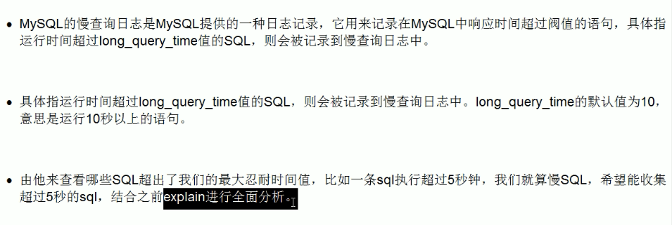

# 观察SQL语句性能
### 查询优化器（MySQL Query Optimizer）
1、MySQL中有专门负责优化SELECT语句的优化器模块，主要功能：通过计算分析系统中收集到的统计信息，为客户端请求的Query提供
他认为最优的执行计划（他认为最优的数据检索方式，但不见得是DBA认为最优的，这部分最耗费时间）  
2、当客户端向MySQL请求一条Query，命令解析器模块完成请求分类，区别出是SELECT并转发给MySQL Query Optimizer时，MySQL Query Optimizer首先会对整条Query进行优化，
处理掉一些常量表达式的预算，直接换算成常量值。并对Query中的查询条件进行简化和转换，如去掉一些无用或显而易见的条件、结构调整等。

### 统计SQL的查询成本
```sql
-- 统计SQL查询页的数量，当有多种可选查询方式时，可以用他来进行比较开销
show status like 'last_query_cost'
```

### 慢查询日志

默认情况下，MySQL数据库没有开启慢查询日志，需要我们手动来设置这个参数。当然，如果不是调优需要的话，一般不建议启动该参数，因为开启慢查询日志会或多或少带来一定的性能影响。慢查询日志
支持将日志记录写入文件。
```
-- 设置慢查询时间阈值
show variables like '%long_query_time%';
-- 设置慢查询扫描过的最少记录数，一般为0行
show variables like '%min_examined_row_limit%';

-- 以上两个参数可以控制超过了指定时间，并且在指定时间内结果行数大于指定行则是慢查询SQL

-- 查看慢查询日志是否开启以及日志文件的位置，默认情况下慢查询日志是禁用的
show variables like '%slow_query_log%'
-- 开启了慢查询日志，只对当前数据库有效，如果mysql重启后则会失效
set global slow_query_log=1
-- 永久生效的办法，修改my.cnf文件，将当前行和下一行加入
slow_query_log = 1
-- 指定慢查询日志文件的存放路径，在没有指定该参数时，系统会默认给一个缺省的文件host_name-slow.log
slow_query_log_file = /var/lib/mysql/atguigu-slow.log
-- 判断大于long_query_time的值会被记录下来，默认是10秒
show variables like '%long_query_time%'
-- 修改慢SQL阈值为3秒钟
set global long_query_time=3
-- 查看当前系统中有多少条慢SQL
show global status like '%Slow_queries%'
```

###### 日志分析工具mysqlDumpSlow
① -a: 不将数字抽象成N，字符串抽象成S  
② -s：表示按何种方式排序  
c：访问次数  
l：锁定时间  
r：返回记录  
t：查询时间  
al：平均锁定时间  
ar：平均返回记录数  
at：平均查询时间  
③ -t：即为返回前面多少条的数据  
④ -g：后边搭配一个正则匹配模式，大小写是不敏感的

常用参考：  
①得到返回记录集最多的10个SQL
```mysqldumpslow -s r -t 10 /var/lib/mysql/atguigu-slow.log```   
②得到访问次数最多的10个SQL
```mysqldumpslow -s c -t /var/lib/mysql/atguigu-slow.log```   
③得到按照时间排序的前10条里面含有左连接的查询语句
```mysqldumpslow -s t -t 10 -g "left join" /var/lib/mysql/atguigu-slow.log```   
④另外建议在使用这些命令时结合|和more使用，否则有可能出现爆屏情况
```mysqldumpslow -s r -t 10 /var/lib/mysql/atguigu-slow.log | more```

##### 重新生成慢查询日志文件
```
-- 慢查询日志都只存在新的日志文件中，如果需要旧的查询日志，就必须事先备份
mysqladmin -uroot -p flush-logs slow
```

# show profiles
查看方法：```show variables like 'profiling';```   
mysql提供可以用来分析当前会话中语句执行的资源消耗情况，可以用于SQL的调优测量。默认情况下，参数处于关闭状态，并保存最近15次的运行结果。  
使用步骤：  
①show profiles;  
②show profile cpu,block io for query 上一步数字;
> 参数说明：  
> type：
> ALL               -- 显示所有的开销信息  
> BLOCK IO          -- 显示块IO相关开销  
> CONTEXT SWITCHES  -- 上下文切换相关开销  
> CPU               -- 显示CPU相关开销信息  
> IPC               -- 显示发送和接收相关开销信息  
> MEMORY            -- 显示内存相关开销信息  
> PAGE FAULTS       -- 显示页面错误相关开销信息  
> SOURCE            -- 显示和Source_function，Source_file，Source_line相关的开销信息  
> SWAPS             -- 显示交换次数相关开销的信息

## 日常开发注意点
① converting HEAP to MyISAM：查询结果太大，内存都不够用了往磁盘上搬  
② creating tmp table：创建临时表，先拷贝数据到临时表，再用完删除  
③ copying to tmp table on disk：把内存中临时表复制到磁盘  
④ locked
如果show profile诊断结果中出现了以上一条，则SQL都需要优化

# Explain
使用```explain```关键字可以模拟优化器执行SQL语句，从而知道MySQL是如何处理你的SQL语句的。即能分析你的查询语句或结构的性能瓶颈

## 能干嘛？
表的读取顺序、数据读取操作的操作类型、哪些索引可以使用、哪些索引被实际使用、表之间的引用、每张表有多少行被优化器查询

## 各字段解释
| 字段名称 | 解释 |
| --- | ---|
| id  | select查询的序列号，包含一组数字，表示查询中执行select子句或操作表的顺序 |
|   |   id如果相同，可以认为是一组，从上往下顺序执行。在所有组中，id值越大，优先级越高，越先执行。注意：id每个数字，表示一趟独立的查询，一个sql的查询次数越少越好 |
| select_type | select关键字对应的查询的类型，主要用于区别普通查询、联合查询、子查询等复杂查询 |
|   |   可以通过该字段知道小查询在整个大查询中扮演了一个什么角色 |
| table | 显示explain结果的一行数据是关于哪张表的，前面的是驱动表，后面的是被驱动表 |
| type | 显示查询单表的访问方法；从最好到最差依次是：system>const>eq_ref>ref>range>index>All |
| possible_keys | 显示可能应用在这张表中的索引，一个或多个。查询涉及的字段上若存在索引，则该索引将被列出，但不一定被查询实际使用 |
| key | 实际使用的索引。如果为null则没有使用索引。查询中若使用了覆盖索引，则索引和查询的select字段重叠 |
| key_len | 实际上使用到的索引长度。**在不损失精确性的情况下，长度越长越好** |
|   |   针对联合索引有参考意义。key_len显示的值为索引最大可能长度，并非实际使用长度，即key_len是根据表定义计算而得，不是通过表内检索出的 |
| ref | 当使用索引列进行等值查询时，与索引列进行等值匹配的对象信息。可以是一个常数或者某个列 |
| rows | 根据表统计信息及索引选用情况，大致估算出找到所需记录所需要读取的行数 |
| filtered | 某个表经过搜索条件过滤后剩余记录条数的百分比 |
| Extra | 一些额外的信息 |

> type详解  
> ① const  
> 当根据主键或者唯一二级索引列与常数进行等值匹配时，对单表的访问方法就是const  
> 
> ① eq_ref  
> 在连接查询时，如果被驱动表是通过主键或者唯一二级索引列等值匹配的方式进行访问的（如果该主键或者唯一二级索引是联合索引的话，所有的索引列都必须进行等值比较），则对该驱动表的访问方法是eq_ref  
> ``` EXPLAIN SELECT * FROM s1 INNER JOIN s2 ON s1.id = s2.id; ```  
> 如果mysql将s2作为驱动表，s1作为被驱动表，而此时s1的访问类型是eq_ref，表明在访问s1表的时候可以```通过主键的等值匹配```来进行访问  
> 
> ② ref  
> 当通过普通的二级索引列与常量进行等值匹配时来查询某个表，那么对该表的访问方法就可能是ref  
> ``` EXPLAIN SELECT * FROM s1 WHERE key1 = 'a'; ```  
> 
> ③ index_merge
> ```select * from student where key1 = 'a' or key3 = 'b';```
> 单表在某些场景下可能会进行索引合并，以index_merge的访问方法来执行查询
> 
> ③ range  
> 如果使用索引获取某些范围区间的记录，那么就可能使用到range的访问方法
> ``` SELECT * FROM s1 WHERE key1 IN ('a', 'b', 'c'); ```  
> ``` SELECT * FROM s1 WHERE key1 > 'a' AND key1 < 'b'; ```  
> 
> ④ index  
> 当我们可以使用索引覆盖，但需要遍历索引树
> ``` SELECT key_part2 FROM s1 WHERE key_part3 = 'a'; ```  
> 
> ⑤ All

> Extra详解  
> ① Using fileSort  
> MySQL有两种方式可以生成有序的结果，通过文件排序操作或者使用索引，当Extra中出现了Using fileSort 说明MySQL使用了前者。  
> 但注意虽然叫fileSort但并不是说明就是用了磁盘文件来进行排序（当数据量较大时才会采用），也可能排序是在内存里完成的（数据量较少时）。  
> 利用索引进行排序更快，所以一般出现```using filesort```时要考虑优化查询，可以通过选择合适的索引来改进性能，用索引来为查询结果排序。  
> 使用文件完成排序操作，可能是order by，group by语句的结果  
> 
> ② Using temporary  
> 在查询过程中，如果不能有效利用索引来完成查询，MySQL可能会借助临时表来完成一些功能，比如去重、排序等，常用于DISTINCT、GROUP BY 、 ORDER BY、UNION操作中  
> 临时表被用来保存中间结果，一般看到它说明查询需要优化了，就算避免不了临时表的使用也要尽量避免硬盘临时表的使用。  
> 
> ③ Using index  
> 当查询列表以及搜索条件中只包含属于某个索引的列。  
> 如果同时出现using where，表明索引被用来执行索引键值的查找；如果没有同时出现using where，表明索引用来读取数据而非执行查找动作。  
> 
> ④ Using where  
> 表明使用了where过滤  
> 
> ⑤ using index condition  
> 使用到索引下推进行优化  
> 
> ⑤ Using join buffer  
> 在连接查询执行过程中，当被驱动表不能有效的利用索引加快访问速度，MySQL一般会为其分配一块名叫join buffer的内存块来加快查询速度。也就是使用到了连接缓存  
> 
> ⑥ impossible where  
> where子句的值总是false，不能用来获取任何元组；  


