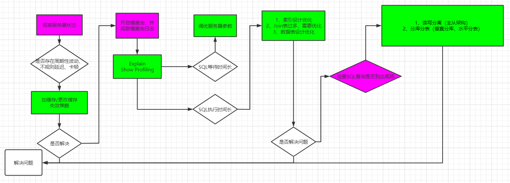

# 查看系统性能参数
SHOW STATUS 语句查询一些MySQL数据库服务器的 性能参数 、 执行频率
```sql
SHOW [GLOBAL|SESSION] STATUS LIKE '参数';
```
一些常用的性能参数如下：  
Connections：连接MySQL服务器的次数  
Uptime：MySQL服务器的上线时间  
**Slow_queries：慢查询的次数**  
Innodb_rows_read：Select查询返回的行数  
Innodb_rows_inserted：执行INSERT操作插入的行数  
Innodb_rows_updated：执行UPDATE操作更新的行数  
Innodb_rows_deleted：执行DELETE操作删除的行数  
Com_select：查询操作的次数  
Com_insert：插入操作的次数，对于批量插入的 INSERT 操作，只累加一次  
Com_update：更新操作的次数  
Com_delete：删除操作的次数

### 查看SQL执行成本
```sql
SHOW STATUS LIKE 'last_query_cost';
```
```sql
show profiles;
```

# 数据库调优
### 调优的目标
① 尽可能节省系统资源，以便系统可以提供更大负荷的服务能力（吞吐量更大）  
② 合理的结构设计和参数调整，以提高用户操作的响应速度（响应速度更快）  
③ 减少系统的瓶颈，提高MySQL数据库整体的性能  

### 调优的维度
① 选择合适的DBMS  

② 优化表设计  
尽量遵循三范式原则。可以采用反范式进行优化。选择合适的表字段类型  

③ 优化逻辑查询  
对SQL语句进行优化，避免关联查询太多join  

④ 优化物理查询  
建立合适索引，避免索引失效  

⑤ 使用redis或memcached作为缓存  

⑥ 库级优化  
服务器调优及各个参数的设置，比如缓冲池大小，线程数等（可以调整my.cnf）  
> 例如：  
> 调整innodb_flush_log_at_trx_commit，把这个参数设置成2，这样不用每次提交事务的时候都读写磁盘，在并发场景下，可以降低CPU使用率，即使故障，损失数据也比较小  
> 调整innodb_buffer_pool_size值变大，这样缓冲池能存储的索引和数据就越多，需要的磁盘读写就越少，可以大幅降低读写磁盘次数  
> 调整innodb_buffer_pool_instances个数，将缓冲池分成几个部分，这样可以提高系统的并行处理能力（即多个进程同时进行数据操作），能提升CPU效率

数据量过多时（读写分离、分库分表）  

### 调优的大致步骤
1 打开慢查询日志相关  
```
① 慢查询日志开启参数：```slow_query_log```（是global级参数）  
② 慢查询的时间阈值：```long_query_time```（既是global级又是session级参数）  
③ ```SHOW GLOBAL STATUS LIKE '%Slow_queries%';``` 查询当前系统中有多少条慢查询记录  
④ ```min_examined_row_limit``` 查询扫描过的最少记录数  
```

2 mysqlDumpSlow  

3 show Profiles  
通过```show profiles```命令获取query Id后，再执行```show profile for query Id```，可以查看sql语句在执行过程中各个阶段的资源消耗情况

4 explain  

5 ...  

# 数据库其他优化策略
## 拆分表结构
将冷热数据进行分离，将会员表拆分成member表和member_detail表  
通过这种分解表的方式可以提高表的查询效率，对于字段很多且有些字段不频繁使用的表，可以通过这种分解的方式来优化数据库的性能  

## 增加中间表
把需要经常联合查询的数据插入中间表中，然后将原来的联合查询改为对中间表的查询，以此来提高查询效率

## 增加冗余字段

## 优化数据类型
① 既可以使用文本类型也可以使用整数类型的字段，优先选择整数类型  
> 对比文本类型，大整数往往占用更少的存储空间

② 对整数类型数据进行优化  
> 对于```非负型```的数据（如自增id、整型ip等）来说，要优先使用无符号整型（unsigned）来存储。因为无符号相对于有符号，同样的字节数，存储的数值范围更大  

③ 避免使用text、blob数据类型  
> MySQL内存临时表不支持text、blob等数据类型。如果查询中包含这样的数据，在排序等操作时，就不能使用内存临时表，必须使用磁盘临时表。  
> 并且对于这种数据，MySQL要回表二次查询，会使性能变差。建议把text、blob列分离到单独的扩展表中

④ 避免使用enum类型  
> 使用tinyint类型来代替enum类型

⑤ 使用timestamp存储时间  
> timestamp占四个字节，datetime使用8个字节，同时timestamp具有自动赋值以及自动更新的特性

⑥ 用decimal代替float和double存储精确浮点数  
> decimal在计算时不丢失精度

## 优化插入记录的速度
① myisam引擎的表  
禁用索引、禁用唯一性检查、使用批量插入  

② innodb引擎的表  
禁用唯一性检查：set unique_checks=0可以禁止对唯一索引的检查;  
禁用外键检查：set foreign_key_checks=0;  
禁止自动提交：set autocommit=0;

## 使用非空约束
在设计字段的时候，如果业务允许，建议尽量使用非空约束  
因为is not null不能使用索引，而且索引null列还需要额外的空间来保存，占用更多的空间，使用非空约束，就可以节省存储空间

##大表优化
① 限制查询范围，禁止不带任何限制数据范围条件的查询语句  
② 读写分离  
③ 分库分表  

# 隐藏索引对调优的帮助
在MySQL8.0中，当一个索引被隐藏时，它不会被查询优化器所使用。  
当隐藏一个索引后，数据库性能有所下降，则说明这个索引是有用的，于是将其“恢复显示”即可，如果数据库性能看不出变化，则说明这个索引是多余的  
数据表中的主键不能被设置成invisible